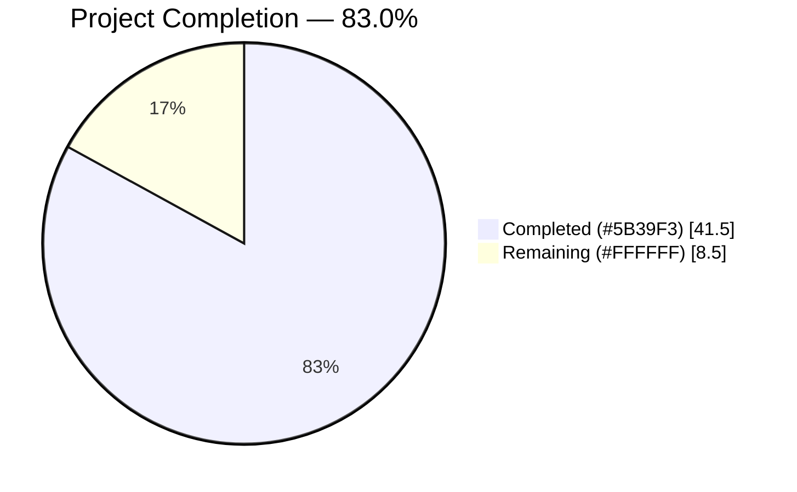
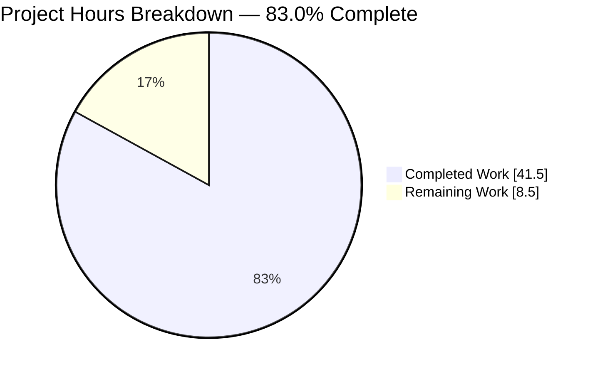
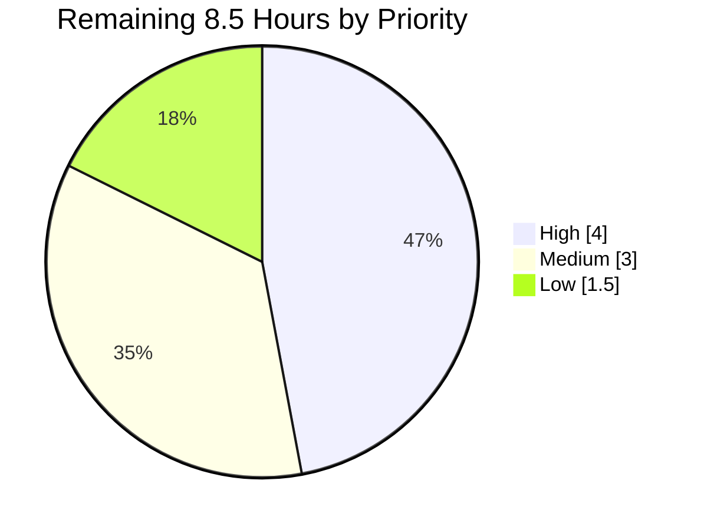
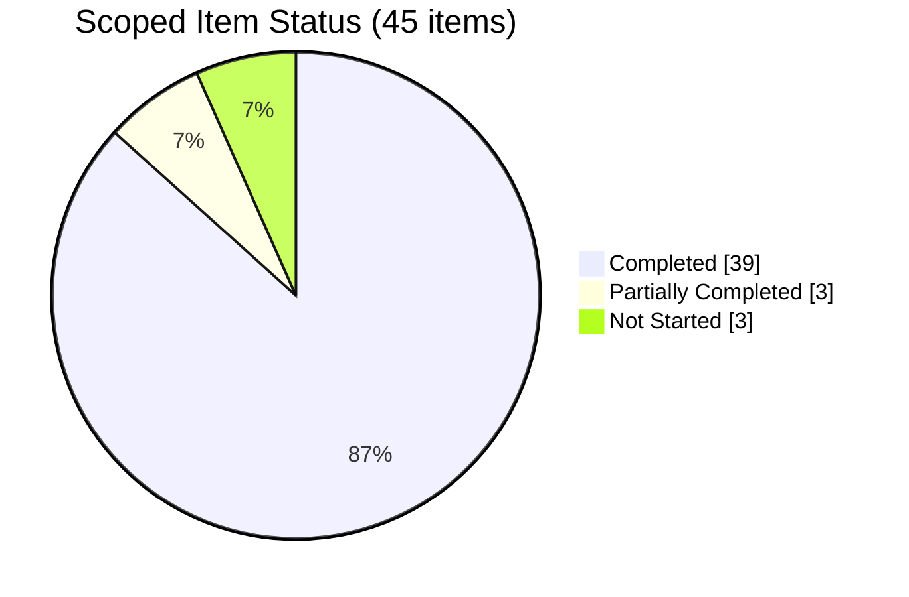

# 1. Executive Summary

## 1.1 Project Overview

`Artifact5` is a Node.js teaching repository serving exactly one HTTP endpoint: `GET /hello` returns the eleven-byte body `Hello world`, and nothing else answers. It targets a learner working from a clean clone — eleven files, an Express 5 service split so configuration, composition and bootstrap each have one reason to change, six tests pinning the response contract, and a tutorial running from prerequisites to a verified response. No database, no authentication, no user interface. The value is pedagogical: a minimal, fully verified reference for defining an endpoint on current Node LTS.

## 1.2 Completion Status



| Metric | Value |
|---|---|
| Total Hours | 50.0 |
| Completed Hours (AI + Manual) | 41.5 |
| Remaining Hours | 8.5 |
| Percent Complete | **83.0%** |

41.5 ÷ 50.0 × 100 = **83.0%**. Scope is 45 items: 41 plan requirement rows plus 4 path-to-production activities. Of those, 39 are complete, 3 partial and 3 not started.

## 1.3 Key Accomplishments

- ✅ `GET /hello` returns 200, `text/plain; charset=utf-8`, `Content-Length: 11`, `Hello world`.
- ✅ Only the literal lowercase path matches; six near-miss spellings return 404.
- ✅ `GET` is the sole registered verb; the four write verbs return 404, not 405.
- ✅ `X-Powered-By` is removed, so no response advertises the framework.
- ✅ `PORT` is accepted as a whole decimal 1–65535, and otherwise falls back to 3000.
- ✅ A failed bind exits 1 naming the port, the error code and the remedy.
- ✅ Six tests pass, at 100% line, branch and function coverage of every module loaded.
- ✅ `npm ci` installs 88 lockfile-pinned packages; `npm audit` reports zero vulnerabilities.

## 1.4 Critical Unresolved Issues

**4 of the 45 scoped items remain open.** Three share one upstream blocker; the fourth is a validation step Windows cannot perform.

| Issue | Impact | Owner | ETA |
|---|---|---|---|
| npm's bundled `tar@7.5.16` carries five advisories, one CRITICAL, in the archive parser its own install path drives | Dev-time only. Not in this project's dependency tree; `npm audit` reports 0 vulnerabilities across its 88 packages | Maintainer | Blocked upstream; 2.5h once a fixed bundle exists |
| npm's bundled `brace-expansion@5.0.6` carries three HIGH advisories, reached through its `glob → minimatch` chain | Dev-time denial of service against the npm process under hostile glob input; the service never loads this code | Maintainer | Same change as above |
| npm's bundled `ip-address@10.2.0` (3 advisories, 1 HIGH) and `undici@6.26.0` (7, 1 HIGH) | Known-vulnerable code present in the mandated client; the high-risk shapes are off npm's ordinary paths | Maintainer | Same change as above |
| Operating-system delivery of `SIGINT`/`SIGTERM` is unverified, so the documented Ctrl-C stop rests on the handler body rather than an end-to-end run | The last link is Windows' console-control-to-signal translation, which holds no project code | Maintainer | 1.5h on a Linux or macOS host |

No released npm carries `tar >= 7.5.21`, `brace-expansion >= 5.0.9`, `ip-address >= 10.3.1` and `undici >= 6.28.0` together, and the runtime pin is fixed at `24.19.0`. The exposure and its interim controls are disclosed in `README.md`.

## 1.5 Access Issues

No access issues identified.

| System/Resource | Type of Access | Issue Description | Resolution Status | Owner |
|---|---|---|---|---|
| Repository checkout | Read/write | None — the tree is writable and the working copy is clean | ✅ Verified | — |
| npm registry (`registry.npmjs.org`) | Package download | None — public registry, no authentication, no `.npmrc` required; `npm ci` succeeds unauthenticated | ✅ Verified | — |
| Third-party services and credentials | — | None used. No database, broker, cache, webhook, outbound service or secrets store exists in this project | ✅ Not applicable | — |
| Environment variables | Runtime | `PORT` is the only variable read, and it is optional | ✅ Verified | — |

## 1.6 Recommended Next Steps

1. **[High]** Run both shutdown scenarios on Linux or macOS; confirm exit status 0.
2. **[High]** Settle the npm toolchain position, refreshing the dated disclosure with it.
3. **[Medium]** Decide whether to relax the six-test suite so the failure path gains a guard.
4. **[Medium]** Read the tutorial as a learner on a clean clone, then sign off and publish.
5. **[Low]** Verify the version-manager branch, and settle the conditional-request note.

# 2. Project Hours Breakdown

## 2.1 Completed Work Detail

| Component | Hours | Description |
|---|---:|---|
| Node 24 toolchain and packaging | 2.5 | `package.json` identity, `type: module`, `main`, the three exact scripts, `engines.node ^24.0.0`, two exactly pinned dependencies and no `packageManager` key; `package-lock.json` at lockfileVersion 3 with 88 entries; `.nvmrc` pinning `24.19.0`; `.gitignore` covering `node_modules/`, `.env`, `npm-debug.log*` and `coverage/` |
| `/hello` route module and exact-match routing | 2.5 | `src/routes/hello.route.js` — `HELLO_PATH` declared once, `Router({ caseSensitive: true, strict: true })`, one GET handler returning `Hello world` as `text/plain` |
| Express application factory | 1.0 | `src/app.js` — `createApp()` composes the app, disables `x-powered-by`, mounts the router prefix-free and never listens, so tests can build their own app |
| `PORT` configuration loader | 2.5 | `src/config.js` — `loadConfig(env = process.env)` returning `{ port }` under an anchored whole-decimal grammar with an inclusive 1–65535 range and a 3000 fallback, pure with respect to its input |
| Process bootstrap, startup log and shutdown | 3.5 | `src/server.js` — the sole module that reads the environment, binds a port, logs the callable URL composed from `HELLO_PATH`, and registers `SIGINT`/`SIGTERM` handlers that close the listener then exit 0 |
| Sanitized startup-failure reporting | 1.5 | A failed bind prints only the configured port, the stable error code and a `PORT` remedy for `EADDRINUSE`, then exits 1 — no absolute path, stack frame, dependency internal or runtime-version banner |
| Route contract test suite | 2.5 | `test/hello.route.test.js` — three tests pinning the successful response, six near-miss paths and four unregistered write verbs, driven through Supertest against a factory-built app |
| Configuration test suite | 2.5 | `test/config.test.js` — three tests over 24 input cases, asserting the exact result shape and non-mutation of the injected environment on every branch |
| Learner tutorial | 5.0 | `README.md`, 250 lines — prerequisites, install, the two-terminal run-and-verify workflow, tests, the `PORT` semantics table, an eleven-row per-file walkthrough, the one-endpoint boundary table and a toolchain appendix |
| Runtime HTTP contract verification | 4.0 | Live sweeps across several ports: byte-level body reads, header assertions, path and method matrices, repetition and concurrency batches, and the conditional-request path |
| Configuration and observability verification | 2.5 | The full grammar matrix exercised against the real loader, ambient-environment isolation, startup-line exactness, and the default / override / malformed-fallback port scenarios |
| Dependency and supply-chain verification | 3.5 | 88/88 lockfile closure with registry, integrity and provenance checks; per-version advisory research over the toolchain; information-exposure probes across responses and process output |
| Documentation verification | 2.0 | Every command in the tutorial executed in the order the file presents it, links resolved, and the `PORT` table checked row by row against the implementation |
| Test-suite quality assurance | 2.5 | Per-file isolation, repeatability across fresh processes, watch-mode behaviour, ambient-environment isolation, and fault-injection proofs that the assertions actually bite |
| Source legibility pass | 2.0 | The six modules brought to sparse, accurate why-notes so a learner reads explanation rather than restatement of the code beneath it |
| Completeness and rule-compliance accounting | 1.5 | Independent recount of the eleven-file tree, six tests, single route, three Express registrations, one log call, one listen call and eleven walkthrough rows against the agreed plan and the product rule |
| **Total** | **41.5** | |

## 2.2 Remaining Work Detail

| Category | Hours | Priority |
|---|---:|---|
| Confirm the shutdown path on a POSIX host — Ctrl-C and `SIGTERM`, both expected to exit 0 | 1.5 | High |
| Settle the npm toolchain position: adopt a fixed bundle or amend the pin, re-scan every bundled package, update `.nvmrc` and the dated disclosure together, re-run every gate | 2.5 | High |
| Automated regression guard for the sanitized startup-failure path (needs a prior decision to relax the fixed six-test suite) | 2.0 | Medium |
| Release sign-off: read the tutorial as a first-time learner on a clean clone, then tag or publish | 1.0 | Medium |
| Verify the version-manager prerequisite branch on a host carrying POSIX `nvm`, `fnm` and `nvm` for Windows | 1.0 | Low |
| Decide whether the learner needs the conditional-request note, and add one sentence if so | 0.5 | Low |
| **Total** | **8.5** | |

## 2.3 Hours Reconciliation

| Check | Value |
|---|---|
| Section 2.1 completed total | 41.5 |
| Section 2.2 remaining total | 8.5 |
| Sum (must equal Total Hours in Section 1.2) | 50.0 ✅ |
| Completion (41.5 ÷ 50.0 × 100) | 83.0% ✅ |
| Section 7 pie chart values | Completed 41.5 / Remaining 8.5 ✅ |

Confidence is high on every completed row — each maps to an artefact in the tree and to a result observed at runtime — and high on four of the six remaining rows, each a bounded single-session task. It is medium on the toolchain row, whose timing depends on an upstream release nobody here controls (the 2.5 hours is the decision, re-scan and update once a candidate exists, not the wait), and medium on the regression-guard row, which cannot start until the six-test constraint is deliberately relaxed.

# 3. Test Results

Every figure below comes from a run of this project's own suite on Node v24.19.0 with npm 11.17.0. `npm test` invokes the bare `node --test` form the manifest declares, which discovers `test/**/*.test.js` on its own. Coverage is from the runner's own instrumentation (`node --test --experimental-test-coverage`).

| Area / Category | Framework | Tests | Passed | Failed | Coverage | What This Proves |
|---|---|---:|---:|---:|---|---|
| `GET /hello` response contract | `node:test` + Supertest | 1 | 1 | 0 | 100% of `src/routes/hello.route.js` | The endpoint answers 200 with `text/plain; charset=utf-8`, `Content-Length: 11`, the exact bytes `Hello world`, and no `X-Powered-By` |
| Path exactness | `node:test` + Supertest | 1 | 1 | 0 | included above | Six near-miss spellings — `/Hello`, `/HELLO`, `/hEllO`, `/hello/`, `/hello2`, `/` — reach nothing, so the endpoint cannot be hit by accident |
| Method surface | `node:test` + Supertest | 1 | 1 | 0 | included above | `POST`, `PUT`, `DELETE` and `PATCH` on `/hello` are unregistered and answer 404, so no write verb is silently accepted |
| `PORT` default | `node:test` + `node:assert/strict` | 1 | 1 | 0 | 100% of `src/config.js` | An empty environment yields exactly `{ port: 3000 }` as a number, so the tutorial starts with no configuration |
| `PORT` accepted values | `node:test` + `node:assert/strict` | 1 | 1 | 0 | included above | Whole decimals inside 1–65535 are honoured, including both boundaries and whitespace-padded input, and the injected environment is not mutated |
| `PORT` malformed fallback | `node:test` + `node:assert/strict` | 1 | 1 | 0 | included above | Trailing garbage, fractions, exponents, signs, zero, out-of-range values and every non-string type select 3000 instead of binding something unintended |
| Application factory (exercised by the route tests) | `node:test` + Supertest | — | — | — | 100% of `src/app.js` | `createApp()` yields a listener-free app, so the suite never binds the configured port |
| **Suite total** | `node:test` | **6** | **6** | **0** | **100% line / 100% branch / 100% function across every module loaded** | The whole agreed HTTP and configuration contract is pinned and green |

Per-file runs confirm the split: `test/config.test.js` 3 of 3, `test/hello.route.test.js` 3 of 3. `node --check` exits 0 on all six JavaScript files. `npm ci` installs 88 packages and `npm audit` reports zero vulnerabilities.

### Not Covered

These are delivered capabilities that no test exercises. Each needs a human check before release.

- **The process bootstrap (`src/server.js`) is loaded by no test.** It is absent from the coverage report entirely, because neither test file may import it — that separation is what keeps the suite from binding the configured port. Everything in it is therefore unguarded by `npm test`: the `listen` call, the startup log, the signal handlers and the failure path. Verify it by starting and stopping the service, and by starting it twice on one port.
- **The sanitized startup-failure message has no automated guard.** A change to a raw rethrow — which would leak the checkout path, a stack and the runtime version — would pass the suite. Check the two-line stderr and exit status 1 by hand after any edit to the bootstrap.
- **`SIGINT` and `SIGTERM` handling is not asserted by any test.** The handlers close the listener and exit 0, but no test drives them; a manual Ctrl-C and a manual `kill` are the only checks.
- **Framework-derived responses are deliberately unasserted.** `HEAD /hello` and `OPTIONS /hello` return 200 from the single GET registration, and a conditional request returns 304 from the weak ETag `res.send()` attaches. All three are correct and intentionally left unpinned so a framework upgrade cannot fail the suite over behaviour the project never specified.
- **The `UNKNOWN_ERROR_CODE` fallback in the failure reporter is unreachable in practice.** Every listen error the runtime produces carries a code, so no real failure selects that branch; it is a defensive default rather than dead code.
- **Documentation has no test.** The tutorial's claims were checked by executing its commands, but nothing in the suite compares the document to the code, so an implementation change can leave the prose stale.

# 4. Runtime Validation & UI Verification

The service was started and driven for real. Every line below reports what was observed against a running process, not what the code appears to do.

- ✅ **Start-up** — `npm start` binds the configured port and writes exactly one line, `Hello service listening on http://localhost:<port>/hello`, with zero bytes on stderr. Confirmed on the default port and on explicit overrides.
- ✅ **`GET /hello`** — 200, `Content-Type: text/plain; charset=utf-8`, `Content-Length: 11`, body read from file as 11 bytes ending at octal `0000013`, no trailing newline. No `X-Powered-By` and no `Server` header in the response dump.
- ✅ **Path exactness** — `/Hello`, `/HELLO`, `/hEllO`, `/hello/`, `/hello2` and `/` each returned 404 with zero redirects; `/health` and `/api/hello` also 404, confirming no second route slipped in.
- ✅ **Method surface** — `POST`, `PUT`, `DELETE` and `PATCH` on `/hello` each returned 404. `HEAD` returned 200 and `OPTIONS` returned 200 from the framework's own handling of the single GET registration.
- ✅ **`PORT` override** — an explicit port was logged in the startup line and served the correct body.
- ✅ **Malformed `PORT` fallback** — `8080abc` produced a start on 3000, served the correct body there, and left port 8080 unbound (connection refused).
- ✅ **Occupied-port failure** — a second start on a held port exited 1, printed no listening URL, and wrote exactly `Failed to start the hello service on port <port>: EADDRINUSE` followed by the `PORT` remedy. No absolute path, stack frame, dependency internal or runtime-version banner appeared.
- ✅ **Conditional request** — a replay carrying the saved ETag returned 304 with no body, which is correct HTTP for the weak ETag `res.send()` attaches.
- ⚠ **Shutdown** — the handlers close the listener and exit 0, and the port is released and immediately rebindable. The operating-system delivery of `SIGINT` and `SIGTERM` was **not exercised**: Windows maps process termination for both to a forced kill, so no handler is entered, and no interactive console was attached for a real Ctrl-C. One run on Linux or macOS closes this.
- ✅ **External integrations** — there are none. No database, broker, cache, queue, webhook, outbound service or secrets store exists in this project, so there is no untested integration surface and no credential to provision.

**UI verification: not applicable.** This project renders nothing — no HTML, templates, stylesheets or client-side JavaScript. Its human-facing surfaces are the response body, the startup log line and the tutorial text, all covered above. No screenshots exist or are needed.

# 5. Compliance & Quality Review

## 5.1 Compliance Matrix

Each row is a deliverable from the agreed plan and the state it stands in now.

| Deliverable | Benchmark | Status | Evidence |
|---|---|---|---|
| Exactly one endpoint at the literal `/hello` | Functional correctness | ✅ PASS | `src/routes/hello.route.js:3,9`; eight negative path probes all 404 |
| Byte-exact `Hello world` response, correct media type, no framework banner | Contract exactness | ✅ PASS | 11 bytes, no trailing newline, `Content-Length: 11`, `text/plain; charset=utf-8`; `app.disable('x-powered-by')` at `src/app.js:16` |
| Case-sensitive, strict path matching | Contract exactness | ✅ PASS | `Router({ caseSensitive: true, strict: true })` at `src/routes/hello.route.js:7`; six spellings 404 |
| `PORT` configuration grammar and fallback | Input validation | ✅ PASS | `src/config.js:9,31-44`; 100% branch coverage; 24 input cases asserted |
| Factory / bootstrap separation | Testability | ✅ PASS | No `listen` in `src/app.js`; no test imports `src/server.js` |
| Startup observability | Operability | ✅ PASS | One log line composed from the imported path constant, `src/server.js:54`; stderr empty on every success path |
| Startup-failure handling | Information exposure | ✅ PASS | `src/server.js:22-37` prints port and error code only; exit status 1 |
| Graceful shutdown handlers | Lifecycle | ⚠ PARTIAL | `src/server.js:57-64` registers exactly `SIGINT` and `SIGTERM` and closes before exit; operating-system delivery unverified — see Section 1.4 |
| Six-test contract suite | Test adequacy | ✅ PASS | 6 of 6 pass; 100% line, branch and function coverage of every module loaded |
| Reproducible clean-clone install | Supply chain | ✅ PASS | `npm ci` adds 88 lockfile-pinned packages, every entry carrying an integrity hash; `npm audit` reports 0 vulnerabilities |
| Learner tutorial completeness | Documentation | ✅ PASS | `README.md`, 250 lines, 9 sections, 11-row walkthrough; every command executed in document order |
| Scope discipline (no extra route, build step, lint tooling, middleware or deployment machinery) | Plan adherence | ✅ PASS | 11 tracked files, 10 added and 1 modified; no TODO, stub or placeholder anywhere in the tree |

## 5.2 AAP & Rule Divergences and Gaps

| What the AAP/Rule Required | What Was Delivered Instead | Why It Diverged | Impact | Remediation |
|---|---|---|---|---|
| The README's content is enumerated, and it must not restate package versions | The document adds a toolchain appendix naming npm 11.17.0 and four of its bundled package versions, a curl prerequisite with the PowerShell `curl.exe` form, and Windows `PORT` equivalents beside the POSIX form | Shipping the documented toolchain and verification commands without disclosing either the advisories or the shell trap leaves the learner worse off | ~27 extra lines and a dated snapshot that will drift | Refresh or remove the appendix when the toolchain position changes (2.2, row 2) |
| `src/config.js` should coerce the raw `PORT` value to a string, then trim it | It rejects any non-string value outright and trims only a genuine string (`src/config.js:31-33`) | Coercion both widened the agreed grammar and could itself throw, breaking the promise that a malformed value never refuses startup | None negative — behaviour is identical for every string input | None needed |
| Do not add error handling around the `listen` call | The `listen` callback inspects its error argument and prints a sanitized failure (`src/server.js:47-51`) | The framework registers that callback as the server's one-shot error listener, so the failure was never unhandled as assumed, and an unfiltered `Error` carries machine detail | None negative — the loud, non-zero `EADDRINUSE` failure the plan describes is what a reader sees | None needed |
| The suite is fixed at six tests and neither test file may import the bootstrap | No automated test pins the sanitized failure message | Such a test must spawn a child process and bind a port, which breaks both constraints | A change to a raw rethrow would pass `npm test` | Add a child-process guard (2.2, row 3) |
| A brief note that a browser reload may show `304 Not Modified` was permitted | The note is absent | It was optional, never required, and a standalone section on it would present framework behaviour the project deliberately leaves unpinned as though the project owned it | A learner reloading in a browser sees a 304 with no in-document explanation | Decide, and add one sentence if wanted (2.2, row 6) |
| The prerequisites paragraph should name the exact Node patch version | It delegates to `.nvmrc` by link; the literal survives once in the appendix | Removing a second hand-maintained copy of a value `.nvmrc` already owns | None — a version-manager user reads the single source of truth | None needed |
| Scenario A ends by stopping the service with Ctrl-C, and Scenario D sends `SIGTERM`; both must exit 0 | Handler behaviour proven in-process; operating-system signal delivery not exercised | Windows maps termination for both signals to a forced kill, so no handler is entered, and no interactive console was attached | The final link — Windows' console-control-to-signal translation, which holds no project code — is unverified | One run on Linux or macOS (2.2, row 1) |
| The plan records that no user-specified rules were provided | The rules document holds one rule, with a garbled title echoing the product requirement and an empty body | A pre-existing discrepancy between the plan's assertion and the rules document | None — the rule asks for nothing beyond the one-endpoint contract the plan already encodes | None needed |

**README content beyond the prescribed set.** The plan enumerates the tutorial's sections and states that it must not restate package versions, because a fourth hand-maintained copy of `express@5.2.1` or `supertest@7.2.2` would drift from the manifest. The delivered document adds an appendix on npm's own bundled dependencies, a curl prerequisite, and Windows shell equivalents. None of the added versions duplicates a project dependency version — the file contains zero occurrences of `express@`, `supertest@`, `5.2.1` or `7.2.2` — so the drift the rule guards against cannot occur. The judgement call is real: the appendix carries a snapshot date, and a snapshot goes stale. It sits after the last tutorial section, costing a learner three lines before the install command.

**Non-string `PORT` values are rejected rather than coerced.** The per-file brief for the configuration loader asked for the raw value to be coerced to a string and trimmed. The plan proper defines the accept grammar over a *trimmed decimal string* in 1–65535 and guarantees that a malformed value never throws, exits or refuses startup. `String()` breaks both: it admits numbers, BigInts, arrays and boxed values as ports, and throws outright on an object with no prototype. The guard at `src/config.js:31-33` returns the default for anything that is not a string, so the accept set narrows to exactly what the plan documents and the no-throw promise becomes unconditional. Every string input behaves identically, across 24 asserted cases.

**The bind failure is handled inside the framework's own callback.** The brief for the bootstrap forbade adding a `server.on('error')` listener or wrapping `listen` in `try`/`catch`, on the premise that an unhandled `EADDRINUSE` was already the documented behaviour. That premise does not hold on this framework version, which wraps the trailing `listen` callback in `once()` and registers it as the server's one-shot error listener — so the failure arrives at the project's own callback. The delivered code inspects it and reports it (`src/server.js:47-51`), honouring both literal prohibitions: the tree contains no `server.on('error')` and no `try`/`catch`. The message names only the port, the stable error code and the `PORT` remedy, disclosing nothing about the machine.

**No automated guard on the failure path.** The plan fixes the suite at exactly six tests in two files and requires that neither imports the bootstrap, which is what stops the suite binding the configured port. A test for the sanitized failure message must spawn a child process and occupy a port, so it cannot exist under those constraints. The consequence is concrete: `npm test` would stay green if someone replaced the reporter with a raw rethrow, opening an information exposure. Until the six-test ceiling is relaxed, treat any edit to `src/server.js` as needing a manual check — start the service twice on one port and confirm exit status 1 with the two-line message.

**The conditional-request note is absent.** `res.send()` attaches a weak ETag, so a browser reload of `/hello` returns 304 with no body. This is correct HTTP and was measured. The tutorial's own content specification listed a note about it as an optional accuracy detail rather than a requirement, and it was left out because a standalone section would present framework behaviour the project deliberately declines to pin as though the project owned it. The residual cost falls on exactly one reader: the learner who reloads in a browser, sees a 304, and finds nothing in the document explaining it. Half an hour settles it either way — add one sentence, or record the decision to leave it out.

**The exact Node version is named once rather than twice.** The tutorial's file brief asked the prerequisites paragraph to note that `.nvmrc` records the exact version, with the literal in parentheses. The paragraph instead states that `.nvmrc` owns the exact version and links to it, and the literal `24.19.0` appears once in the appendix, where it is load-bearing because the bundled-npm versions cited there hold only for that release. The prerequisite itself is still stated — the document names Node.js 24 as the requirement — and the file that owns the patch version is one click away. This removes a hand-maintained duplicate rather than a fact, and there is nothing for a human to do.

**Shutdown was not driven by a real signal.** Scenario A closes with a Ctrl-C and Scenario D sends `SIGTERM`, each expected to close the listener and exit 0. On Windows, `process.kill` for either signal maps to a forced termination that never enters a JavaScript handler — shown with a child process whose handler never ran — and no interactive console was attached for a genuine Ctrl-C. The handlers were driven directly instead: each closes the listener and exits 0 within a millisecond, stays correct when signalled twice, and is unaffected by an idle keep-alive connection. Unverified is Windows' translation of a console event into a signal, which holds no project code.

**The rules document and the plan disagree about whether rules exist.** The plan states that no user-specified rules were provided and that enterprise best practice therefore applies. The rules document returns exactly one rule, whose title is a truncated, duplicated echo of the product requirement and whose body is empty. Reading the document as authoritative on rule existence, the rule's only enforceable content is what the plan already encodes: a Node.js tutorial project with one endpoint returning `Hello world`. The delivered tree satisfies it — the literal path appears throughout, the body is exactly `Hello world` and never `Hello World!`, and one endpoint is registered. Recorded so the plan's statement is not read as authoritative alone.

# 6. Risk Assessment

Forward-looking only: what could still go wrong with this codebase in the hands of the next person to change or run it.

| Risk | Category | Severity | Probability | Mitigation | Status |
|---|---|---|---|---|---|
| The process bootstrap is loaded by no test, so a change to the `listen` call, the startup log, the failure path or the signal handlers ships green | Technical | Medium | Medium | Treat every `src/server.js` edit as needing a manual start, stop and occupied-port check; add a child-process guard once the six-test ceiling is relaxed | 🔶 Open |
| Path exactness depends on two options on the `Router` constructor; the equivalent app-level settings do not reach a router mounted with `app.use()`, so moving the route or dropping an option would silently widen the endpoint | Technical | Medium | Low | The exactness test pins all six near-miss spellings and fails on either change | ✅ Mitigated |
| A plausible "improvement" — answering write verbs with 405, or relaxing the port grammar to a bare integer parse — would break the agreed contract | Technical | Low | Low | Both test files pin the current behaviour; the configuration tests were shown to fail under exactly that mutation | ✅ Mitigated |
| npm's own bundled packages carry published advisories, including one CRITICAL in the archive parser its install path drives | Security | High | Low | None of the four packages is in this project's tree and the service never loads them; installs are held to the committed lockfile with per-entry integrity hashes; the exposure is disclosed in the tutorial | 🔶 Open (upstream) |
| The endpoint is intentionally public and unauthenticated, with no transport security, rate limiting or security headers beyond the removed framework banner | Security | Medium | Low | Correct for a localhost tutorial and in scope as such; the bind host is deliberately not configurable, so exposing it beyond localhost requires a code change | ✅ Accepted by design |
| The toolchain appendix carries a dated snapshot that drifts as advisories accumulate against frozen versions | Operational | Low | High | The appendix tells the reader to re-check before relying on it; it is refreshed by the same change that settles the toolchain position | 🔶 Open |
| After the listener closes, a connection whose request never finished is waited on indefinitely on this runtime, so a stop can appear to hang | Operational | Low | Low | Measured: an idle keep-alive connection completes shutdown in about a millisecond; only an unfinished request holds it. Compensating shutdown machinery is outside the agreed scope | ✅ Accepted |
| The shutdown path's final link — Windows' translation of a console event into a signal — is unverified, so the documented Ctrl-C behaviour rests on the handler body rather than an end-to-end run | Integration | Low | Low | One run of the two shutdown scenarios on Linux or macOS; no code change expected | 🔶 Open |

Two absences are worth stating so they are not mistaken for gaps. There is no database, broker, cache, queue, webhook, outbound service or secrets store anywhere in this project, so there is no untested integration surface and no credential to provision. And the project reads exactly one environment variable, `PORT`, which is optional — no other variable present on a host has any effect on it.

# 7. Visual Project Status

Completed work is shown in Blitzy Dark Blue (`#5B39F3`); remaining work in White (`#FFFFFF`).



Remaining hours by priority band, summing to the 8.5 hours in Sections 1.2 and 2.2:



Requirement status across the 45 scoped items — 41 plan requirement rows plus 4 path-to-production activities:



# 8. Summary & Recommendations

The project asked for one thing and got it. `GET /hello` returns the eleven bytes `Hello world` as `text/plain; charset=utf-8`, and only that path, spelled exactly that way, with exactly that verb, reaches anything at all. Around that endpoint sits the structure a learner needs to understand it: a configuration loader that is a pure function of its input, an application factory that never binds a port, a bootstrap that is the only module doing so, six tests that pin the contract, and a 250-line tutorial that takes a reader from prerequisites to a verified response. Eleven files, 1,795 lines added across eleven commits, no build step, no placeholder and no stub anywhere in the tree.

Measured against the agreed plan, the project is **83.0% complete** — 41.5 of 50.0 hours. Thirty-nine of the forty-five scoped items are finished, three are partial and three have not started. Everything the plan asked to be *built* exists and works; what remains is validation closure and release preparation. The suite passes 6 of 6 with 100% line, branch and function coverage of every module it loads, a clean clone installs 88 lockfile-pinned packages with zero advisories in the project's own tree, and the whole response contract was driven against a live process: byte-level body checks, eight negative paths, four unregistered verbs, the override and fallback port scenarios, and the occupied-port failure exiting 1 with a message that names the port and the remedy and nothing about the machine.

Two things stand between this and a signed-off release. The first is a single validation step: the shutdown handlers close the listener and exit 0 when driven directly, but no real `SIGINT` or `SIGTERM` has ever reached them, because Windows maps both to a forced kill and attaches no console. One run on Linux or macOS closes it, and no code change is expected. The second is the npm client itself. Node 24.19.0 — the version the plan pins by name — bundles four packages carrying eighteen published advisories, one of them CRITICAL, in the archive parser npm drives when it unpacks a download. None of those packages is in this project's dependency tree, the running service never loads them, and no released npm carries all four fixes, so the position is genuinely blocked upstream. It is disclosed in the tutorial with per-package counts and a snapshot date, and installs are held to the committed lockfile whose every entry carries an integrity hash. The decision — adopt a fixed bundle when one appears, or amend the agreed pin — belongs to a human.

The gap worth naming beyond those two is narrower and more likely to bite. The bootstrap module is loaded by no test at all; that is by design, since importing it would bind the configured port, but the effect is that `npm test` guards nothing about the startup log, the signal handlers or the sanitized failure message. Someone could replace that failure reporter with a raw rethrow, open the information exposure it exists to prevent, and see a green suite. Until the fixed six-test suite is deliberately relaxed so a child-process guard can be added, any edit to `src/server.js` needs a manual start, stop and occupied-port check. That is the one place where the project's otherwise complete test coverage does not reach.

**Production readiness for the intended scope: ready, pending the four open items in Section 1.4.** The success metrics are already met — one endpoint, byte-exact response, exact path and method matching, a reproducible install, zero advisories in the project's own dependency closure, and a tutorial whose every command was executed in the order it presents them. The critical path to release is short: run the two shutdown scenarios on a POSIX host, take the toolchain decision, read the tutorial once as a learner, and publish. That is 8.5 hours of human work, of which 4.0 is the high-priority pair. No part of it requires rewriting anything that was delivered.

# 9. Development Guide

Every command below was executed against this repository. Windows PowerShell 5.1 forms are given where they differ from POSIX, because the two are not interchangeable.

### System prerequisites

- **Node.js 24** — the repository pins `24.19.0` in `.nvmrc`, and `package.json` declares `"engines": { "node": "^24.0.0" }`. npm warns rather than blocking on an engine mismatch, so check the version yourself.
- **npm 11** — arrives with Node; no separate install. The committed lockfile was generated by npm 11, so do not upgrade to a different major just to install this project.
- **A curl executable** — needed only for the verification steps. On Windows PowerShell, `curl` is an alias for `Invoke-WebRequest`, which prints a formatted object instead of raw bytes; use `curl.exe`.
- **Nothing else.** No database, broker, cache server, container runtime, reverse proxy or TLS termination is required or used. There is no build step and no `build` script — the project is plain ESM and runs directly.

```bash
node -v      # expect v24.19.0
npm -v       # expect 11.17.0
```

### Environment setup

No virtual environment applies. Isolation is the per-checkout `node_modules/`, which is git-ignored and is not shared between clones — every clone runs its own install.

`PORT` is the only variable this project reads, and it is optional.

| Variable | Required | Default | Accepted values | Behaviour otherwise |
|---|---|---|---|---|
| `PORT` | No | `3000` | A whole decimal integer, 1–65535, optionally surrounded by whitespace | Anything else — trailing garbage, a fraction, exponent notation, a sign, `0`, `65536`, an empty string — falls back to `3000` |

### Dependency installation

```bash
cd <repository root>
npm ci
```

Expect `added 88 packages, and audited 89 packages` and `found 0 vulnerabilities`. Use `npm ci` from a clean clone: it installs exactly what the lockfile records and fails rather than quietly changing it. Use `npm install` only when you are deliberately changing `package.json` dependencies, and commit the regenerated lockfile alongside it.

### Application startup

`npm start` holds the foreground, so run it in one terminal and verify from another.

```bash
# POSIX shells
npm start                 # default port 3000
PORT=5555 npm start       # explicit port
```

```powershell
# Windows PowerShell 5.1 — the POSIX inline-variable form is invalid here
npm start
$env:PORT='5555'; npm start
```

Expect exactly one line on stdout and nothing on stderr:

```text
Hello service listening on http://localhost:3000/hello
```

Stop it with Ctrl-C. The listener closes before the process exits; an idle keep-alive connection does not hold shutdown open.

### Verification

```bash
# Status, media type, length, and the absence of a framework banner
curl.exe -sS -i http://localhost:3000/hello

# Body bytes — write to a file first; a shell pipeline can corrupt the count
curl.exe -sS -o body.bin http://localhost:3000/hello
od -c body.bin            # expect 11 bytes ending at octal 0000013, no trailing newline

# Path exactness — every one of these must be 404
curl.exe -sS -o /dev/null -w '%{http_code}\n' http://localhost:3000/Hello
curl.exe -sS -o /dev/null -w '%{http_code}\n' http://localhost:3000/hello/
curl.exe -sS -o /dev/null -w '%{http_code}\n' http://localhost:3000/

# Unregistered verbs — every one of these must be 404
curl.exe -sS -o /dev/null -w '%{http_code}\n' -X POST http://localhost:3000/hello
```

Observed on a running service: `HTTP/1.1 200 OK`, `Content-Type: text/plain; charset=utf-8`, `Content-Length: 11`, no `X-Powered-By`, body `Hello world`. `/Hello`, `/HELLO`, `/hEllO`, `/hello/`, `/hello2`, `/`, `/health` and `/api/hello` all return 404; `POST`, `PUT`, `DELETE` and `PATCH` on `/hello` all return 404.

On Windows use `-o NUL` in place of `-o /dev/null`, and `od.exe` from the Git distribution.

### Running the tests

```bash
npm test                  # bare `node --test`; expect tests 6 / pass 6 / fail 0
node --test test/config.test.js        # 3 of 3
node --test test/hello.route.test.js   # 3 of 3
node --test --experimental-test-coverage   # 100% line / branch / function on every module loaded
npm audit                 # expect: found 0 vulnerabilities
```

Two cautions. Do not change the test script to `node --test test/` — the trailing-directory form fails module resolution on this runtime; the bare form discovers `test/**/*.test.js` correctly. And never run `npm run test:watch` in a foreground automation step: it holds the terminal and never returns.

### Example usage

```bash
$ npm start &
Hello service listening on http://localhost:3000/hello

$ curl.exe -sS http://localhost:3000/hello
Hello world

$ curl.exe -sS -o /dev/null -w '%{http_code}\n' http://localhost:3000/Hello
404
```

### Troubleshooting

| Symptom | Cause | Resolution |
|---|---|---|
| `Failed to start the hello service on port 3000: EADDRINUSE` and exit status 1 | Something already holds the port | Start on a free port: `PORT=5555 npm start`, or `$env:PORT='5555'; npm start` in PowerShell. The message names the remedy itself |
| The service starts on 3000 despite an explicit `PORT` | The value did not match the accepted grammar, so it fell back to the default | Pass a whole decimal integer in 1–65535. `8080abc`, `3.5`, `1e3`, `+8080`, `-1`, `0` and `65536` all fall back |
| `Failed to start … : EACCES` | The port is in a range the operating system reserves or excludes | Choose a different port above 1024 that is not OS-excluded |
| `curl` prints a formatted object instead of `Hello world` | On Windows PowerShell, `curl` is an alias for `Invoke-WebRequest` | Use `curl.exe` |
| A byte count reads as more than 11 | The shell pipeline injected a byte-order mark and a line ending | Write the response to a file with `-o`, then inspect the file |
| A browser reload shows `304 Not Modified` | The response carries a weak ETag, so a conditional request is answered correctly with 304 and no body | Nothing to fix. A fresh unconditional request still returns 200 and the full body |
| `Cannot find module …\src\server.js` | `npm start` was run somewhere other than the repository root | `cd` to the root — the script path is relative to it |
| `ERR_MODULE_NOT_FOUND` after adding a file | A relative import was written without its `.js` extension | This project is ESM: every relative specifier needs the explicit extension |
| `git lfs pre-push --dry-run` appears to hang | The hook reads refs from standard input | Run it with stdin closed |

# 10. Appendices

## A. Command Reference

| Purpose | Command | Expected result |
|---|---|---|
| Check the runtime | `node -v` | `v24.19.0` |
| Check the package client | `npm -v` | `11.17.0` |
| Install from a clean clone | `npm ci` | `added 88 packages`, `found 0 vulnerabilities` |
| Re-resolve after editing dependencies | `npm install` | Lockfile updated only if the manifest and lockfile disagree |
| Run the service | `npm start` | One startup line; foreground held until Ctrl-C |
| Run the service on a chosen port | `PORT=5555 npm start` / `$env:PORT='5555'; npm start` | Startup line naming 5555 |
| Run the tests | `npm test` | `tests 6 / pass 6 / fail 0` |
| Run one test file | `node --test test/config.test.js` | `tests 3 / pass 3 / fail 0` |
| Measure coverage | `node --test --experimental-test-coverage` | 100% line, branch and function on every module loaded |
| Watch the tests | `npm run test:watch` | Reruns affected tests; never returns — do not use in automation |
| Audit dependencies | `npm audit` | `found 0 vulnerabilities` |
| Parse-check a module | `node --check src/server.js` | Exit 0, no output |
| Call the endpoint | `curl.exe -sS http://localhost:3000/hello` | `Hello world` |
| Inspect the response headers | `curl.exe -sS -i http://localhost:3000/hello` | 200, `text/plain; charset=utf-8`, `Content-Length: 11`, no `X-Powered-By` |

## B. Port Reference

| Port | Role | Notes |
|---|---|---|
| 3000 | Default service port | Used when `PORT` is unset, or when it holds a value outside the accepted grammar |
| Any 1–65535 | Service port via `PORT` | Whole decimal integers only; surrounding whitespace is trimmed |
| Ephemeral | Test transport | Supertest binds a throwaway loopback port per in-process request, so the suite never needs the configured port reserved |

## C. Key File Locations

| Path | Role |
|---|---|
| `src/server.js` | Process bootstrap — the only module that reads the environment, binds a port, logs the callable URL or registers a signal handler |
| `src/app.js` | `createApp()` factory — composes the Express instance, removes the framework banner, mounts the router, never listens |
| `src/config.js` | `loadConfig(env = process.env)` returning `{ port }` under the whole-decimal 1–65535 grammar with a 3000 fallback |
| `src/routes/hello.route.js` | `HELLO_PATH` and the router carrying the single GET handler, with case-sensitive and strict matching |
| `test/hello.route.test.js` | Three tests: the successful response, six near-miss paths, four unregistered write verbs |
| `test/config.test.js` | Three tests: the default port, accepted overrides with boundaries and trimming, and the fallback for every malformed form |
| `package.json` | Manifest — ESM declaration, three scripts, engine range, two exactly pinned dependencies |
| `package-lock.json` | Committed lockfile, version 3, 88 entries each with a resolution URL and integrity hash |
| `.nvmrc` | The exact runtime patch version |
| `.gitignore` | `node_modules/`, `.env`, `npm-debug.log*`, `coverage/` |
| `README.md` | The learner tutorial: prerequisites, install, run and verify, tests, `PORT` semantics, per-file walkthrough, endpoint boundaries, toolchain appendix |

## D. Technology Versions

| Component | Version | Role |
|---|---|---|
| Node.js | 24.19.0 | Runtime; also supplies the test runner (`node:test`) and assertions (`node:assert/strict`), so no test framework is installed |
| npm | 11.17.0 | Bundled with the runtime; generates and verifies the lockfile and runs every script |
| Express | 5.2.1 | HTTP routing and the response API — the only production dependency |
| Supertest | 7.2.2 | In-process HTTP assertions — the only development dependency |
| Transitive packages | 88 total | All resolved from the public registry, each with an integrity hash; none carries an install script |

## E. Environment Variable Reference

| Variable | Required | Default | Accepted | Read by |
|---|---|---|---|---|
| `PORT` | No | `3000` | A whole decimal integer 1–65535, whitespace-trimmed; anything else selects the default | `src/config.js` only, via the injected environment object |

No other variable affects this project. It reads no `.env` file — `.env` appears in `.gitignore` purely as a guard so that a learner who creates one cannot commit it.

## F. Developer Tools Guide

- **Test runner** — Node's built-in `node:test`, invoked as the bare `node --test`. It discovers `test/**/*.test.js` itself; passing a trailing-slash directory argument fails module resolution on this runtime.
- **Assertions** — `node:assert/strict`. Strict deep equality compares types, which is why the configuration tests assert whole result objects rather than scalars.
- **Coverage** — `node --test --experimental-test-coverage`, from the runner. No coverage package is installed and no threshold gate is configured.
- **Linting and formatting** — none configured, and none wanted: no ESLint, Prettier or editor configuration exists, and no `lint` script is defined. `node --check` is the available static gate.
- **Build** — none. Plain ESM runs directly on the pinned runtime; there is no transpile or bundle step and no `build` script.
- **Git hooks** — only the standard Git LFS shims are active, and there is no `.gitattributes`, so nothing is converted to a pointer.

## G. Glossary

| Term | Meaning in this project |
|---|---|
| Application factory | `createApp()` — returns a configured Express application without binding a port, so each test can build its own |
| Bootstrap | `src/server.js` — the single module that turns the application into a running process |
| Strict routing | A router option that stops `/hello/` matching the route registered at `/hello` |
| Case-sensitive routing | A router option that stops `/Hello` matching `/hello`. Both options must sit on the router's own constructor; the equivalent application-level settings do not reach a router mounted with `app.use()` |
| Weak ETag | The validator the framework attaches to a sent response, which makes a conditional request correctly answer 304 with no body |
| Near-miss path | One of the six spellings the contract requires to return 404: `/Hello`, `/HELLO`, `/hEllO`, `/hello/`, `/hello2`, `/` |
| Write verb | `POST`, `PUT`, `DELETE` or `PATCH` — none is registered, so each returns 404 rather than 405 |
| Clean clone | A fresh checkout with no `node_modules/`, from which `npm ci` reproduces the tested dependency tree exactly |
