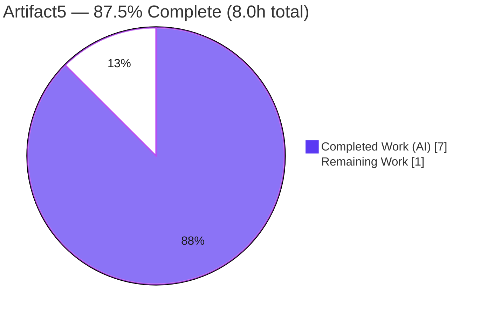
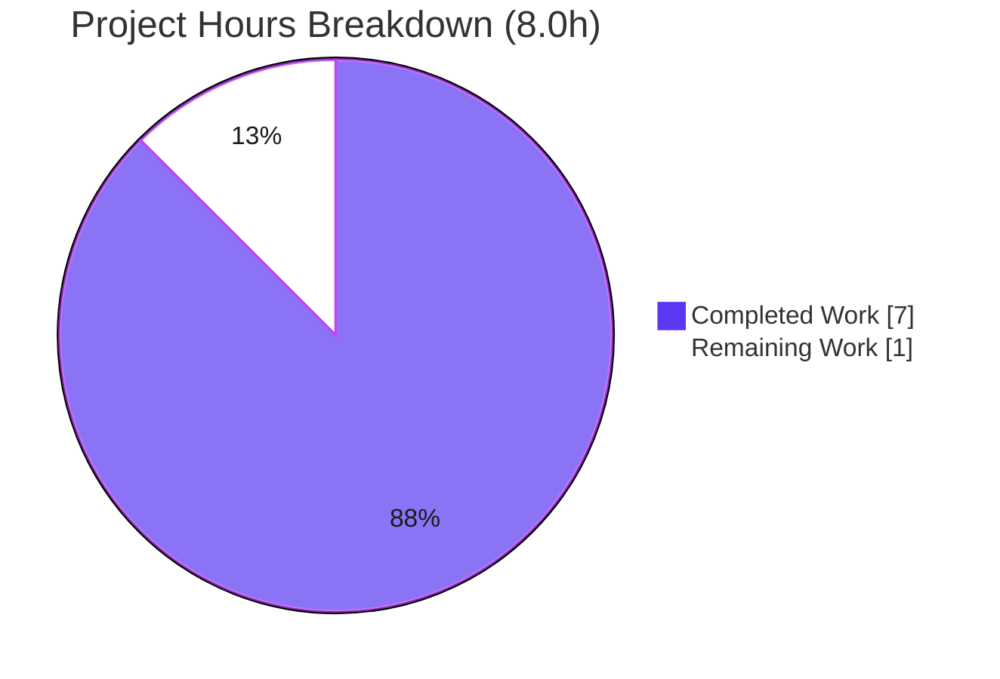

# Blitzy Project Guide — Artifact5: Node.js + Express Server

> Brand legend — **Completed / AI Work:** Dark Blue `#5B39F3` · **Remaining / Not Completed:** White `#FFFFFF` · **Headings / Accents:** Violet-Black `#B23AF2` · **Highlight:** Mint `#A8FDD9`

---

## 1. Executive Summary

### 1.1 Project Overview

Artifact5 stands up a minimal, runnable Node.js HTTP server built on the Express.js web framework. The server exposes two plaintext `GET` endpoints — `GET /` returning `Hello world` and a newly added `GET /good-evening` returning `Good evening` — listening on port 3000. Although the request framed this as extending an *existing* server, the repository in fact contained only a one-line `README.md`; the entire application foundation (manifest, entry point, lockfile, ignore rules) was therefore bootstrapped from scratch. The target audience is developers learning idiomatic Express routing. Technical scope is deliberately tiny and self-contained: one direct dependency (`express@5.2.1`), CommonJS modules, no database, and no external integrations.

### 1.2 Completion Status



| Metric | Value |
| --- | --- |
| **Total Hours** | **8.0 h** |
| **Completed Hours (AI + Manual)** | **7.0 h** (AI: 7.0 h · Manual: 0.0 h) |
| **Remaining Hours** | **1.0 h** |
| **Percent Complete** | **87.5%** |

> Completion is computed with the PA1 AAP-scoped, hours-based formula: `Completed / (Completed + Remaining) × 100 = 7.0 / 8.0 = 87.5%`. All Agent Action Plan (AAP) deliverables are complete and independently verified; the remaining 1.0 h is the human review-and-acceptance layer that always precedes a production merge.

### 1.3 Key Accomplishments

- ✅ Bootstrapped the absent project foundation: `package.json` manifest with a `start` script and `main` entry.
- ✅ Integrated Express.js as the routing layer — `express@5.2.1` added as the sole direct dependency and locked.
- ✅ Implemented `index.js` (CommonJS): instantiates the app and binds `app.listen(3000)` with a startup log.
- ✅ Original endpoint `GET /` returns the exact body `Hello world` (HTTP 200) — verified byte-exact.
- ✅ New endpoint `GET /good-evening` returns the exact body `Good evening` (HTTP 200) — verified byte-exact.
- ✅ Generated `package-lock.json` (lockfileVersion 3) pinning `express@5.2.1` across 67 packages; `npm audit` → 0 vulnerabilities.
- ✅ Added `.gitignore` excluding `node_modules/` and logs; `node_modules/` correctly untracked.
- ✅ Updated `README.md` with prerequisites, install/run steps, and an endpoint table — original `# Artifact5` heading preserved.
- ✅ Honored the "Make minimal changes" rule: exactly 5 files, no opportunistic refactoring, no out-of-scope additions.

### 1.4 Critical Unresolved Issues

| Issue | Impact | Owner | ETA |
| --- | --- | --- | --- |
| None | No critical or blocking issues identified. All AAP deliverables are complete, compile cleanly, run, and return their exact required bodies; `npm audit` reports 0 vulnerabilities. | — | — |

### 1.5 Access Issues

| System / Resource | Type of Access | Issue Description | Resolution Status | Owner |
| --- | --- | --- | --- | --- |
| Git repository (branch `blitzy-ef681432-…`) | Read/Write | None — repository accessible; working tree clean | ✅ No issue | — |
| npm registry | Network (install) | None — registry reachable; `npm ci` succeeded (66 packages) | ✅ No issue | — |
| External services / credentials | — | None required — server is fully self-contained (no DB, APIs, secrets, or env config) | ✅ Not applicable | — |

**No access issues identified.** Automated build, install, and runtime validation all completed without permission or credential blockers.

### 1.6 Recommended Next Steps

1. **[Medium]** Perform human code review of the branch and approve/merge the pull request (~0.5 h).
2. **[Medium]** Run runtime acceptance verification: `npm install` → `npm start`, then exercise both endpoints (~0.5 h).
3. **[Low]** *(Optional, out of AAP scope)* Parameterize the port via `process.env.PORT || 3000` to avoid `EADDRINUSE` conflicts.
4. **[Low]** *(Optional, out of AAP scope)* Add a minimal automated test suite (`jest` + `supertest`) covering both endpoints and the 404 fallback.
5. **[Low]** *(Optional, out of AAP scope)* If ever exposed publicly, add hardening (`helmet`), request logging (`morgan`), and TLS via a reverse proxy.

---

## 2. Project Hours Breakdown

### 2.1 Completed Work Detail

| Component | Hours | Description |
| --- | --- | --- |
| Project manifest & bootstrap (`package.json`) | 1.0 | Project metadata, `main = index.js`, `scripts.start = "node index.js"`, `express` declared under dependencies (AAP R3, R4). |
| Express integration & dependency lockfile | 1.5 | `npm install express@5.2.1`; generated `package-lock.json` (lockfileVersion 3, 67 packages); version research/confirmation (AAP R1, R4). |
| Server entry point core (`index.js`) | 1.5 | CommonJS app: `require('express')`, `const app = express()`, `GET /` → `Hello world`, `app.listen(3000)` + startup log, full JSDoc (AAP R3, R5, R6). |
| New endpoint `GET /good-evening` | 0.5 | Added route returning the exact body `Good evening` (AAP R2, R6). |
| Version-control hygiene (`.gitignore`) | 0.5 | Excludes `node_modules/` and logs from version control (AAP R4). |
| Documentation (`README.md`) | 1.0 | Added description, prerequisites (Node ≥ 18), install/run steps, endpoint table, 404 note; preserved `# Artifact5` heading. |
| Autonomous validation & runtime verification | 1.0 | 5-gate validation (deps, static, contract, runtime, integrity), ad-hoc assertion harness, byte-exact endpoint checks, web-research consolidation. |
| **Total** | **7.0** | **Sum of completed AAP-scoped work (matches Section 1.2 Completed Hours).** |

### 2.2 Remaining Work Detail

| Category | Hours | Priority |
| --- | --- | --- |
| Human code review & merge approval (path-to-production) | 0.5 | Medium |
| Human runtime / acceptance verification (path-to-production) | 0.5 | Medium |
| **Total** | **1.0** | **Matches Section 1.2 Remaining Hours and Section 7 pie chart.** |

> **Out-of-scope advisory items (NOT counted in the 1.0 h / 8.0 h totals):** port parameterization, automated tests, `engines`/`.nvmrc` pinning, hardening/observability middleware, and containerization/CI-CD are all explicitly excluded by AAP §0.3.2 and are listed only as optional future enhancements (see Section 1.6 and Section 6).

---

## 3. Test Results

All checks below originate from Blitzy's autonomous validation logs and were independently reproduced during this assessment. No standalone unit-test framework exists (deliberately out of scope per AAP §0.3.2); behavioral correctness is proven via an ad-hoc assertion harness and live runtime checks.

| Test Category | Framework | Total Tests | Passed | Failed | Coverage % | Notes |
| --- | --- | --- | --- | --- | --- | --- |
| Static / Syntax | `node --check` | 1 | 1 | 0 | n/a | `index.js` parses clean (exit 0); both manifests valid JSON. |
| API / Behavioral Contract | Ad-hoc Node assertion harness (Blitzy validator) | 5 | 5 | 0 | 100% of routes | Status + byte-exact body for `GET /` and `GET /good-evening`; `GET /no-such-route` → 404. |
| End-to-End Runtime (HTTP) | Live HTTP (curl / Invoke-WebRequest) | 3 | 3 | 0 | 100% of endpoints | `GET /` → 200 `Hello world`; `GET /good-evening` → 200 `Good evening`; unknown → 404. |
| Unit | — (none by design) | 0 | 0 | 0 | n/a | No unit-test framework; `npm test` → "Missing script" is EXPECTED (AAP §0.3.2). |
| **Total** | | **9** | **9** | **0** | **100% (behavioral)** | **100% pass rate; 0 failures.** |

> Code-coverage instrumentation (e.g., `nyc`/`c8`) was not used (out of scope). "Coverage %" here denotes behavioral route/endpoint coverage: 2/2 routes plus the 404 fallback were exercised. Dependency security: `npm audit` → **0 vulnerabilities** (67 packages audited).

---

## 4. Runtime Validation & UI Verification

**Runtime health**

- ✅ **Operational** — Server starts via `npm start` (`node index.js`); logs `Server listening on port 3000`; binds port 3000; zero stderr.
- ✅ **Operational** — `GET /` → HTTP 200, body `Hello world` (Content-Type `text/html; charset=utf-8`), case-sensitive exact match.
- ✅ **Operational** — `GET /good-evening` → HTTP 200, body `Good evening`, case-sensitive exact match.
- ✅ **Operational** — Unmatched path (`GET /no-such-route`) → HTTP 404 (Express default handler).
- ✅ **Operational** — Clean shutdown; port 3000 released; no orphaned processes.

**API integration**

- ✅ **Operational** — Self-contained server with no external API or service dependencies; nothing to integrate or mock.

**UI verification**

- ⚠ **Not Applicable** — There is no graphical user interface. Both endpoints return short plaintext payloads over HTTP (AAP §0.5.3). No component library or design system is involved, so no visual/Figma verification applies.

---

## 5. Compliance & Quality Review

AAP deliverables cross-mapped to Blitzy quality and compliance benchmarks. No fixes were required during autonomous validation — every item passed on inspection.

| Benchmark / AAP Deliverable | Status | Progress | Notes |
| --- | --- | --- | --- |
| R1 — Express.js integrated as routing layer | ✅ Pass | 100% | `express@5.2.1` sole direct dep; `require('express')`, `app = express()`. |
| R2 — New endpoint `GET /good-evening` → `Good evening` | ✅ Pass | 100% | Verified 200 + byte-exact body. |
| R3 — Bootstrap foundation (`package.json` + `index.js`, original `GET /`) | ✅ Pass | 100% | Both created; `GET /` → `Hello world` verified. |
| R4 — Dependency declared, locked, `node_modules/` ignored | ✅ Pass | 100% | `package-lock.json` lockfileVersion 3; `.gitignore` excludes `node_modules/`. |
| R5 — Server binds & listens on port 3000 | ✅ Pass | 100% | `app.listen(3000)` + startup log; port 3000 LISTEN confirmed. |
| R6 — Route paths resolve (`/`, `/good-evening`) | ✅ Pass | 100% | Both routes registered and verified; unmatched → 404. |
| Exact-string fidelity (`Hello world`, `Good evening`) | ✅ Pass | 100% | Lowercase `w`, no trailing punctuation; confirmed byte-exact (`-ceq`). |
| "Make minimal changes" rule (§0.7) | ✅ Pass | 100% | Exactly 5 files; heading preserved; no refactoring or cross-file edits. |
| Dependency security | ✅ Pass | 100% | `npm audit` → 0 vulnerabilities (67 audited). |
| Static validity (syntax + JSON) | ✅ Pass | 100% | `node --check` exit 0; manifests valid JSON. |
| Out-of-scope exclusions honored (§0.3.2) | ✅ Pass | 100% | No tests/CI-CD/containers/extra middleware/TS; "Dead code detection" correctly not actioned. |

**Fixes applied during autonomous validation:** None — zero defects found across all five gates. **Outstanding compliance items:** None.

---

## 6. Risk Assessment

All identified risks are **Low** severity and stem from the deliberately minimal, tutorial-grade scope. Items marked *Accepted/Deferred* are explicitly excluded by the AAP and are advisory only — they do **not** add to the remaining-hours total.

| Risk | Category | Severity | Probability | Mitigation | Status |
| --- | --- | --- | --- | --- | --- |
| No automated test suite (no regression safety net) | Technical | Low | Low | Add `jest` + `supertest` if the project grows | Accepted (AAP §0.3.2) |
| Hardcoded port 3000 (no `PORT` fallback) → `EADDRINUSE` if occupied | Technical | Low | Low | `const port = process.env.PORT || 3000` | Deferred (AAP §0.5.5) |
| No graceful shutdown / process supervisor | Technical | Low | Low | Run under `pm2`/`systemd` in production | Accepted |
| No hardening middleware (helmet, rate limiting) | Security | Low | Low | Add `helmet` if publicly exposed; surface is trivial (no user input/secrets) | Accepted |
| Dependency vulnerability drift over time | Security | Low | Low | Periodic `npm audit`; lockfile pins versions | Mitigated (0 vulns now) |
| No HTTPS/TLS (plaintext HTTP) | Security | Low | Low | TLS termination via reverse proxy in production | Accepted |
| No dedicated `/health` endpoint | Operational | Low | Low | `GET /` returns 200 and serves as de facto liveness probe | Accepted |
| Minimal logging / no metrics | Operational | Low | Low | Add `morgan`/APM if observability needed | Accepted |
| npm registry reachability for install | Integration | Low | Low | Committed lockfile makes installs deterministic; offline cache | Mitigated (verified) |
| External service integrations | Integration | Low | N/A | None exist — self-contained stateless server | Not applicable |

---

## 7. Visual Project Status



**Remaining hours by category (Section 2.2)** — total **1.0 h**:

| Category | Hours | Priority |
| --- | --- | --- |
| Human code review & merge approval | 0.5 | Medium |
| Human runtime / acceptance verification | 0.5 | Medium |
| **Total** | **1.0** | — |

> Integrity check: "Remaining Work" = 1.0 h in the pie chart equals Section 1.2 Remaining Hours (1.0 h) and the sum of Section 2.2 (0.5 + 0.5 = 1.0 h). "Completed Work" = 7.0 h equals Section 1.2 Completed Hours and the Section 2.1 total.

---

## 8. Summary & Recommendations

**Achievements.** The Artifact5 project is **87.5% complete**. Every Agent Action Plan deliverable has been autonomously implemented and independently verified with zero defects. Express.js 5.2.1 is integrated as the sole direct dependency; the server bootstraps cleanly from a previously empty repository; and both endpoints return their exact required bodies — `GET /` → `Hello world` and `GET /good-evening` → `Good evening` — with correct HTTP 200 status, while unmatched paths fall through to Express's default 404. All five files (`package.json`, `index.js`, `package-lock.json`, `.gitignore`, `README.md`) are present, valid, and consistent, and the "Make minimal changes" rule is fully honored.

**Remaining gaps.** The outstanding 1.0 h (12.5%) is entirely the human path-to-production layer: code review/merge approval and a runtime acceptance pass. No engineering work remains within the AAP scope.

**Critical path to production.** (1) Human reviews and merges the branch → (2) human runs `npm install` and `npm start` and exercises both endpoints → done. There are no blockers.

**Success metrics (all met):** server starts on port 3000; `GET /` returns `Hello world`; `GET /good-evening` returns `Good evening`; `npm audit` reports 0 vulnerabilities; exactly 5 tracked files; working tree clean.

| Dimension | Assessment |
| --- | --- |
| AAP-scoped completion | 87.5% (7.0 h of 8.0 h) |
| Defects found | 0 |
| Dependency vulnerabilities | 0 |
| Production readiness (within tutorial scope) | High — pending human sign-off only |

**Production readiness assessment:** **Ready for human review and merge.** For the defined tutorial-grade scope, the deliverable is functionally complete and verified. Optional hardening, tests, and deployment automation are intentionally out of scope and can be undertaken later if the project's purpose expands beyond a tutorial.

---

## 9. Development Guide

### 9.1 System Prerequisites

- **Node.js ≥ 18** (Express 5 requirement). Verified on Node v20.20.2; the AAP build host used v22.22.2 — both satisfy the requirement.
- **npm** (bundled with Node.js). Verified on npm 10.8.2.
- **OS:** cross-platform (Windows / macOS / Linux). `curl` is available by default on all three (`C:\Windows\system32\curl.exe` on Windows).
- **Hardware:** negligible — a few MB of RAM; no special CPU/disk needs.

### 9.2 Environment Setup

- No environment variables are required. No `.env` file is used.
- No databases, caches, or message queues.
- The listening port is hardcoded to **3000** (no configuration needed).

### 9.3 Dependency Installation

Run from the repository root:

```bash
# Deterministic install from the committed lockfile (preferred):
npm ci

# — or — first-time / development install:
npm install
```

Expected output (abridged):

```
added 66 packages, and audited 67 packages in ~1s
found 0 vulnerabilities
```

Verify the dependency tree:

```bash
npm ls
# artifact5@1.0.0
# `-- express@5.2.1
```

### 9.4 Application Startup

```bash
npm start          # equivalent to: node index.js
```

Expected startup log:

```
> artifact5@1.0.0 start
> node index.js
Server listening on port 3000
```

### 9.5 Verification Steps

With the server running, in a second terminal:

```bash
curl http://localhost:3000/                 # -> Hello world
curl http://localhost:3000/good-evening     # -> Good evening
curl -o /dev/null -w "%{http_code}\n" http://localhost:3000/no-such-route   # -> 404
```

On Windows PowerShell you may instead use:

```powershell
(Invoke-WebRequest http://localhost:3000/).Content                # Hello world
(Invoke-WebRequest http://localhost:3000/good-evening).Content    # Good evening
```

Stop the server with `Ctrl+C` (foreground) or by terminating the `node index.js` process.

### 9.6 Example Usage

- Open `http://localhost:3000/` in a browser → page shows `Hello world`.
- Open `http://localhost:3000/good-evening` → page shows `Good evening`.
- Any other path returns Express's default `404 Not Found`.

### 9.7 Troubleshooting

| Symptom | Cause | Resolution |
| --- | --- | --- |
| `Error: listen EADDRINUSE :::3000` | Port 3000 already in use | Stop the conflicting process, or (advisory) parameterize via `process.env.PORT`. |
| `npm test` → `Missing script: "test"` | No test script by design | **Expected** — tests are out of scope (AAP §0.3.2); not an error. |
| `Cannot find module 'express'` | Dependencies not installed | Run `npm ci` (or `npm install`) to materialize `node_modules/`. |
| Server exits immediately / syntax error | Wrong Node version | Ensure Node ≥ 18 (`node --version`). |

---

## 10. Appendices

### A. Command Reference

| Command | Purpose |
| --- | --- |
| `npm ci` | Deterministic install from `package-lock.json` (66 packages). |
| `npm install` | Install/resolve dependencies (first-time or dev). |
| `npm ls` | Show the dependency tree (`express@5.2.1`). |
| `npm start` | Start the server (`node index.js`) on port 3000. |
| `node --check index.js` | Validate `index.js` syntax without executing. |
| `npm audit` | Security scan (currently 0 vulnerabilities). |
| `curl http://localhost:3000/` | Exercise the `Hello world` endpoint. |
| `curl http://localhost:3000/good-evening` | Exercise the `Good evening` endpoint. |

### B. Port Reference

| Port | Service | Configurable | Notes |
| --- | --- | --- | --- |
| 3000 | Express HTTP server | Hardcoded (no env override in current scope) | `http://localhost:3000`. |

### C. Key File Locations

| File | LOC | Role |
| --- | --- | --- |
| `index.js` | 58 | Express server entry point; two route handlers + listener. |
| `package.json` | 13 | Manifest: `main`, `start` script, `express` dependency. |
| `package-lock.json` | 844 | Lockfile (lockfileVersion 3); pins `express@5.2.1` + 66 transitive packages. |
| `.gitignore` | 6 | Excludes `node_modules/` and logs. |
| `README.md` | 35 | Project docs: prerequisites, install/run, endpoint table. |

### D. Technology Versions

| Component | Version | Notes |
| --- | --- | --- |
| Express.js | 5.2.1 | Sole direct dependency (latest stable). |
| Node.js | ≥ 18 required | Verified v20.20.2; AAP build host v22.22.2. |
| npm | — | Verified 10.8.2; AAP build host 11.1.0. |
| Module system | CommonJS | `require`/`module`; `package.json` does **not** set `"type":"module"`. |
| lockfileVersion | 3 | npm lockfile format. |
| License | MIT | Declared in `package.json`. |

### E. Environment Variable Reference

| Variable | Required | Default | Notes |
| --- | --- | --- | --- |
| — (none) | — | — | No environment variables are used in the current scope. `PORT` is an optional future enhancement (advisory, out of scope). |

### F. Developer Tools Guide

| Tool | Use |
| --- | --- |
| Node.js runtime | Executes `index.js` directly. |
| npm | Dependency management and the `start` script. |
| `node --check` | Fast syntax validation in CI or pre-commit. |
| `curl` / `Invoke-WebRequest` | Manual endpoint verification. |
| Git + Git LFS | Version control (LFS hooks present but unused by this project). |

### G. Glossary

| Term | Definition |
| --- | --- |
| **AAP** | Agent Action Plan — the authoritative specification for this engagement. |
| **CommonJS** | Node's classic module system using `require()`/`module.exports`. |
| **Endpoint** | An HTTP route + method pair handled by the server (e.g., `GET /good-evening`). |
| **Lockfile** | `package-lock.json` — pins exact dependency versions for reproducible installs. |
| **Path-to-production** | Standard human steps (review, acceptance) required before code is merged/deployed. |
| **EADDRINUSE** | OS error when the target port is already bound by another process. |