# Technical Specification

# 1. Introduction

## 1.1 Executive Summary

### 1.1.1 Project Overview

The `Artifact5` project is, as of this Technical Specification's documentation baseline, a freshly initialized Git repository in a pre-implementation state. The repository's working tree contains exactly one tracked artifact — a `README.md` file totaling 11 bytes whose entire content is the project name expressed as a Markdown H1 heading (`# Artifact5`). The repository's version control history consists of a single commit titled "Initial commit" (`44cfc00`) authored by `Blitzy-Multi <mmwforfinance@gmail.com>`.

Because no implementation source, configuration manifest, dependency declaration, build script, test suite, architectural specification, design document, or requirements artifact has been committed to the repository, this Introduction documents the **observable project identity** rather than realized capabilities. Subsections that would conventionally describe business problems, stakeholder taxonomies, value propositions, integrations, success metrics, and scope are explicitly marked as undefined where the repository provides no evidentiary basis.

### 1.1.2 Project Identity (Observable Facts)

The following table captures every fact about the project that can be derived from the repository's current contents.

| Attribute | Observed Value |
|---|---|
| Project Name | `Artifact5` |
| Repository State | Initialization-stage (single commit) |
| Tracked Files (excluding `.git/`) | 1 (`README.md`) |
| Repository Content Size | 11 bytes |
| Initial Commit Hash | `44cfc00` |
| Initial Commit Message | "Initial commit" |
| Commit Author | `Blitzy-Multi <mmwforfinance@gmail.com>` |
| Subdirectories | None |

### 1.1.3 Core Business Problem

The repository does not articulate a business problem, market pain point, or domain challenge. The sole tracked artifact (`README.md`) contains only the project name and provides no narrative description. A business problem statement cannot be documented from available evidence.

| Dimension | Status |
|---|---|
| Problem Statement | Not defined in repository |
| Target Domain | Not defined in repository |
| Existing Solution Gap | Not defined in repository |
| Triggering Need | Not defined in repository |

### 1.1.4 Key Stakeholders and Users

The repository contains no stakeholder registry, user persona definitions, role assignments, or audience descriptions. The only identifiable party associated with the project is the author of the initial Git commit.

| Stakeholder Role | Identified Party |
|---|---|
| Repository Initializer | `Blitzy-Multi` (commit author) |
| End Users | Not defined in repository |
| Product Owner / Sponsor | Not defined in repository |
| Operations / Support Owner | Not defined in repository |

### 1.1.5 Expected Business Impact and Value Proposition

No value proposition, expected outcome, benefit projection, or business-impact metric is declared in the repository. This subsection cannot be populated from the available evidence.

| Impact Dimension | Status |
|---|---|
| Revenue / Commercial Impact | Not defined in repository |
| Operational Efficiency Gains | Not defined in repository |
| User-Experience Improvements | Not defined in repository |
| Strategic / Competitive Positioning | Not defined in repository |

## 1.2 System Overview

### 1.2.1 Project Context

#### Business Context and Market Positioning

The repository contains no documents describing business context, market positioning, competitive landscape, target segment, or strategic intent for `Artifact5`. The `README.md` provides no narrative beyond the project name itself.

#### Current System Limitations

The repository's Git history consists of a single "Initial commit," indicating `Artifact5` is a newly initialized project rather than a replacement, refactor, or upgrade of an existing solution. No predecessor system, legacy platform, or prior-art constraint is referenced anywhere in the repository. Consequently, no current-system limitations are documented because no current system is referenced.

#### Integration with Existing Enterprise Landscape

No enterprise integration points, external systems, partner APIs, or third-party services are referenced in the repository. The absence of any dependency manifest (such as `package.json`, `requirements.txt`, `go.mod`, `Cargo.toml`, `pom.xml`, or equivalent) confirms that no external integrations have been declared.

| Integration Category | Declared Touchpoints |
|---|---|
| Upstream Systems | Not defined in repository |
| Downstream Systems | Not defined in repository |
| Authentication / Identity Providers | Not defined in repository |
| Data / Messaging Backbones | Not defined in repository |

### 1.2.2 High-Level Description

#### Primary System Capabilities

The repository realizes no system capabilities at this time. There are no executable artifacts, functional modules, behavioral specifications, or interface definitions. The system, as represented by the current repository state, performs no observable actions.

#### Major System Components

The repository contains a single observable component: the `README.md` placeholder file. The diagram below represents the complete observable structure of the repository as it exists at the documentation baseline.

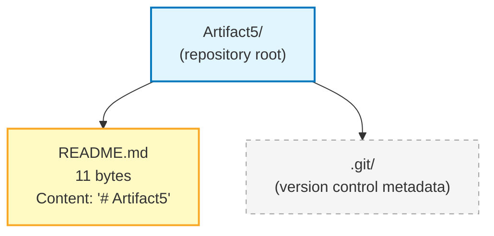

#### Core Technical Approach

No programming language, framework, runtime, persistence technology, deployment target, or architectural pattern has been selected or declared in the repository. The `README.md` file's use of Markdown syntax constitutes a documentation-format choice, not an architectural decision that influences any future system's runtime behavior.

| Technical Decision | Current State |
|---|---|
| Programming Language | Not selected in repository |
| Framework / Platform | Not selected in repository |
| Runtime Environment | Not selected in repository |
| Persistence Layer | Not selected in repository |
| Deployment Target | Not selected in repository |
| Architectural Style | Not selected in repository |

### 1.2.3 Success Criteria

#### Measurable Objectives

The repository defines no measurable objectives. Quantitative targets cannot be enumerated when no goals have been articulated.

#### Critical Success Factors

The repository documents no critical success factors, organizational dependencies, or required enabling conditions.

#### Key Performance Indicators (KPIs)

The repository declares no KPIs across any performance dimension.

| KPI Category | Declared Targets |
|---|---|
| Performance Metrics (latency, throughput) | Not defined in repository |
| Reliability Metrics (availability, error rate) | Not defined in repository |
| Adoption / Usage Metrics | Not defined in repository |
| Quality Metrics (defect density, coverage) | Not defined in repository |

## 1.3 Scope

### 1.3.1 In-Scope Elements

#### Core Features and Functionalities

The repository declares no must-have capabilities, primary user workflows, essential integrations, or key technical requirements. The sole tracked artifact (`README.md`) does not enumerate functional or non-functional in-scope items.

| Scope Category | In-Scope Items |
|---|---|
| Must-Have Capabilities | Not defined in repository |
| Primary User Workflows | Not defined in repository |
| Essential Integrations | Not defined in repository |
| Key Technical Requirements | Not defined in repository |

#### Implementation Boundaries

No boundaries — system, user, geographic, or data — are delineated in the repository.

| Boundary Dimension | Defined Coverage |
|---|---|
| System Boundaries | Not defined in repository |
| User Groups Covered | Not defined in repository |
| Geographic / Market Coverage | Not defined in repository |
| Data Domains Included | Not defined in repository |

### 1.3.2 Out-of-Scope Elements

Out-of-scope exclusions are typically enumerated relative to an established in-scope baseline. Because the repository declares no in-scope features, capabilities, integrations, or data domains (see Section 1.3.1), no meaningful exclusion list can be derived from available evidence.

| Out-of-Scope Category | Declared Exclusions |
|---|---|
| Excluded Features / Capabilities | Not defined in repository |
| Future Phase Considerations | Not defined in repository |
| Integration Points Not Covered | Not defined in repository |
| Unsupported Use Cases | Not defined in repository |

### 1.3.3 Documentation Baseline Acknowledgement

This Technical Specification is produced against an initialization-stage repository. The following conditions are objectively observed and constitute the documentary baseline for every subsequent section of this specification:

- The repository's `README.md` contains only the project name (`# Artifact5`) as a single Markdown H1 heading, with no additional narrative content.
- No source code files, configuration files, build scripts, dependency manifests, test artifacts, license files, `.gitignore` files, or supplementary documentation exist in the repository.
- No subdirectories exist beneath the repository root; the only entries under the root are `README.md` and the `.git/` metadata directory.
- The Git history contains exactly one commit (`44cfc00` — "Initial commit"), with no prior revisions providing additional context, branches with divergent content, or tags indicating release milestones.

Subsequent revisions of this Technical Specification should be triggered once the repository accumulates implementation artifacts, formal requirements documents, or design specifications that allow meaningful and evidence-based population of the Executive Summary, System Overview, and Scope subsections introduced above.

#### References

#### Files Examined

- `README.md` — The sole non-`.git` file in the repository. Total size: 11 bytes. Full content: `# Artifact5` (a single Markdown H1 heading). This file is the exclusive source of the project name fact used throughout this section.

#### Folders Examined

- `/` (repository root) — Verified to contain only `README.md` (file) and `.git/` (version-control metadata directory). No subdirectories exist; the repository's directory depth is 0.

#### Repository Metadata Examined

- Git commit log (`git log --all --oneline`) — Confirmed a single commit `44cfc00 "Initial commit"`; no historical state exists beyond the current working tree.
- Git commit authorship (`git log --all --pretty=full`) — Confirmed the sole commit author as `Blitzy-Multi <mmwforfinance@gmail.com>`.

#### Negative Findings (Verified Absences)

- No package manifests, configuration files, build scripts, source code files, test files, license files, or `.gitignore` files exist anywhere in the repository tree.
- No `.blitzyignore` files exist (verified via filesystem search).
- No subdirectories of any kind exist beneath the repository root (verified via directory listing).
- No API definitions (OpenAPI, GraphQL schema, Protocol Buffer files), database schemas, or migration scripts exist.

#### Cross-Referenced Specification Sections

- None. The list of potentially relevant cross-reference sections supplied for this Introduction section was empty (`[]`), and no other Technical Specification sections were retrieved.

# 2. Product Requirements

## 2.1 DOCUMENTATION BASELINE AND EVIDENTIARY CONSTRAINTS

### 2.1.1 Inherited Baseline from Sections 1.1–1.3

This Product Requirements section is produced against the same initialization-stage repository baseline already documented in Sections 1.1 (Executive Summary), 1.2 (System Overview), and 1.3 (Scope). The observable repository facts that constrain every subsection below are:

- The repository's working tree contains exactly one tracked artifact — `README.md` (11 bytes) — whose entire content is the project name expressed as a Markdown H1 heading (`# Artifact5`).
- No source code files, configuration files, build scripts, dependency manifests, test artifacts, license files, `.gitignore` files, or supplementary documentation exist in the repository.
- No subdirectories exist beneath the repository root; the only entries are `README.md` and the `.git/` metadata directory.
- The Git history contains exactly one commit (`44cfc00` — "Initial commit") authored by `Blitzy-Multi <mmwforfinance@gmail.com>`.
- Section 1.1.3 confirms that no business problem statement is articulated in the repository.
- Section 1.2.2 confirms that the repository realizes no system capabilities and that no programming language, framework, runtime, persistence layer, deployment target, or architectural pattern has been selected.
- Section 1.3.1 confirms that the repository declares no must-have capabilities, primary user workflows, essential integrations, or key technical requirements.

### 2.1.2 Consequence for Product Requirements Documentation

Product Requirements documentation depends on the existence of upstream artifacts — formally captured features, user stories, specification documents, behavioral descriptions, interface contracts, or implementation source from which feature inventory can be derived. The `Artifact5` repository contains none of these artifact categories at this documentation baseline. Therefore, every subsection of Section 2 documents the **absence** of the requested requirements artifacts following the evidence-based "Not defined in repository" pattern established in Sections 1.1, 1.2, and 1.3.

The following table summarizes which Product Requirements subsections can be populated from the repository's current evidentiary base:

| Subsection | Population Feasibility | Cross-Reference |
|---|---|---|
| Feature Catalog | Cannot be populated — no features declared | Section 1.2.2 |
| Functional Requirements Table | Cannot be populated — no requirements declared | Section 1.3.1 |
| Feature Relationships | Cannot be populated — zero features yields zero relationships | Section 1.2.2 |
| Implementation Considerations | Cannot be populated — no technical stack selected | Section 1.2.2 |

### 2.1.3 Authoring Constraint Acknowledgement

In accordance with the evidence-based documentation discipline applied throughout this Technical Specification, this section does not introduce speculative feature identifiers, hypothetical acceptance criteria, presumed priority levels, imagined complexity ratings, or fabricated integration points. The standard `F-XXX` feature ID schema and `F-XXX-RQ-YYY` requirement ID schema are presented as structural conventions only; no IDs are assigned because no features or requirements exist in the repository.

---

## 2.2 FEATURE CATALOG

### 2.2.1 Feature Inventory

No features are declared or implemented in the `Artifact5` repository. The `README.md` file contains only the project name (`# Artifact5`) and provides no narrative, capability list, user story, behavioral specification, or interface description from which features could be enumerated. Consistent with Section 1.2.2, "The repository realizes no system capabilities at this time. There are no executable artifacts, functional modules, behavioral specifications, or interface definitions."

The following table represents the complete feature inventory derivable from available evidence:

| Feature ID | Feature Name | Feature Category | Status |
|---|---|---|---|
| _None_ | Not defined in repository | Not defined in repository | Not defined in repository |

### 2.2.2 Feature Metadata Schema (Reserved for Future Population)

Once the repository accumulates implementation artifacts or formal requirements documents, features will be catalogued using the conventional metadata structure shown below. At this documentation baseline, this schema is presented as a placeholder only and contains no rows.

| Metadata Attribute | Value Domain | Current Population |
|---|---|---|
| Unique ID | Format `F-XXX` | No features to identify |
| Feature Name | Free-text label | No features to name |
| Feature Category | Functional / Non-Functional / Infrastructure / Integration | No features to categorize |
| Priority Level | Critical / High / Medium / Low | No features to prioritize |
| Status | Proposed / Approved / In Development / Completed | No features to track |

### 2.2.3 Feature Descriptions

No feature descriptions can be authored because no features have been declared. The conventional description dimensions — Overview, Business Value, User Benefits, and Technical Context — depend on upstream artifacts that do not exist in the repository:

| Description Dimension | Dependency for Population | Current State |
|---|---|---|
| Overview | Requires feature inventory | Not defined in repository |
| Business Value | Requires business problem statement (see Section 1.1.3) | Not defined in repository |
| User Benefits | Requires user persona definitions (see Section 1.1.4) | Not defined in repository |
| Technical Context | Requires technology stack selection (see Section 1.2.2) | Not defined in repository |

### 2.2.4 Feature Dependencies

Feature dependencies cannot be documented because no features have been declared. Section 1.2.1 confirms that the repository declares no upstream systems, downstream systems, authentication providers, or data/messaging integrations, and that "the absence of any dependency manifest (such as `package.json`, `requirements.txt`, `go.mod`, `Cargo.toml`, `pom.xml`, or equivalent) confirms that no external integrations have been declared."

| Dependency Category | Identified Dependencies | Evidentiary Source |
|---|---|---|
| Prerequisite Features | Not defined in repository | No features declared |
| System Dependencies | Not defined in repository | No manifests present |
| External Dependencies | Not defined in repository | See Section 1.2.1 |
| Integration Requirements | Not defined in repository | See Section 1.2.1 |

---

## 2.3 FUNCTIONAL REQUIREMENTS TABLE

### 2.3.1 Functional Requirement Inventory

No functional requirements are declared in the `Artifact5` repository. Per Section 1.3.1, "The repository declares no must-have capabilities, primary user workflows, essential integrations, or key technical requirements." Because the `F-XXX-RQ-YYY` requirement-identifier schema is derived from feature identifiers, and because no features exist (see Section 2.2.1), no requirement identifiers can be issued.

The following table represents the complete functional-requirement inventory derivable from available evidence:

| Requirement ID | Parent Feature | Description | Priority |
|---|---|---|---|
| _None_ | Not defined in repository | Not defined in repository | Not defined in repository |

### 2.3.2 Requirement Details Schema (Reserved for Future Population)

The standard requirement-details schema is presented below for reference only. It contains no rows at the current documentation baseline because no requirements have been declared.

| Detail Attribute | Value Domain | Current Population |
|---|---|---|
| Requirement ID | Format `F-XXX-RQ-YYY` | No requirements to identify |
| Description | Free-text statement of required behavior | No behaviors specified |
| Acceptance Criteria | Verifiable pass/fail conditions | No criteria defined |
| Priority | Must-Have / Should-Have / Could-Have | No priorities assigned |

### 2.3.3 Technical Specification Schema (Reserved for Future Population)

The conventional technical-specification dimensions for each requirement cannot be populated because no requirements exist. The dependency chain demonstrating why each dimension cannot be populated is documented below:

| Specification Dimension | Population Dependency | Current State |
|---|---|---|
| Input Parameters | Requires interface definitions | Not defined in repository |
| Output / Response | Requires behavioral specifications | Not defined in repository |
| Performance Criteria | Requires declared KPIs (see Section 1.2.3) | Not defined in repository |
| Data Requirements | Requires data-domain definitions (see Section 1.3.1) | Not defined in repository |

### 2.3.4 Validation Rules Schema (Reserved for Future Population)

Validation rules — including business rules, data-validation constraints, security controls, and compliance obligations — cannot be documented absent declared features and requirements. The conventional validation-rule dimensions are listed below for structural completeness:

| Validation Dimension | Population Dependency | Current State |
|---|---|---|
| Business Rules | Requires business-domain definition | Not defined in repository |
| Data Validation | Requires data schemas / models | Not defined in repository |
| Security Requirements | Requires threat model / auth model | Not defined in repository |
| Compliance Requirements | Requires regulatory / contractual scope | Not defined in repository |

### 2.3.5 Complexity Assessment

Requirement complexity cannot be rated because no requirements exist. The conventional High / Medium / Low complexity scale is documented here as a reserved structural element only. No assessments can be issued against zero requirements.

---

## 2.4 FEATURE RELATIONSHIPS

### 2.4.1 Feature Dependency Map

A feature dependency map requires a non-empty feature inventory. Because Section 2.2.1 establishes that the `Artifact5` repository declares zero features, zero feature-to-feature dependency relationships exist by definition. The diagram below represents the complete (empty) feature dependency landscape derivable from available evidence.

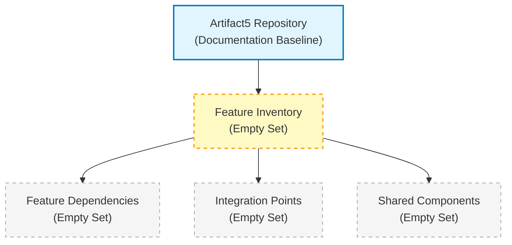

### 2.4.2 Integration Points

No integration points are declared in the repository. This finding is consistent with Section 1.2.1, which documents that no upstream systems, downstream systems, authentication / identity providers, or data / messaging backbones are declared, and that the absence of any dependency manifest confirms no external integrations exist.

| Integration Category | Declared Touchpoints | Source of Evidence |
|---|---|---|
| Inbound Integrations | Not defined in repository | No manifests, no APIs declared |
| Outbound Integrations | Not defined in repository | No clients, no SDKs declared |
| Synchronous Integrations | Not defined in repository | No HTTP / RPC contracts declared |
| Asynchronous Integrations | Not defined in repository | No queue / event contracts declared |

### 2.4.3 Shared Components and Common Services

No shared components or common services are declared in the repository. Because Section 1.2.2 confirms that there are "no executable artifacts, functional modules, behavioral specifications, or interface definitions," no module can be classified as shared or common.

| Shared Resource Category | Identified Resources | Source of Evidence |
|---|---|---|
| Shared Libraries / Modules | Not defined in repository | No source files present |
| Common Services | Not defined in repository | No service definitions present |
| Shared Data Stores | Not defined in repository | No persistence layer selected |
| Cross-Cutting Concerns | Not defined in repository | No logging / observability declared |

---

## 2.5 IMPLEMENTATION CONSIDERATIONS

### 2.5.1 Technical Constraints

No technical constraints are declared in the repository. Per Section 1.2.2, no programming language, framework, runtime environment, persistence layer, deployment target, or architectural style has been selected. Constraint analysis requires an established technology baseline against which constraints can be evaluated; no such baseline exists.

| Constraint Dimension | Declared Constraint | Cross-Reference |
|---|---|---|
| Language / Platform Constraints | Not defined in repository | See Section 1.2.2 |
| Runtime / Environment Constraints | Not defined in repository | See Section 1.2.2 |
| Architectural Constraints | Not defined in repository | See Section 1.2.2 |
| Deployment Constraints | Not defined in repository | See Section 1.2.2 |

### 2.5.2 Performance Requirements

No performance requirements are declared in the repository. Per Section 1.2.3, the repository declares no KPIs across any performance dimension, including latency, throughput, availability, error rate, adoption / usage, or quality metrics.

| Performance Dimension | Declared Target | Cross-Reference |
|---|---|---|
| Latency Targets | Not defined in repository | See Section 1.2.3 |
| Throughput Targets | Not defined in repository | See Section 1.2.3 |
| Availability Targets | Not defined in repository | See Section 1.2.3 |
| Resource Utilization Targets | Not defined in repository | See Section 1.2.3 |

### 2.5.3 Scalability Considerations

No scalability considerations are declared in the repository. Scalability analysis depends on declared workload characteristics, traffic projections, growth assumptions, and architectural style — none of which are documented in the current repository state.

| Scalability Dimension | Declared Strategy | Source of Evidence |
|---|---|---|
| Horizontal Scaling Strategy | Not defined in repository | No architecture declared |
| Vertical Scaling Strategy | Not defined in repository | No architecture declared |
| Load Profile Assumptions | Not defined in repository | No workload modeling present |
| Capacity Planning Assumptions | Not defined in repository | No resource targets declared |

### 2.5.4 Security Implications

No security implications, threat models, authentication mechanisms, authorization policies, or data-protection controls are declared in the repository. The absence of any source code, configuration, or specification means no attack surface, trust boundary, or security control can be identified or assessed.

| Security Dimension | Declared Control | Source of Evidence |
|---|---|---|
| Authentication Mechanism | Not defined in repository | No auth provider declared |
| Authorization Model | Not defined in repository | No role / policy declared |
| Data Protection Controls | Not defined in repository | No data handling declared |
| Threat Model | Not defined in repository | No attack surface defined |

### 2.5.5 Maintenance Requirements

No maintenance requirements are declared in the repository. Maintenance planning presupposes the existence of operational artifacts — runbooks, monitoring definitions, backup procedures, upgrade paths — none of which are present at the current documentation baseline.

| Maintenance Dimension | Declared Practice | Source of Evidence |
|---|---|---|
| Operational Runbooks | Not defined in repository | No `docs/` directory exists |
| Monitoring / Observability | Not defined in repository | No telemetry stack declared |
| Backup / Recovery Procedures | Not defined in repository | No persistence layer selected |
| Upgrade / Migration Procedures | Not defined in repository | No deployable artifact exists |

---

## 2.6 TRACEABILITY MATRIX

### 2.6.1 Requirement-to-Feature Traceability

A traceability matrix maps requirements to parent features and onward to acceptance tests, design artifacts, and implementation modules. Because the feature inventory (Section 2.2.1) and the functional-requirement inventory (Section 2.3.1) are both empty, no traceability rows can be produced.

| Requirement ID | Feature ID | Design Artifact | Implementation Module |
|---|---|---|---|
| _None_ | _None_ | Not defined in repository | Not defined in repository |

### 2.6.2 Cross-Section Traceability

The following table maps each Product Requirements subsection's empty-state finding to its evidentiary source in earlier sections of this Technical Specification. This cross-section traceability confirms that Section 2's empty-state documentation is rigorously grounded in evidence already established by Sections 1.1, 1.2, and 1.3.

| Section 2 Subsection | Empty-State Justification | Cross-Reference |
|---|---|---|
| 2.2 Feature Catalog | No system capabilities realized | Section 1.2.2 |
| 2.3 Functional Requirements | No must-have capabilities declared | Section 1.3.1 |
| 2.4 Feature Relationships | No integrations declared | Section 1.2.1 |
| 2.5 Implementation Considerations | No technology stack selected | Section 1.2.2 |

### 2.6.3 Assumption and Constraint Register

The following assumptions and constraints govern this section's documentation discipline and should be revisited when the repository is re-baselined for documentation:

| Assumption / Constraint | Description | Re-Evaluation Trigger |
|---|---|---|
| Evidence-Only Documentation | No requirement is fabricated absent repository evidence | Implementation artifacts committed |
| Schema Reservation | Standard ID schemas (`F-XXX`, `F-XXX-RQ-YYY`) reserved for future use | First feature declared |
| Inherited Baseline | Section 2 inherits the empty baseline from Sections 1.1–1.3 | Sections 1.1–1.3 re-baselined |
| Process-Flowchart References | No process flowcharts referenced because no processes declared | First behavioral spec authored |

---

## 2.7 RE-DOCUMENTATION TRIGGERS

### 2.7.1 Required Inputs for Meaningful Section 2 Population

Consistent with the re-triggering guidance provided in Section 1.3.3, meaningful Product Requirements documentation requires the repository to first accumulate one or more of the following artifact categories:

- **Implementation source code** revealing functional capabilities, callable interfaces, and behavioral contracts from which features and requirements can be reverse-engineered.
- **Formal requirements documents or user stories** declaring features, acceptance criteria, priorities, and stakeholder commitments.
- **Design specifications** declaring architectural style, component boundaries, integration points, and shared services.
- **Configuration manifests** (such as `package.json`, `requirements.txt`, `go.mod`, `Cargo.toml`, `pom.xml`, or equivalent) revealing system and external dependencies.
- **API specifications** (OpenAPI, GraphQL schema, Protocol Buffer files) declaring input parameters, output responses, and interface contracts.
- **Test artifacts** declaring acceptance criteria operationally as automated checks against expected behavior.

### 2.7.2 Versioning and Revision Tracking

This Section 2 baseline corresponds to repository commit `44cfc00` ("Initial commit"). Any commit that introduces one or more of the artifact categories listed in Section 2.7.1 should trigger a re-issuance of this Product Requirements section with evidence-based feature, requirement, and relationship content replacing the current empty-state tables.

| Version Attribute | Current Value |
|---|---|
| Section Baseline Commit | `44cfc00` |
| Section Baseline Commit Message | "Initial commit" |
| Feature Count at Baseline | 0 |
| Requirement Count at Baseline | 0 |

---

## 2.8 REFERENCES

### 2.8.1 Files Examined

- `README.md` — The sole non-`.git` file in the repository. Total size: 11 bytes. Full content: `# Artifact5` (a single Markdown H1 heading). Examined to confirm absence of feature narratives, capability lists, user stories, behavioral specifications, or interface descriptions.

### 2.8.2 Folders Examined

- `/` (repository root) — Verified to contain only `README.md` and the `.git/` metadata directory. No subdirectories exist; the repository's directory depth is 0. Examined to confirm absence of `src/`, `docs/`, `tests/`, `spec/`, or any other directory typically containing requirement or feature artifacts.

### 2.8.3 Repository Metadata Examined

- Git commit log — Confirmed a single commit `44cfc00 "Initial commit"`; no historical state exists from which prior feature declarations could be recovered.
- Git branch enumeration — Confirmed branches `main`, `remotes/origin/HEAD`, `remotes/origin/main` all point to the same single initialization commit; no divergent branches contain alternate feature declarations.

### 2.8.4 Negative Findings (Verified Absences)

- No source code files of any language (`.py`, `.js`, `.ts`, `.go`, `.rs`, `.java`, `.rb`, `.php`, `.c`, `.cpp`, `.cs`, etc.) exist anywhere in the repository tree.
- No package manifests (`package.json`, `requirements.txt`, `go.mod`, `Cargo.toml`, `pom.xml`, `composer.json`, `Gemfile`, etc.) exist.
- No build or infrastructure files (`Dockerfile`, `docker-compose.yml`, `Makefile`, `.github/workflows/`, `.gitlab-ci.yml`, `Jenkinsfile`, Terraform, Kubernetes manifests, etc.) exist.
- No documentation artifacts beyond `README.md` exist (no `CONTRIBUTING.md`, `CHANGELOG.md`, `LICENSE`, `docs/` directory, requirements documents, user stories, or specification files).
- No API specifications (OpenAPI, GraphQL schema, `.proto` files), database schemas, or migration scripts exist.
- No test artifacts (`tests/`, `test/`, `__tests__/`, `spec/`, `jest.config.js`, `pytest.ini`, etc.) exist.

### 2.8.5 Cross-Referenced Technical Specification Sections

- **Section 1.1 Executive Summary** — Established project identity (`Artifact5`), confirmed absence of business problem definition (Section 1.1.3), and confirmed absence of stakeholder taxonomy (Section 1.1.4). Used to justify the empty state of Section 2.2.3 (Feature Descriptions).
- **Section 1.2 System Overview** — Confirmed absence of business context (Section 1.2.1), absence of system capabilities and technology-stack selection (Section 1.2.2), and absence of declared KPIs (Section 1.2.3). Used to justify the empty state of Sections 2.2.1, 2.4.2, 2.4.3, 2.5.1, and 2.5.2.
- **Section 1.3 Scope** — Confirmed absence of in-scope features (Section 1.3.1) and established the documentary baseline acknowledgement pattern (Section 1.3.3). Used to justify the empty state of Section 2.3.1 and to inherit the documentary baseline acknowledgement framework applied throughout Section 2.

# 3. Technology Stack

## 3.1 Documentation Baseline and Evidentiary Constraints

### 3.1.1 Inherited Baseline from Sections 1.x and 2.x

This Technology Stack section is produced against the same initialization-stage repository baseline already documented in Sections 1.1 (Executive Summary), 1.2 (System Overview), 1.3 (Scope), and the entirety of Section 2 (Product Requirements). The observable repository facts that constrain every subsection below are:

- The repository's working tree contains exactly one tracked artifact — `README.md` (11 bytes) — whose entire content is the project name expressed as a Markdown H1 heading (`# Artifact5`).
- No source code files, configuration files, build scripts, dependency manifests, test artifacts, license files, `.gitignore` files, or supplementary documentation exist in the repository.
- No subdirectories exist beneath the repository root; the only entries are `README.md` and the `.git/` metadata directory.
- The Git history contains exactly one commit (`44cfc00` — "Initial commit") authored by `Blitzy-Multi <mmwforfinance@gmail.com>`.
- Section 1.2.2 confirms that no programming language, framework, runtime, persistence layer, deployment target, or architectural pattern has been selected or declared in the repository.
- Section 1.2.1 confirms that no upstream systems, downstream systems, authentication / identity providers, or data / messaging backbones are declared, and that the absence of any dependency manifest confirms no external integrations exist.
- Section 2.5.1 confirms that no language/platform, runtime/environment, architectural, or deployment constraints are declared.
- Section 2.5.4 confirms that no authentication mechanism, authorization model, data-protection controls, or threat model are declared.

### 3.1.2 Authoring Constraint and Default Stack Non-Applicability

In accordance with the evidence-based documentation discipline established in Section 2.1.3, this Technology Stack section does not introduce speculative language selections, hypothetical framework choices, presumed runtime targets, imagined database technologies, or fabricated cloud-platform commitments. Every technology category enumerated by the section prompt is documented as **not selected in the repository**, following the "Not defined in repository" pattern rigorously applied across Sections 1.1, 1.2, 1.3, 2.1, 2.2, 2.3, 2.4, 2.5, 2.6, 2.7, and 2.8.

The section prompt's instruction to **"Only include sections and items that are actually relevant to this system, based on your analysis of its requirements. Don't add any items that aren't clearly applicable."** is the controlling constraint for this section. Applying that instruction to the observable repository state yields the following determination: zero items from any default or suggested technology catalog are "clearly applicable" because the repository contains no evidence — source code, configuration manifest, build script, infrastructure file, or specification document — that would substantiate the selection of any specific language, framework, library, service, database, or deployment tool. Introducing any such selection without evidentiary support would violate the documentation discipline established throughout this specification and would create false architectural commitments not present in the repository.

### 3.1.3 Empty Technology Stack Landscape

The diagram below represents the complete (empty) technology stack landscape derivable from available evidence. It follows the same empty-state visualization pattern established in Section 2.4.1 (Feature Dependency Map).

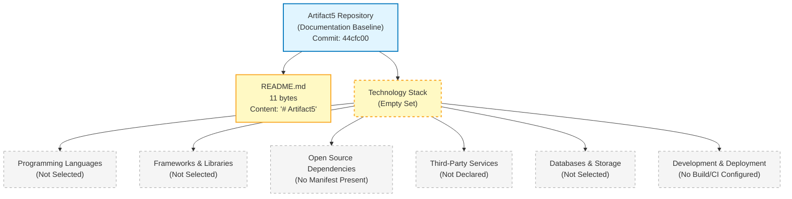

---

## 3.2 Programming Languages

### 3.2.1 Selection State by Platform/Component

No programming language has been selected, declared, or implemented in the repository. The verified absence of source files in every common language extension — `.py`, `.js`, `.ts`, `.tsx`, `.jsx`, `.go`, `.rs`, `.java`, `.rb`, `.php`, `.c`, `.cpp`, `.cs`, `.swift`, `.kt`, `.m`, `.html`, `.css` — confirms this state (see Section 2.8.4). The `README.md` file's use of Markdown syntax constitutes a documentation-format choice, not a programming-language selection that influences any runtime behavior (per Section 1.2.2).

| Platform / Component Category | Selected Language | Version | Source of Evidence |
|---|---|---|---|
| Backend / Server-Side | Not defined in repository | Not defined in repository | See Section 1.2.2 |
| Frontend / Client-Side (Web) | Not defined in repository | Not defined in repository | See Section 1.2.2 |
| Mobile (iOS) | Not defined in repository | Not defined in repository | See Section 1.2.2 |
| Mobile (Android) | Not defined in repository | Not defined in repository | See Section 1.2.2 |
| Desktop / Native | Not defined in repository | Not defined in repository | See Section 1.2.2 |
| Scripting / Automation | Not defined in repository | Not defined in repository | See Section 1.2.2 |
| Infrastructure / Configuration | Not defined in repository | Not defined in repository | See Section 1.2.2 |

### 3.2.2 Selection Criteria

Language selection criteria cannot be enumerated because no functional capabilities, performance targets, latency budgets, throughput goals, or team-skill constraints have been declared. Section 1.2.3 confirms that the repository declares no KPIs across any performance dimension, and Section 2.5.1 confirms no language/platform constraints have been articulated. Selection criteria documentation requires both a workload definition and a constraint envelope, neither of which exists at the current baseline.

| Selection Criterion | Declared Value | Cross-Reference |
|---|---|---|
| Performance / Latency Profile | Not defined in repository | See Section 2.5.2 |
| Concurrency Model Requirements | Not defined in repository | See Section 1.2.2 |
| Ecosystem / Library Maturity Requirements | Not defined in repository | See Section 1.2.2 |
| Team Skill / Operational Familiarity | Not defined in repository | See Section 1.1.4 |
| Long-Term Maintainability Requirements | Not defined in repository | See Section 2.5.5 |

### 3.2.3 Constraints and Dependencies

No language-level constraints or interpreter/runtime dependencies are declared in the repository. Per Section 2.5.1, the constraint dimensions for language/platform, runtime/environment, architectural, and deployment categories are all marked as "Not defined in repository."

| Constraint Dimension | Declared Constraint | Cross-Reference |
|---|---|---|
| Minimum Language / Runtime Version | Not defined in repository | See Section 2.5.1 |
| Target Operating System Constraints | Not defined in repository | See Section 2.5.1 |
| Hardware / Architecture Constraints | Not defined in repository | See Section 2.5.1 |
| Cross-Language Interop Requirements | Not defined in repository | See Section 2.4.2 |

---

## 3.3 Frameworks & Libraries

### 3.3.1 Core Frameworks

No application frameworks have been selected or declared in the repository. Framework selection is evidenced by either (a) a dependency manifest declaring framework packages or (b) source files importing framework modules — neither category exists at the current baseline. Section 2.8.4 confirms the absence of all package manifests (`package.json`, `requirements.txt`, `go.mod`, `Cargo.toml`, `pom.xml`, `composer.json`, `Gemfile`, etc.) and the absence of all source code files.

| Framework Category | Selected Framework | Version | Source of Evidence |
|---|---|---|---|
| Web / HTTP Application Framework | Not defined in repository | Not defined in repository | No manifest, no source |
| Frontend UI Framework | Not defined in repository | Not defined in repository | No manifest, no source |
| Mobile Application Framework | Not defined in repository | Not defined in repository | No manifest, no source |
| ORM / Data-Access Framework | Not defined in repository | Not defined in repository | No persistence selected |
| Background / Worker Framework | Not defined in repository | Not defined in repository | No manifest, no source |
| AI / ML Framework | Not defined in repository | Not defined in repository | No manifest, no source |

### 3.3.2 Supporting Libraries

No supporting libraries — utility libraries, validation libraries, serialization libraries, logging libraries, telemetry libraries, or testing libraries — are declared in the repository. The absence of any dependency manifest (confirmed in Section 1.2.1 and Section 2.8.4) precludes any library inventory.

| Supporting Library Category | Selected Library | Version | Source of Evidence |
|---|---|---|---|
| Validation / Schema | Not defined in repository | Not defined in repository | No manifest present |
| Serialization (JSON, XML, Binary) | Not defined in repository | Not defined in repository | No manifest present |
| Logging / Structured Logs | Not defined in repository | Not defined in repository | No manifest present |
| Telemetry / Instrumentation | Not defined in repository | Not defined in repository | No manifest present |
| Testing / Assertion Libraries | Not defined in repository | Not defined in repository | No test artifacts exist |
| HTTP Client / SDK Libraries | Not defined in repository | Not defined in repository | No manifest present |

### 3.3.3 Compatibility Requirements

Compatibility requirements between frameworks, libraries, language runtimes, and the host environment cannot be enumerated when none of these components have been selected. Per Section 2.5.1, all runtime/environment constraint dimensions are marked as "Not defined in repository."

| Compatibility Dimension | Declared Requirement | Cross-Reference |
|---|---|---|
| Framework ↔ Language Runtime Compatibility | Not defined in repository | See Section 2.5.1 |
| Library ↔ Framework Compatibility | Not defined in repository | See Section 2.5.1 |
| Library ↔ Operating System Compatibility | Not defined in repository | See Section 2.5.1 |
| Inter-Library Conflict Resolution Policy | Not defined in repository | See Section 2.5.1 |

### 3.3.4 Justification for Framework Choices

No framework choices have been made; consequently, no justification narrative is documentable. The author cannot retroactively justify selections that the repository has not made. Per the discipline established in Section 2.1.3, this section will not impute justifications for hypothetical selections.

---

## 3.4 Open Source Dependencies

### 3.4.1 Package Manifest State

No package manifest of any ecosystem exists in the repository. Section 2.8.4 confirms the verified absence of every common manifest format:

- No `package.json` (Node.js / JavaScript / TypeScript ecosystem absent)
- No `requirements.txt`, `Pipfile`, or `pyproject.toml` (Python ecosystem absent)
- No `go.mod` (Go ecosystem absent)
- No `Cargo.toml` (Rust ecosystem absent)
- No `pom.xml` or `build.gradle` (Java / JVM ecosystem absent)
- No `composer.json` (PHP ecosystem absent)
- No `Gemfile` or `*.gemspec` (Ruby ecosystem absent)
- No `*.csproj` or `*.fsproj` (.NET ecosystem absent)
- No `Podfile` (CocoaPods / iOS ecosystem absent)

Because no manifest exists, no dependency graph can be reconstructed, no transitive dependencies can be enumerated, and no license inventory can be assembled.

### 3.4.2 Third-Party Library Inventory

| Dependency Class | Identified Packages | Version | Registry |
|---|---|---|---|
| Direct (Production) Dependencies | Not defined in repository | Not defined in repository | Not defined in repository |
| Direct (Development) Dependencies | Not defined in repository | Not defined in repository | Not defined in repository |
| Transitive Dependencies | Not defined in repository | Not defined in repository | Not defined in repository |
| Optional / Peer Dependencies | Not defined in repository | Not defined in repository | Not defined in repository |

### 3.4.3 Package Registries

No package registry (npm, PyPI, Maven Central, RubyGems, crates.io, NuGet, Packagist, Go module proxy, or private registry) is referenced anywhere in the repository. Registry selection is typically expressed through manifest fields, lockfiles, or `.npmrc` / `.piprc` / equivalent configuration files — none of which exist (per Section 2.8.4).

| Registry Type | Configured Registry | Authentication Mode | Cross-Reference |
|---|---|---|---|
| Public Package Registry | Not defined in repository | Not defined in repository | See Section 2.8.4 |
| Private / Internal Registry | Not defined in repository | Not defined in repository | See Section 2.8.4 |
| Mirror / Proxy Configuration | Not defined in repository | Not defined in repository | See Section 2.8.4 |

### 3.4.4 Dependency Versioning Policy

No dependency versioning policy (semantic versioning constraint, lockfile commitment policy, automated update strategy, or vulnerability response procedure) is declared. Per Section 2.5.5, no maintenance practices — including upgrade/migration procedures — are declared in the repository.

---

## 3.5 Third-Party Services

### 3.5.1 External APIs and Integrations

No external APIs or third-party service integrations are declared in the repository. This finding is consistent with Section 1.2.1 and Section 2.4.2, both of which confirm that no upstream systems, downstream systems, inbound integrations, or outbound integrations are documented.

| Integration Category | Service / API | Protocol | Source of Evidence |
|---|---|---|---|
| Inbound REST / HTTP APIs Consumed | Not defined in repository | Not defined in repository | See Section 2.4.2 |
| Outbound REST / HTTP APIs Invoked | Not defined in repository | Not defined in repository | See Section 2.4.2 |
| GraphQL / gRPC Integrations | Not defined in repository | Not defined in repository | See Section 2.4.2 |
| Messaging / Queue Integrations | Not defined in repository | Not defined in repository | See Section 2.4.2 |
| Webhook / Event-Stream Integrations | Not defined in repository | Not defined in repository | See Section 2.4.2 |

### 3.5.2 Authentication Services

No authentication or identity provider is declared in the repository. Per Section 2.5.4, the security dimension for "Authentication Mechanism" is explicitly marked "Not defined in repository (no auth provider declared)," and Section 1.2.1 marks the integration category "Authentication / Identity Providers" as "Not defined in repository."

| Authentication Concern | Selected Provider / Mechanism | Version / Protocol | Cross-Reference |
|---|---|---|---|
| Identity Provider (IdP) | Not defined in repository | Not defined in repository | See Section 2.5.4 |
| Authentication Protocol (OAuth2, OIDC, SAML) | Not defined in repository | Not defined in repository | See Section 2.5.4 |
| Token / Session Management | Not defined in repository | Not defined in repository | See Section 2.5.4 |
| Multi-Factor Authentication | Not defined in repository | Not defined in repository | See Section 2.5.4 |
| Service-to-Service Authentication | Not defined in repository | Not defined in repository | See Section 2.5.4 |

### 3.5.3 Monitoring and Observability Tools

No monitoring, logging-aggregation, distributed-tracing, alerting, or observability service is declared in the repository. Per Section 2.5.5, the maintenance dimension for "Monitoring / Observability" is marked "Not defined in repository (no telemetry stack declared)."

| Observability Concern | Selected Tool / Service | Version | Cross-Reference |
|---|---|---|---|
| Application Performance Monitoring (APM) | Not defined in repository | Not defined in repository | See Section 2.5.5 |
| Log Aggregation | Not defined in repository | Not defined in repository | See Section 2.5.5 |
| Distributed Tracing | Not defined in repository | Not defined in repository | See Section 2.5.5 |
| Metrics / Time-Series Backend | Not defined in repository | Not defined in repository | See Section 2.5.5 |
| Alerting / On-Call Routing | Not defined in repository | Not defined in repository | See Section 2.5.5 |
| Error Tracking | Not defined in repository | Not defined in repository | See Section 2.5.5 |

### 3.5.4 Cloud Services

No cloud platform (AWS, Azure, Google Cloud, Oracle Cloud, IBM Cloud, Alibaba Cloud, or other) is referenced in the repository. The absence of any Infrastructure-as-Code artifact (`.tf`, `.tfvars`, CloudFormation, ARM, Pulumi, Bicep), any cloud-provider SDK declaration in a manifest, or any deployment configuration (per Section 2.8.4) confirms this state.

| Cloud Service Category | Provider | Service | Cross-Reference |
|---|---|---|---|
| Compute (VM, Container, Serverless) | Not defined in repository | Not defined in repository | See Section 1.2.2 |
| Object / Blob Storage | Not defined in repository | Not defined in repository | See Section 1.2.2 |
| Managed Database Services | Not defined in repository | Not defined in repository | See Section 1.2.2 |
| Managed Messaging / Queue | Not defined in repository | Not defined in repository | See Section 1.2.1 |
| Managed Identity / Secrets | Not defined in repository | Not defined in repository | See Section 2.5.4 |
| Content Delivery Network (CDN) | Not defined in repository | Not defined in repository | See Section 1.2.2 |
| Edge / Function Services | Not defined in repository | Not defined in repository | See Section 1.2.2 |

---

## 3.6 Databases & Storage

### 3.6.1 Primary and Secondary Databases

No database — relational, document, key-value, columnar, graph, time-series, or search — has been selected for the system. Per Section 1.2.2, the "Persistence Layer" technical decision is explicitly marked "Not selected in repository." Section 2.8.4 confirms the absence of all schema and migration artifacts (no `.sql` files, no ORM model definitions, no NoSQL schema files, no database connection configuration).

| Database Role | Selected Engine | Version | Source of Evidence |
|---|---|---|---|
| Primary Transactional Database | Not defined in repository | Not defined in repository | See Section 1.2.2 |
| Secondary / Read-Replica Database | Not defined in repository | Not defined in repository | See Section 1.2.2 |
| Analytical / Warehouse Database | Not defined in repository | Not defined in repository | See Section 1.2.2 |
| Document / NoSQL Store | Not defined in repository | Not defined in repository | See Section 1.2.2 |
| Search / Indexing Engine | Not defined in repository | Not defined in repository | See Section 1.2.2 |
| Time-Series / Telemetry Store | Not defined in repository | Not defined in repository | See Section 1.2.2 |
| Graph Database | Not defined in repository | Not defined in repository | See Section 1.2.2 |

### 3.6.2 Data Persistence Strategies

No data persistence strategy — transactional model, consistency guarantees, durability targets, replication topology, partitioning approach, or backup cadence — is declared in the repository. Per Section 2.5.5, the maintenance dimension for "Backup / Recovery Procedures" is marked "Not defined in repository (no persistence layer selected)."

| Persistence Strategy Dimension | Declared Strategy | Cross-Reference |
|---|---|---|
| Transactional Model (ACID, BASE) | Not defined in repository | See Section 2.5.1 |
| Consistency Model | Not defined in repository | See Section 2.5.3 |
| Durability / Replication Topology | Not defined in repository | See Section 2.5.3 |
| Partitioning / Sharding Strategy | Not defined in repository | See Section 2.5.3 |
| Backup / Recovery Procedure | Not defined in repository | See Section 2.5.5 |
| Data Retention Policy | Not defined in repository | See Section 2.5.5 |

### 3.6.3 Caching Solutions

No caching technology — in-memory cache, distributed cache, CDN cache, or HTTP cache — is declared in the repository. Caching selection requires both a performance target (which Section 2.5.2 confirms is undefined) and a data-access profile (which Section 1.2.2 confirms is undefined).

| Caching Tier | Selected Technology | Version | Cross-Reference |
|---|---|---|---|
| In-Memory / Process Cache | Not defined in repository | Not defined in repository | See Section 2.5.2 |
| Distributed / Shared Cache | Not defined in repository | Not defined in repository | See Section 2.5.2 |
| HTTP / Edge Cache | Not defined in repository | Not defined in repository | See Section 2.5.2 |
| Database / Query Result Cache | Not defined in repository | Not defined in repository | See Section 2.5.2 |

### 3.6.4 Storage Services

No file, blob, object, or attached-storage service is declared in the repository. Per Section 1.2.1 and Section 2.4.2, no data/messaging backbones or shared data stores are documented (Section 2.4.3 marks "Shared Data Stores" as "Not defined in repository").

| Storage Service Category | Selected Service | Version / Tier | Cross-Reference |
|---|---|---|---|
| File / Blob Storage | Not defined in repository | Not defined in repository | See Section 2.4.3 |
| Object Storage | Not defined in repository | Not defined in repository | See Section 2.4.3 |
| Block / Attached Storage | Not defined in repository | Not defined in repository | See Section 2.4.3 |
| Archive / Cold Storage | Not defined in repository | Not defined in repository | See Section 2.4.3 |

---

## 3.7 Development & Deployment

### 3.7.1 Development Tools

No development tooling is declared in the repository. The absence of all tooling-configuration files (per Section 2.8.4) — including but not limited to `.editorconfig`, `.eslintrc*`, `.prettierrc*`, `tsconfig.json`, `babel.config.js`, `webpack.config.js`, IDE workspace configurations, and language-specific formatter settings — confirms that no formatter, linter, type checker, or editor convention has been established.

| Development Tool Category | Selected Tool | Version | Source of Evidence |
|---|---|---|---|
| Source Code Editor / IDE Convention | Not defined in repository | Not defined in repository | See Section 2.8.4 |
| Linter / Static Analyzer | Not defined in repository | Not defined in repository | See Section 2.8.4 |
| Code Formatter | Not defined in repository | Not defined in repository | See Section 2.8.4 |
| Type Checker | Not defined in repository | Not defined in repository | See Section 2.8.4 |
| Version Control System | Git (inferred from `.git/` metadata only) | Not defined in repository | Repository metadata |
| Branching Strategy | Not defined in repository | Not defined in repository | See Section 2.8.3 |
| Code Review Tooling | Not defined in repository | Not defined in repository | See Section 2.8.4 |
| Local Development Environment | Not defined in repository | Not defined in repository | See Section 2.8.4 |

The Git tooling row above is included only because the repository's `.git/` directory is observable. No Git configuration policy (e.g., commit-message convention, branching strategy, signed-commit requirement, hook configuration) is declared in the repository.

### 3.7.2 Build System

No build system or build orchestration tooling is declared in the repository. Per Section 2.8.4, no `Makefile`, language-native build scripts, task-runner configurations, or build-tool manifests exist. Build configuration is conventionally co-located with the dependency manifest; because no manifest exists (Section 3.4.1), no build pipeline can be reconstructed.

| Build System Concern | Selected Tooling | Version | Cross-Reference |
|---|---|---|---|
| Build Orchestrator (Make, Bazel, Gradle, etc.) | Not defined in repository | Not defined in repository | See Section 2.8.4 |
| Task Runner | Not defined in repository | Not defined in repository | See Section 2.8.4 |
| Bundler / Compiler | Not defined in repository | Not defined in repository | See Section 2.8.4 |
| Artifact Packaging Format | Not defined in repository | Not defined in repository | See Section 2.5.5 |
| Versioning / Release Tagging Strategy | Not defined in repository | Not defined in repository | See Section 2.8.3 |

### 3.7.3 Containerization

No containerization technology is declared in the repository. Per Section 2.8.4, no `Dockerfile`, `docker-compose.yml`, Kubernetes manifest, Helm chart, container-runtime configuration, or container-registry reference exists.

| Containerization Concern | Selected Technology | Version | Cross-Reference |
|---|---|---|---|
| Container Runtime | Not defined in repository | Not defined in repository | See Section 2.8.4 |
| Container Image Definition | Not defined in repository | Not defined in repository | See Section 2.8.4 |
| Container Orchestration Platform | Not defined in repository | Not defined in repository | See Section 2.8.4 |
| Container Registry | Not defined in repository | Not defined in repository | See Section 2.8.4 |
| Service Mesh | Not defined in repository | Not defined in repository | See Section 2.4.2 |

### 3.7.4 CI/CD Requirements

No continuous-integration or continuous-deployment configuration is declared in the repository. Per Section 2.8.4, no `.github/workflows/`, `.gitlab-ci.yml`, `Jenkinsfile`, CircleCI configuration, Azure Pipelines definition, or other CI/CD platform artifact exists.

| CI/CD Concern | Selected Platform / Tool | Version | Cross-Reference |
|---|---|---|---|
| CI / Build Automation Platform | Not defined in repository | Not defined in repository | See Section 2.8.4 |
| Test Automation Trigger | Not defined in repository | Not defined in repository | See Section 2.8.4 |
| Code Quality Gates | Not defined in repository | Not defined in repository | See Section 2.8.4 |
| Security / SCA Scanning | Not defined in repository | Not defined in repository | See Section 2.5.4 |
| Deployment Automation | Not defined in repository | Not defined in repository | See Section 2.5.5 |
| Environment Promotion Strategy | Not defined in repository | Not defined in repository | See Section 2.5.5 |
| Rollback Strategy | Not defined in repository | Not defined in repository | See Section 2.5.5 |

### 3.7.5 Infrastructure as Code

No Infrastructure-as-Code (IaC) tooling — Terraform, Pulumi, CloudFormation, ARM, Bicep, CDK, Ansible, Chef, Puppet, SaltStack — is referenced in the repository. The verified absence of `.tf`, `.tfvars`, and equivalent files (per Section 2.8.4) confirms this state.

| IaC Concern | Selected Tool | Version | Cross-Reference |
|---|---|---|---|
| Infrastructure Provisioning Tool | Not defined in repository | Not defined in repository | See Section 2.8.4 |
| Configuration Management Tool | Not defined in repository | Not defined in repository | See Section 2.8.4 |
| Secrets Management Integration | Not defined in repository | Not defined in repository | See Section 2.5.4 |
| State Storage Backend | Not defined in repository | Not defined in repository | See Section 2.8.4 |

---

## 3.8 Re-Documentation Triggers for the Technology Stack

### 3.8.1 Required Inputs for Meaningful Section 3 Population

Consistent with the re-documentation discipline established in Section 1.3.3 and Section 2.7.1, a meaningful Technology Stack section requires the repository to first accumulate one or more of the following artifact categories:

- **Configuration manifests** (`package.json`, `requirements.txt`, `Pipfile`, `pyproject.toml`, `go.mod`, `Cargo.toml`, `pom.xml`, `build.gradle`, `composer.json`, `Gemfile`, `*.csproj`, `Podfile`, or equivalent) — required to enumerate languages, frameworks, and third-party dependencies with versions.
- **Source code files** in any programming language — required to corroborate language selection, observe framework usage patterns, and identify library imports.
- **Dockerfile, container manifests, or Kubernetes/Helm configurations** — required to document containerization and runtime targets.
- **CI/CD pipeline definitions** (`.github/workflows/`, `.gitlab-ci.yml`, `Jenkinsfile`, etc.) — required to document the build system and deployment automation.
- **Infrastructure-as-Code files** (`.tf`, CloudFormation, Pulumi, CDK, Bicep) — required to document cloud platform, managed services, and infrastructure topology.
- **API specifications** (OpenAPI, GraphQL schema, Protocol Buffer files) — required to document inbound/outbound integrations and third-party API consumption.
- **Database schemas, migration files, or ORM models** — required to document the persistence layer, primary database engine, and data access strategy.
- **Environment / runtime configuration** (`.env*` templates, application configuration files, secrets manifest references) — required to document third-party service integrations such as identity providers and observability platforms.

### 3.8.2 Versioning and Revision Tracking

This Section 3 baseline corresponds to repository commit `44cfc00` ("Initial commit"). Any commit that introduces one or more of the artifact categories listed in Section 3.8.1 should trigger a re-issuance of this Technology Stack section with evidence-based selections — including specific languages, frameworks with versions, libraries with versions, services with provider names, databases with engines and versions, and deployment tooling with versions — replacing the current empty-state tables.

| Version Attribute | Current Value |
|---|---|
| Section Baseline Commit | `44cfc00` |
| Section Baseline Commit Message | "Initial commit" |
| Declared Languages at Baseline | 0 |
| Declared Frameworks at Baseline | 0 |
| Declared Direct Dependencies at Baseline | 0 |
| Declared Third-Party Services at Baseline | 0 |
| Declared Databases / Storage Services at Baseline | 0 |
| Declared Build / CI / IaC Tools at Baseline | 0 |

---

## 3.9 References

### 3.9.1 Files Examined

- `README.md` — The sole non-`.git` file in the repository. Total size: 11 bytes. Full content: `# Artifact5` (a single Markdown H1 heading). Examined to confirm the absence of any technology declarations, framework choices, library references, dependency listings, service identifiers, database selections, or deployment configurations within the repository's only narrative artifact.

### 3.9.2 Folders Examined

- `/` (repository root, depth 0) — Verified to contain only `README.md` and the `.git/` metadata directory. No subdirectories exist; the repository's directory depth is 0. Examined to confirm the absence of `src/`, `lib/`, `app/`, `frontend/`, `backend/`, `services/`, `api/`, `docs/`, `tests/`, `config/`, `infra/`, `deploy/`, `.github/`, or any other directory typically containing technology-stack artifacts.

### 3.9.3 Negative Findings (Verified Absences)

The following technology-stack-relevant absences are inherited from Section 2.8.4 and supplemented for completeness:

- **Source Code**: No source code files of any language (`.py`, `.js`, `.ts`, `.tsx`, `.jsx`, `.go`, `.rs`, `.java`, `.rb`, `.php`, `.c`, `.cpp`, `.cs`, `.swift`, `.kt`, `.m`, `.html`, `.css`) exist anywhere in the repository tree.
- **Package Manifests**: No `package.json`, `requirements.txt`, `Pipfile`, `pyproject.toml`, `go.mod`, `Cargo.toml`, `pom.xml`, `build.gradle`, `composer.json`, `Gemfile`, `*.gemspec`, `*.csproj`, `*.fsproj`, or `Podfile` exists.
- **Build / Infrastructure Files**: No `Dockerfile`, `docker-compose.yml`, `Makefile`, `.github/workflows/` directory, `.gitlab-ci.yml`, `Jenkinsfile`, Terraform (`.tf`, `.tfvars`), CloudFormation, Pulumi, Bicep, or Kubernetes manifest files exist.
- **Database & Schema Files**: No SQL migration files, `.sql` files, ORM model definitions, NoSQL schema files, or database connection configuration files exist.
- **API Specifications**: No OpenAPI / Swagger (`.openapi.yaml`, `swagger.json`), GraphQL schema (`.graphql`, `.gql`), or Protocol Buffer (`.proto`) files exist.
- **Test Artifacts**: No `tests/`, `test/`, `__tests__/`, or `spec/` directories exist; no `jest.config.js`, `pytest.ini`, `mocharc.json`, `karma.conf.js`, or equivalent test framework configurations exist.
- **Tooling / Configuration Files**: No `.gitignore`, `.editorconfig`, `.eslintrc*`, `.prettierrc*`, `.env*` templates, `tsconfig.json`, `babel.config.js`, or `webpack.config.js` exists.
- **Documentation Artifacts**: No `CONTRIBUTING.md`, `CHANGELOG.md`, `LICENSE`, `docs/` directory, or supplementary specification files exist.
- **Repository Metadata Filters**: No `.blitzyignore` files exist (verified via filesystem search).

### 3.9.4 Cross-Referenced Technical Specification Sections

- **Section 1.1 Executive Summary** — Established project identity (`Artifact5`), commit baseline (`44cfc00`), single-file repository state (11-byte `README.md`), and the discipline of marking undefined dimensions explicitly. Used to ground the empty-state baseline of Section 3.1.
- **Section 1.2 System Overview** — Specifically Section 1.2.2's table confirming that Programming Language, Framework/Platform, Runtime Environment, Persistence Layer, Deployment Target, and Architectural Style are all "Not selected in repository," and Section 1.2.1's table confirming that all integration categories (Upstream Systems, Downstream Systems, Authentication / Identity Providers, Data / Messaging Backbones) are "Not defined in repository." Used to justify the empty state of Sections 3.2, 3.3, 3.5, and 3.6.
- **Section 1.3 Scope** — Established the documentation-baseline acknowledgement pattern (Section 1.3.3) and confirmed the absence of essential integrations and key technical requirements (Section 1.3.1). Used to justify the empty state of Section 3.5 and to inherit the re-documentation trigger framework formalized in Section 3.8.
- **Section 2.1 Documentation Baseline and Evidentiary Constraints** — Provided the structural pattern of inheriting baseline from earlier sections and the authoring constraint acknowledgement (Section 2.1.3) that prohibits speculative declarations. Used as the controlling discipline for Section 3.1.2's rejection of the Default Technology Stack.
- **Section 2.4 Feature Relationships** — Specifically Section 2.4.1's empty-state Mermaid diagram pattern (referenced as the visualization template for Section 3.1.3), Section 2.4.2's confirmation that no integration touchpoints exist (used in Section 3.5.1), and Section 2.4.3's confirmation that no shared data stores exist (used in Section 3.6.4).
- **Section 2.5 Implementation Considerations** — Specifically Section 2.5.1 (technical constraints all "Not defined"), Section 2.5.2 (performance requirements all "Not defined"), Section 2.5.3 (scalability strategies all "Not defined"), Section 2.5.4 (security controls including authentication and threat model all "Not defined"), and Section 2.5.5 (maintenance practices including monitoring, backup, and upgrade procedures all "Not defined"). Used to justify the empty state of Sections 3.2.3, 3.5.2, 3.5.3, 3.6.2, 3.6.3, 3.7.4, and 3.7.5.
- **Section 2.7 Re-Documentation Triggers** — Specifically Section 2.7.1's enumeration of required input artifact categories (none of which exist) and Section 2.7.2's versioning attribution to commit `44cfc00`. Used as the structural template for Section 3.8's re-documentation trigger definition.
- **Section 2.8 References** — Specifically Section 2.8.4's verified-absence catalog, which is inherited and supplemented in Section 3.9.3, and Section 2.8.5's cross-reference pattern, which is replicated in this Section 3.9.4.

# 4. Process Flowchart

## 4.1 Documentation Baseline and Evidentiary Constraints

### 4.1.1 Inherited Baseline from Sections 1.x, 2.x, and 3.x

This Process Flowchart section is produced against the same initialization-stage repository baseline already documented in Section 1.1 (Executive Summary), Section 1.2 (System Overview), Section 1.3 (Scope), the entirety of Section 2 (Product Requirements), and the entirety of Section 3 (Technology Stack). The observable repository facts that constrain every subsection below are inherited verbatim from Section 3.1.1:

- The repository's working tree contains exactly one tracked artifact — `README.md` (11 bytes) — whose entire content is the project name expressed as a Markdown H1 heading (`# Artifact5`).
- No source code files, configuration files, build scripts, dependency manifests, test artifacts, license files, `.gitignore` files, or supplementary documentation exist in the repository.
- No subdirectories exist beneath the repository root; the only entries are `README.md` and the `.git/` metadata directory.
- The Git history contains exactly one commit (`44cfc00` — "Initial commit") authored by `Blitzy-Multi <mmwforfinance@gmail.com>`.
- Per Section 1.2.2, no programming language, framework, runtime environment, persistence layer, deployment target, or architectural style has been selected or declared in the repository.
- Per Section 1.2.1, no upstream systems, downstream systems, authentication / identity providers, or data / messaging backbones are declared, and the absence of any dependency manifest confirms no external integrations exist.
- Per Section 1.3.1, the repository declares no must-have capabilities, primary user workflows, essential integrations, or key technical requirements.
- Per Section 2.2.1, the feature inventory is empty (zero features declared).
- Per Section 2.3.1, the functional-requirement inventory is empty (zero functional requirements declared).
- Per Section 2.5.4, no authentication mechanism, authorization model, data-protection controls, or threat model are declared.

### 4.1.2 Explicit Prior Commitment Regarding Process Flowcharts

Section 2.6.3 (Assumption and Constraint Register) establishes the explicit prior commitment under which this Process Flowchart section must be authored. That commitment is reproduced below verbatim because it is the controlling directive for the entirety of Section 4:

| Assumption / Constraint | Description | Re-Evaluation Trigger |
|---|---|---|
| Process-Flowchart References | No process flowcharts referenced because no processes declared | First behavioral spec authored |

This prior commitment, in combination with the evidentiary baseline summarized in Section 4.1.1, governs every subsequent subsection of Section 4. No process flowchart can be authored when no processes — business, integration, state-management, or error-handling — have been declared in the repository.

### 4.1.3 Authoring Constraint and Speculative-Content Non-Applicability

Consistent with the documentation discipline established in Section 2.1.3 and replicated in Section 3.1.2, this Process Flowchart section does not introduce speculative process steps, hypothetical decision points, presumed user journeys, imagined state transitions, fabricated error-handling flows, or any other workflow content unsupported by repository evidence. Every workflow category enumerated by the section prompt is documented as **not defined in the repository**, following the "Not defined in repository" pattern rigorously applied across Sections 1.1, 1.2, 1.3, and the whole of Sections 2 and 3.

The section prompt enumerates several categories of process content — Core Business Processes, Integration Workflows, Flowchart Requirements, Validation Rules, State Management, Error Handling — and several categories of required diagrams (high-level system workflow, detailed process flows per feature, error handling flowcharts, integration sequence diagrams, state transition diagrams). For each such category, the controlling determination is that **zero items are derivable from the current repository state** because the repository contains no source code, no behavioral specifications, no API contracts, no state machine definitions, no workflow orchestration manifests, no test artifacts revealing behavioral expectations, and no error-handling middleware or retry policy configurations. Introducing any such content without evidentiary support would violate the documentation discipline established throughout this specification and would create false behavioral commitments not present in the repository.

---

## 4.2 System Workflows

### 4.2.1 Core Business Processes

No core business processes are declared in the repository. Per Section 1.2.2, the repository "realizes no system capabilities at this time. There are no executable artifacts, functional modules, behavioral specifications, or interface definitions." Per Section 1.3.1, the repository declares no must-have capabilities and no primary user workflows. The table below maps each business-process dimension enumerated in the section prompt to its evidentiary basis.

| Business Process Dimension | Declared Workflow | Source of Evidence |
|---|---|---|
| End-to-End User Journeys | Not defined in repository | See Section 1.3.1 (no primary user workflows) |
| System Interactions | Not defined in repository | See Section 1.2.1 (no upstream/downstream systems) |
| Decision Points | Not defined in repository | See Section 2.2.1 (zero features in inventory) |
| Process Steps | Not defined in repository | See Section 2.3.1 (zero functional requirements) |
| Error Handling Paths | Not defined in repository | See Section 2.8.4 (no source code; no behavioral specs) |
| User Touchpoints | Not defined in repository | See Section 1.1.4 (no stakeholder taxonomy) |
| Business Actor Definitions | Not defined in repository | See Section 1.1.4 (no stakeholder taxonomy) |
| Outcome / Completion States | Not defined in repository | See Section 1.2.3 (no measurable objectives) |

### 4.2.2 Integration Workflows

No integration workflows are declared in the repository. This finding is consistent with Section 1.2.1, which marks all four integration categories — Upstream Systems, Downstream Systems, Authentication / Identity Providers, and Data / Messaging Backbones — as "Not defined in repository," and with Section 2.4.2, which marks all four integration types — Inbound, Outbound, Synchronous, and Asynchronous — as "Not defined in repository." Section 3.5.1 reaffirms that no inbound REST/HTTP APIs, outbound REST/HTTP APIs, GraphQL/gRPC integrations, messaging/queue integrations, or webhook/event-stream integrations are declared.

| Integration Workflow Dimension | Declared Workflow | Source of Evidence |
|---|---|---|
| Data Flow Between Systems | Not defined in repository | See Section 2.4.2 (no integration points) |
| Synchronous API Interactions | Not defined in repository | See Section 3.5.1 (no inbound/outbound REST/HTTP) |
| GraphQL / gRPC Interactions | Not defined in repository | See Section 3.5.1 (no GraphQL/gRPC integrations) |
| Event Processing Flows | Not defined in repository | See Section 3.5.1 (no webhook/event-stream integrations) |
| Asynchronous Message Flows | Not defined in repository | See Section 3.5.1 (no messaging/queue integrations) |
| Batch Processing Sequences | Not defined in repository | See Section 3.3 (no background/worker framework selected) |
| File / Data Transfer Flows | Not defined in repository | See Section 3.6.4 (no storage services declared) |
| Inter-Service Communication | Not defined in repository | See Section 2.4.3 (no shared services declared) |

---

## 4.3 Flowchart Requirements

### 4.3.1 Workflow Component Requirements

The section prompt enumerates several flowchart components that should be specified for each major workflow. Because Sections 4.2.1 and 4.2.2 establish that zero workflows are declared in the repository, zero instances of each flowchart component can be enumerated. The table below maps each component requirement to its evidentiary basis.

| Flowchart Component | Declared Instances | Source of Evidence |
|---|---|---|
| Workflow Start Points | Not defined in repository | See Section 4.2.1 (no business processes) |
| Workflow End Points | Not defined in repository | See Section 4.2.1 (no business processes) |
| Process Steps | Not defined in repository | See Section 2.3.1 (zero functional requirements) |
| Decision Diamonds | Not defined in repository | See Section 2.3.4 (no business rules declared) |
| System Boundaries | Not defined in repository | See Section 1.3.1 (no system boundaries defined) |
| User Touchpoints | Not defined in repository | See Section 1.1.4 (no stakeholder taxonomy) |
| Error States | Not defined in repository | See Section 2.8.4 (no source code; no behavioral specs) |
| Recovery Paths | Not defined in repository | See Section 2.5.5 (no recovery procedures declared) |
| Timing Constraints | Not defined in repository | See Section 1.2.3 (no latency targets declared) |
| SLA Considerations | Not defined in repository | See Section 1.2.3 (no availability targets declared) |
| Swim Lanes (Actors / Systems) | Not defined in repository | See Section 1.2.1 (no systems / actors declared) |

### 4.3.2 Validation Rules

No validation rules are declared in the repository. The section prompt requires business rules, data validation requirements, authorization checkpoints, and regulatory compliance checks at each workflow step; however, because no workflow steps are declared (Section 4.3.1) and because validation rules presuppose a non-empty feature inventory (per Section 2.3 discipline), no validation rule rows can be produced. Section 2.5.4 explicitly marks "Authorization Model — Not defined in repository (no role / policy declared)."

| Validation Rule Dimension | Declared Rules | Source of Evidence |
|---|---|---|
| Business Rules at Each Step | Not defined in repository | See Section 2.3 (no functional requirements to attach rules to) |
| Data Validation Requirements | Not defined in repository | See Section 2.8.4 (no data schemas / models) |
| Schema / Type Validation | Not defined in repository | See Section 3.4 (no manifests; no schema artifacts) |
| Authorization Checkpoints | Not defined in repository | See Section 2.5.4 (no role / policy declared) |
| Authentication Gateways | Not defined in repository | See Section 3.5.2 (no identity provider declared) |
| Regulatory Compliance Checks | Not defined in repository | See Section 2.5 (no regulatory / contractual scope) |
| Input Sanitization Steps | Not defined in repository | See Section 2.5.4 (no data-protection controls) |
| Audit / Logging Checkpoints | Not defined in repository | See Section 3.5.3 (no log aggregation declared) |

---

## 4.4 Technical Implementation

### 4.4.1 State Management

No state management mechanism — persistent or transient — is declared in the repository. Per Section 1.2.2, the "Persistence Layer" technical decision is explicitly marked "Not selected in repository." Per Section 3.6.1, no database (relational, document, key-value, columnar, graph, time-series, or search) has been selected for the system. Per Section 3.6.2, no transactional model, consistency guarantees, durability targets, replication topology, partitioning approach, or backup cadence is declared. Per Section 3.6.3, no caching technology — in-memory, distributed, CDN, or HTTP cache — is declared at any tier. The table below maps each state-management dimension enumerated in the section prompt to its evidentiary basis.

| State Management Dimension | Declared Mechanism | Source of Evidence |
|---|---|---|
| State Transitions | Not defined in repository | See Section 1.2.2 (no architectural style declared) |
| State Machine Definitions | Not defined in repository | See Section 2.8.4 (no source code; no specs) |
| Data Persistence Points | Not defined in repository | See Section 1.2.2 (persistence layer not selected) |
| Persistence Engine Selection | Not defined in repository | See Section 3.6.1 (no database engine selected) |
| In-Memory / Process Caching | Not defined in repository | See Section 3.6.3 (no caching tier declared) |
| Distributed Caching | Not defined in repository | See Section 3.6.3 (no caching tier declared) |
| HTTP / Edge Caching | Not defined in repository | See Section 3.6.3 (no caching tier declared) |
| Transactional Model (ACID, BASE) | Not defined in repository | See Section 3.6.2 (no transactional model declared) |
| Transaction Boundaries | Not defined in repository | See Section 3.6.2 (no consistency model declared) |
| Compensating / Saga Boundaries | Not defined in repository | See Section 3.6.2 (no consistency model declared) |
| Session / Context Persistence | Not defined in repository | See Section 3.5.2 (no session management declared) |

### 4.4.2 Error Handling

No error-handling mechanisms — retry policies, fallback processes, error notification flows, or recovery procedures — are declared in the repository. Per Section 2.8.4, no source code exists from which retry, circuit-breaker, bulkhead, timeout, or fallback patterns could be inferred. Per Section 3.5.3, no alerting or on-call routing service is declared, and no error tracking service is declared. Per Section 2.5.5, the maintenance dimension for "Backup / Recovery Procedures" is marked "Not defined in repository (no persistence layer selected)." The table below maps each error-handling dimension enumerated in the section prompt to its evidentiary basis.

| Error Handling Dimension | Declared Mechanism | Source of Evidence |
|---|---|---|
| Retry Mechanisms | Not defined in repository | See Section 2.8.4 (no source code; no resilience patterns) |
| Backoff / Jitter Policies | Not defined in repository | See Section 2.8.4 (no source code) |
| Timeout / Deadline Policies | Not defined in repository | See Section 2.8.4 (no source code) |
| Circuit-Breaker / Bulkhead Patterns | Not defined in repository | See Section 2.8.4 (no source code) |
| Fallback Processes | Not defined in repository | See Section 2.8.4 (no source code) |
| Dead-Letter / Quarantine Handling | Not defined in repository | See Section 3.5.1 (no messaging integrations) |
| Error Notification Flows | Not defined in repository | See Section 3.5.3 (no alerting / on-call routing) |
| Error Tracking Integrations | Not defined in repository | See Section 3.5.3 (no error tracking declared) |
| Recovery Procedures | Not defined in repository | See Section 2.5.5 (no recovery procedures) |
| Compensating Action Definitions | Not defined in repository | See Section 3.6.2 (no transactional model) |
| Disaster-Recovery Sequences | Not defined in repository | See Section 2.5.5 (no backup / recovery procedures) |

---

## 4.5 Process Flowchart Visualization

### 4.5.1 Empty-State Workflow Landscape

The diagram below represents the complete (empty) process-flowchart landscape derivable from available evidence. It follows the same empty-state visualization pattern established in Section 1.2.2 (Major System Components), Section 2.4.1 (Feature Dependency Map), and Section 3.1.3 (Empty Technology Stack Landscape), and uses the identical style conventions to distinguish concrete repository artifacts (`README.md` and the repository root) from empty sets (every category enumerated by the Section 4 prompt).

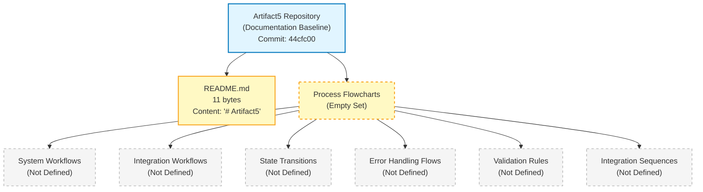

The diagram visually reaffirms the textual finding established throughout Section 4: only two repository artifacts are observable (the repository root and `README.md`), and every Section 4 prompt category resolves to an empty set with no derivable interior structure.

### 4.5.2 Diagram Categories Not Renderable at Current Baseline

The section prompt enumerates five categories of required Mermaid diagrams. Each is documented below with its evidentiary basis for non-renderability. No speculative or placeholder diagram is produced for any category.

| Required Diagram | Renderability Determination | Source of Evidence |
|---|---|---|
| High-Level System Workflow | Not renderable — no workflow exists to summarize | See Section 4.2.1 (no business processes declared) |
| Detailed Process Flows per Core Feature | Not renderable — feature inventory is empty | See Section 2.2.1 (zero features declared) |
| Error Handling Flowcharts | Not renderable — no error handling declared | See Section 4.4.2 (no retry / fallback / notification flows) |
| Integration Sequence Diagrams | Not renderable — no integrations declared | See Section 2.4.2 and Section 3.5.1 (no integration points) |
| State Transition Diagrams | Not renderable — no state model declared | See Section 4.4.1 (no persistence; no state machines) |

The single Mermaid diagram in Section 4.5.1 is the only diagram derivable from current repository evidence. It is purposefully an empty-set landscape diagram rather than a workflow, sequence, or state-transition diagram, because no behavioral content exists in the repository from which such diagrams could be constructed.

---

## 4.6 Re-Documentation Triggers for Process Flowcharts

### 4.6.1 Required Inputs for Meaningful Section 4 Population

Consistent with the re-documentation discipline established in Section 1.3.3, Section 2.7.1, and Section 3.8.1, a meaningful Process Flowchart section requires the repository to first accumulate one or more of the following artifact categories. The categories below are the specific artifact types whose introduction would enable evidence-based authoring of process flowcharts:

- **Implementation source code** — required to observe call flows, control-flow branches, exception-handling pathways, and state transitions from which detailed process flowcharts can be reverse-engineered. Triggers re-authoring of Sections 4.2.1, 4.3.1, 4.4.1, and 4.4.2.
- **Behavioral specifications, user stories, or use-case documents** — required to declare end-to-end user journeys, actor responsibilities, and acceptance criteria from which high-level workflow diagrams can be constructed. Triggers re-authoring of Section 4.2.1 and the high-level system workflow diagram referenced in Section 4.5.2.
- **API specifications** (OpenAPI, GraphQL schema, Protocol Buffer files) — required to declare request/response contracts, integration partners, and synchronous/asynchronous interaction patterns from which integration sequence diagrams can be constructed. Triggers re-authoring of Section 4.2.2 and the integration sequence diagrams referenced in Section 4.5.2.
- **State machine definitions** (state-chart files, state-machine library configurations, or equivalent specifications) — required to declare states, transitions, guards, and effects from which state transition diagrams can be constructed. Triggers re-authoring of Section 4.4.1 and the state transition diagrams referenced in Section 4.5.2.
- **Workflow orchestration manifests** (BPMN files, Airflow DAGs, AWS Step Functions definitions, Temporal workflow code, Camunda process definitions, or equivalent) — required to declare orchestrated multi-step processes from which workflow diagrams can be constructed. Triggers re-authoring of Section 4.2.1 and Section 4.2.2.
- **Test artifacts** (BDD specifications, integration tests, end-to-end tests, contract tests) — required to declare expected behavioral flows operationally as executable assertions. Triggers re-authoring of Section 4.2.1 and Section 4.4.2.
- **Error-handling middleware or resilience configurations** (retry policy declarations, circuit-breaker configurations, dead-letter queue configurations, alerting rules) — required to declare error-handling flows, retry strategies, fallback processes, and notification routes. Triggers re-authoring of Section 4.4.2 and the error handling flowcharts referenced in Section 4.5.2.
- **Database schemas, migration files, or ORM model definitions** — required to declare persistence points, transactional boundaries, and data-state lifecycles from which state-management and data-persistence flowcharts can be constructed. Triggers re-authoring of Section 4.4.1.

### 4.6.2 Versioning and Revision Tracking

This Section 4 baseline corresponds to repository commit `44cfc00` ("Initial commit"). Any commit that introduces one or more of the artifact categories listed in Section 4.6.1 should trigger a re-issuance of this Process Flowchart section, with evidence-based workflow, integration, state-management, and error-handling diagrams replacing the current empty-state visualization in Section 4.5.1 and the empty-state tables throughout Sections 4.2 through 4.4.

| Version Attribute | Current Value |
|---|---|
| Section Baseline Commit | `44cfc00` |
| Section Baseline Commit Message | "Initial commit" |
| Business Process Workflows at Baseline | 0 |
| Integration Workflows at Baseline | 0 |
| Decision Points at Baseline | 0 |
| Process Steps at Baseline | 0 |
| Validation Rules at Baseline | 0 |
| State Machines Defined at Baseline | 0 |
| Error-Handling Flows at Baseline | 0 |
| Required-Diagram Categories Rendered at Baseline | 0 of 5 |

Re-triggering this section is contingent on the prior commitment recorded in Section 2.6.3 — namely, the authoring of the first behavioral specification — being satisfied. Until that trigger fires, the empty-state baseline documented in this section remains authoritative.

---

## 4.7 References

### 4.7.1 Files Examined

- `README.md` — The sole non-`.git` file in the repository. Total size: 11 bytes. Full content: `# Artifact5` (a single Markdown H1 heading). Examined to confirm absence of workflow narratives, process descriptions, behavioral specifications, sequence definitions, state-machine declarations, error-handling policies, or any other content that could substantiate process flowchart authoring.

### 4.7.2 Folders Examined

- `/` (repository root) — Verified to contain only `README.md` (file) and `.git/` (version-control metadata directory). No subdirectories exist; the repository's directory depth is 0. Examined to confirm absence of `src/`, `docs/`, `tests/`, `spec/`, `workflows/`, `bpmn/`, `state-machines/`, or any other directory typically containing behavioral, workflow, or process-orchestration artifacts.

### 4.7.3 Repository Metadata Examined

- Git commit log — Confirmed a single commit `44cfc00 "Initial commit"` authored by `Blitzy-Multi <mmwforfinance@gmail.com>`; no historical state exists from which prior workflow declarations could be recovered.
- Git branch enumeration — Confirmed branches `main`, `remotes/origin/HEAD`, and `remotes/origin/main` all point to the same single initialization commit; no divergent branches contain alternate workflow declarations.

### 4.7.4 Negative Findings (Verified Absences)

The following artifact categories — each of which would be required to substantiate the authoring of process flowcharts — are verified absent from the repository. This catalog extends the comprehensive verified-absence list established in Section 2.8.4 and Section 3.9.

- No source code files of any language (`.py`, `.js`, `.ts`, `.tsx`, `.jsx`, `.go`, `.rs`, `.java`, `.rb`, `.php`, `.c`, `.cpp`, `.cs`, `.swift`, `.kt`, `.m`, `.html`, `.css`) exist anywhere in the repository tree from which call flows, control-flow branches, or exception-handling paths could be observed.
- No behavioral specification artifacts (user stories, use-case documents, acceptance criteria documents, BDD feature files such as `*.feature`) exist.
- No API specifications (OpenAPI / Swagger, GraphQL schema, Protocol Buffer `.proto` files) exist from which integration sequence diagrams could be derived.
- No state machine definitions (XState configurations, state-chart XML, finite-state-machine library configurations, or equivalent) exist.
- No workflow orchestration manifests (BPMN `.bpmn` files, Airflow DAG Python files, AWS Step Functions JSON definitions, Temporal workflow code, Camunda process definitions) exist.
- No test artifacts (`tests/`, `test/`, `__tests__/`, `spec/`, `cypress/`, `e2e/` directories; `jest.config.js`, `pytest.ini`, `mocha.opts`, `playwright.config.*`, or equivalent) exist from which behavioral flows could be inferred.
- No error-handling middleware or resilience-policy configurations (retry policy YAML, circuit-breaker configurations, dead-letter queue manifests, alerting rule definitions) exist.
- No database schemas, migration files, or ORM model definitions exist from which persistence points or transactional boundaries could be identified.
- No queue / event / messaging contract definitions exist from which event-processing flows could be diagrammed.
- No batch processing configurations (cron definitions, scheduled-job manifests, ETL pipeline declarations) exist from which batch sequences could be diagrammed.
- No `.blitzyignore` files exist (verified via filesystem search).

### 4.7.5 Cross-Referenced Technical Specification Sections

The following Technical Specification sections were retrieved and used to substantiate the empty-state determinations throughout Section 4. Each citation in the body of Section 4 traces back to one or more of these cross-references.

- **Section 1.1 Executive Summary** — Established the absence of stakeholder taxonomy (Section 1.1.4), used to justify the empty state of user-touchpoint and business-actor rows in Section 4.2.1 and Section 4.3.1.
- **Section 1.2 System Overview** — Established the absence of business context (Section 1.2.1), the absence of system capabilities and technology selection (Section 1.2.2), and the absence of declared KPIs (Section 1.2.3). Used to justify the empty state of Sections 4.2.1, 4.2.2, 4.3.1, and 4.4.1, and to source the SLA / timing-constraint findings in Section 4.3.1.
- **Section 1.3 Scope** — Established the absence of in-scope features and primary user workflows (Section 1.3.1) and the Documentation Baseline Acknowledgement pattern (Section 1.3.3). Used to justify the empty state of Section 4.2.1 and to inherit the documentary baseline framework applied throughout Section 4.
- **Section 2.1 Documentation Baseline and Evidentiary Constraints** — Established the evidence-only documentation discipline (Section 2.1.3) that prohibits speculative feature, requirement, or workflow content. Used to justify the authoring constraint in Section 4.1.3.
- **Section 2.2 Feature Catalog** — Confirmed the empty feature inventory (Section 2.2.1). Used to justify the empty state of decision-point, process-step, and detailed-process-flow rows in Sections 4.2.1, 4.3.1, and 4.5.2.
- **Section 2.3 Functional Requirements Table** — Confirmed the empty functional-requirement inventory (Section 2.3.1) and the absence of business rules, data validation, and compliance scope (Section 2.3.4). Used to justify the empty state of Section 4.3.2.
- **Section 2.4 Feature Relationships** — Confirmed the absence of integration points (Section 2.4.2) and shared components (Section 2.4.3). Used to justify the empty state of Section 4.2.2 and the non-renderability of integration sequence diagrams in Section 4.5.2.
- **Section 2.5 Implementation Considerations** — Confirmed the absence of performance requirements (Section 2.5.2), the absence of authorization model and threat model (Section 2.5.4), and the absence of recovery procedures (Section 2.5.5). Used to justify the empty state of Sections 4.3.1, 4.3.2, and 4.4.2.
- **Section 2.6 Traceability Matrix** — Source of the **explicit prior commitment** ("No process flowcharts referenced because no processes declared — First behavioral spec authored") that controls the entirety of Section 4. Quoted verbatim in Section 4.1.2.
- **Section 2.7 Re-Documentation Triggers** — Source of the re-documentation discipline (Section 2.7.1) and versioning attribution pattern (Section 2.7.2) replicated in Section 4.6.
- **Section 2.8 References** — Source of the comprehensive verified-absence catalog (Section 2.8.4) replicated and extended in Section 4.7.4.
- **Section 3.1 Documentation Baseline and Evidentiary Constraints** — Source of the inherited-baseline pattern (Section 3.1.1) replicated in Section 4.1.1 and the empty-state Mermaid visualization template (Section 3.1.3) followed in Section 4.5.1.
- **Section 3.3 Frameworks & Libraries** — Confirmed the absence of background / worker framework selection. Used to justify the empty state of the batch processing row in Section 4.2.2.
- **Section 3.5 Third-Party Services** — Confirmed the absence of inbound / outbound APIs, GraphQL/gRPC, messaging/queue, and webhook/event-stream integrations (Section 3.5.1); the absence of identity provider (Section 3.5.2); and the absence of monitoring, alerting, and error tracking services (Section 3.5.3). Used to justify the empty state of Sections 4.2.2, 4.3.2, and 4.4.2.
- **Section 3.6 Databases & Storage** — Confirmed the absence of database engines (Section 3.6.1), persistence strategies and transactional models (Section 3.6.2), caching tiers (Section 3.6.3), and storage services (Section 3.6.4). Used to justify the empty state of Section 4.4.1.
- **Section 3.8 Re-Documentation Triggers for the Technology Stack** — Source of the re-documentation trigger pattern (Section 3.8.1) and versioning attribution pattern (Section 3.8.2) replicated in Section 4.6.

# 5. System Architecture

## 5.1 Documentation Baseline and Evidentiary Constraints

### 5.1.1 Inherited Baseline from Sections 1.x, 2.x, 3.x, and 4.x

This System Architecture section is produced against the same initialization-stage repository baseline already documented in Sections 1.1 (Executive Summary), 1.2 (System Overview), 1.3 (Scope), the entirety of Section 2 (Product Requirements), the entirety of Section 3 (Technology Stack), and the entirety of Section 4 (Process Flowchart). The observable repository facts that constrain every subsection below are inherited verbatim from Section 4.1.1:

- The repository's working tree contains exactly one tracked artifact — `README.md` (11 bytes) — whose entire content is the project name expressed as a Markdown H1 heading (`# Artifact5`).
- No source code files, configuration files, build scripts, dependency manifests, test artifacts, license files, `.gitignore` files, or supplementary documentation exist in the repository.
- No subdirectories exist beneath the repository root; the only entries are `README.md` and the `.git/` metadata directory.
- The Git history contains exactly one commit (`44cfc00` — "Initial commit") authored by `Blitzy-Multi <mmwforfinance@gmail.com>`.
- Per Section 1.2.2, no programming language, framework, runtime environment, persistence layer, deployment target, or architectural style has been selected or declared in the repository.
- Per Section 1.2.1, no upstream systems, downstream systems, authentication / identity providers, or data / messaging backbones are declared, and the absence of any dependency manifest confirms no external integrations exist.
- Per Section 2.2.1, the feature inventory is empty (zero features declared).
- Per Section 2.3.1, the functional-requirement inventory is empty (zero functional requirements declared).
- Per Section 2.4.3, no shared components, common services, shared data stores, or cross-cutting concerns are declared.
- Per Section 2.5.2 through 2.5.5, no performance requirements, scalability strategies, security controls, or maintenance practices are declared.
- Per Section 3.5.x, no external APIs, authentication services, monitoring / observability tools, or cloud services are declared.
- Per Section 3.6.x, no databases, persistence strategies, caching solutions, or storage services are declared.
- Per Sections 4.2 through 4.5, no business processes, integration workflows, state machines, or error-handling flows are declared.

### 5.1.2 Consequence for System Architecture Documentation

System Architecture documentation depends on the existence of upstream artifacts — declared components, observable component boundaries, interface contracts, integration manifests, persistence schemas, observability configurations, and architectural decision records — from which an architectural narrative can be derived. The `Artifact5` repository contains none of these artifact categories at this documentation baseline. Therefore, every subsection of Section 5 documents the **absence** of the requested architectural artifacts following the evidence-based "Not defined in repository" pattern established in Sections 1.1, 1.2, 1.3, the whole of Section 2, the whole of Section 3, and the whole of Section 4.

The following table summarizes which System Architecture subsections can be populated from the repository's current evidentiary base:

| Subsection | Population Feasibility | Cross-Reference |
|---|---|---|
| High-Level Architecture | Cannot be populated — no architectural style declared | Section 1.2.2 |
| Component Details | Cannot be populated — no components beyond `README.md` | Section 2.4.3 |
| Technical Decisions | Cannot be populated — no decisions to justify | Section 3.3.4 |
| Cross-Cutting Concerns | Cannot be populated — no observability / security / error-handling artifacts | Section 2.5.x |

### 5.1.3 Authoring Constraint and Speculative-Content Non-Applicability

Consistent with the documentation discipline established in Section 2.1.3 and replicated in Sections 3.1.2 and 4.1.3, this System Architecture section does not introduce speculative architectural styles, hypothetical component decompositions, presumed integration patterns, imagined data flows, fabricated technical decisions, or any other architectural content unsupported by repository evidence. The Section 3.3.4 precedent — "The author cannot retroactively justify selections that the repository has not made" — is the controlling discipline for the present section's Technical Decisions subsection and applies with equal force to every other architectural dimension enumerated by the section prompt.

The section prompt's overriding instruction is reproduced verbatim:

> "Only include sections and items that are actually relevant to this system, based on your analysis of its requirements. Don't add any items that aren't clearly applicable."

Under this instruction and the inherited evidentiary baseline, **zero architectural items are clearly applicable** because the repository contains no source code, no configuration, no manifests, no schemas, no API contracts, no infrastructure-as-code, no observability configurations, no security policies, and no architectural decision records. Every dimension below is therefore documented as "Not defined in repository" with cross-references to the upstream evidence sections that establish its empty state. No speculative component interaction diagrams, sequence diagrams, state-transition diagrams, decision-tree diagrams, ADRs, or error-handling flowcharts are produced; only one empty-state landscape diagram is rendered (Section 5.2.5), consistent with the visualization precedent set in Sections 1.2.2, 2.4.1, 3.1.3, and 4.5.1.

---

## 5.2 High-Level Architecture

### 5.2.1 System Overview

#### Overall Architecture Style and Rationale

No architectural style is declared in the repository. Per Section 1.2.2, the technical decision row "Architectural Style" is explicitly marked **"Not selected in repository,"** and the same section confirms that no programming language, framework, runtime, persistence technology, deployment target, or architectural pattern has been selected or declared in the repository. Section 2.5.1 reinforces this by marking the "Architectural Constraints" dimension as "Not defined in repository." No rationale can be authored for an unspecified style; consequently no monolith, layered, hexagonal, event-driven, microservices, serverless, modular-monolith, or alternative-style commitment is recorded.

#### Key Architectural Principles and Patterns

No architectural principles or patterns are declared in the repository. The single observable artifact (`README.md`, 11 bytes, content `# Artifact5`) contains no narrative beyond the project name and therefore expresses no design philosophy, no quality-attribute prioritization, no separation-of-concerns commitment, and no pattern selection. Section 2.4.3 confirms that "Cross-Cutting Concerns" are "Not defined in repository (No logging / observability declared)," eliminating any principle-driven cross-cutting architectural commitment that could be cited here.

#### System Boundaries and Major Interfaces

No system boundaries or major interfaces are observable. Per Section 1.2.1, all four declared-touchpoint categories (Upstream Systems, Downstream Systems, Authentication / Identity Providers, Data / Messaging Backbones) are marked "Not defined in repository." Per Section 2.4.2, all four integration categories (Inbound, Outbound, Synchronous, Asynchronous) are similarly marked "Not defined in repository." With no interfaces to delineate, no system boundary can be drawn.

| System Overview Dimension | Declared State | Cross-Reference |
|---|---|---|
| Architectural Style | Not defined in repository | See Section 1.2.2 |
| Architectural Principles / Patterns | Not defined in repository | See Section 1.2.2 |
| System Boundaries | Not defined in repository | See Section 1.2.1 |
| Major Interfaces | Not defined in repository | See Section 2.4.2 |

### 5.2.2 Core Components Table

A core components table requires observable, addressable, and behaviorally distinct components in the repository. Per Section 1.2.2 (Major System Components), the only observable artifacts at the current documentation baseline are the repository root, the `README.md` placeholder file (11 bytes), and the `.git/` metadata directory. Per Section 2.4.3, no shared libraries, common services, shared data stores, or cross-cutting concerns are declared. The table below enumerates each observable artifact and confirms that no behavioral component yet exists. Consistent with the section-prompt rule that tables shall not exceed four columns, "Key Dependencies" and "Integration Points" are combined into a single column because both resolve to identical empty content for every row.

| Component Name | Primary Responsibility | Key Dependencies / Integration Points | Critical Considerations |
|---|---|---|---|
| `Artifact5/` (repository root) | Containment of project artifacts | None declared | No subdirectories exist; directory depth = 0 |
| `README.md` | Project-name placeholder (Markdown H1 heading) | None declared | 11 bytes total; conveys no design or behavioral narrative |
| `.git/` | Version-control metadata | External Git toolchain (not a runtime component) | Holds the single initialization commit `44cfc00` |
| Behavioral / Functional Components | Not defined in repository | Not defined in repository | See Section 2.4.3 |

The first three rows reflect every artifact directly observable in the repository tree. The fourth row reflects the entirety of what the section prompt expects under "core components" (functional / behavioral building blocks) — for which the repository declares nothing.

### 5.2.3 Data Flow Description

#### Primary Data Flows Between Components

No data flows can be described because no behavioral components exist between which data could flow. Per Section 4.2.2, every integration-workflow dimension (Data Flow Between Systems, Synchronous API Interactions, GraphQL / gRPC Interactions, Event Processing Flows, Asynchronous Message Flows, Batch Processing Sequences, File / Data Transfer Flows, Inter-Service Communication) is marked "Not defined in repository."

#### Integration Patterns and Protocols

No integration patterns or protocols are declared. Per Section 3.5.1, every integration category (Inbound REST / HTTP, Outbound REST / HTTP, GraphQL / gRPC, Messaging / Queue, Webhook / Event-Stream) is marked "Not defined in repository" with the protocol column likewise blank.

#### Data Transformation Points

No data transformation points exist. Per Section 2.3.1, the functional-requirement inventory is empty, and no source code, schema, or pipeline configuration is present from which transformations could be enumerated.

#### Key Data Stores and Caches

No data stores or caches are declared. Per Section 3.6.1, all seven database role categories (Primary Transactional, Secondary / Read-Replica, Analytical / Warehouse, Document / NoSQL, Search / Indexing, Time-Series / Telemetry, Graph) are marked "Not defined in repository." Per Section 3.6.3, all four caching tiers (In-Memory / Process, Distributed / Shared, HTTP / Edge, Database / Query Result) are marked "Not defined in repository." Per Section 3.6.4, all four storage service categories (File / Blob, Object, Block / Attached, Archive / Cold) are marked "Not defined in repository."

| Data Flow Dimension | Declared State | Cross-Reference |
|---|---|---|
| Primary Data Flows Between Components | Not defined in repository | See Section 4.2.2 |
| Integration Patterns / Protocols | Not defined in repository | See Section 3.5.1 |
| Data Transformation Points | Not defined in repository | See Section 2.3.1 |
| Key Data Stores and Caches | Not defined in repository | See Sections 3.6.1, 3.6.3, 3.6.4 |

### 5.2.4 External Integration Points

No external integration points are declared in the repository. The category enumeration below mirrors Section 1.2.1 (Integration Category Table) and Section 2.4.2 (Integration Points) to make explicit which categories of external system would be candidates for population once architectural artifacts are introduced. Consistent with the section-prompt four-column rule, the prompt's "Integration Type" and "Data Exchange Pattern" columns are combined into a single column because both resolve to identical empty content for every row.

| External System (Category) | Integration Type / Exchange Pattern | Protocol / Format | SLA Requirements |
|---|---|---|---|
| Upstream / Inbound Systems | Not defined in repository | Not defined in repository | Not defined in repository |
| Downstream / Outbound Systems | Not defined in repository | Not defined in repository | Not defined in repository |
| Authentication / Identity Providers | Not defined in repository | Not defined in repository | Not defined in repository |
| Data / Messaging Backbones | Not defined in repository | Not defined in repository | Not defined in repository |

Row-by-row cross-references: System identity inherits from Section 1.2.1; Integration Type / Exchange Pattern inherits from Section 2.4.2 and Section 3.5.1; Protocol / Format inherits from Section 3.5.1; SLA Requirements inherits from Section 1.2.3 (no KPIs declared) and Section 2.5.2 (no performance targets declared).

### 5.2.5 Empty-State Architecture Landscape

The diagram below represents the complete (empty) System Architecture landscape derivable from available evidence. It follows the same empty-state visualization pattern established in Section 1.2.2 (Major System Components), Section 2.4.1 (Feature Dependency Map), Section 3.1.3 (Empty Technology Stack Landscape), and Section 4.5.1 (Empty-State Workflow Landscape), and uses the identical style conventions to distinguish concrete repository artifacts (`README.md` and the repository root) from empty sets (every architectural dimension enumerated by the Section 5 prompt).

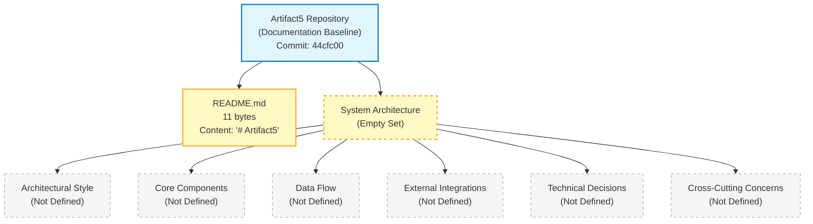

The diagram visually reaffirms the textual finding established throughout Section 5: only two repository artifacts are observable (the repository root and `README.md`), and every Section 5 prompt category — architectural style, core components, data flow, external integrations, technical decisions, and cross-cutting concerns — resolves to an empty set with no derivable interior structure.

---

## 5.3 Component Details

### 5.3.1 Per-Component Specification Matrix

The section prompt requires, for each major component, a specification of (a) purpose and responsibilities, (b) technologies and frameworks used, (c) key interfaces and APIs, (d) data persistence requirements, and (e) scaling considerations. Per Section 5.2.2 above, only three filesystem artifacts are observable (`Artifact5/`, `README.md`, `.git/`), and none of them is a "major component" in the architectural sense — that is, none is an executable subsystem, a service, a module with declared interfaces, or a behaviorally distinct unit of work. Per Section 2.4.3, no shared libraries, common services, shared data stores, or cross-cutting concerns are declared. Per Section 1.2.2, the repository "realizes no system capabilities at this time," and there are "no executable artifacts, functional modules, behavioral specifications, or interface definitions."

The matrix below enumerates the five per-component specification dimensions required by the section prompt and resolves each to its empty-state determination.

| Specification Dimension | Declared Content | Cross-Reference |
|---|---|---|
| Purpose and Responsibilities | Not defined in repository | See Section 1.2.2 |
| Technologies and Frameworks Used | Not defined in repository | See Section 3.3.1 |
| Key Interfaces and APIs | Not defined in repository | See Section 3.5.1 |
| Data Persistence Requirements | Not defined in repository | See Section 3.6.1 |
| Scaling Considerations | Not defined in repository | See Section 2.5.3 |

### 5.3.2 Required Diagram Categories — Renderability Determination

The section prompt enumerates three categories of required Mermaid diagrams under Component Details. Each is documented below with its evidentiary basis for non-renderability. Following the precedent of Section 4.5.2, no speculative or placeholder diagram is produced for any category.

| Required Diagram | Renderability Determination | Source of Evidence |
|---|---|---|
| Detailed Component Interaction Diagram | Not renderable — no components exist to interact | See Section 5.2.2 |
| State Transition Diagram | Not renderable — no state model declared | See Section 4.4.1 |
| Sequence Diagram for Key Flows | Not renderable — no flows declared | See Section 4.2.2 |

The single Mermaid diagram in Section 5.2.5 (Empty-State Architecture Landscape) is the only diagram derivable from current repository evidence. It is purposefully an empty-set landscape diagram rather than a component interaction, state transition, or sequence diagram, because no behavioral or structural content exists in the repository from which such diagrams could be constructed.

---

## 5.4 Technical Decisions

### 5.4.1 Architecture Style and Communication Pattern Decisions

No architecture-style or communication-pattern decisions have been recorded in the repository. Per Section 1.2.2, the "Architectural Style" technical decision row is marked "Not selected in repository." Per Section 2.4.2, both Synchronous Integrations (HTTP / RPC contracts) and Asynchronous Integrations (queue / event contracts) are marked "Not defined in repository." Per Section 3.5.1, no REST / HTTP, GraphQL / gRPC, messaging / queue, or webhook / event-stream integration patterns are declared.

The Section 3.3.4 precedent governs this entire subsection: "No framework choices have been made; consequently, no justification narrative is documentable. The author cannot retroactively justify selections that the repository has not made." Applied here, no architecture-style or communication-pattern justification narrative is documentable.

| Decision Dimension | Declared Decision and Tradeoff | Cross-Reference |
|---|---|---|
| Architecture Style (monolith / SOA / microservices / serverless / event-driven) | Not defined in repository | See Section 1.2.2 |
| Synchronous Communication Pattern | Not defined in repository | See Section 2.4.2 |
| Asynchronous Communication Pattern | Not defined in repository | See Section 2.4.2 |
| Inter-Component Protocol Selection | Not defined in repository | See Section 3.5.1 |

### 5.4.2 Data Storage, Caching, and Security Mechanism Decisions

No data-storage, caching-strategy, or security-mechanism decisions have been recorded in the repository. Per Section 3.6.1, no database engine is selected. Per Section 3.6.2, no transactional model, consistency model, durability / replication topology, or partitioning strategy is declared. Per Section 3.6.3, no caching tier is declared. Per Section 2.5.4, no authentication mechanism, authorization model, data-protection controls, or threat model is declared. Per Section 3.5.2, no identity provider, authentication protocol, token / session management, MFA, or service-to-service authentication is declared.

| Decision Dimension | Declared Decision and Rationale | Cross-Reference |
|---|---|---|
| Data Storage Solution Rationale | Not defined in repository | See Section 3.6.1 |
| Caching Strategy Justification | Not defined in repository | See Section 3.6.3 |
| Security Mechanism Selection | Not defined in repository | See Section 2.5.4 |
| Authentication Protocol Choice | Not defined in repository | See Section 3.5.2 |

### 5.4.3 Architecture Decision Records (ADRs) — Renderability Determination

The section prompt's required diagrams under TECHNICAL DECISIONS include (a) decision tree diagrams and (b) Architecture Decision Records (ADRs). Both are non-renderable at the current baseline.

A decision tree diagram requires evaluated alternatives and selected paths; the repository contains no record of evaluated alternatives because no decisions have been made. An ADR requires a context, a decision, a status, consequences, and (optionally) alternatives considered; the repository contains no `docs/adr/`, no `architecture/decisions/`, no `RFCs/`, and no decision-record artifacts of any form (verified absent in Section 5.7.4).

| Required Diagram | Renderability Determination | Source of Evidence |
|---|---|---|
| Decision Tree Diagram | Not renderable — no decisions evaluated | See Section 1.2.2 |
| Architecture Decision Record (ADR) | Not renderable — no ADR artifacts exist | See Section 5.7.4 |

The Section 3.3.4 precedent applies: the author cannot retroactively author ADRs for decisions that have not been made.

---

## 5.5 Cross-Cutting Concerns

### 5.5.1 Monitoring and Observability Approach

No monitoring or observability approach is declared in the repository. Per Section 3.5.3, all six observability concerns (Application Performance Monitoring, Log Aggregation, Distributed Tracing, Metrics / Time-Series Backend, Alerting / On-Call Routing, Error Tracking) are marked "Not defined in repository." Per Section 2.5.5, the maintenance dimension for "Monitoring / Observability" is marked "Not defined in repository (no telemetry stack declared)."

| Observability Concern | Declared Approach | Cross-Reference |
|---|---|---|
| Application Performance Monitoring | Not defined in repository | See Section 3.5.3 |
| Metrics / Time-Series Backend | Not defined in repository | See Section 3.5.3 |
| Alerting / On-Call Routing | Not defined in repository | See Section 3.5.3 |
| Error Tracking | Not defined in repository | See Section 3.5.3 |

### 5.5.2 Logging and Tracing Strategy

No logging or tracing strategy is declared in the repository. Per Section 3.3.2, the "Logging / Structured Logs" and "Telemetry / Instrumentation" supporting-library categories are both marked "Not defined in repository (No manifest present)." Per Section 3.5.3, "Log Aggregation" and "Distributed Tracing" are explicitly marked "Not defined in repository."

| Logging / Tracing Concern | Declared Strategy | Cross-Reference |
|---|---|---|
| Structured Logging Format | Not defined in repository | See Section 3.3.2 |
| Log Aggregation Backend | Not defined in repository | See Section 3.5.3 |
| Distributed Tracing | Not defined in repository | See Section 3.5.3 |
| Telemetry / Instrumentation | Not defined in repository | See Section 3.3.2 |

### 5.5.3 Error Handling Patterns

No error-handling patterns are declared in the repository. Per Section 4.4.2, all 11 error-handling dimensions (Retry Mechanisms, Backoff / Jitter Policies, Timeout / Deadline Policies, Circuit-Breaker / Bulkhead Patterns, Fallback Processes, Dead-Letter / Quarantine Handling, Error Notification Flows, Error Tracking Integrations, Recovery Procedures, Compensating Action Definitions, Disaster-Recovery Sequences) are marked "Not defined in repository."

| Error-Handling Pattern | Declared Mechanism | Cross-Reference |
|---|---|---|
| Retry / Backoff / Timeout | Not defined in repository | See Section 4.4.2 |
| Circuit-Breaker / Bulkhead | Not defined in repository | See Section 4.4.2 |
| Fallback / Dead-Letter / Quarantine | Not defined in repository | See Section 4.4.2 |
| Error Notification and Tracking | Not defined in repository | See Section 4.4.2 |

### 5.5.4 Authentication and Authorization Framework

No authentication or authorization framework is declared in the repository. Per Section 2.5.4, all four security dimensions (Authentication Mechanism, Authorization Model, Data Protection Controls, Threat Model) are marked "Not defined in repository." Per Section 3.5.2, all five authentication concerns (Identity Provider, Authentication Protocol, Token / Session Management, Multi-Factor Authentication, Service-to-Service Authentication) are marked "Not defined in repository."

| Auth Concern | Declared Mechanism | Cross-Reference |
|---|---|---|
| Authentication Mechanism | Not defined in repository | See Section 2.5.4 |
| Authorization Model | Not defined in repository | See Section 2.5.4 |
| Identity Provider | Not defined in repository | See Section 3.5.2 |
| Service-to-Service Authentication | Not defined in repository | See Section 3.5.2 |

### 5.5.5 Performance Requirements and SLAs

No performance requirements or SLAs are declared in the repository. Per Section 1.2.3, the repository declares no KPIs across any performance dimension (latency, throughput, availability, error rate, adoption / usage, quality metrics). Per Section 2.5.2, all four performance dimensions (Latency Targets, Throughput Targets, Availability Targets, Resource Utilization Targets) are marked "Not defined in repository." Per Section 2.5.3, all four scalability dimensions (Horizontal Scaling Strategy, Vertical Scaling Strategy, Load Profile Assumptions, Capacity Planning Assumptions) are marked "Not defined in repository."

| Performance / Scalability Dimension | Declared Target | Cross-Reference |
|---|---|---|
| Latency / Throughput Targets | Not defined in repository | See Section 2.5.2 |
| Availability Target | Not defined in repository | See Section 2.5.2 |
| Horizontal / Vertical Scaling Strategy | Not defined in repository | See Section 2.5.3 |
| Load Profile / Capacity Planning | Not defined in repository | See Section 2.5.3 |

### 5.5.6 Disaster Recovery Procedures

No disaster recovery procedures are declared in the repository. Per Section 2.5.5, the maintenance dimensions for "Backup / Recovery Procedures" and "Upgrade / Migration Procedures" are both marked "Not defined in repository." Per Section 3.6.2, the "Backup / Recovery Procedure" persistence-strategy dimension is marked "Not defined in repository." Per Section 4.4.2, the "Disaster-Recovery Sequences" error-handling dimension is marked "Not defined in repository."

| Disaster Recovery Concern | Declared Procedure | Cross-Reference |
|---|---|---|
| Backup Procedure | Not defined in repository | See Section 2.5.5 |
| Recovery / Restore Procedure | Not defined in repository | See Section 3.6.2 |
| Disaster-Recovery Sequence | Not defined in repository | See Section 4.4.2 |
| Recovery Time / Recovery Point Objectives | Not defined in repository | See Section 2.5.2 |

### 5.5.7 Error Handling Flow Diagram — Renderability Determination

The section prompt's required diagrams under CROSS-CUTTING CONCERNS include an error-handling flow diagram. Per Section 4.5.2, an "Error Handling Flowchart" was already documented as "Not renderable — no error handling declared." That determination is inherited here.

| Required Diagram | Renderability Determination | Source of Evidence |
|---|---|---|
| Error Handling Flow Diagram | Not renderable — no error-handling mechanisms declared | See Sections 4.4.2 and 4.5.2 |

No speculative error-handling diagram is produced. The single empty-state landscape diagram in Section 5.2.5 already visually reflects the empty Cross-Cutting Concerns node.

---

## 5.6 Re-Documentation Triggers for System Architecture

### 5.6.1 Required Inputs for Meaningful Section 5 Population

Consistent with the re-documentation discipline established in Section 1.3.3, Section 2.7.1, Section 3.8.1, and Section 4.6.1, a meaningful System Architecture section requires the repository to first accumulate one or more of the following artifact categories:

- **Implementation source code** — required to observe component boundaries, module relationships, dependency graphs, and runtime behaviors from which a real component model can be authored. Triggers re-authoring of Sections 5.2.2 and 5.3.1.
- **Architectural Decision Records (ADRs) or design documents** — required to declare architecture style, component-decomposition rationale, communication-pattern selection, data-storage rationale, caching strategy, and security-mechanism selection. Triggers re-authoring of Section 5.4 and Section 5.2.1.
- **API specifications** (OpenAPI, GraphQL schema, Protocol Buffer files, AsyncAPI) — required to declare component interfaces, integration contracts, and synchronous / asynchronous interaction patterns. Triggers re-authoring of Sections 5.2.4, 5.3.1, and the Required Component Interaction / Sequence Diagrams referenced in Section 5.3.2.
- **Service-mesh and orchestration configurations** (Kubernetes manifests, Docker Compose files, Helm charts, service definitions, ingress configurations) — required to declare component topology, deployment-unit boundaries, inter-service communication, and runtime placement. Triggers re-authoring of Section 5.2.1 (system boundaries) and Section 5.2.2 (component table).
- **Observability configurations** (OpenTelemetry SDK initialization, Prometheus scrape rules, log-aggregation pipelines, distributed-tracing exporter configuration, alert-routing rules) — required to declare monitoring, logging, tracing, and alerting strategies. Triggers re-authoring of Sections 5.5.1 and 5.5.2.
- **Security policy artifacts** (IAM policies, network policies, secret manifests, OAuth / OIDC client configurations, MFA enrollment policy, service-account definitions) — required to declare authentication and authorization framework. Triggers re-authoring of Section 5.5.4.
- **Disaster-recovery runbooks and backup configurations** (cron-driven backup definitions, replication-topology declarations, restore procedures, RTO / RPO commitments) — required to declare disaster recovery procedures. Triggers re-authoring of Section 5.5.6.
- **Database schemas, replication topologies, and caching-layer manifests** (DDL files, ORM model definitions, migration files, Redis / Memcached configuration, CDN configuration) — required to declare data storage and caching strategies. Triggers re-authoring of Sections 5.2.3 and 5.4.2.
- **Performance-test artifacts and SLA documents** (k6 / JMeter / Gatling scripts, SLA contracts, capacity-planning spreadsheets) — required to declare performance requirements, SLA targets, and scalability profiles. Triggers re-authoring of Section 5.5.5.
- **Error-handling middleware or resilience configurations** (retry policy declarations, circuit-breaker configurations, dead-letter queue manifests, alerting rule definitions) — required to declare error-handling patterns and the related flow diagram. Triggers re-authoring of Sections 5.5.3 and 5.5.7.

### 5.6.2 Versioning and Revision Tracking

This Section 5 baseline corresponds to repository commit `44cfc00` ("Initial commit"). Any commit that introduces one or more of the artifact categories listed in Section 5.6.1 should trigger a re-issuance of this System Architecture section, with evidence-based component, decision, and cross-cutting-concern content replacing the current empty-state visualization in Section 5.2.5 and the empty-state tables throughout Sections 5.2 through 5.5.

| Version Attribute | Current Value |
|---|---|
| Section Baseline Commit | `44cfc00` |
| Section Baseline Commit Message | "Initial commit" |
| Major Components Declared at Baseline | 0 |
| External Integration Points Declared at Baseline | 0 |
| Architectural Decisions Recorded at Baseline | 0 |
| Architecture Decision Records (ADRs) at Baseline | 0 |
| Cross-Cutting Concerns Implemented at Baseline | 0 |
| Performance Targets / SLAs Declared at Baseline | 0 |
| Required-Diagram Categories Rendered at Baseline | 0 of 6 (component interaction, state transition, sequence, decision tree, ADR, error handling) |
| Empty-State Landscape Diagrams Rendered at Baseline | 1 (Section 5.2.5) |

Re-triggering this section is contingent on at least one of the artifact categories listed in Section 5.6.1 being introduced to the repository. Until that trigger fires, the empty-state baseline documented in this section remains authoritative.

---

## 5.7 References

### 5.7.1 Files Examined

- `README.md` — The sole non-`.git` file in the repository. Total size: 11 bytes. Full content: `# Artifact5` (a single Markdown H1 heading). Examined to confirm absence of architectural narrative, component descriptions, technology declarations, integration definitions, decision records, or any other content that could substantiate system-architecture authoring.

### 5.7.2 Folders Examined

- `/` (repository root) — Verified to contain only `README.md` (file) and `.git/` (version-control metadata directory). No subdirectories exist; the repository's directory depth is 0. Examined to confirm absence of `src/`, `lib/`, `app/`, `services/`, `components/`, `modules/`, `docs/`, `docs/adr/`, `architecture/`, `architecture/decisions/`, `infra/`, `infrastructure/`, `deploy/`, `k8s/`, `helm/`, `terraform/`, `observability/`, `monitoring/`, `security/`, or any other directory typically containing architectural, infrastructural, observability, or security artifacts.

### 5.7.3 Repository Metadata Examined

- Git commit log — Confirmed a single commit `44cfc00 "Initial commit"` authored by `Blitzy-Multi <mmwforfinance@gmail.com>`; no historical state exists from which prior architectural declarations could be recovered.
- Git branch enumeration — Confirmed branches `main`, `remotes/origin/HEAD`, and `remotes/origin/main` all point to the same single initialization commit; no divergent branches contain alternate architectural declarations.

### 5.7.4 Negative Findings (Verified Absences)

The following artifact categories — each of which would be required to substantiate the authoring of system architecture — are verified absent from the repository. This catalog extends the comprehensive verified-absence lists established in Sections 2.8.4, 3.9, and 4.7.4.

- No source code files of any language exist anywhere in the repository tree from which component boundaries, interfaces, or runtime behaviors could be observed.
- No dependency manifests (`package.json`, `requirements.txt`, `go.mod`, `Cargo.toml`, `pom.xml`, `composer.json`, `Gemfile`, `build.gradle`, `*.csproj`, `*.fsproj`, `pyproject.toml`, `setup.py`, `mix.exs`, `pubspec.yaml`) exist from which framework, library, or platform selections could be determined.
- No architectural decision records (`docs/adr/*`, `docs/architecture/decisions/*`, `RFCs/*`, `design-docs/*`) exist.
- No API specifications (OpenAPI / Swagger, GraphQL schema, Protocol Buffer `.proto` files, AsyncAPI, RAML) exist from which component interfaces or integration contracts could be derived.
- No service-orchestration manifests (Kubernetes YAML, Docker Compose, Helm charts, Nomad jobs, ECS task definitions, Cloud Run service definitions) exist from which deployment topology could be inferred.
- No Infrastructure-as-Code artifacts (`.tf`, `.tfvars`, CloudFormation, ARM templates, Pulumi, Bicep, CDK projects) exist from which cloud-resource architecture could be derived.
- No observability configurations (OpenTelemetry initialization, Prometheus scrape configs, Grafana dashboards, Loki / Elastic indices, Jaeger / Zipkin exporters, alerting rules) exist from which a monitoring / tracing strategy could be inferred.
- No security-policy artifacts (IAM JSON policies, Kubernetes NetworkPolicy, secret-manifest definitions, OAuth / OIDC client registrations, MFA enrollment policy, service-account manifests) exist from which an authentication / authorization framework could be inferred.
- No disaster-recovery runbooks, backup-cron definitions, replication-topology declarations, or RTO / RPO commitment documents exist.
- No database schemas, migration files, or ORM model definitions exist from which persistence architecture could be inferred.
- No caching, CDN, or edge configurations exist from which caching architecture could be inferred.
- No performance-test artifacts (k6, JMeter, Gatling, Locust scripts) or SLA documents exist from which performance architecture could be inferred.
- No `.blitzyignore` files exist (verified via filesystem search).

### 5.7.5 Cross-Referenced Technical Specification Sections

The following Technical Specification sections were retrieved and used to substantiate the empty-state determinations throughout Section 5. Each citation in the body of Section 5 traces back to one or more of these cross-references.

- **Section 1.1 Executive Summary** — Established project identity (`Artifact5`), commit baseline (`44cfc00`), and the evidence-based "Not defined in repository" pattern.
- **Section 1.2 System Overview** — Source of the canonical "Not selected in repository" table for architectural style, persistence layer, deployment target, runtime, framework, and programming language; source of the integration-category empty-state table (upstream / downstream / auth / messaging); source of the first empty-state Mermaid diagram template followed in Section 5.2.5.
- **Section 1.3 Scope** — Established the Documentation Baseline Acknowledgement pattern and the re-documentation triggering guidance replicated in Section 5.6.
- **Section 2.1 Documentation Baseline and Evidentiary Constraints** — Source of the inherited-baseline opening pattern and the Section 2.1.3 authoring constraint that prohibits speculative content; this constraint controls the entirety of Section 5.
- **Section 2.2 Feature Catalog** — Confirmed the empty feature inventory (zero features) used to justify the empty state of every component-and-flow row in Sections 5.2.2 and 5.2.3.
- **Section 2.3 Functional Requirements Table** — Confirmed the empty functional-requirement inventory used to justify the empty state of the Data Transformation Points row in Section 5.2.3.
- **Section 2.4 Feature Relationships** — Source of the Integration Points empty-state table (Section 2.4.2) and the Shared Components / Common Services empty-state table (Section 2.4.3), both directly inherited by Sections 5.2.2, 5.2.4, and 5.3.1.
- **Section 2.5 Implementation Considerations** — Source of the empty-state tables for Technical Constraints (Section 2.5.1), Performance Requirements (Section 2.5.2), Scalability Considerations (Section 2.5.3), Security Implications (Section 2.5.4), and Maintenance Requirements (Section 2.5.5); directly inherited by Sections 5.5.4, 5.5.5, and 5.5.6.
- **Section 2.6 Traceability Matrix** — Source of the Assumption and Constraint Register pattern.
- **Section 2.7 Re-Documentation Triggers** — Source of the Required Inputs enumeration pattern and Versioning Attribution table pattern replicated in Section 5.6.
- **Section 2.8 References** — Source of the comprehensive References subsection template followed in Section 5.7.
- **Section 3.1 Documentation Baseline and Evidentiary Constraints** — Source of the Default-Stack-Non-Applicability authoring pattern that rejects speculative selections, and the empty-state landscape Mermaid template applied in Section 5.2.5.
- **Section 3.3 Frameworks & Libraries** — Source of the precedent in Section 3.3.4 ("The author cannot retroactively justify selections that the repository has not made") that directly governs Section 5.4; also source of the Logging / Telemetry empty-state determinations inherited by Section 5.5.2.
- **Section 3.5 Third-Party Services** — Source of External APIs / Integrations empty-state table (Section 5.5.1 and 5.2.4 inheritance), Authentication Services empty-state table (Section 5.5.4 inheritance), Monitoring / Observability Tools empty-state table (Section 5.5.1 inheritance), and Cloud Services empty-state table (Section 5.2.4 inheritance).
- **Section 3.6 Databases & Storage** — Source of Databases (Section 5.2.3 inheritance), Persistence Strategies (Section 5.4.2 inheritance), Caching Solutions (Section 5.4.2 inheritance), and Storage Services (Section 5.2.3 inheritance) empty-state tables; also directly cited in Section 5.5.6 for backup / recovery procedures.
- **Section 3.8 Re-Documentation Triggers for the Technology Stack** — Source of the Required Inputs enumeration extending the Section 2.7.1 pattern, replicated in Section 5.6.
- **Section 4.1 Documentation Baseline and Evidentiary Constraints** — Source of the most complete inherited-baseline bullet list pattern (template for Section 5.1.1).
- **Section 4.2 System Workflows** — Source of the Integration Workflows empty-state table directly inherited by Section 5.2.3.
- **Section 4.4 Technical Implementation** — Source of the State Management empty-state table (11 dimensions) and Error Handling empty-state table (11 dimensions), directly inherited by Sections 5.5.3 and 5.3.2.
- **Section 4.5 Process Flowchart Visualization** — Source of the empty-state landscape Mermaid template (visual style transferred to Section 5.2.5) and the Diagram Categories Not Renderable table pattern (directly applied in Sections 5.3.2, 5.4.3, and 5.5.7).
- **Section 4.6 Re-Documentation Triggers for Process Flowcharts** — Source of the Required Inputs enumeration and Versioning Attribution table replicated in Section 5.6.
- **Section 4.7 References** — Source of the most comprehensive References subsection template followed in Section 5.7.

# 6. SYSTEM COMPONENTS DESIGN

## 6.1 Core Services Architecture

### 6.1.1 Documentation Baseline and Applicability Determination

#### Inherited Baseline from Sections 1.x, 2.x, 3.x, 4.x, and 5.x

This Core Services Architecture section is produced against the same initialization-stage repository baseline already documented in Sections 1.1 (Executive Summary), 1.2 (System Overview), 1.3 (Scope), the entirety of Section 2 (Product Requirements), the entirety of Section 3 (Technology Stack), the entirety of Section 4 (Process Flowchart), and the entirety of Section 5 (System Architecture). The observable repository facts that constrain every subsection below are inherited verbatim from Section 5.1.1:

- The repository's working tree contains exactly one tracked artifact — `README.md` (11 bytes) — whose entire content is the project name expressed as a Markdown H1 heading (`# Artifact5`).
- No source code files, configuration files, build scripts, dependency manifests, test artifacts, license files, `.gitignore` files, or supplementary documentation exist in the repository.
- No subdirectories exist beneath the repository root; the only entries are `README.md` and the `.git/` metadata directory.
- The Git history contains exactly one commit (`44cfc00` — "Initial commit") authored by `Blitzy-Multi <mmwforfinance@gmail.com>`.
- Per Section 1.2.2, no programming language, framework, runtime environment, persistence layer, deployment target, or architectural style has been selected or declared in the repository.
- Per Section 5.2.1, "no monolith, layered, hexagonal, event-driven, microservices, serverless, modular-monolith, or alternative-style commitment is recorded."
- Per Section 2.4.3, no shared libraries, common services, shared data stores, or cross-cutting concerns are declared.
- Per Section 2.5.3, all four scalability dimensions (Horizontal Scaling Strategy, Vertical Scaling Strategy, Load Profile Assumptions, Capacity Planning Assumptions) are marked "Not defined in repository."
- Per Section 4.4.2, all 11 error-handling dimensions (Retry Mechanisms, Backoff / Jitter Policies, Timeout / Deadline Policies, Circuit-Breaker / Bulkhead Patterns, Fallback Processes, Dead-Letter / Quarantine Handling, Error Notification Flows, Error Tracking Integrations, Recovery Procedures, Compensating Action Definitions, Disaster-Recovery Sequences) are marked "Not defined in repository."
- Per Section 5.5.5, no performance requirements, SLAs, or scalability targets are declared.
- Per Section 5.5.6, no disaster recovery procedures are declared.

#### Section 6.1 Off-Ramp Invocation

The Section 6.1 prompt provides an explicit off-ramp clause, reproduced verbatim:

> "If the system does not require microservices, distributed architecture, or distinct service components, clearly state 'Core Services Architecture is not applicable for this system' and explain why."

**Core Services Architecture is not applicable for this system.**

The applicability determination is grounded in the following evidence from prior sections:

1. **No architectural style is declared.** Per Section 1.2.2, the "Architectural Style" technical decision row is explicitly marked "Not selected in repository." Per Section 5.2.1, no monolith, layered, hexagonal, event-driven, microservices, serverless, or modular-monolith commitment is recorded. A "Core Services Architecture" presupposes a distributed or service-oriented style; no such style has been selected.
2. **No services exist.** Per Section 5.2.2, the only observable artifacts at the current documentation baseline are the repository root (`Artifact5/`), the `README.md` placeholder file, and the `.git/` metadata directory — none of which is an executable subsystem, service, or behaviorally distinct unit of work. Per Section 2.4.3, "Common Services: Not defined in repository (No service definitions present)."
3. **No integration points exist.** Per Section 1.2.1 and Section 2.4.2, all integration categories (Upstream, Downstream, Authentication / Identity Providers, Data / Messaging Backbones, Synchronous, Asynchronous) are marked "Not defined in repository." Inter-service communication requires at least two services and an integration contract; both prerequisites are absent.
4. **No capabilities are realized.** Per Section 1.2.2, the repository "realizes no system capabilities at this time. There are no executable artifacts, functional modules, behavioral specifications, or interface definitions."

#### Authoring Constraint and Speculative-Content Non-Applicability

Consistent with the documentation discipline established in Sections 2.1.3, 3.1.2, 4.1.3, and 5.1.3, this Core Services Architecture section does not introduce speculative service decompositions, hypothetical service boundaries, presumed inter-service communication patterns, imagined service-discovery topologies, fabricated load-balancing strategies, or any other service-architecture content unsupported by repository evidence. The Section 3.3.4 precedent — "The author cannot retroactively justify selections that the repository has not made" — is the controlling discipline for the present section.

The section prompt's overriding instruction is reproduced verbatim:

> "Only include sections and items that are actually relevant to this system, based on your analysis of its requirements. Don't add any items that aren't clearly applicable."

Under this instruction and the inherited evidentiary baseline, **zero Core Services Architecture items are clearly applicable**. Every dimension below is therefore documented as "Not applicable" with cross-references to the upstream evidence sections that establish its empty state.

---

### 6.1.2 Service Components — Not Applicable

No service components exist in the repository. The six service-component dimensions enumerated in the Section 6.1 prompt (service boundaries and responsibilities, inter-service communication patterns, service discovery mechanisms, load balancing strategy, circuit breaker patterns, retry and fallback mechanisms) each presuppose the existence of at least one declared service, executable artifact, deployment manifest, or integration contract. Per Section 5.2.2, none of these prerequisites is observable in the repository.

The table below maps each service-component dimension enumerated by the section prompt to its empty-state determination and the upstream evidence section that establishes that determination.

| Service Component Dimension | Declared Implementation | Cross-Reference |
|---|---|---|
| Service Boundaries and Responsibilities | Not applicable — no services declared | See Sections 5.2.1, 5.2.2 |
| Inter-Service Communication Patterns | Not applicable — no sync/async contracts declared | See Sections 2.4.2, 5.4.1 |
| Service Discovery Mechanisms | Not applicable — no service registry declared | See Section 3.5.1 |
| Load Balancing Strategy | Not applicable — no orchestration manifests declared | See Section 2.5.3 |
| Circuit Breaker Patterns | Not applicable — no resilience library declared | See Sections 4.4.2, 5.5.3 |
| Retry and Fallback Mechanisms | Not applicable — no retry/fallback policies declared | See Sections 4.4.2, 5.5.3 |

#### Service Boundaries and Responsibilities

A service-boundary declaration requires (a) an executable module with an addressable network or process boundary, (b) an interface contract describing inbound and outbound traffic, and (c) a documented responsibility scope. Per Section 1.2.2, "no executable artifacts, functional modules, behavioral specifications, or interface definitions" exist. Per Section 2.4.3, "Shared Libraries / Modules: Not defined in repository (No source files present)" and "Common Services: Not defined in repository (No service definitions present)." No boundary can be drawn around a non-existent module.

#### Inter-Service Communication Patterns

Inter-service communication patterns (request/response, publish/subscribe, request/reply over message bus, streaming, etc.) require at least two services and a declared protocol. Per Section 5.4.1, both "Synchronous Communication Pattern" and "Asynchronous Communication Pattern" are explicitly marked "Not defined in repository." Per Section 3.5.1, no REST / HTTP, GraphQL / gRPC, messaging / queue, or webhook / event-stream integration patterns are declared. With zero services and zero declared protocols, no communication pattern exists to document.

#### Service Discovery Mechanisms

Service discovery (DNS-based, registry-based such as Consul / etcd / Eureka, or Kubernetes-native through `Service` objects and `EndpointSlices`) requires (a) registrant services and (b) a discovery substrate. The repository declares no services and no discovery substrate. Per Section 3.5.1, no integration platforms are declared; per Section 3.7.x, no orchestration tooling is declared.

#### Load Balancing Strategy

Load balancing (L4 / L7, round-robin / least-connections / consistent-hash, client-side / server-side / mesh-side) requires (a) replicated service instances and (b) a load-balancing substrate (ELB / ALB / NLB, HAProxy, Nginx, Envoy, mesh sidecar, etc.). Per Section 2.5.3, the "Horizontal Scaling Strategy" dimension is marked "Not defined in repository," meaning no replicated instances are declared. Per the verified absences inventory in Section 5.7.4 (referenced from Section 5.6.1), no load-balancer or ingress configurations exist in the repository.

#### Circuit Breaker Patterns

Circuit breaker patterns (Hystrix-style, Resilience4j-style, Polly-style, or mesh-native via Envoy outlier detection) require (a) a calling service, (b) a downstream dependency, and (c) a configured failure-detection threshold. Per Section 5.5.3, the "Circuit-Breaker / Bulkhead" error-handling pattern is explicitly marked "Not defined in repository." Per Section 4.4.2, no circuit-breaker, bulkhead, or related resilience configuration exists.

#### Retry and Fallback Mechanisms

Retry and fallback mechanisms require (a) a fault-prone dependency call, (b) a retry policy declaration (max attempts, backoff strategy, jitter), and (c) a fallback procedure. Per Section 4.4.2, "Retry Mechanisms," "Backoff / Jitter Policies," "Timeout / Deadline Policies," and "Fallback Processes" are all explicitly marked "Not defined in repository." Per Section 5.5.3, no retry / backoff / timeout configuration is recorded.

---

### 6.1.3 Scalability Design — Not Applicable

No scalability design is declared in the repository. The five scalability dimensions enumerated in the Section 6.1 prompt (horizontal/vertical scaling approach, auto-scaling triggers and rules, resource allocation strategy, performance optimization techniques, capacity planning guidelines) each presuppose declared workload characteristics, performance targets, and a scaling substrate (container orchestrator, autoscaling group, serverless platform, etc.). Per Section 2.5.3 and Section 5.5.5, none of these prerequisites is observable in the repository.

The table below maps each scalability dimension enumerated by the section prompt to its empty-state determination and the upstream evidence section that establishes that determination.

| Scalability Dimension | Declared Implementation | Cross-Reference |
|---|---|---|
| Horizontal / Vertical Scaling Approach | Not applicable — no scaling strategy declared | See Sections 2.5.3, 5.5.5 |
| Auto-Scaling Triggers and Rules | Not applicable — no orchestration manifests declared | See Section 5.6.1 |
| Resource Allocation Strategy | Not applicable — no resource constraints declared | See Section 2.5.1 |
| Performance Optimization Techniques | Not applicable — no performance targets declared | See Sections 2.5.2, 5.5.5 |
| Capacity Planning Guidelines | Not applicable — no load profile declared | See Section 2.5.3 |

#### Horizontal and Vertical Scaling Approach

Horizontal scaling (adding replicas) and vertical scaling (increasing per-instance resources) each require (a) at least one workload to scale and (b) a scaling decision rationale grounded in load characteristics. Per Section 5.5.5, all four scalability dimensions (Horizontal Scaling Strategy, Vertical Scaling Strategy, Load Profile Assumptions, Capacity Planning Assumptions) are marked "Not defined in repository." Per Section 2.5.3, no architecture is declared from which a scaling axis could be selected. The Section 3.3.4 precedent applies: no scaling approach can be retroactively justified for a system the repository has not defined.

#### Auto-Scaling Triggers and Rules

Auto-scaling rules (Kubernetes HPA / VPA / KEDA, AWS Auto Scaling Group policies, GCP Managed Instance Group autoscaling, Azure VMSS scaling rules) require (a) a scalable workload and (b) trigger metrics (CPU, memory, queue depth, request rate, custom metric). Per Section 5.6.1, "Service-mesh and orchestration configurations" are listed among the artifact categories that would trigger re-authoring of System Architecture — none of which exist at the current baseline. No auto-scaling rules can be enumerated.

#### Resource Allocation Strategy

A resource allocation strategy requires declared CPU / memory / I/O / storage envelopes per service, declared quality-of-service classes, and a resource-management substrate (cgroups, Kubernetes resource requests / limits, cloud-provider sizing, etc.). Per Section 2.5.1, all four constraint dimensions (Language / Platform Constraints, Runtime / Environment Constraints, Architectural Constraints, Deployment Constraints) are marked "Not defined in repository." Per Section 2.5.2, all four performance dimensions (Latency Targets, Throughput Targets, Availability Targets, Resource Utilization Targets) are marked "Not defined in repository." No resource envelopes can be sized.

#### Performance Optimization Techniques

Performance optimization (caching, batching, connection pooling, asynchronous offload, read replicas, CDN edge offload, query optimization, indexing, etc.) requires (a) measured baseline performance, (b) declared performance targets, and (c) identified bottlenecks. Per Section 5.5.5, no performance targets or SLAs are declared. Per Section 3.6.3, all four caching tiers (In-Memory / Process, Distributed / Shared, HTTP / Edge, Database / Query Result) are marked "Not defined in repository." No optimization technique can be selected without an optimization target.

#### Capacity Planning Guidelines

Capacity planning requires (a) load profile assumptions (peak concurrent users, requests-per-second, data volume growth), (b) headroom commitments, and (c) cost-vs-capacity tradeoff decisions. Per Section 2.5.3, both "Load Profile Assumptions" and "Capacity Planning Assumptions" are marked "Not defined in repository." Per Section 1.2.3, no KPIs are declared across any performance dimension. No capacity guideline can be issued against an undefined load profile.

---

### 6.1.4 Resilience Patterns — Not Applicable

No resilience patterns are declared in the repository. The five resilience dimensions enumerated in the Section 6.1 prompt (fault tolerance mechanisms, disaster recovery procedures, data redundancy approach, failover configurations, service degradation policies) each presuppose the existence of running services, persistence layers, monitoring infrastructure, and operational runbooks. Per Section 5.5.3, Section 5.5.6, Section 4.4.2, and Section 3.6.2, none of these prerequisites is observable in the repository.

The table below maps each resilience dimension enumerated by the section prompt to its empty-state determination and the upstream evidence section that establishes that determination.

| Resilience Dimension | Declared Implementation | Cross-Reference |
|---|---|---|
| Fault Tolerance Mechanisms | Not applicable — no error handling declared | See Sections 4.4.2, 5.5.3 |
| Disaster Recovery Procedures | Not applicable — no DR runbooks declared | See Sections 2.5.5, 5.5.6 |
| Data Redundancy Approach | Not applicable — no replication topology declared | See Section 3.6.2 |
| Failover Configurations | Not applicable — no failover topology declared | See Section 5.5.6 |
| Service Degradation Policies | Not applicable — no fallback processes declared | See Sections 4.4.2, 5.5.3 |

#### Fault Tolerance Mechanisms

Fault tolerance (redundancy, isolation, graceful degradation, idempotency, exactly-once semantics, etc.) requires declared failure modes, declared blast-radius boundaries, and declared mitigation strategies. Per Section 5.5.3, all four error-handling pattern categories (Retry / Backoff / Timeout, Circuit-Breaker / Bulkhead, Fallback / Dead-Letter / Quarantine, Error Notification and Tracking) are marked "Not defined in repository." Per Section 4.4.2, all 11 error-handling dimensions are marked "Not defined in repository." No fault tolerance mechanism can be enumerated.

#### Disaster Recovery Procedures

Disaster recovery (backup cadence, restore drills, replicated standbys, region-pair failover, ad-hoc rebuild procedures) requires (a) a persistence layer to back up, (b) an operational team to execute the procedure, and (c) declared RTO / RPO commitments. Per Section 5.5.6, "Backup Procedure," "Recovery / Restore Procedure," "Disaster-Recovery Sequence," and "Recovery Time / Recovery Point Objectives" are all marked "Not defined in repository." Per Section 2.5.5, the maintenance dimensions for "Backup / Recovery Procedures" and "Upgrade / Migration Procedures" are both marked "Not defined in repository." No DR procedure exists.

#### Data Redundancy Approach

Data redundancy (synchronous replication, asynchronous replication, multi-AZ / multi-region replication, snapshot / point-in-time recovery, erasure coding for object stores, etc.) requires a declared persistence layer with a configured replication topology. Per Section 3.6.2, "Durability / Replication Topology" and "Backup / Recovery Procedure" are marked "Not defined in repository." Per Section 3.6.1, no database is selected across any of the seven role categories (Primary Transactional, Secondary / Read-Replica, Analytical / Warehouse, Document / NoSQL, Search / Indexing, Time-Series / Telemetry, Graph). No data redundancy approach can be documented.

#### Failover Configurations

Failover configurations (active-passive, active-active, multi-master, hot-standby, cold-standby, leader-election for stateful services) require (a) at least two service instances or persistence replicas, (b) a health-check substrate, and (c) a documented failover sequence. Per Section 5.5.6, no failover sequence is declared. Per Section 5.5.1, all observability concerns (APM, Metrics, Alerting, Error Tracking) are marked "Not defined in repository" — health-check substrates are absent. No failover configuration can be specified.

#### Service Degradation Policies

Service degradation (graceful shutdown, load shedding, feature flags for non-critical functionality, read-only mode for stateful services, cached responses during dependency outages) requires (a) declared service-level objectives, (b) declared non-critical functionality that can be sacrificed, and (c) declared degraded-mode behaviors. Per Section 5.5.3, "Fallback / Dead-Letter / Quarantine" is marked "Not defined in repository." Per Section 4.4.2, "Fallback Processes" is marked "Not defined in repository." No degradation policy is documentable.

---

### 6.1.5 Required Diagrams — Renderability Determination

The Section 6.1 prompt enumerates three required Mermaid diagram categories: (1) service interaction diagrams, (2) scalability architecture, and (3) resilience pattern implementations. Each of these diagram categories presupposes the existence of services, scaling infrastructure, or resilience mechanisms — all of which are absent at the current documentation baseline.

Following the Renderability Determination pattern established in Sections 5.3.2, 5.4.3, and 5.5.7, the table below documents each required diagram with its renderability determination and the upstream evidence source for that determination. No speculative or placeholder diagrams are produced for any of the three categories, consistent with the precedent set in Section 4.5.2.

| Required Diagram | Renderability Determination | Source of Evidence |
|---|---|---|
| Service Interaction Diagram | Not renderable — no services exist to interact | See Sections 5.2.2, 6.1.2 |
| Scalability Architecture Diagram | Not renderable — no scaling strategy declared | See Sections 2.5.3, 5.5.5, 6.1.3 |
| Resilience Pattern Implementation Diagram | Not renderable — no resilience mechanisms declared | See Sections 4.4.2, 5.5.3, 5.5.6, 6.1.4 |

#### Empty-State Core Services Architecture Landscape

A single empty-state landscape diagram is rendered below, consistent with the visualization precedent set in Section 1.2.2 (Major System Components), Section 2.4.1 (Feature Dependency Map), Section 3.1.3 (Empty Technology Stack Landscape), Section 4.5.1 (Empty-State Workflow Landscape), and Section 5.2.5 (Empty-State Architecture Landscape). The diagram uses the identical style conventions established throughout the specification to distinguish concrete repository artifacts (the repository root, `README.md`) from empty sets (every Core Services Architecture dimension enumerated by the Section 6.1 prompt).

```mermaid
graph TD
    Root["Artifact5 Repository<br/>(Documentation Baseline)<br/>Commit: 44cfc00"]
    Readme["README.md<br/>11 bytes<br/>Content: '# Artifact5'"]
    NoCSA["Core Services Architecture<br/>(Empty Set)"]

    NoServiceComp["Service Components<br/>(Not Applicable)"]
    NoBoundary["Service Boundaries<br/>(Not Defined)"]
    NoComm["Inter-Service Communication<br/>(Not Defined)"]
    NoDiscovery["Service Discovery<br/>(Not Defined)"]
    NoLB["Load Balancing<br/>(Not Defined)"]
    NoCB["Circuit Breakers<br/>(Not Defined)"]
    NoRetry["Retry / Fallback<br/>(Not Defined)"]

    NoScale["Scalability Design<br/>(Not Applicable)"]
    NoHVScale["Horizontal / Vertical Scaling<br/>(Not Defined)"]
    NoAutoScale["Auto-Scaling Triggers<br/>(Not Defined)"]
    NoResAlloc["Resource Allocation<br/>(Not Defined)"]
    NoPerfOpt["Performance Optimization<br/>(Not Defined)"]
    NoCapacity["Capacity Planning<br/>(Not Defined)"]

    NoResilience["Resilience Patterns<br/>(Not Applicable)"]
    NoFT["Fault Tolerance<br/>(Not Defined)"]
    NoDR["Disaster Recovery<br/>(Not Defined)"]
    NoRedundancy["Data Redundancy<br/>(Not Defined)"]
    NoFailover["Failover Configurations<br/>(Not Defined)"]
    NoDegrade["Service Degradation<br/>(Not Defined)"]

    Root --> Readme
    Root --> NoCSA
    NoCSA --> NoServiceComp
    NoCSA --> NoScale
    NoCSA --> NoResilience

    NoServiceComp --> NoBoundary
    NoServiceComp --> NoComm
    NoServiceComp --> NoDiscovery
    NoServiceComp --> NoLB
    NoServiceComp --> NoCB
    NoServiceComp --> NoRetry

    NoScale --> NoHVScale
    NoScale --> NoAutoScale
    NoScale --> NoResAlloc
    NoScale --> NoPerfOpt
    NoScale --> NoCapacity

    NoResilience --> NoFT
    NoResilience --> NoDR
    NoResilience --> NoRedundancy
    NoResilience --> NoFailover
    NoResilience --> NoDegrade

    style Root fill:#e1f5ff,stroke:#0277bd,stroke-width:2px
    style Readme fill:#fff9c4,stroke:#f9a825,stroke-width:2px
    style NoCSA fill:#fff9c4,stroke:#f9a825,stroke-width:2px,stroke-dasharray: 5 5
    style NoServiceComp fill:#fff9c4,stroke:#f9a825,stroke-width:2px,stroke-dasharray: 5 5
    style NoScale fill:#fff9c4,stroke:#f9a825,stroke-width:2px,stroke-dasharray: 5 5
    style NoResilience fill:#fff9c4,stroke:#f9a825,stroke-width:2px,stroke-dasharray: 5 5
    style NoBoundary fill:#f5f5f5,stroke:#9e9e9e,stroke-dasharray: 5 5
    style NoComm fill:#f5f5f5,stroke:#9e9e9e,stroke-dasharray: 5 5
    style NoDiscovery fill:#f5f5f5,stroke:#9e9e9e,stroke-dasharray: 5 5
    style NoLB fill:#f5f5f5,stroke:#9e9e9e,stroke-dasharray: 5 5
    style NoCB fill:#f5f5f5,stroke:#9e9e9e,stroke-dasharray: 5 5
    style NoRetry fill:#f5f5f5,stroke:#9e9e9e,stroke-dasharray: 5 5
    style NoHVScale fill:#f5f5f5,stroke:#9e9e9e,stroke-dasharray: 5 5
    style NoAutoScale fill:#f5f5f5,stroke:#9e9e9e,stroke-dasharray: 5 5
    style NoResAlloc fill:#f5f5f5,stroke:#9e9e9e,stroke-dasharray: 5 5
    style NoPerfOpt fill:#f5f5f5,stroke:#9e9e9e,stroke-dasharray: 5 5
    style NoCapacity fill:#f5f5f5,stroke:#9e9e9e,stroke-dasharray: 5 5
    style NoFT fill:#f5f5f5,stroke:#9e9e9e,stroke-dasharray: 5 5
    style NoDR fill:#f5f5f5,stroke:#9e9e9e,stroke-dasharray: 5 5
    style NoRedundancy fill:#f5f5f5,stroke:#9e9e9e,stroke-dasharray: 5 5
    style NoFailover fill:#f5f5f5,stroke:#9e9e9e,stroke-dasharray: 5 5
    style NoDegrade fill:#f5f5f5,stroke:#9e9e9e,stroke-dasharray: 5 5
```

The diagram visually reaffirms the textual finding established throughout this section: only two repository artifacts are observable (the repository root and `README.md`), and every Section 6.1 prompt category — Service Components, Scalability Design, and Resilience Patterns — resolves to an empty set with no derivable interior structure. The diagram is purposefully an empty-set landscape rather than a service interaction, scalability architecture, or resilience pattern implementation diagram, because no behavioral, structural, or operational content exists in the repository from which such diagrams could be constructed.

---

### 6.1.6 Re-Documentation Triggers for Core Services Architecture

#### Required Artifact Categories for Meaningful Section 6.1 Population

Consistent with the re-documentation discipline established in Section 1.3.3, Section 2.7.1, Section 3.8.1, Section 4.6.1, and Section 5.6.1, a meaningful Core Services Architecture section requires the repository to first accumulate one or more of the following artifact categories. The list below extends the Section 5.6.1 trigger inventory with artifact categories specifically required to substantiate Section 6.1's three prompt areas (Service Components, Scalability Design, Resilience Patterns).

- **Implementation source code with multiple service definitions** — required to observe service boundaries, responsibilities, and inter-service interactions. Triggers re-authoring of Section 6.1.2.
- **Service-mesh configurations** (Istio, Linkerd, Consul Connect, AWS App Mesh, GCP Anthos Service Mesh) — required to declare service-to-service mTLS, traffic policies, retries, timeouts, and circuit breakers at the mesh layer. Triggers re-authoring of Sections 6.1.2 and 6.1.4.
- **Kubernetes manifests with multiple Deployment / Service / Ingress resources** — required to declare service topology, replica counts, resource requests / limits, and load-balancer integration. Triggers re-authoring of Sections 6.1.2 and 6.1.3.
- **Container orchestration manifests** (Docker Compose, ECS task definitions, Nomad job specs, Cloud Run service definitions) — required to declare service runtime placement and per-service resource envelopes. Triggers re-authoring of Section 6.1.3.
- **Load balancer configurations** (HAProxy, Nginx, Envoy, AWS ELB / ALB / NLB, GCP Cloud Load Balancing, Azure Load Balancer) — required to declare load-balancing strategy. Triggers re-authoring of Section 6.1.2.
- **Service discovery configurations** (Consul service definitions, etcd registrations, Eureka client configuration, Kubernetes `Service` / `EndpointSlice` resources, AWS Cloud Map) — required to declare service discovery mechanism. Triggers re-authoring of Section 6.1.2.
- **Circuit breaker / resilience library configurations** (Resilience4j configuration, Polly policy declarations, Hystrix configuration, Sentinel rules) — required to declare circuit breaker patterns and bulkhead isolation. Triggers re-authoring of Sections 6.1.2 and 6.1.4.
- **Retry policy declarations** (gRPC retry policies, HTTP client retry configuration, message-queue redelivery policies, AWS SDK retry strategies) — required to declare retry and fallback mechanisms. Triggers re-authoring of Section 6.1.2.
- **Auto-scaling policies** (Kubernetes HPA / VPA manifests, KEDA `ScaledObject` resources, AWS Auto Scaling Group policies, GCP Managed Instance Group autoscaling policies, Azure VMSS scaling rules) — required to declare auto-scaling triggers and rules. Triggers re-authoring of Section 6.1.3.
- **Performance test artifacts and SLA documents** (k6 / JMeter / Gatling scripts, capacity-planning spreadsheets, signed SLA contracts) — required to declare performance optimization techniques and capacity planning guidelines. Triggers re-authoring of Section 6.1.3.
- **Disaster recovery runbooks with RTO / RPO commitments** — required to declare disaster recovery procedures, failover configurations, and service degradation policies. Triggers re-authoring of Section 6.1.4.
- **Data replication and redundancy configurations** (database replication topologies, object-store cross-region replication policies, snapshot schedules, multi-AZ / multi-region deployment policies) — required to declare data redundancy approach. Triggers re-authoring of Section 6.1.4.

#### Versioning and Revision Tracking

This Section 6.1 baseline corresponds to repository commit `44cfc00` ("Initial commit"). Any commit that introduces one or more of the artifact categories listed above should trigger a re-issuance of this Core Services Architecture section, with evidence-based service, scalability, and resilience content replacing the current empty-state visualization in Section 6.1.5 and the empty-state tables throughout Sections 6.1.2 through 6.1.4.

| Version Attribute | Current Value |
|---|---|
| Section Baseline Commit | `44cfc00` |
| Section Baseline Commit Message | "Initial commit" |
| Services Declared at Baseline | 0 |
| Inter-Service Communication Patterns at Baseline | 0 |
| Auto-Scaling Policies at Baseline | 0 |
| Circuit Breaker / Retry Configurations at Baseline | 0 |
| Disaster Recovery Runbooks at Baseline | 0 |
| Required-Diagram Categories Rendered at Baseline | 0 of 3 (service interaction, scalability architecture, resilience pattern) |
| Empty-State Landscape Diagrams Rendered at Baseline | 1 (Section 6.1.5) |

Re-triggering this section is contingent on at least one of the artifact categories listed above being introduced to the repository. Until that trigger fires, the empty-state baseline documented in this section remains authoritative.

---

### 6.1.7 References

#### Files Examined

- `README.md` — Confirmed sole tracked content artifact in the repository (11 bytes); complete content is the single Markdown H1 heading `# Artifact5`. Confirms no service definitions, no architectural narrative, no operational artifacts.

#### Folders Explored

- `/` (repository root, depth 0) — Confirmed to contain only `README.md` and the `.git/` metadata directory. No subdirectories exist; no source code, service manifests, orchestration configurations, IaC artifacts, or operational runbooks are present.
- `.git/` — Version-control metadata only; not a runtime component. Contains the single initialization commit `44cfc00`.

#### Technical Specification Sections Referenced

- **Section 1.2.1 (Integration with Existing Enterprise Landscape)** — Established that all four integration touchpoint categories (Upstream, Downstream, Authentication / Identity Providers, Data / Messaging Backbones) are marked "Not defined in repository."
- **Section 1.2.2 (High-Level Description)** — Established the "Architectural Style: Not selected in repository" determination; confirmed the repository "realizes no system capabilities at this time."
- **Section 1.2.3 (Success Criteria)** — Established that no KPIs are declared across any performance, reliability, adoption, or quality dimension.
- **Section 2.4.2 (Integration Points)** — Established that all four integration categories (Inbound, Outbound, Synchronous, Asynchronous) are marked "Not defined in repository."
- **Section 2.4.3 (Shared Components and Common Services)** — Established "Common Services: Not defined in repository (No service definitions present)" and "Shared Libraries / Modules: Not defined in repository (No source files present)."
- **Section 2.5.1 (Technical Constraints)** — Established that all four constraint dimensions are marked "Not defined in repository."
- **Section 2.5.2 (Performance Requirements)** — Established that all four performance dimensions are marked "Not defined in repository."
- **Section 2.5.3 (Scalability Considerations)** — Established that all four scalability dimensions are marked "Not defined in repository."
- **Section 2.5.5 (Maintenance Requirements)** — Established that "Backup / Recovery Procedures" and related operational dimensions are marked "Not defined in repository."
- **Section 3.3.4 (Authoring Constraint Precedent)** — Sourced the controlling discipline: "The author cannot retroactively justify selections that the repository has not made."
- **Section 3.5.1 (Integration Patterns and Protocols)** — Established that no REST / HTTP, GraphQL / gRPC, messaging / queue, or webhook / event-stream integration patterns are declared.
- **Section 3.6.1, 3.6.2, 3.6.3 (Databases, Persistence Strategy, Caching)** — Established the empty-state inventory of persistence engines, replication topologies, and caching tiers.
- **Section 4.4.2 (Error Handling)** — Established that all 11 error-handling dimensions are marked "Not defined in repository."
- **Section 4.5.2 (Renderability Determination Precedent)** — Sourced the discipline of not producing speculative or placeholder diagrams.
- **Section 5.1.1, 5.1.3 (Documentation Baseline and Authoring Constraint)** — Sourced the inherited-baseline opening pattern and the speculative-content non-applicability rule.
- **Section 5.2.1 (System Overview)** — Established that no monolith, layered, hexagonal, event-driven, microservices, serverless, or modular-monolith style is recorded.
- **Section 5.2.2 (Core Components Table)** — Established that the only three observable artifacts (`Artifact5/`, `README.md`, `.git/`) are not behavioral components.
- **Section 5.2.5 (Empty-State Architecture Landscape)** — Sourced the empty-state Mermaid diagram styling convention.
- **Section 5.3.2 (Renderability Determination Table)** — Sourced the renderability determination table template.
- **Section 5.4.1 (Architecture Style and Communication Pattern Decisions)** — Established that synchronous and asynchronous communication patterns are not defined.
- **Section 5.4.3 (ADRs — Renderability Determination)** — Sourced the renderability determination table pattern for required diagrams.
- **Section 5.5.1, 5.5.2 (Monitoring, Observability, Logging, Tracing)** — Established the empty-state inventory of telemetry and observability concerns.
- **Section 5.5.3 (Error Handling Patterns)** — Established that all four error-handling pattern categories are marked "Not defined in repository."
- **Section 5.5.5 (Performance Requirements and SLAs)** — Established that all four performance / scalability dimensions are marked "Not defined in repository."
- **Section 5.5.6 (Disaster Recovery Procedures)** — Established that all four DR concerns are marked "Not defined in repository."
- **Section 5.5.7 (Error Handling Flow Diagram Renderability)** — Sourced the renderability determination convention for required diagrams.
- **Section 5.6.1 (Required Inputs for Meaningful Section 5 Population)** — Sourced the artifact-category trigger pattern extended in Section 6.1.6.
- **Section 5.7.4 (Verified Absences Catalog, referenced via Section 5.6.1)** — Established the verified absence of source code, dependency manifests, service-orchestration manifests, service-mesh configurations, IaC artifacts, API specifications, observability configurations, load-balancer configurations, and resilience-library configurations.

## 6.2 Database Design

### 6.2.1 Documentation Baseline and Applicability Determination

#### 6.2.1.1 Inherited Baseline from Sections 1.x, 2.x, 3.x, 4.x, 5.x, and 6.1

This Database Design section is produced against the same initialization-stage repository baseline already documented in Sections 1.1 (Executive Summary), 1.2 (System Overview), 1.3 (Scope), the entirety of Section 2 (Product Requirements), the entirety of Section 3 (Technology Stack), the entirety of Section 4 (Process Flowchart), the entirety of Section 5 (System Architecture), and Section 6.1 (Core Services Architecture). The observable repository facts that constrain every subsection below are inherited verbatim from Sections 5.1.1 and 6.1.1:

- The repository's working tree contains exactly one tracked artifact — `README.md` (11 bytes) — whose entire content is the project name expressed as a Markdown H1 heading (`# Artifact5`).
- No source code files, configuration files, build scripts, dependency manifests, test artifacts, license files, `.gitignore` files, or supplementary documentation exist in the repository.
- No subdirectories exist beneath the repository root; the only entries are `README.md` and the `.git/` metadata directory.
- The Git history contains exactly one commit (`44cfc00` — "Initial commit") authored by `Blitzy-Multi <mmwforfinance@gmail.com>`.
- Per Section 1.2.2, the "Persistence Layer" technical decision row is explicitly marked **"Not selected in repository."**
- Per Section 3.6.1, all seven database role categories (Primary Transactional, Secondary / Read-Replica, Analytical / Warehouse, Document / NoSQL, Search / Indexing, Time-Series / Telemetry, Graph) are marked "Not defined in repository."
- Per Section 3.6.2, all six persistence strategy dimensions (Transactional Model, Consistency Model, Durability / Replication Topology, Partitioning / Sharding Strategy, Backup / Recovery Procedure, Data Retention Policy) are marked "Not defined in repository."
- Per Section 3.6.3, all four caching tiers (In-Memory / Process, Distributed / Shared, HTTP / Edge, Database / Query Result) are marked "Not defined in repository."
- Per Section 3.6.4, all four storage service categories (File / Blob, Object, Block / Attached, Archive / Cold Storage) are marked "Not defined in repository."
- Per Section 2.8.4 and Section 5.7.4, no `.sql` files, ORM model definitions, NoSQL schema files, migration scripts, or database connection configurations exist anywhere in the repository tree.
- Per Section 6.1.4, "Data Redundancy Approach: Not applicable — no replication topology declared."

#### 6.2.1.2 Section 6.2 Off-Ramp Invocation

The Section 6.2 prompt provides an explicit off-ramp clause, reproduced verbatim:

> "If the system does not require or direct database or persistent storage interactions are not clearly evident, clearly state 'Database Design is not applicable to this system' and explain why."

**Database Design is not applicable to this system.**

The applicability determination is grounded in the following evidence from prior sections:

1. **No persistence layer is selected.** Per Section 1.2.2, the "Persistence Layer" row of the Core Technical Approach table is explicitly marked "Not selected in repository." A Database Design presupposes a chosen persistence engine, datastore family, or storage technology; no such selection has been recorded.
2. **No database engine, datastore, or storage service is declared.** Per Section 3.6.1, all seven database role categories resolve to "Not defined in repository." Per Section 3.6.4, all four storage service categories resolve to "Not defined in repository." There is no engine against which to design schemas, indexes, partitions, or replication topologies.
3. **No schema artifacts exist.** Per Section 2.8.4 (Verified Absences) and Section 5.7.4, the repository contains no `.sql` files, no DDL scripts, no ORM model definitions (no Sequelize, SQLAlchemy, Hibernate, ActiveRecord, Prisma, Mongoose, TypeORM, or Entity Framework files), no NoSQL schema files, no migration scripts (no `migrations/`, `db/migrate/`, `alembic/`, `flyway/`, or `liquibase/` directories), and no database connection configurations (no `database.yml`, no connection strings, no `.env` files referencing databases).
4. **No persistence strategy is articulated.** Per Section 3.6.2, every persistence-strategy dimension — transactional model, consistency guarantees, durability targets, replication topology, partitioning approach, backup cadence, and data retention policy — is marked "Not defined in repository." Per Section 6.1.4, the Data Redundancy Approach is marked "Not applicable — no replication topology declared."
5. **No caching technology is declared.** Per Section 3.6.3, all four caching tiers (in-memory, distributed, HTTP / edge, database / query-result) are marked "Not defined in repository." A caching policy cannot be designed for a non-existent persistence layer.
6. **No data-flow narrative exists.** Per Section 4.2.2, "Data Flow Between Systems: Not defined in repository." Per Section 5.2.3, "no data stores or caches are declared." No data-flow diagram can be authored without declared producers, consumers, or persistence sinks.
7. **No capabilities are realized.** Per Section 1.2.2, the repository "realizes no system capabilities at this time. There are no executable artifacts, functional modules, behavioral specifications, or interface definitions." Database design without an application that reads or writes data has no anchor.

#### 6.2.1.3 Authoring Constraint and Speculative-Content Non-Applicability

Consistent with the documentation discipline established in Sections 2.1.3, 3.1.2, 4.1.3, 5.1.3, and 6.1.1, this Database Design section does not introduce speculative entity-relationship diagrams, hypothetical normalization choices, presumed indexing strategies, imagined sharding boundaries, fabricated retention policies, invented backup schedules, or any other database-design content unsupported by repository evidence. The Section 3.3.4 precedent — **"The author cannot retroactively justify selections that the repository has not made"** — is the controlling discipline for the present section.

The Section 3.1.2 enumeration of prohibited content categories is incorporated by reference: no "speculative language selections, hypothetical framework choices, presumed runtime targets, imagined database technologies, or fabricated cloud-platform commitments" are introduced.

Under this constraint, **zero Database Design items are clearly applicable**. Every dimension below is documented as "Not applicable" with cross-references to the upstream evidence sections that establish its empty state.

---

### 6.2.2 Schema Design — Not Applicable

No database schema exists in the repository. The six schema-design dimensions enumerated in the Section 6.2 prompt (entity relationships, data models and structures, indexing strategy, partitioning approach, replication configuration, backup architecture) each presuppose the existence of at least one selected database engine, one DDL artifact, or one ORM model definition. Per Sections 3.6.1, 3.6.2, and 2.8.4, none of these prerequisites is observable in the repository.

The table below maps each schema-design dimension enumerated by the section prompt to its empty-state determination and the upstream evidence section that establishes that determination.

| Schema Design Dimension | Declared Implementation | Cross-Reference |
|---|---|---|
| Entity Relationships | Not applicable — no entities or schemas declared | See Sections 2.8.4, 3.6.1 |
| Data Models and Structures | Not applicable — no ORM models or DDL declared | See Sections 2.8.4, 3.6.1 |
| Indexing Strategy | Not applicable — no database engine declared | See Sections 3.6.1, 5.4.2 |
| Partitioning Approach | Not applicable — no partitioning strategy declared | See Section 3.6.2 |
| Replication Configuration | Not applicable — no replication topology declared | See Sections 3.6.2, 6.1.4 |
| Backup Architecture | Not applicable — no backup procedure declared | See Sections 2.5.5, 3.6.2, 5.5.6 |

#### 6.2.2.1 Entity Relationships and Data Models

Entity relationships and data models (whether expressed as third-normal-form relational tables, denormalized document collections, key-value pairs, columnar families, graph nodes / edges, or time-series measurements) require a declared schema artifact. Per Section 2.8.4, the repository contains "no API specifications (OpenAPI, GraphQL schema, .proto files), database schemas, or migration scripts." Per Section 5.7.4, "no database schemas, migration files, or ORM model definitions exist from which persistence architecture could be inferred." With zero schema artifacts, no entity can be enumerated, no attribute can be typed, and no cardinality can be drawn.

#### 6.2.2.2 Indexing Strategy

An indexing strategy requires (a) a selected database engine with a defined index taxonomy (B-tree, hash, GIN / GiST, inverted, geospatial, columnar, vector, etc.), (b) a declared query workload, and (c) measured baseline performance. Per Section 3.6.1, no database engine is selected. Per Section 5.4.2, no data-storage-solution rationale is recorded. Per Section 2.5.2, all four performance dimensions (Latency Targets, Throughput Targets, Availability Targets, Resource Utilization Targets) are marked "Not defined in repository." No index can be created against a non-existent table.

#### 6.2.2.3 Partitioning Approach

Partitioning approaches (horizontal sharding by tenant / hash / range, vertical partitioning by column families, list partitioning, composite partitioning) require a declared dataset and a declared distribution key. Per Section 3.6.2, the "Partitioning / Sharding Strategy" dimension is explicitly marked "Not defined in repository." No partition can be defined for a dataset that does not exist.

#### 6.2.2.4 Replication Configuration

Replication configurations (synchronous primary / standby, asynchronous primary / replica, multi-master, group / quorum-based replication, log-shipping, change-data-capture streams) require declared participating instances and a declared consistency model. Per Section 3.6.2, "Durability / Replication Topology: Not defined in repository." Per Section 6.1.4, the Data Redundancy Approach is marked "Not applicable — no replication topology declared." No replication graph can be drawn between zero participants.

#### 6.2.2.5 Backup Architecture

Backup architecture (full / incremental / differential cadence, logical / physical backup format, snapshot vs. dump strategy, on-site / off-site / cross-region copies, encryption at rest, retention windows) requires (a) a persistence layer to back up, (b) a backup substrate, and (c) declared RPO / RTO commitments. Per Section 3.6.2, "Backup / Recovery Procedure: Not defined in repository." Per Section 2.5.5, "Backup / Recovery Procedures: Not defined in repository (no persistence layer selected)." Per Section 5.5.6, all four DR concerns — "Backup Procedure," "Recovery / Restore Procedure," "Disaster-Recovery Sequence," and "Recovery Time / Recovery Point Objectives" — are marked "Not defined in repository." No backup architecture can be specified.

---

### 6.2.3 Data Management — Not Applicable

No data-management policy is declared in the repository. The five data-management dimensions enumerated in the Section 6.2 prompt (migration procedures, versioning strategy, archival policies, data storage and retrieval mechanisms, caching policies) each presuppose declared schemas, declared lifecycle commitments, and a runtime substrate against which the policies operate. Per Sections 3.6.1 through 3.6.4 and Section 2.8.4, none of these prerequisites is observable in the repository.

The table below maps each data-management dimension enumerated by the section prompt to its empty-state determination and the upstream evidence section that establishes that determination.

| Data Management Dimension | Declared Implementation | Cross-Reference |
|---|---|---|
| Migration Procedures | Not applicable — no migration scripts declared | See Sections 2.5.5, 2.8.4 |
| Versioning Strategy | Not applicable — no schema artifacts declared | See Sections 1.2.2, 2.8.4 |
| Archival Policies | Not applicable — no archive / cold storage declared | See Sections 3.6.2, 3.6.4 |
| Data Storage and Retrieval Mechanisms | Not applicable — no datastore or storage service declared | See Sections 3.6.1, 3.6.4 |
| Caching Policies | Not applicable — no caching technology declared | See Section 3.6.3 |

#### 6.2.3.1 Migration Procedures

Migration procedures (forward-only DDL migrations, idempotent up / down migrations, blue-green schema deployments, expand-contract schema evolution, zero-downtime online migrations) require (a) a migration tooling selection (Flyway, Liquibase, Alembic, Knex, Sequelize-CLI, EF Migrations, Goose, etc.) and (b) at least one declared schema baseline. Per Section 2.8.4, no migration scripts and no migration tooling configuration exist. Per Section 2.5.5, the "Upgrade / Migration Procedures" maintenance dimension is marked "Not defined in repository." No migration procedure can be specified.

#### 6.2.3.2 Versioning Strategy

Schema versioning strategies (linear monotonically increasing version numbers, hash-based migration identifiers, timestamp-based versioning, semantic version coupling between application and schema) require an initial schema baseline. Per Section 2.8.4, no schema artifacts exist; per Section 1.2.2, no persistence layer has been selected. There is no baseline against which subsequent versions could be tracked.

#### 6.2.3.3 Archival Policies

Archival policies (hot-warm-cold tiering, time-based archival to object stores, ILM lifecycle rules, tiered storage with automated transitions, legal-hold workflows) require declared data classification rules and a declared cold-tier substrate. Per Section 3.6.4, "Archive / Cold Storage: Not defined in repository." Per Section 3.6.2, "Data Retention Policy: Not defined in repository." No archival workflow can be authored.

#### 6.2.3.4 Data Storage and Retrieval Mechanisms

Data storage and retrieval mechanisms (CRUD APIs, repository / DAO patterns, query builders, raw SQL, ORM abstractions, NoSQL document accessors, key-value clients, GraphQL resolvers, search index clients) require both a storage substrate and an application layer to access it. Per Section 3.6.1, no database is selected; per Section 3.6.4, no storage service is selected; per Section 1.2.2, the repository "realizes no system capabilities at this time." With neither a substrate nor an application, no storage / retrieval mechanism exists to document.

#### 6.2.3.5 Caching Policies

Caching policies (read-through, write-through, write-behind / write-back, cache-aside / lazy loading, refresh-ahead, time-to-live (TTL) expiration, least-recently-used (LRU) / least-frequently-used (LFU) eviction, cache warming, cache stampede protection) require both a caching technology and a declared workload. Per Section 3.6.3, all four caching tiers are marked "Not defined in repository." Per Section 5.4.2, no caching-strategy justification is recorded. No caching policy can be specified.

---

### 6.2.4 Compliance Considerations — Not Applicable

No compliance posture is declared in the repository. The five compliance dimensions enumerated in the Section 6.2 prompt (data retention rules, backup and fault tolerance policies, privacy controls, audit mechanisms, access controls) each presuppose declared regulatory obligations, declared data classifications, and a security / governance substrate. Per Sections 2.5.4, 5.5.4, 5.5.1, and 5.5.6, none of these prerequisites is observable in the repository.

The table below maps each compliance dimension enumerated by the section prompt to its empty-state determination and the upstream evidence section that establishes that determination.

| Compliance Dimension | Declared Implementation | Cross-Reference |
|---|---|---|
| Data Retention Rules | Not applicable — no retention policy declared | See Section 3.6.2 |
| Backup and Fault Tolerance Policies | Not applicable — no backup or DR procedure declared | See Sections 5.5.6, 6.1.4 |
| Privacy Controls | Not applicable — no data protection controls declared | See Section 2.5.4 |
| Audit Mechanisms | Not applicable — no logging or observability declared | See Sections 5.5.1, 5.5.2 |
| Access Controls | Not applicable — no authorization model declared | See Sections 2.5.4, 5.5.4 |

#### 6.2.4.1 Data Retention Rules

Data retention rules (regulatory retention minimums under GDPR, HIPAA, SOX, PCI-DSS, CCPA, etc.; right-to-erasure workflows; legal-hold suspensions; per-class retention windows; cryptographic shredding at end-of-life) require declared data classifications, declared regulatory scope, and a substrate that enforces lifecycle. Per Section 3.6.2, "Data Retention Policy: Not defined in repository." No retention rule can be issued without a declared dataset or regulatory commitment.

#### 6.2.4.2 Backup and Fault Tolerance Policies

Backup and fault-tolerance policies require (a) declared backup cadence and retention, (b) declared restore-drill frequency, (c) declared RTO / RPO commitments, and (d) declared failover topology. Per Section 5.5.6, all four DR concerns are marked "Not defined in repository." Per Section 6.1.4, the Resilience Patterns dimensions (Fault Tolerance Mechanisms, Disaster Recovery Procedures, Data Redundancy Approach, Failover Configurations, Service Degradation Policies) are all marked "Not applicable." No policy can be documented.

#### 6.2.4.3 Privacy Controls

Privacy controls (PII tagging / classification, column-level encryption, tokenization / pseudonymization, data-subject access request workflows, consent management, regional data residency, encryption-at-rest with customer-managed keys) require declared PII categories and a control substrate. Per Section 2.5.4, "Data Protection Controls: Not defined in repository." No privacy control can be implemented against a non-existent dataset.

#### 6.2.4.4 Audit Mechanisms

Audit mechanisms (immutable audit logs, change-data-capture for compliance, append-only journals, cryptographic chaining of audit events, audit-log retention separate from application data, SIEM integration) require (a) auditable events, (b) an event-capture substrate, and (c) an audit-log storage tier. Per Section 5.5.1, all observability concerns (APM, Metrics, Alerting, Error Tracking) are marked "Not defined in repository." Per Section 5.5.2, no logging or tracing substrate is declared. No audit mechanism can be specified.

#### 6.2.4.5 Access Controls

Access controls (role-based access control (RBAC), attribute-based access control (ABAC), row-level security (RLS), column-level access controls, database role grants, view-based access restrictions, schema-level isolation, query-rewrite policies) require (a) an identity provider, (b) a declared authorization model, and (c) a database substrate that enforces it. Per Section 2.5.4, "Authorization Model: Not defined in repository." Per Section 5.5.4, no authentication or authorization framework is declared. No access-control policy can be configured against a non-existent database.

---

### 6.2.5 Performance Optimization — Not Applicable

No performance-optimization plan is declared in the repository. The five performance-optimization dimensions enumerated in the Section 6.2 prompt (query optimization patterns, caching strategy, connection pooling, read / write splitting, batch processing approach) each presuppose declared workload characteristics, measured baseline performance, declared optimization targets, and a runtime substrate against which optimization techniques operate. Per Section 2.5.2 and Section 3.6.1, none of these prerequisites is observable in the repository.

The table below maps each performance-optimization dimension enumerated by the section prompt to its empty-state determination and the upstream evidence section that establishes that determination.

| Performance Optimization Dimension | Declared Implementation | Cross-Reference |
|---|---|---|
| Query Optimization Patterns | Not applicable — no database or queries declared | See Sections 2.5.2, 3.6.1 |
| Caching Strategy | Not applicable — no caching technology declared | See Sections 3.6.3, 5.4.2 |
| Connection Pooling | Not applicable — no database or connection config declared | See Sections 2.8.4, 3.6.1 |
| Read / Write Splitting | Not applicable — no primary or replica declared | See Section 3.6.1 |
| Batch Processing Approach | Not applicable — no batch sequences declared | See Section 4.2.2 |

#### 6.2.5.1 Query Optimization Patterns

Query optimization patterns (covering indexes, denormalization for read paths, materialized views, query rewriting, execution-plan-pinning, statistics maintenance, partition pruning) require (a) a query workload, (b) measured query latencies, and (c) a database engine with an EXPLAIN / query-plan facility. Per Section 3.6.1, no database engine is selected. Per Section 2.5.2, no performance targets are declared. No query can be optimized in the absence of both.

#### 6.2.5.2 Caching Strategy

Caching strategies (cache-aside, read-through, write-through, write-behind, refresh-ahead, multi-tier caching with promotion / demotion) require both a caching technology and a declared hit-rate / miss-rate target. Per Section 3.6.3, all four caching tiers are marked "Not defined in repository." Per Section 5.4.2, no caching-strategy justification is recorded. No caching strategy can be authored.

#### 6.2.5.3 Connection Pooling

Connection pooling (per-process pools, application-level poolers such as HikariCP / pgbouncer / RDS Proxy, sidecar pool managers, mesh-managed connections, pool sizing formulas based on workload) requires (a) a database with a wire protocol, (b) a pool-manager library or service, and (c) declared concurrency targets. Per Section 3.6.1, no database is selected; per Section 2.8.4, no database connection configuration exists; per Section 2.5.3, no concurrency profile is declared. No connection pool can be sized.

#### 6.2.5.4 Read / Write Splitting

Read / write splitting (application-level routing to read replicas, JDBC / driver-level routing, proxy-level routing via ProxySQL / RDS Proxy / Vitess, mesh-level routing) requires (a) a declared primary, (b) at least one declared read replica, and (c) a routing substrate. Per Section 3.6.1, the "Secondary / Read-Replica Database" row is marked "Not defined in repository." With zero primaries and zero replicas declared, no read / write split can be configured.

#### 6.2.5.5 Batch Processing Approach

Batch processing approaches (scheduled ETL jobs, micro-batching, bulk-load endpoints, COPY / LOAD DATA INFILE pipelines, Spark / Flink / Airflow / Dagster workflows, queue-batched workers) require (a) a workload that benefits from batching, (b) a batch orchestrator, and (c) a target datastore. Per Section 4.2.2, "Batch Processing Sequences: Not defined in repository." Per Section 3.6.1, no target datastore is declared. No batch-processing approach can be specified.

---

### 6.2.6 Required Diagrams — Renderability Determination

The Section 6.2 prompt enumerates three required Mermaid diagram categories: (1) database schema diagrams, (2) data flow diagrams, and (3) replication architecture diagrams. The prompt additionally requires inclusion of ERD diagrams and documentation of "all indexes and constraints." Each of these categories presupposes the existence of declared entities, schemas, datastores, or replication topologies — all of which are absent at the current documentation baseline.

Following the Renderability Determination pattern established in Sections 5.3.2, 5.4.3, 5.5.7, and 6.1.5, the table below documents each required diagram with its renderability determination and the upstream evidence source for that determination. No speculative or placeholder ERDs, data-flow diagrams, or replication diagrams are produced, consistent with the precedent set in Sections 4.5.2 and 6.1.5.

| Required Diagram | Renderability Determination | Source of Evidence |
|---|---|---|
| Database Schema Diagram / ERD | Not renderable — no schemas, entities, or DDL exist | See Sections 2.8.4, 3.6.1 |
| Data Flow Diagram | Not renderable — no data flow between systems declared | See Sections 4.2.2, 5.2.3 |
| Replication Architecture Diagram | Not renderable — no replication topology declared | See Sections 3.6.2, 6.1.4 |
| Index and Constraint Inventory | Not renderable — no indexes or constraints exist | See Sections 2.8.4, 3.6.1 |

#### 6.2.6.1 Empty-State Database Design Landscape

A single empty-state landscape diagram is rendered below, consistent with the visualization precedent set in Section 1.2.2 (Major System Components), Section 2.4.1 (Feature Dependency Map), Section 3.1.3 (Empty Technology Stack Landscape), Section 4.5.1 (Empty-State Workflow Landscape), Section 5.2.5 (Empty-State Architecture Landscape), and Section 6.1.5 (Empty-State Core Services Architecture Landscape). The diagram uses the identical style conventions established throughout the specification to distinguish concrete repository artifacts (the repository root, `README.md`) from empty sets (every Database Design dimension enumerated by the Section 6.2 prompt).

```mermaid
graph TD
    Root["Artifact5 Repository<br/>(Documentation Baseline)<br/>Commit: 44cfc00"]
    Readme["README.md<br/>11 bytes<br/>Content: '# Artifact5'"]
    NoDB["Database Design<br/>(Empty Set)"]

    NoSchema["Schema Design<br/>(Not Applicable)"]
    NoEntities["Entity Relationships<br/>(Not Defined)"]
    NoModels["Data Models / Structures<br/>(Not Defined)"]
    NoIndex["Indexing Strategy<br/>(Not Defined)"]
    NoPartition["Partitioning Approach<br/>(Not Defined)"]
    NoReplication["Replication Configuration<br/>(Not Defined)"]
    NoBackup["Backup Architecture<br/>(Not Defined)"]

    NoDataMgmt["Data Management<br/>(Not Applicable)"]
    NoMigration["Migration Procedures<br/>(Not Defined)"]
    NoVersioning["Versioning Strategy<br/>(Not Defined)"]
    NoArchival["Archival Policies<br/>(Not Defined)"]
    NoStorageMech["Storage / Retrieval Mechanisms<br/>(Not Defined)"]
    NoCachePolicy["Caching Policies<br/>(Not Defined)"]

    NoCompliance["Compliance Considerations<br/>(Not Applicable)"]
    NoRetention["Data Retention Rules<br/>(Not Defined)"]
    NoBackupPolicy["Backup / Fault Tolerance Policies<br/>(Not Defined)"]
    NoPrivacy["Privacy Controls<br/>(Not Defined)"]
    NoAudit["Audit Mechanisms<br/>(Not Defined)"]
    NoAccess["Access Controls<br/>(Not Defined)"]

    NoPerformance["Performance Optimization<br/>(Not Applicable)"]
    NoQueryOpt["Query Optimization Patterns<br/>(Not Defined)"]
    NoCacheStrategy["Caching Strategy<br/>(Not Defined)"]
    NoPooling["Connection Pooling<br/>(Not Defined)"]
    NoRWSplit["Read / Write Splitting<br/>(Not Defined)"]
    NoBatch["Batch Processing Approach<br/>(Not Defined)"]

    Root --> Readme
    Root --> NoDB
    NoDB --> NoSchema
    NoDB --> NoDataMgmt
    NoDB --> NoCompliance
    NoDB --> NoPerformance

    NoSchema --> NoEntities
    NoSchema --> NoModels
    NoSchema --> NoIndex
    NoSchema --> NoPartition
    NoSchema --> NoReplication
    NoSchema --> NoBackup

    NoDataMgmt --> NoMigration
    NoDataMgmt --> NoVersioning
    NoDataMgmt --> NoArchival
    NoDataMgmt --> NoStorageMech
    NoDataMgmt --> NoCachePolicy

    NoCompliance --> NoRetention
    NoCompliance --> NoBackupPolicy
    NoCompliance --> NoPrivacy
    NoCompliance --> NoAudit
    NoCompliance --> NoAccess

    NoPerformance --> NoQueryOpt
    NoPerformance --> NoCacheStrategy
    NoPerformance --> NoPooling
    NoPerformance --> NoRWSplit
    NoPerformance --> NoBatch

    style Root fill:#e1f5ff,stroke:#0277bd,stroke-width:2px
    style Readme fill:#fff9c4,stroke:#f9a825,stroke-width:2px
    style NoDB fill:#fff9c4,stroke:#f9a825,stroke-width:2px,stroke-dasharray: 5 5
    style NoSchema fill:#fff9c4,stroke:#f9a825,stroke-width:2px,stroke-dasharray: 5 5
    style NoDataMgmt fill:#fff9c4,stroke:#f9a825,stroke-width:2px,stroke-dasharray: 5 5
    style NoCompliance fill:#fff9c4,stroke:#f9a825,stroke-width:2px,stroke-dasharray: 5 5
    style NoPerformance fill:#fff9c4,stroke:#f9a825,stroke-width:2px,stroke-dasharray: 5 5
    style NoEntities fill:#f5f5f5,stroke:#9e9e9e,stroke-dasharray: 5 5
    style NoModels fill:#f5f5f5,stroke:#9e9e9e,stroke-dasharray: 5 5
    style NoIndex fill:#f5f5f5,stroke:#9e9e9e,stroke-dasharray: 5 5
    style NoPartition fill:#f5f5f5,stroke:#9e9e9e,stroke-dasharray: 5 5
    style NoReplication fill:#f5f5f5,stroke:#9e9e9e,stroke-dasharray: 5 5
    style NoBackup fill:#f5f5f5,stroke:#9e9e9e,stroke-dasharray: 5 5
    style NoMigration fill:#f5f5f5,stroke:#9e9e9e,stroke-dasharray: 5 5
    style NoVersioning fill:#f5f5f5,stroke:#9e9e9e,stroke-dasharray: 5 5
    style NoArchival fill:#f5f5f5,stroke:#9e9e9e,stroke-dasharray: 5 5
    style NoStorageMech fill:#f5f5f5,stroke:#9e9e9e,stroke-dasharray: 5 5
    style NoCachePolicy fill:#f5f5f5,stroke:#9e9e9e,stroke-dasharray: 5 5
    style NoRetention fill:#f5f5f5,stroke:#9e9e9e,stroke-dasharray: 5 5
    style NoBackupPolicy fill:#f5f5f5,stroke:#9e9e9e,stroke-dasharray: 5 5
    style NoPrivacy fill:#f5f5f5,stroke:#9e9e9e,stroke-dasharray: 5 5
    style NoAudit fill:#f5f5f5,stroke:#9e9e9e,stroke-dasharray: 5 5
    style NoAccess fill:#f5f5f5,stroke:#9e9e9e,stroke-dasharray: 5 5
    style NoQueryOpt fill:#f5f5f5,stroke:#9e9e9e,stroke-dasharray: 5 5
    style NoCacheStrategy fill:#f5f5f5,stroke:#9e9e9e,stroke-dasharray: 5 5
    style NoPooling fill:#f5f5f5,stroke:#9e9e9e,stroke-dasharray: 5 5
    style NoRWSplit fill:#f5f5f5,stroke:#9e9e9e,stroke-dasharray: 5 5
    style NoBatch fill:#f5f5f5,stroke:#9e9e9e,stroke-dasharray: 5 5
```

The diagram visually reaffirms the textual finding established throughout this section: only two repository artifacts are observable (the repository root and `README.md`), and every Section 6.2 prompt category — Schema Design, Data Management, Compliance Considerations, and Performance Optimization — resolves to an empty set with no derivable interior structure. The diagram is purposefully an empty-set landscape rather than an entity-relationship diagram, data-flow diagram, or replication-architecture diagram, because no schema, data flow, or replication topology exists in the repository from which such diagrams could be constructed.

#### 6.2.6.2 Index and Constraint Inventory

The Section 6.2 prompt directs the author to "document all indexes and constraints." Per Section 2.8.4 (Verified Absences), the repository contains no DDL files, no ORM model definitions, no NoSQL schema files, and no migration scripts from which indexes (B-tree, hash, GIN, GiST, inverted, geospatial, columnar, vector) or constraints (primary keys, foreign keys, unique constraints, check constraints, exclusion constraints, NOT NULL constraints, default values) could be enumerated. The inventory is, therefore, the empty set:

| Inventory Category | Declared Count at Baseline | Source of Evidence |
|---|---|---|
| Tables / Collections / Entities | 0 | See Sections 2.8.4, 3.6.1 |
| Indexes (any type) | 0 | See Sections 2.8.4, 3.6.1 |
| Primary / Foreign / Unique Constraints | 0 | See Sections 2.8.4, 3.6.1 |
| Check / Exclusion / Default Constraints | 0 | See Sections 2.8.4, 3.6.1 |

---

### 6.2.7 Re-Documentation Triggers for Database Design

#### 6.2.7.1 Required Artifact Categories for Meaningful Section 6.2 Population

Consistent with the re-documentation discipline established in Section 1.3.3, Section 2.7.1, Section 3.8.1, Section 4.6.1, Section 5.6.1, and Section 6.1.6, a meaningful Database Design section requires the repository to first accumulate one or more of the following artifact categories. The list below extends the Section 5.6.1 trigger inventory ("Database schemas, replication topologies, and caching-layer manifests (DDL files, ORM model definitions, migration files, Redis / Memcached configuration, CDN configuration)") with the full inventory of artifact categories specifically required to substantiate Section 6.2's four prompt areas.

- **DDL artifacts** (`.sql` files containing `CREATE TABLE`, `CREATE INDEX`, `CREATE VIEW`, `CREATE MATERIALIZED VIEW`, `CREATE TYPE`, `CREATE SEQUENCE`, `CREATE TRIGGER`, `CREATE FUNCTION` / `CREATE PROCEDURE` statements; or NoSQL equivalents such as DynamoDB table definitions, MongoDB collection schemas, Cassandra `CREATE KEYSPACE` / `CREATE TABLE` CQL) — required to enumerate entities, relationships, and constraints. Triggers re-authoring of Sections 6.2.2 and 6.2.6.
- **ORM model definitions** (Sequelize models, TypeORM entities, Prisma `schema.prisma`, SQLAlchemy declarative classes, Django models, Hibernate `@Entity` classes, ActiveRecord models, Entity Framework `DbContext` classes, Mongoose schemas) — required to enumerate domain entities, attribute types, and inter-entity relationships. Triggers re-authoring of Sections 6.2.2 and 6.2.6.
- **Database migration scripts** (Flyway versioned migrations, Liquibase changesets, Alembic revisions, Knex migrations, Sequelize-CLI migrations, EF Migrations, Goose migrations, Active Record migrations) — required to establish migration procedures and schema versioning strategy. Triggers re-authoring of Sections 6.2.3.1 and 6.2.3.2.
- **Database connection configurations** (`database.yml`, `config/database.json`, environment-variable-driven DSN configurations, `.env` files declaring `DATABASE_URL` / `MONGO_URI` / equivalent connection strings, connection-pool configuration such as HikariCP / pgbouncer / RDS Proxy settings) — required to declare runtime persistence integration. Triggers re-authoring of Sections 6.2.5.3.
- **Replication topology declarations** (PostgreSQL streaming-replication configuration, MySQL `CHANGE REPLICATION SOURCE TO` declarations, MongoDB replica-set configuration, Cassandra `NetworkTopologyStrategy` declarations, AWS RDS Multi-AZ / read-replica configurations, GCP Cloud SQL replica configurations, Azure SQL geo-replication) — required to declare replication configuration and data redundancy. Triggers re-authoring of Sections 6.2.2.4 and 6.2.6.
- **Partitioning / sharding declarations** (PostgreSQL declarative partitioning, MySQL partitioning DDL, Vitess / Citus shard maps, MongoDB shard-key declarations, Cassandra partition-key designs) — required to declare partitioning approach. Triggers re-authoring of Section 6.2.2.3.
- **Caching layer manifests** (Redis configuration files including `redis.conf` / Sentinel / Cluster configurations, Memcached configuration, Hazelcast / Apache Ignite configuration, application-layer cache configuration such as Caffeine / Ehcache / Spring Cache annotations, CDN configurations such as CloudFront / Cloudflare / Fastly / Akamai) — required to declare caching policies and strategies. Triggers re-authoring of Sections 6.2.3.5 and 6.2.5.2.
- **Backup runbooks and snapshot schedules** (cron-driven `pg_dump` / `mysqldump` jobs, AWS Backup plans, GCP scheduled snapshots, Azure Backup vaults, Velero schedules, custom backup scripts with retention windows) — required to declare backup architecture. Triggers re-authoring of Sections 6.2.2.5 and 6.2.4.2.
- **Disaster recovery documents declaring RTO / RPO commitments** — required to declare backup / fault-tolerance policy. Triggers re-authoring of Section 6.2.4.2.
- **Data retention and archival policy documents** (records-management policies, ILM rules, S3 / GCS / Azure Blob lifecycle configurations, BigQuery / Snowflake / Redshift retention rules) — required to declare data retention rules and archival policies. Triggers re-authoring of Sections 6.2.3.3 and 6.2.4.1.
- **Privacy and data-protection control configurations** (PII tagging / classification annotations, column-level encryption declarations, Vault / KMS integrations for at-rest encryption, tokenization service configurations, GDPR / CCPA data-subject-access-request workflows) — required to declare privacy controls. Triggers re-authoring of Section 6.2.4.3.
- **Database audit-logging configurations** (PostgreSQL `pgaudit`, MySQL Enterprise Audit, MongoDB auditing, SQL Server auditing, change-data-capture pipelines feeding SIEM, append-only audit tables with trigger-based capture) — required to declare audit mechanisms. Triggers re-authoring of Section 6.2.4.4.
- **Database access-control declarations** (`GRANT` / `REVOKE` SQL statements, row-level security policies, role-based grants in Postgres / MySQL / Snowflake, IAM database authentication policies, schema-isolation patterns for multi-tenancy) — required to declare access controls. Triggers re-authoring of Section 6.2.4.5.
- **Batch processing pipeline declarations** (Airflow DAGs, Dagster jobs, Prefect flows, Spark / Flink job specifications, AWS Glue jobs, BigQuery scheduled queries, cron-driven ETL scripts) — required to declare batch processing approach. Triggers re-authoring of Section 6.2.5.5.

#### 6.2.7.2 Versioning and Revision Tracking

This Section 6.2 baseline corresponds to repository commit `44cfc00` ("Initial commit"). Any commit that introduces one or more of the artifact categories listed in Section 6.2.7.1 should trigger a re-issuance of this Database Design section, with evidence-based schema, data-management, compliance, and performance-optimization content replacing the current empty-state visualization in Section 6.2.6.1 and the empty-state tables throughout Sections 6.2.2 through 6.2.5.

| Version Attribute | Current Value |
|---|---|
| Section Baseline Commit | `44cfc00` |
| Section Baseline Commit Message | "Initial commit" |
| Database Engines Declared at Baseline | 0 |
| Schema Artifacts (DDL / ORM / NoSQL) at Baseline | 0 |
| Migration Scripts at Baseline | 0 |
| Caching Technologies Declared at Baseline | 0 |
| Storage Services Declared at Baseline | 0 |
| Replication Topologies Declared at Baseline | 0 |
| Backup Runbooks at Baseline | 0 |
| Data Retention Policies at Baseline | 0 |
| Privacy / Access-Control Declarations at Baseline | 0 |
| Required-Diagram Categories Rendered at Baseline | 0 of 3 (schema, data flow, replication architecture) |
| Empty-State Landscape Diagrams Rendered at Baseline | 1 (Section 6.2.6.1) |
| Tables / Indexes / Constraints at Baseline | 0 / 0 / 0 |

Re-triggering this section is contingent on at least one of the artifact categories listed in Section 6.2.7.1 being introduced to the repository. Until that trigger fires, the empty-state baseline documented in this section remains authoritative.

---

### 6.2.8 References

#### 6.2.8.1 Files Examined

- `README.md` — Confirmed sole tracked content artifact in the repository (11 bytes); complete content is the single Markdown H1 heading `# Artifact5`. Examined to confirm absence of database narrative, schema documentation, ERD descriptions, retention policy statements, or any data-management content.

#### 6.2.8.2 Folders Explored

- `/` (repository root, depth 0) — Confirmed to contain only `README.md` and the `.git/` metadata directory. No subdirectories exist; specifically verified absent: `db/`, `database/`, `migrations/`, `db/migrate/`, `alembic/`, `flyway/`, `liquibase/`, `models/`, `schemas/`, `data/`, `docs/`, `infra/`, and `config/`. No DDL, ORM, NoSQL, migration, caching, or backup artifacts exist.
- `.git/` — Version-control metadata only; not a runtime component. Contains the single initialization commit `44cfc00`.

#### 6.2.8.3 Verified Absences Catalog (Inherited from Sections 2.8.4 and 5.7.4)

The following artifact categories were verified absent from the repository tree via filesystem inspection:

- No `.sql` files (no DDL, no DML, no stored procedures, no triggers, no views).
- No ORM model definitions in any framework (no Sequelize, TypeORM, Prisma, SQLAlchemy, Django ORM, Hibernate, ActiveRecord, Entity Framework, Mongoose).
- No NoSQL schema files (no DynamoDB table definitions, no Firestore rules, no Cassandra CQL files).
- No database migration scripts in any framework (no `migrations/`, `db/migrate/`, `alembic/`, `flyway/`, `liquibase/`, `knex_migrations/` directories or files).
- No database connection configurations (no `database.yml`, no connection strings, no `.env` files referencing databases, no DSN declarations).
- No caching configurations (no `redis.conf`, no Memcached configuration, no Hazelcast / Ignite configuration, no Caffeine / Ehcache annotations).
- No CDN configurations (no CloudFront distributions, no Cloudflare / Fastly / Akamai declarations).
- No backup cron definitions or snapshot schedules (no AWS Backup plans, no Velero schedules, no `pg_dump` / `mysqldump` cron jobs).
- No replication topology declarations (no streaming-replication configs, no replica-set configs, no shard maps).
- No RTO / RPO commitment documents.
- No data retention or archival policy documents (no `docs/retention.md`, no ILM rule declarations, no S3 / GCS / Azure Blob lifecycle configurations).
- No privacy / data-protection control configurations (no PII tagging, no column-level encryption, no tokenization service config, no DSAR workflows).
- No database audit-logging configurations (no `pgaudit`, no MongoDB auditing, no SIEM-integration manifests).
- No database access-control declarations (no `GRANT` / `REVOKE` statements, no RLS policies, no IAM database authentication).

#### 6.2.8.4 Technical Specification Sections Referenced

- **Section 1.2.1 (Integration with Existing Enterprise Landscape)** — Established that "Data / Messaging Backbones" are marked "Not defined in repository."
- **Section 1.2.2 (High-Level Description)** — Sourced the controlling determination: "Persistence Layer: Not selected in repository." Confirmed the repository "realizes no system capabilities at this time."
- **Section 2.4.2 (Integration Points)** — Established that all integration categories are marked "Not defined in repository."
- **Section 2.4.3 (Shared Components and Common Services)** — Established "Shared Data Stores: Not defined in repository."
- **Section 2.5.1 (Technical Constraints)** — Established that all constraint dimensions are marked "Not defined in repository."
- **Section 2.5.2 (Performance Requirements)** — Established that all four performance dimensions are marked "Not defined in repository."
- **Section 2.5.3 (Scalability Considerations)** — Established that all scalability dimensions are marked "Not defined in repository."
- **Section 2.5.4 (Security Considerations)** — Established that "Data Protection Controls" and "Authorization Model" are marked "Not defined in repository."
- **Section 2.5.5 (Maintenance Requirements)** — Established that "Backup / Recovery Procedures: Not defined in repository (no persistence layer selected)" and "Upgrade / Migration Procedures: Not defined in repository."
- **Section 2.8.4 (Negative Findings / Verified Absences)** — Sourced the verified absence of `.sql` files, ORM definitions, migration scripts, database connection configuration, and all related artifact categories.
- **Section 3.1.2 (Speculative-Content Non-Applicability)** — Sourced the prohibition against introducing "imagined database technologies, or fabricated cloud-platform commitments."
- **Section 3.3.4 (Authoring Constraint Precedent)** — Sourced the controlling discipline: "The author cannot retroactively justify selections that the repository has not made."
- **Section 3.6.1 (Primary and Secondary Databases)** — Central evidence source: all seven database role categories marked "Not defined in repository."
- **Section 3.6.2 (Data Persistence Strategies)** — Central evidence source: all six persistence-strategy dimensions marked "Not defined in repository."
- **Section 3.6.3 (Caching Solutions)** — Central evidence source: all four caching tiers marked "Not defined in repository."
- **Section 3.6.4 (Storage Services)** — Central evidence source: all four storage service categories marked "Not defined in repository."
- **Section 4.2.2 (Integration Workflows)** — Established that "Batch Processing Sequences" and "Data Flow Between Systems" are marked "Not defined in repository."
- **Section 4.4.2 (Error Handling)** — Established that all 11 error-handling dimensions are marked "Not defined in repository."
- **Section 4.5.2 (Renderability Determination Precedent)** — Sourced the discipline of not producing speculative or placeholder diagrams.
- **Section 5.1.1, 5.1.3 (Documentation Baseline and Authoring Constraint)** — Sourced the inherited-baseline opening pattern and the speculative-content non-applicability rule.
- **Section 5.2.3 (Component Dependency Diagram)** — Established that "no data stores or caches are declared."
- **Section 5.2.5 (Empty-State Architecture Landscape)** — Sourced the empty-state Mermaid diagram styling convention.
- **Section 5.4.2 (Communication Pattern Choices)** — Established that no data-storage-solution rationale and no caching-strategy justification is recorded.
- **Section 5.5.1, 5.5.2 (Monitoring, Observability, Logging, Tracing)** — Established the empty-state inventory of telemetry and audit-substrate concerns.
- **Section 5.5.4 (Authentication and Authorization Framework)** — Established that no authentication or authorization framework is declared.
- **Section 5.5.6 (Disaster Recovery Procedures)** — Established that "Backup Procedure," "Recovery / Restore Procedure," "Disaster-Recovery Sequence," and "Recovery Time / Recovery Point Objectives" are all marked "Not defined in repository."
- **Section 5.6.1 (Required Inputs for Meaningful Section 5 Population)** — Sourced the artifact-category trigger pattern citing "Database schemas, replication topologies, and caching-layer manifests" as the artifact class requiring re-documentation.
- **Section 5.7.4 (Verified Absences Catalog)** — Sourced the catalog confirming "no database schemas, migration files, or ORM model definitions exist from which persistence architecture could be inferred" and "no caching, CDN, or edge configurations exist from which caching architecture could be inferred."
- **Section 6.1.1 (Documentation Baseline and Applicability Determination)** — Sourced the off-ramp invocation pattern, the inherited-baseline opening pattern, and the authoring-constraint acknowledgement framework adopted in Section 6.2.1.
- **Section 6.1.4 (Resilience Patterns — Not Applicable)** — Established that "Data Redundancy Approach: Not applicable — no replication topology declared" and that all DR / failover dimensions resolve to "Not Applicable."
- **Section 6.1.5 (Required Diagrams — Renderability Determination)** — Sourced the renderability-determination table pattern and the empty-state landscape diagram styling convention.
- **Section 6.1.6 (Re-Documentation Triggers for Core Services Architecture)** — Sourced the re-documentation triggers list structure and the versioning attribution table format adopted in Section 6.2.7.

## 6.3 Integration Architecture

### 6.3.1 Documentation Baseline and Applicability Determination

#### 6.3.1.1 Inherited Baseline from Sections 1.x, 2.x, 3.x, 4.x, 5.x, and 6.1–6.2

This Integration Architecture section is produced against the same initialization-stage repository baseline already documented in Sections 1.1 (Executive Summary), 1.2 (System Overview), 1.3 (Scope), the entirety of Section 2 (Product Requirements), the entirety of Section 3 (Technology Stack), the entirety of Section 4 (Process Flowchart), the entirety of Section 5 (System Architecture), Section 6.1 (Core Services Architecture), and Section 6.2 (Database Design). The observable repository facts that constrain every subsection below are inherited verbatim from Sections 5.1.1, 6.1.1, and 6.2.1.1:

- The repository's working tree contains exactly one tracked artifact — `README.md` (11 bytes) — whose entire content is the project name expressed as a Markdown H1 heading (`# Artifact5`).
- No source code files, configuration files, build scripts, dependency manifests, test artifacts, license files, `.gitignore` files, or supplementary documentation exist in the repository.
- No subdirectories exist beneath the repository root; the only entries are `README.md` and the `.git/` metadata directory.
- The Git history contains exactly one commit (`44cfc00` — "Initial commit") authored by `Blitzy-Multi <mmwforfinance@gmail.com>`.
- Per Section 1.2.1, all four integration touchpoint categories — Upstream Systems, Downstream Systems, Authentication / Identity Providers, and Data / Messaging Backbones — are marked **"Not defined in repository,"** and the absence of any dependency manifest (such as `package.json`, `requirements.txt`, `go.mod`, `Cargo.toml`, `pom.xml`, or equivalent) confirms that no external integrations have been declared.
- Per Section 2.4.2, all four integration categories (Inbound, Outbound, Synchronous, Asynchronous) are marked "Not defined in repository."
- Per Section 2.4.3, no shared libraries, common services, shared data stores, or cross-cutting concerns are declared.
- Per Section 2.5.4, all four security dimensions (Authentication Mechanism, Authorization Model, Data Protection Controls, Threat Model) are marked "Not defined in repository."
- Per Section 2.5.2, all four performance dimensions (Latency Targets, Throughput Targets, Availability Targets, Resource Utilization Targets) are marked "Not defined in repository."
- Per Section 2.8.4, the repository contains "no API specifications (OpenAPI, GraphQL schema, `.proto` files), database schemas, or migration scripts."
- Per Section 3.5.1, all five external-API / integration categories (Inbound REST / HTTP, Outbound REST / HTTP, GraphQL / gRPC, Messaging / Queue, Webhook / Event-Stream) are marked "Not defined in repository."
- Per Section 3.5.2, all five authentication concerns (Identity Provider, Authentication Protocol, Token / Session Management, Multi-Factor Authentication, Service-to-Service Authentication) are marked "Not defined in repository."
- Per Section 3.5.3, all six observability concerns (APM, Log Aggregation, Distributed Tracing, Metrics / Time-Series Backend, Alerting / On-Call Routing, Error Tracking) are marked "Not defined in repository."
- Per Section 4.2.2, all eight integration-workflow dimensions (Data Flow Between Systems, Synchronous API Interactions, GraphQL / gRPC Interactions, Event Processing Flows, Asynchronous Message Flows, Batch Processing Sequences, File / Data Transfer Flows, Inter-Service Communication) are marked "Not defined in repository."
- Per Section 4.4.2, all 11 error-handling dimensions (Retry Mechanisms, Backoff / Jitter Policies, Timeout / Deadline Policies, Circuit-Breaker / Bulkhead Patterns, Fallback Processes, Dead-Letter / Quarantine Handling, Error Notification Flows, Error Tracking Integrations, Recovery Procedures, Compensating Action Definitions, Disaster-Recovery Sequences) are marked "Not defined in repository."
- Per Section 5.4.1, all four communication-pattern decision dimensions (Architecture Style, Synchronous Communication Pattern, Asynchronous Communication Pattern, Inter-Component Protocol Selection) are marked "Not defined in repository."
- Per Section 5.5.4, no authentication or authorization framework is declared.
- Per Section 5.7.4, no API specifications (OpenAPI / Swagger, GraphQL schema, Protocol Buffer `.proto` files, AsyncAPI, RAML) exist from which component interfaces or integration contracts could be derived.
- Per Section 6.1.2, all six service-component dimensions (Service Boundaries, Inter-Service Communication, Service Discovery, Load Balancing, Circuit Breakers, Retry and Fallback) are marked "Not Applicable."

#### 6.3.1.2 Section 6.3 Off-Ramp Invocation

The Section 6.3 prompt provides an explicit off-ramp clause, reproduced verbatim:

> "If the system does not require integration with external systems or services, clearly state 'Integration Architecture is not applicable for this system' and explain why."

**Integration Architecture is not applicable for this system.**

The applicability determination is grounded in the following seven evidence-based findings from prior sections:

1. **No integration touchpoints are declared.** Per Section 1.2.1, all four enterprise-integration categories (Upstream Systems, Downstream Systems, Authentication / Identity Providers, Data / Messaging Backbones) resolve to "Not defined in repository." The Section 1.2.1 finding is reinforced by the explicit statement that "no enterprise integration points, external systems, partner APIs, or third-party services are referenced in the repository" and that "the absence of any dependency manifest … confirms that no external integrations have been declared." Integration Architecture presupposes at least one integration touchpoint; zero are observable.
2. **No API specifications or interface contracts exist.** Per Section 2.8.4 (Verified Absences), the repository contains no OpenAPI / Swagger documents, no GraphQL schemas, no Protocol Buffer `.proto` files, and no migration scripts. Per Section 5.7.4, no AsyncAPI or RAML specifications exist either. With zero interface contracts, no protocol can be specified, no API version can be tracked, and no API documentation standard can be applied.
3. **No authentication or authorization framework is declared.** Per Section 3.5.2, all five authentication concerns (Identity Provider, Authentication Protocol, Token / Session Management, Multi-Factor Authentication, Service-to-Service Authentication) resolve to "Not defined in repository." Per Section 2.5.4, both Authentication Mechanism and Authorization Model resolve to "Not defined in repository." Per Section 5.5.4, the authentication and authorization framework is entirely absent. No API can be secured against a non-existent identity substrate.
4. **No message queue, event stream, or messaging backbone is declared.** Per Section 3.5.1, both Messaging / Queue Integrations and Webhook / Event-Stream Integrations are marked "Not defined in repository." Per Section 1.2.1, "Data / Messaging Backbones: Not defined in repository." Per Section 4.2.2, Event Processing Flows, Asynchronous Message Flows, and Batch Processing Sequences are all marked "Not defined in repository." Message Processing presupposes a messaging substrate; none exists.
5. **No performance targets, SLAs, or rate-limiting policies exist.** Per Section 2.5.2, all four performance dimensions (Latency, Throughput, Availability, Resource Utilization) are marked "Not defined in repository." Per Section 2.5.3, all four scalability dimensions (Horizontal Scaling, Vertical Scaling, Load Profile, Capacity Planning) are marked "Not defined in repository." Per Section 5.5.5, no performance requirements or SLAs are declared. Rate limiting and external service contracts (SLAs) cannot be designed without throughput targets, latency budgets, or availability commitments.
6. **No capabilities exist to integrate.** Per Section 1.2.2, the repository "realizes no system capabilities at this time. There are no executable artifacts, functional modules, behavioral specifications, or interface definitions." Per Section 6.1.2, no services exist. Per Section 6.2.1.2, no persistence layer is selected and no schema artifacts exist. An integration architecture requires at least one local capability that produces or consumes data with an external system; none exists.
7. **No error-handling strategy exists for integrations.** Per Section 4.4.2, all 11 error-handling dimensions (Retry Mechanisms, Backoff / Jitter Policies, Timeout / Deadline Policies, Circuit-Breaker / Bulkhead Patterns, Fallback Processes, Dead-Letter / Quarantine Handling, Error Notification Flows, Error Tracking Integrations, Recovery Procedures, Compensating Action Definitions, Disaster-Recovery Sequences) are marked "Not defined in repository." Per Section 5.5.3, no error-handling patterns are declared. No integration error-handling strategy is documentable.

#### 6.3.1.3 Authoring Constraint and Speculative-Content Non-Applicability

Consistent with the documentation discipline established in Sections 2.1.3, 3.1.2, 4.1.3, 5.1.3, 6.1.1, and 6.2.1.3, this Integration Architecture section does not introduce speculative API protocols, hypothetical authentication mechanisms, presumed rate-limiting strategies, imagined message queues, fabricated integration patterns, invented external service contracts, or any other integration-architecture content unsupported by repository evidence. The Section 3.3.4 precedent — **"The author cannot retroactively justify selections that the repository has not made"** — is the controlling discipline for the present section.

The Section 3.1.2 enumeration of prohibited content categories is incorporated by reference: this section introduces no "speculative language selections, hypothetical framework choices, presumed runtime targets, imagined database technologies, or fabricated cloud-platform commitments." Extended for the present section: no speculative API protocol (REST / HTTP, GraphQL, gRPC, SOAP, JSON-RPC, WebSocket), no hypothetical authentication scheme (OAuth2, OIDC, SAML, mTLS, API key, HMAC), no imagined message broker (Kafka, RabbitMQ, SQS / SNS, Pub/Sub, Service Bus, NATS), no presumed API gateway (Kong, Apigee, AWS API Gateway, Azure API Management, GCP API Gateway, Tyk, KrakenD), and no fabricated third-party SDK or service contract is introduced.

The section prompt's overriding instruction is reproduced verbatim:

> "Only include sections and items that are actually relevant to this system, based on your analysis of its requirements. Don't add any items that aren't clearly applicable."

Under this instruction and the inherited evidentiary baseline, **zero Integration Architecture items are clearly applicable**. Every dimension below is therefore documented as "Not applicable" with cross-references to the upstream evidence sections that establish its empty state.

---

### 6.3.2 API Design — Not Applicable

No API design exists in the repository. The six API-design dimensions enumerated in the Section 6.3 prompt (protocol specifications, authentication methods, authorization framework, rate-limiting strategy, versioning approach, documentation standards) each presuppose the existence of at least one declared API contract, one selected communication protocol, or one interface specification. Per Sections 2.8.4, 3.5.1, 3.5.2, 5.4.1, and 5.7.4, none of these prerequisites is observable in the repository.

The table below maps each API-design dimension enumerated by the section prompt to its empty-state determination and the upstream evidence section that establishes that determination.

| API Design Dimension | Declared Specification | Cross-Reference |
|---|---|---|
| Protocol Specifications | Not applicable — no protocol selected | See Sections 3.5.1, 5.4.1 |
| Authentication Methods | Not applicable — no authentication scheme declared | See Sections 2.5.4, 3.5.2 |
| Authorization Framework | Not applicable — no authorization model declared | See Sections 2.5.4, 5.5.4 |
| Rate Limiting Strategy | Not applicable — no throughput targets declared | See Sections 2.5.2, 2.5.3 |
| Versioning Approach | Not applicable — no API specifications exist | See Sections 2.8.4, 5.7.4 |
| Documentation Standards | Not applicable — no API artifacts exist | See Sections 2.8.4, 5.7.4 |

#### 6.3.2.1 Protocol Specifications

Protocol specifications (REST over HTTP/1.1 or HTTP/2 with media-type negotiation, GraphQL over HTTP with query / mutation / subscription operations, gRPC over HTTP/2 with Protocol Buffers, JSON-RPC over HTTP or WebSocket, SOAP over HTTP with WSDL, AsyncAPI-described event-stream protocols, MQTT, AMQP, STOMP) each require (a) a selected wire protocol, (b) a declared interface contract, and (c) a serialization format. Per Section 3.5.1, all five external-API integration categories are marked "Not defined in repository." Per Section 5.4.1, the "Inter-Component Protocol Selection" decision is marked "Not defined in repository." Per Section 2.8.4, no `.proto` files, no GraphQL schemas, and no OpenAPI documents exist. No protocol can be specified for a non-existent API.

#### 6.3.2.2 Authentication Methods

Authentication methods (OAuth 2.0 authorization-code / client-credentials / device-flow, OpenID Connect ID tokens, SAML 2.0 assertions, JWT bearer tokens, API keys, HMAC-signed requests, mutual TLS, AWS SigV4, HTTP Basic, session cookies) each require (a) a selected identity provider or self-issued credential authority, (b) a token format or credential type, and (c) a verification substrate at the API boundary. Per Section 3.5.2, the "Identity Provider (IdP)," "Authentication Protocol (OAuth2, OIDC, SAML)," "Token / Session Management," "Multi-Factor Authentication," and "Service-to-Service Authentication" rows are each marked "Not defined in repository." Per Section 2.5.4, the "Authentication Mechanism" security dimension is marked "Not defined in repository (no auth provider declared)." Per Section 1.2.1, the "Authentication / Identity Providers" integration category is marked "Not defined in repository." No authentication method can be documented for an API that has not been declared and a credential authority that has not been chosen.

#### 6.3.2.3 Authorization Framework

Authorization frameworks (role-based access control (RBAC), attribute-based access control (ABAC), policy-as-code with Open Policy Agent / Cedar / Casbin, scope-based authorization for OAuth tokens, claims-based authorization, row-level / column-level access controls at the data tier, mesh-level authorization via Istio AuthorizationPolicy or Linkerd Server policies) each require (a) a declared principal model (users, roles, groups, attributes), (b) a declared resource model, and (c) a policy decision point. Per Section 2.5.4, the "Authorization Model" security dimension is marked "Not defined in repository (no role / policy declared)." Per Section 5.5.4, the entire Authentication and Authorization Framework is marked "Not defined in repository." No authorization framework can be specified.

#### 6.3.2.4 Rate Limiting Strategy

Rate-limiting strategies (token-bucket, leaky-bucket, fixed-window, sliding-window, sliding-log; per-IP, per-API-key, per-user, per-tenant, per-endpoint; soft limits with throttling vs. hard limits with rejection; quota and burst capacity declarations) each require (a) a declared API endpoint to protect, (b) a measured or projected request-rate distribution, and (c) a rate-limiting substrate (API gateway, reverse proxy, application middleware, mesh sidecar). Per Section 2.5.2, all four performance dimensions, including "Throughput Targets," are marked "Not defined in repository." Per Section 2.5.3, "Load Profile Assumptions" and "Capacity Planning Assumptions" are marked "Not defined in repository." Per Section 3.5.1, no inbound REST / HTTP API is declared. With zero declared endpoints and zero declared throughput targets, no rate-limit policy can be designed.

#### 6.3.2.5 Versioning Approach

API versioning approaches (URI-path versioning such as `/v1/`, `/v2/`; media-type versioning via `Accept` headers; custom-header versioning; GraphQL schema evolution with `@deprecated` directives and continuous additive change; gRPC backwards-compatibility rules per Protocol Buffer field-number conventions; AsyncAPI-driven message-schema evolution; consumer-driven contract tests for compatibility verification) each require an initial API baseline against which subsequent versions could be tracked. Per Section 2.8.4, no API specifications exist. Per Section 5.7.4, no OpenAPI, GraphQL, Protocol Buffer, AsyncAPI, or RAML artifacts exist. There is no API baseline against which a versioning policy could operate.

#### 6.3.2.6 Documentation Standards

API documentation standards (OpenAPI 3.x / Swagger 2.0 specifications rendered via Swagger UI, Redoc, Stoplight Elements; GraphQL schema documentation via GraphQL Playground, GraphiQL, GraphQL Voyager; gRPC documentation generated from `.proto` files via grpc-gateway and protoc-gen-doc; AsyncAPI documentation for event-driven contracts; postman / hoppscotch collections for example traffic; ADR-recorded API design decisions) each require an underlying API artifact from which documentation can be generated or hand-authored. Per Section 2.8.4 (Verified Absences), no API specification artifacts exist; no `docs/api/`, `docs/openapi/`, `docs/graphql/`, `docs/proto/`, `docs/asyncapi/`, or equivalent documentation directory exists. No documentation standard can be applied to a non-existent API.

---

### 6.3.3 Message Processing — Not Applicable

No message-processing architecture exists in the repository. The five message-processing dimensions enumerated in the Section 6.3 prompt (event processing patterns, message queue architecture, stream processing design, batch processing flows, error handling strategy) each presuppose the existence of a messaging substrate, a stream-processing engine, a batch orchestrator, or a declared event-flow contract. Per Sections 3.5.1, 4.2.2, and 4.4.2, none of these prerequisites is observable in the repository.

The table below maps each message-processing dimension enumerated by the section prompt to its empty-state determination and the upstream evidence section that establishes that determination.

| Message Processing Dimension | Declared Implementation | Cross-Reference |
|---|---|---|
| Event Processing Patterns | Not applicable — no event-stream integration declared | See Sections 3.5.1, 4.2.2 |
| Message Queue Architecture | Not applicable — no message broker declared | See Sections 1.2.1, 3.5.1 |
| Stream Processing Design | Not applicable — no streaming integration declared | See Sections 3.5.1, 4.2.2 |
| Batch Processing Flows | Not applicable — no batch orchestrator declared | See Sections 3.3, 4.2.2 |
| Error Handling Strategy | Not applicable — no error-handling dimension declared | See Sections 4.4.2, 5.5.3 |

#### 6.3.3.1 Event Processing Patterns

Event processing patterns (event-driven architecture with publisher / subscriber decoupling, event sourcing with append-only event logs, command-query responsibility segregation (CQRS), event-carried state transfer, choreography-based saga orchestration, event-streaming for change-data-capture, complex event processing for pattern recognition) each require (a) a declared event schema, (b) a publisher and one or more subscribers, and (c) an event broker substrate. Per Section 3.5.1, "Webhook / Event-Stream Integrations" is marked "Not defined in repository." Per Section 4.2.2, "Event Processing Flows" is marked "Not defined in repository." Per Section 5.4.1, the "Asynchronous Communication Pattern" decision is marked "Not defined in repository." No event-processing pattern can be authored in the absence of declared events, publishers, subscribers, and a broker.

#### 6.3.3.2 Message Queue Architecture

Message queue architectures (point-to-point queues with competing consumers, publish-subscribe topics with fan-out subscribers, work queues with task acknowledgment, priority queues, delay queues / scheduled delivery, dead-letter queues for poison-message isolation, exchange topologies in AMQP, partitioned topics in Kafka, FIFO queues in SQS, virtual topics in Service Bus) each require a declared message-broker engine (Kafka, RabbitMQ, AWS SQS / SNS, GCP Pub/Sub, Azure Service Bus, Redis Streams, NATS, Apache Pulsar, ActiveMQ, IBM MQ). Per Section 1.2.1, the "Data / Messaging Backbones" integration category is marked "Not defined in repository." Per Section 3.5.1, "Messaging / Queue Integrations" is marked "Not defined in repository." With zero brokers declared, no queue topology can be designed.

#### 6.3.3.3 Stream Processing Design

Stream-processing designs (windowed aggregations over Kafka Streams, Apache Flink topologies with stateful operators, AWS Kinesis Data Streams with Kinesis Data Analytics, GCP Dataflow / Apache Beam pipelines, Azure Stream Analytics queries, Apache Pulsar Functions, Spark Structured Streaming jobs, materialized-view streams in ksqlDB) each require (a) a declared stream-source substrate, (b) a stream-processing engine, and (c) declared windowing / state-management semantics. Per Section 3.5.1, no streaming integration is declared. Per Section 4.2.2, neither asynchronous message flows nor event processing flows are declared. No stream-processing topology can be specified.

#### 6.3.3.4 Batch Processing Flows

Batch-processing flows (scheduled ETL pipelines via Apache Airflow DAGs, Dagster jobs, Prefect flows, AWS Step Functions, AWS Glue jobs, GCP Cloud Composer, Azure Data Factory pipelines; cron-driven scripts; bulk-data loaders such as AWS Database Migration Service, Snowflake `COPY INTO`, BigQuery `bq load`; micro-batch processors with Spark) each require (a) a declared batch orchestrator, (b) declared source and sink datastores, and (c) declared scheduling cadence. Per Section 4.2.2, "Batch Processing Sequences" is marked "Not defined in repository." Per Section 3.3, no background or worker framework is selected. Per Section 6.2.5.5, "Batch Processing Approach: Not applicable — no batch sequences declared." No batch flow can be described.

#### 6.3.3.5 Error Handling Strategy

Integration-specific error-handling strategies (idempotent message handlers with deduplication keys, at-least-once / at-most-once / exactly-once delivery semantics, retry with exponential backoff and jitter for transient failures, dead-letter queues for poison messages, compensating transactions in saga workflows, message-replay procedures from event-log snapshots, circuit breakers against failing downstream services, bulkhead isolation across consumer pools, time-budget enforcement, idempotency-key propagation across hops) each require declared messages, declared failure modes, and declared remediation policies. Per Section 4.4.2, all 11 error-handling dimensions resolve to "Not defined in repository." Per Section 5.5.3, all four error-handling pattern categories (Retry / Backoff / Timeout, Circuit-Breaker / Bulkhead, Fallback / Dead-Letter / Quarantine, Error Notification and Tracking) resolve to "Not defined in repository." Per Section 6.1.2, both "Circuit Breaker Patterns" and "Retry and Fallback Mechanisms" service-component dimensions are marked "Not Applicable." No integration error-handling strategy can be enumerated.

---

### 6.3.4 External Systems — Not Applicable

No external-system integration exists in the repository. The four external-systems dimensions enumerated in the Section 6.3 prompt (third-party integration patterns, legacy system interfaces, API gateway configuration, external service contracts) each presuppose the existence of declared third-party services, declared legacy interfaces, declared gateway substrate, or declared service-level commitments. Per Sections 1.2.1, 3.5, 5.7.4, and 5.5.5, none of these prerequisites is observable in the repository.

The table below maps each external-systems dimension enumerated by the section prompt to its empty-state determination and the upstream evidence section that establishes that determination.

| External Systems Dimension | Declared Implementation | Cross-Reference |
|---|---|---|
| Third-Party Integration Patterns | Not applicable — no third-party SDK or service declared | See Sections 3.5.1, 3.5.4 |
| Legacy System Interfaces | Not applicable — no predecessor system referenced | See Section 1.2.1 |
| API Gateway Configuration | Not applicable — no gateway substrate declared | See Sections 5.7.4, 6.1.2 |
| External Service Contracts | Not applicable — no SLA or contract declared | See Sections 2.5.2, 5.5.5 |

#### 6.3.4.1 Third-Party Integration Patterns

Third-party integration patterns (vendor-SDK adapters with hexagonal-architecture ports, anti-corruption layers wrapping external APIs, adapter / facade patterns for SaaS APIs, webhook-receiver endpoints for partner notifications, scheduled-poll integrations against rate-limited APIs, OAuth-flow integrations for delegated access, SCIM-driven user-provisioning integrations) each require (a) a declared third-party service, (b) a declared client SDK or API contract, and (c) a declared integration boundary in the local system. Per Section 3.5.1, no external APIs or third-party service integrations are declared. Per Section 3.5.4, no cloud platform (AWS, Azure, GCP, OCI, IBM Cloud, Alibaba Cloud, or other) is referenced. Per Section 1.2.2, no programming language is selected, meaning no language-specific SDK can be declared. The empty external-services inventory (Section 3.5.1, 3.5.2, 3.5.3, 3.5.4) extends transitively: no integration pattern can be designed against zero third-party services.

#### 6.3.4.2 Legacy System Interfaces

Legacy system interfaces (anti-corruption layers, strangler-fig migration adapters, screen-scraping integrations against terminal-based systems, ESB-mediated SOAP / IBM MQ integrations, ETL extracts from mainframe VSAM / IMS / DB2 sources, COBOL-program invocation via mainframe gateways, RPC bridges to legacy services) each require a declared predecessor or peer legacy system. Per Section 1.2.1, the "Current System Limitations" subsection states that "`Artifact5` is a newly initialized project rather than a replacement, refactor, or upgrade of an existing solution. No predecessor system, legacy platform, or prior-art constraint is referenced anywhere in the repository." With zero legacy systems referenced, no legacy interface can be specified.

#### 6.3.4.3 API Gateway Configuration

API gateway configurations (Kong declarative routes / plugins, Apigee API proxies and policies, AWS API Gateway REST / HTTP / WebSocket APIs, Azure API Management products / APIs / policies, GCP API Gateway configurations, Tyk gateway definitions, KrakenD endpoint declarations, Envoy / Istio ingress with gateway-API resources, Nginx / OpenResty / Traefik / HAProxy reverse-proxy declarations) each require (a) a declared gateway substrate and (b) at least one backing service. Per Section 5.7.4 (Verified Absences for Architecture), no service-orchestration manifests, no ingress configurations, and no load-balancer configurations exist in the repository. Per Section 6.1.2, the "Load Balancing Strategy" service-component dimension is marked "Not Applicable." Per Section 6.1.5, the empty-state landscape diagram visually reaffirms that no gateway, ingress, or service-mesh component exists. No API gateway can be configured against zero backing services and zero gateway substrate.

#### 6.3.4.4 External Service Contracts

External service contracts (Service-Level Agreements with availability / latency / throughput commitments, Data Processing Agreements under GDPR / CCPA, vendor support-tier contracts, partner API consumption agreements, OpenTelemetry-baselined SLOs for vendor services, consumer-driven contract tests via Pact / Spring Cloud Contract, vendor-issued OAuth client registrations) each require (a) a declared external party, (b) a declared service being consumed or provided, and (c) declared service-level commitments. Per Section 2.5.2, all four performance dimensions including "Availability Targets" are marked "Not defined in repository." Per Section 5.5.5, no performance requirements or SLAs are declared. Per Section 3.5.1, no external service is consumed or provided. With zero external parties and zero service-level commitments, no contract is documentable.

---

### 6.3.5 Required Diagrams — Renderability Determination

The Section 6.3 prompt enumerates three required Mermaid diagram categories — (1) integration flow diagrams, (2) API architecture diagrams, and (3) message flow diagrams — and additionally requires inclusion of sequence diagrams for key flows and documentation of all external dependencies. Each of these categories presupposes the existence of declared integration points, declared API contracts, declared message flows, or declared external dependencies — all of which are absent at the current documentation baseline.

Following the Renderability Determination pattern established in Sections 5.3.2, 5.4.3, 5.5.7, 6.1.5, and 6.2.6, the table below documents each required diagram with its renderability determination and the upstream evidence source for that determination. No speculative or placeholder integration-flow, API-architecture, message-flow, or sequence diagrams are produced, consistent with the precedent set in Sections 4.5.2, 6.1.5, and 6.2.6.

| Required Diagram | Renderability Determination | Source of Evidence |
|---|---|---|
| Integration Flow Diagram | Not renderable — no integration points exist | See Sections 1.2.1, 2.4.2 |
| API Architecture Diagram | Not renderable — no APIs declared, no protocol selected | See Sections 3.5.1, 5.4.1 |
| Message Flow Diagram | Not renderable — no broker or event stream declared | See Sections 3.5.1, 4.2.2 |
| Sequence Diagram for Key Flows | Not renderable — no flows declared | See Sections 4.2.2, 5.3.2 |

#### 6.3.5.1 Empty-State Integration Architecture Landscape

A single empty-state landscape diagram is rendered below, consistent with the visualization precedent set in Section 1.2.2 (Major System Components), Section 2.4.1 (Feature Dependency Map), Section 3.1.3 (Empty Technology Stack Landscape), Section 4.5.1 (Empty-State Workflow Landscape), Section 5.2.5 (Empty-State Architecture Landscape), Section 6.1.5 (Empty-State Core Services Architecture Landscape), and Section 6.2.6.1 (Empty-State Database Design Landscape). The diagram uses the identical style conventions established throughout the specification to distinguish concrete repository artifacts (the repository root, `README.md`) from empty sets (every Integration Architecture dimension enumerated by the Section 6.3 prompt).

```mermaid
graph TD
    Root["Artifact5 Repository<br/>(Documentation Baseline)<br/>Commit: 44cfc00"]
    Readme["README.md<br/>11 bytes<br/>Content: '# Artifact5'"]
    NoIntegration["Integration Architecture<br/>(Empty Set)"]

    NoAPI["API Design<br/>(Not Applicable)"]
    NoProtocol["Protocol Specifications<br/>(Not Defined)"]
    NoAuthN["Authentication Methods<br/>(Not Defined)"]
    NoAuthZ["Authorization Framework<br/>(Not Defined)"]
    NoRateLimit["Rate Limiting Strategy<br/>(Not Defined)"]
    NoVersioning["Versioning Approach<br/>(Not Defined)"]
    NoApiDocs["Documentation Standards<br/>(Not Defined)"]

    NoMsg["Message Processing<br/>(Not Applicable)"]
    NoEvents["Event Processing Patterns<br/>(Not Defined)"]
    NoQueue["Message Queue Architecture<br/>(Not Defined)"]
    NoStream["Stream Processing Design<br/>(Not Defined)"]
    NoBatch["Batch Processing Flows<br/>(Not Defined)"]
    NoMsgErrors["Error Handling Strategy<br/>(Not Defined)"]

    NoExternal["External Systems<br/>(Not Applicable)"]
    NoThirdParty["Third-Party Integration Patterns<br/>(Not Defined)"]
    NoLegacy["Legacy System Interfaces<br/>(Not Defined)"]
    NoGateway["API Gateway Configuration<br/>(Not Defined)"]
    NoContracts["External Service Contracts<br/>(Not Defined)"]

    Root --> Readme
    Root --> NoIntegration
    NoIntegration --> NoAPI
    NoIntegration --> NoMsg
    NoIntegration --> NoExternal

    NoAPI --> NoProtocol
    NoAPI --> NoAuthN
    NoAPI --> NoAuthZ
    NoAPI --> NoRateLimit
    NoAPI --> NoVersioning
    NoAPI --> NoApiDocs

    NoMsg --> NoEvents
    NoMsg --> NoQueue
    NoMsg --> NoStream
    NoMsg --> NoBatch
    NoMsg --> NoMsgErrors

    NoExternal --> NoThirdParty
    NoExternal --> NoLegacy
    NoExternal --> NoGateway
    NoExternal --> NoContracts

    style Root fill:#e1f5ff,stroke:#0277bd,stroke-width:2px
    style Readme fill:#fff9c4,stroke:#f9a825,stroke-width:2px
    style NoIntegration fill:#fff9c4,stroke:#f9a825,stroke-width:2px,stroke-dasharray: 5 5
    style NoAPI fill:#fff9c4,stroke:#f9a825,stroke-width:2px,stroke-dasharray: 5 5
    style NoMsg fill:#fff9c4,stroke:#f9a825,stroke-width:2px,stroke-dasharray: 5 5
    style NoExternal fill:#fff9c4,stroke:#f9a825,stroke-width:2px,stroke-dasharray: 5 5
    style NoProtocol fill:#f5f5f5,stroke:#9e9e9e,stroke-dasharray: 5 5
    style NoAuthN fill:#f5f5f5,stroke:#9e9e9e,stroke-dasharray: 5 5
    style NoAuthZ fill:#f5f5f5,stroke:#9e9e9e,stroke-dasharray: 5 5
    style NoRateLimit fill:#f5f5f5,stroke:#9e9e9e,stroke-dasharray: 5 5
    style NoVersioning fill:#f5f5f5,stroke:#9e9e9e,stroke-dasharray: 5 5
    style NoApiDocs fill:#f5f5f5,stroke:#9e9e9e,stroke-dasharray: 5 5
    style NoEvents fill:#f5f5f5,stroke:#9e9e9e,stroke-dasharray: 5 5
    style NoQueue fill:#f5f5f5,stroke:#9e9e9e,stroke-dasharray: 5 5
    style NoStream fill:#f5f5f5,stroke:#9e9e9e,stroke-dasharray: 5 5
    style NoBatch fill:#f5f5f5,stroke:#9e9e9e,stroke-dasharray: 5 5
    style NoMsgErrors fill:#f5f5f5,stroke:#9e9e9e,stroke-dasharray: 5 5
    style NoThirdParty fill:#f5f5f5,stroke:#9e9e9e,stroke-dasharray: 5 5
    style NoLegacy fill:#f5f5f5,stroke:#9e9e9e,stroke-dasharray: 5 5
    style NoGateway fill:#f5f5f5,stroke:#9e9e9e,stroke-dasharray: 5 5
    style NoContracts fill:#f5f5f5,stroke:#9e9e9e,stroke-dasharray: 5 5
```

The diagram visually reaffirms the textual finding established throughout this section: only two repository artifacts are observable (the repository root and `README.md`), and every Section 6.3 prompt category — API Design, Message Processing, and External Systems — resolves to an empty set with no derivable interior structure. The diagram is purposefully an empty-set landscape rather than an integration-flow diagram, API-architecture diagram, or message-flow diagram, because no integration touchpoint, API contract, or message channel exists in the repository from which such diagrams could be constructed.

#### 6.3.5.2 Sequence Diagram for Key Flows — Renderability Determination

The Section 6.3 prompt directs the author to "include sequence diagrams for key flows." A sequence diagram requires (a) at least two participants (actor, service, datastore, external system), (b) a declared message sequence with ordered method invocations / events, and (c) declared activation lifelines indicating processing periods. Per Section 4.2.2, all eight integration-workflow dimensions are marked "Not defined in repository," meaning no declared flow exists. Per Section 6.1.2, no services exist to participate in a sequence diagram. Per Section 1.2.1, no external systems exist to participate. The minimum requirements for any sequence diagram (two participants and one ordered message) are not satisfied.

| Required Diagram | Renderability Determination | Source of Evidence |
|---|---|---|
| Synchronous API Sequence Diagram | Not renderable — no API or service participants | See Sections 3.5.1, 6.1.2 |
| Asynchronous Message Sequence Diagram | Not renderable — no broker or subscribers declared | See Sections 3.5.1, 6.3.3.2 |
| Event-Driven Sequence Diagram | Not renderable — no events or subscribers declared | See Sections 4.2.2, 6.3.3.1 |
| Webhook / Callback Sequence Diagram | Not renderable — no webhook endpoints declared | See Section 3.5.1 |

No speculative sequence diagram is produced. The empty-state landscape diagram in Section 6.3.5.1 already visually reflects the absence of all participants required to populate a sequence diagram.

#### 6.3.5.3 External Dependencies Inventory

The Section 6.3 prompt directs the author to "document all external dependencies." Per Section 3.4 (Open Source Dependencies), no dependency manifests of any ecosystem (`package.json`, `requirements.txt`, `go.mod`, `Cargo.toml`, `pom.xml`, `composer.json`, `Gemfile`, `build.gradle`, `*.csproj`, `pyproject.toml`, `mix.exs`, `pubspec.yaml`) exist in the repository. Per Section 3.5 (Third-Party Services), no external APIs, authentication services, monitoring services, or cloud services are declared. The inventory of external dependencies is, therefore, the empty set:

| External Dependency Category | Declared Count at Baseline | Source of Evidence |
|---|---|---|
| Third-Party Service Integrations | 0 | See Section 3.5.1 |
| Authentication / Identity Providers | 0 | See Section 3.5.2 |
| Monitoring / Observability Vendors | 0 | See Section 3.5.3 |
| Cloud Service Dependencies | 0 | See Section 3.5.4 |
| Open Source Library Dependencies | 0 | See Section 3.4 |
| Message Broker / Streaming Platforms | 0 | See Sections 1.2.1, 3.5.1 |
| API Gateway / Ingress Substrates | 0 | See Section 5.7.4 |
| Legacy / Predecessor System Touchpoints | 0 | See Section 1.2.1 |

---

### 6.3.6 Re-Documentation Triggers for Integration Architecture

#### 6.3.6.1 Required Artifact Categories for Meaningful Section 6.3 Population

Consistent with the re-documentation discipline established in Section 1.3.3, Section 2.7.1, Section 3.8.1, Section 4.6.1, Section 5.6.1, Section 6.1.6, and Section 6.2.7.1, a meaningful Integration Architecture section requires the repository to first accumulate one or more of the following artifact categories. The list below extends the Section 5.6.1 and Section 6.1.6 trigger inventories with artifact categories specifically required to substantiate Section 6.3's three prompt areas (API Design, Message Processing, External Systems).

**Triggers for the API Design subsection (Section 6.3.2):**

- **API specifications** — OpenAPI 3.x / Swagger 2.0 documents (`openapi.yaml`, `swagger.json`), GraphQL schema files (`schema.graphql`, `schema.gql`), Protocol Buffer files (`*.proto`), AsyncAPI documents, RAML specifications, JSON Schema definitions for request / response bodies. Triggers re-authoring of Sections 6.3.2.1, 6.3.2.5, and 6.3.2.6.
- **Authentication and identity-provider configurations** — OAuth 2.0 / OIDC client registrations, JWT signing-key configurations, SAML metadata and assertion-consumer configurations, IAM policies (AWS IAM, GCP IAM, Azure RBAC), mTLS certificate-rotation manifests, API-key issuance configurations, MFA enrollment policies, service-account manifests. Triggers re-authoring of Section 6.3.2.2.
- **Authorization-policy artifacts** — Open Policy Agent (`*.rego` files), Cedar policy declarations, Casbin policy / model files, RBAC role / permission matrices, ABAC attribute mappings, Istio AuthorizationPolicy resources, Kubernetes RBAC `Role` / `ClusterRole` / `RoleBinding` resources, AWS IAM identity-based policies. Triggers re-authoring of Section 6.3.2.3.
- **Rate-limiting configurations** — Nginx `limit_req_zone` / `limit_req` directives, Envoy `local_ratelimit` / `ratelimit_service` filters, API gateway rate-limit policies (Kong rate-limiting plugin, AWS API Gateway usage plans, Apigee quota policies, Azure API Management rate-limit policies), application middleware rate-limit declarations, Redis-backed token-bucket libraries. Triggers re-authoring of Section 6.3.2.4.
- **API documentation artifacts** — `docs/api/`, `docs/openapi/`, `docs/graphql/`, `docs/proto/`, `docs/asyncapi/` directories with rendered specifications, Swagger UI / Redoc / Stoplight deployments, GraphQL Playground / GraphiQL endpoints, protoc-gen-doc outputs, Postman collections, API style-guide documents. Triggers re-authoring of Section 6.3.2.6.

**Triggers for the Message Processing subsection (Section 6.3.3):**

- **Message broker configurations** — Kafka topic declarations (`topics.yaml`, Strimzi `KafkaTopic` resources), RabbitMQ queue / exchange / binding declarations, AWS SQS / SNS resource definitions, GCP Pub/Sub topic / subscription declarations, Azure Service Bus queue / topic configurations, Redis Streams configurations, NATS Jetstream stream / consumer configurations, Apache Pulsar topic configurations. Triggers re-authoring of Section 6.3.3.2.
- **Event-stream / stream-processing configurations** — Kafka Streams topologies, Apache Flink job specifications, AWS Kinesis Data Streams / Data Analytics applications, GCP Dataflow pipelines (Apache Beam jobs), Azure Stream Analytics queries, Apache Pulsar Functions, Spark Structured Streaming job specifications, ksqlDB stream / table definitions. Triggers re-authoring of Section 6.3.3.3.
- **Webhook / event endpoint declarations** — HTTP-route declarations for inbound webhooks (Stripe / GitHub / Slack / Shopify-style webhook handlers), event-source declarations in cloud-event consumers (Knative Eventing `Trigger` / `Subscription`, AWS EventBridge rules, Azure Event Grid subscriptions, GCP Eventarc triggers), Avro / Protobuf event schemas in a schema registry (Confluent Schema Registry, AWS Glue Schema Registry, Apicurio). Triggers re-authoring of Section 6.3.3.1.
- **Batch processing pipeline declarations** — Apache Airflow DAGs, Dagster jobs, Prefect flows, AWS Step Functions state machines, AWS Glue jobs, GCP Cloud Composer DAGs, Azure Data Factory pipelines, cron-driven ETL scripts. Triggers re-authoring of Section 6.3.3.4.
- **Dead-letter queue / message-error-handling configurations** — DLQ declarations in SQS / Service Bus / RabbitMQ / Kafka error topics, idempotency-key middleware declarations, retry-policy declarations in message consumers, saga-orchestrator definitions with compensating-transaction declarations (Camunda, Temporal, AWS Step Functions, Cadence). Triggers re-authoring of Section 6.3.3.5.

**Triggers for the External Systems subsection (Section 6.3.4):**

- **Third-party SDK declarations** — Vendor-SDK entries in dependency manifests (`package.json`, `requirements.txt`, `go.mod`, `Cargo.toml`, `pom.xml`, `composer.json`, `Gemfile`, `build.gradle`), terraform-provider declarations for SaaS / PaaS / IaaS vendors, OAuth client registrations for third-party APIs, partner-API contract documents. Triggers re-authoring of Section 6.3.4.1.
- **Legacy-interface adapter artifacts** — Anti-corruption layer / adapter / facade modules wrapping legacy APIs, ESB / MQ-bridge configurations (IBM MQ, TIBCO EMS, MuleSoft, BizTalk), screen-scraper / RPA bot declarations, mainframe-gateway configurations (CICS Transaction Gateway, IMS Connect), ETL extracts targeting VSAM / DB2 / IDMS / IMS sources. Triggers re-authoring of Section 6.3.4.2.
- **API gateway configurations** — Kong declarative YAML (services, routes, plugins, consumers), Apigee API proxy bundles, AWS API Gateway REST / HTTP / WebSocket API definitions (CloudFormation / Terraform / SAM / CDK), Azure API Management products / APIs / policies, GCP API Gateway configurations, Tyk gateway definitions, KrakenD endpoint declarations, Envoy / Istio Gateway-API resources, Nginx / OpenResty / Traefik / HAProxy reverse-proxy configurations, AWS App Mesh / Linkerd / Consul Connect / Anthos Service Mesh configurations. Triggers re-authoring of Section 6.3.4.3.
- **External service contracts** — Signed SLA documents with availability / latency / throughput commitments, Data Processing Agreements under GDPR / CCPA, vendor support-tier contracts, partner API consumption agreements, consumer-driven contract tests (Pact files, Spring Cloud Contract specifications, WireMock stubs for mocking external services), runtime SLO declarations against vendor APIs. Triggers re-authoring of Section 6.3.4.4.

**Cross-cutting triggers (apply to all three subsections):**

- **Integration test artifacts** — Contract tests against external services, end-to-end integration tests with declared service participants, Postman test collections, Karate / REST Assured / Supertest specifications. Required to validate integration assumptions; triggers re-authoring across Sections 6.3.2 through 6.3.4.
- **Observability artifacts for integrations** — Distributed-trace instrumentation (OpenTelemetry SDK initialization), log-correlation manifests, integration-specific dashboards (Grafana, Datadog, New Relic), integration-specific alerting rules. Required to declare integration error-notification and error-tracking flows; triggers re-authoring of Section 6.3.3.5.

#### 6.3.6.2 Versioning and Revision Tracking

This Section 6.3 baseline corresponds to repository commit `44cfc00` ("Initial commit"). Any commit that introduces one or more of the artifact categories listed in Section 6.3.6.1 should trigger a re-issuance of this Integration Architecture section, with evidence-based API, message-processing, and external-systems content replacing the current empty-state visualization in Section 6.3.5.1 and the empty-state tables throughout Sections 6.3.2 through 6.3.4.

| Version Attribute | Current Value |
|---|---|
| Section Baseline Commit | `44cfc00` |
| Section Baseline Commit Message | "Initial commit" |
| API Specifications Declared at Baseline | 0 |
| Authentication Protocols Declared at Baseline | 0 |
| Authorization Policies Declared at Baseline | 0 |
| Rate-Limiting Policies Declared at Baseline | 0 |
| Message Brokers / Event Streams Declared at Baseline | 0 |
| Batch Processing Pipelines Declared at Baseline | 0 |
| API Gateway Configurations at Baseline | 0 |
| Third-Party Integrations Declared at Baseline | 0 |
| External Service Contracts at Baseline | 0 |
| Required-Diagram Categories Rendered at Baseline | 0 of 3 (integration flow, API architecture, message flow) |
| Sequence Diagrams Rendered at Baseline | 0 |
| Empty-State Landscape Diagrams Rendered at Baseline | 1 (Section 6.3.5.1) |

Re-triggering this section is contingent on at least one of the artifact categories listed in Section 6.3.6.1 being introduced to the repository. Until that trigger fires, the empty-state baseline documented in this section remains authoritative.

---

### 6.3.7 References

#### 6.3.7.1 Files Examined

- `README.md` — Confirmed sole tracked content artifact in the repository (11 bytes); complete content is the single Markdown H1 heading `# Artifact5`. Examined to confirm absence of integration narrative, API documentation, message-flow descriptions, authentication declarations, third-party service references, or any integration-architecture content.

#### 6.3.7.2 Folders Explored

- `/` (repository root, depth 0) — Confirmed to contain only `README.md` and the `.git/` metadata directory. No subdirectories exist; specifically verified absent: `api/`, `apis/`, `docs/api/`, `docs/openapi/`, `docs/graphql/`, `docs/proto/`, `docs/asyncapi/`, `proto/`, `protos/`, `graphql/`, `schemas/`, `events/`, `messages/`, `integrations/`, `connectors/`, `adapters/`, `clients/`, `sdks/`, `gateways/`, `webhooks/`, `auth/`, `security/`, `policies/`, and `contracts/`. No API specifications, no event-schema declarations, no integration adapters, and no gateway configurations exist.
- `.git/` — Version-control metadata only; not a runtime integration component. Contains the single initialization commit `44cfc00`.

#### 6.3.7.3 Verified Absences Catalog (Extends Sections 2.8.4 and 5.7.4)

The following artifact categories were verified absent from the repository tree via filesystem inspection. This catalog extends the comprehensive verified-absence lists established in Sections 2.8.4, 3.9, 4.7.4, 5.7.4, 6.1.7, and 6.2.8.3:

- No API specifications of any kind — no OpenAPI / Swagger documents (`openapi.yaml`, `openapi.json`, `swagger.yaml`, `swagger.json`), no GraphQL schemas (`schema.graphql`, `schema.gql`, `*.graphqls`), no Protocol Buffer files (`*.proto`), no AsyncAPI documents (`asyncapi.yaml`), no RAML files (`*.raml`), no JSON Schema definitions, no XSD files for SOAP services, no WSDL files.
- No authentication / authorization artifacts — no OAuth / OIDC client registrations, no SAML metadata, no JWT signing-key declarations, no IAM JSON policies, no Kubernetes RBAC manifests, no Open Policy Agent `*.rego` files, no Cedar policy files, no Casbin policy / model files, no Istio AuthorizationPolicy resources.
- No rate-limiting configurations — no Nginx `limit_req` directives, no Envoy ratelimit filters, no API gateway rate-limit plugins, no application-middleware rate-limit declarations.
- No message broker configurations — no Kafka topic / Strimzi resource declarations, no RabbitMQ queue / exchange definitions, no AWS SQS / SNS / EventBridge declarations, no GCP Pub/Sub / Eventarc declarations, no Azure Service Bus / Event Grid declarations, no Redis Streams configurations, no NATS Jetstream declarations, no Apache Pulsar declarations.
- No event-stream / stream-processing configurations — no Kafka Streams topologies, no Apache Flink jobs, no AWS Kinesis declarations, no GCP Dataflow / Apache Beam pipelines, no Azure Stream Analytics queries, no Spark Structured Streaming jobs, no ksqlDB definitions.
- No webhook / event endpoint declarations — no webhook-handler routes, no Knative Eventing `Trigger` / `Subscription` resources, no schema-registry declarations.
- No batch processing pipeline declarations — no Apache Airflow DAGs, no Dagster jobs, no Prefect flows, no AWS Step Functions / Glue jobs, no GCP Cloud Composer / Dataflow declarations, no Azure Data Factory pipelines, no cron-driven ETL scripts.
- No API gateway configurations — no Kong, Apigee, AWS API Gateway, Azure API Management, GCP API Gateway, Tyk, KrakenD, Envoy, Istio Gateway, Nginx, OpenResty, Traefik, or HAProxy configurations exist.
- No third-party SDK declarations — no vendor SDKs declared in any dependency manifest (because no dependency manifest exists per Section 5.7.4).
- No legacy-interface adapter artifacts — no anti-corruption layer modules, no ESB / MQ-bridge configurations, no mainframe-gateway configurations, no ETL extracts targeting legacy datastores.
- No external service contracts — no signed SLA documents, no Data Processing Agreements, no vendor support-tier contracts, no partner API consumption agreements, no Pact files, no Spring Cloud Contract specifications, no WireMock stubs.
- No integration observability artifacts — no OpenTelemetry SDK initialization, no log-correlation manifests, no integration-specific dashboards or alerting rules.
- No `.blitzyignore` files (verified via filesystem-wide search, consistent with the verified absence reaffirmed in Section 5.7.4).

#### 6.3.7.4 Technical Specification Sections Referenced

**Primary evidence sources:**

- **Section 1.2.1 (Integration with Existing Enterprise Landscape)** — Central evidence source: all four integration touchpoint categories (Upstream Systems, Downstream Systems, Authentication / Identity Providers, Data / Messaging Backbones) marked "Not defined in repository"; explicit declaration that "no enterprise integration points, external systems, partner APIs, or third-party services are referenced in the repository" and that "the absence of any dependency manifest … confirms that no external integrations have been declared."
- **Section 1.2.2 (High-Level Description)** — Sourced determinations that no programming language, framework, runtime, persistence layer, deployment target, or architectural style has been selected, and that the repository "realizes no system capabilities at this time."
- **Section 2.4.2 (Integration Points)** — Established that all four integration categories (Inbound, Outbound, Synchronous, Asynchronous) are marked "Not defined in repository."
- **Section 2.4.3 (Shared Components and Common Services)** — Established \"Common Services: Not defined in repository\" and \"Shared Data Stores: Not defined in repository.\"
- **Section 2.5.2 (Performance Requirements)** — Established that all four performance dimensions are marked "Not defined in repository"; directly cited to justify the empty state of rate-limiting strategy (Section 6.3.2.4) and external service contracts (Section 6.3.4.4).
- **Section 2.5.3 (Scalability Considerations)** — Established that all four scalability dimensions are marked "Not defined in repository"; cited to justify the empty state of rate-limiting strategy (Section 6.3.2.4).
- **Section 2.5.4 (Security Implications)** — Established that "Authentication Mechanism," "Authorization Model," "Data Protection Controls," and "Threat Model" are marked "Not defined in repository"; directly cited to justify the empty state of authentication methods (Section 6.3.2.2) and authorization framework (Section 6.3.2.3).
- **Section 2.8.4 (Negative Findings / Verified Absences)** — Sourced the verified absence of "API specifications (OpenAPI, GraphQL schema, `.proto` files), database schemas, or migration scripts"; cited throughout Sections 6.3.2 and 6.3.5 to justify non-renderability of API artifacts.
- **Section 3.5.1 (External APIs and Integrations)** — Central evidence source: all five external-API integration categories (Inbound REST / HTTP, Outbound REST / HTTP, GraphQL / gRPC, Messaging / Queue, Webhook / Event-Stream) marked "Not defined in repository."
- **Section 3.5.2 (Authentication Services)** — Central evidence source: all five authentication concerns (Identity Provider, Authentication Protocol, Token / Session Management, Multi-Factor Authentication, Service-to-Service Authentication) marked "Not defined in repository."
- **Section 3.5.3 (Monitoring and Observability Tools)** — Established that all six observability concerns are marked "Not defined in repository"; cited as supporting evidence for the absence of integration error-tracking and notification flows.
- **Section 3.5.4 (Cloud Services)** — Established that no cloud platform is referenced; cited to justify the empty state of third-party integration patterns (Section 6.3.4.1).
- **Section 4.2.2 (Integration Workflows)** — Central evidence source: all eight integration-workflow dimensions (Data Flow Between Systems, Synchronous API Interactions, GraphQL / gRPC Interactions, Event Processing Flows, Asynchronous Message Flows, Batch Processing Sequences, File / Data Transfer Flows, Inter-Service Communication) marked "Not defined in repository."
- **Section 4.4.2 (Error Handling)** — Central evidence source: all 11 error-handling dimensions marked "Not defined in repository"; directly cited to justify the empty state of integration error-handling strategy (Section 6.3.3.5).
- **Section 5.4.1 (Architecture Style and Communication Pattern Decisions)** — Established that all four communication-pattern decision dimensions (Architecture Style, Synchronous Communication Pattern, Asynchronous Communication Pattern, Inter-Component Protocol Selection) are marked "Not defined in repository."
- **Section 5.5.3 (Error Handling Patterns)** — Established that all four error-handling pattern categories (Retry / Backoff / Timeout, Circuit-Breaker / Bulkhead, Fallback / Dead-Letter / Quarantine, Error Notification and Tracking) are marked "Not defined in repository."
- **Section 5.5.4 (Authentication and Authorization Framework)** — Established that no authentication or authorization framework is declared; central evidence for Sections 6.3.2.2 and 6.3.2.3.
- **Section 5.5.5 (Performance Requirements and SLAs)** — Established that no performance requirements or SLAs are declared; central evidence for Section 6.3.4.4.
- **Section 5.7.4 (Verified Absences for Architecture)** — Sourced the verified absence of "API specifications (OpenAPI / Swagger, GraphQL schema, Protocol Buffer `.proto` files, AsyncAPI, RAML)" and "service-orchestration manifests (Kubernetes YAML, Docker Compose, Helm charts, Nomad jobs, ECS task definitions, Cloud Run service definitions)"; central evidence for Sections 6.3.2.5, 6.3.2.6, and 6.3.4.3.
- **Section 6.1.2 (Service Components — Not Applicable)** — Established that all six service-component dimensions are marked "Not Applicable"; cited to justify the absence of service-mesh, load-balancer, and inter-service participants required for integration sequence diagrams.

**Authoring discipline sources:**

- **Section 2.1.3 (Authoring Constraint Acknowledgement)** — Sourced the speculative-content prohibition.
- **Section 3.1.2 (Authoring Constraint and Default Stack Non-Applicability)** — Sourced the controlling rule against "speculative language selections, hypothetical framework choices, presumed runtime targets, imagined database technologies, or fabricated cloud-platform commitments."
- **Section 3.3.4 (Authoring Constraint Precedent)** — Sourced the controlling discipline: "The author cannot retroactively justify selections that the repository has not made."
- **Section 4.5.2 (Renderability Determination Precedent)** — Sourced the discipline of not producing speculative or placeholder diagrams.
- **Section 6.1.5 (Required Diagrams — Renderability Determination)** — Sourced the renderability-determination table pattern adopted in Section 6.3.5.
- **Section 6.2.6 (Required Diagrams — Renderability Determination)** — Sourced the refined renderability-determination table pattern with hierarchical subsection numbering adopted in Section 6.3.5.

**Visualization style sources:**

- **Section 1.2.2 (Major System Components)** — Original Mermaid empty-state template with the standardized color scheme.
- **Section 5.2.5 (Empty-State Architecture Landscape)** — Established visual style transferred to Section 6.3.5.1.
- **Section 6.1.5 (Empty-State Core Services Architecture Landscape)** — Established the multi-dimension empty-state landscape pattern transferred to Section 6.3.5.1.
- **Section 6.2.6.1 (Empty-State Database Design Landscape)** — Refined the multi-dimension empty-state landscape pattern with four prompt areas; directly templated for Section 6.3.5.1's three-prompt-area expansion.

**Precedent sources for the off-ramp invocation pattern:**

- **Section 6.1.1 (Documentation Baseline and Applicability Determination)** — Primary precedent for the off-ramp invocation pattern, inherited-baseline opening, authoring-constraint framework, and numbered evidence-based justification.
- **Section 6.2.1 (Documentation Baseline and Applicability Determination)** — Secondary precedent with refined hierarchical numbering (6.2.1.1, 6.2.1.2, 6.2.1.3) directly adopted in Section 6.3.1.

**Precedent sources for re-documentation triggers:**

- **Section 5.6.1 (Required Inputs for Meaningful Section 5 Population)** — Sourced the artifact-category trigger pattern.
- **Section 6.1.6 (Re-Documentation Triggers for Core Services Architecture)** — Sourced the trigger-list and versioning-attribution-table format.
- **Section 6.2.7 (Re-Documentation Triggers for Database Design)** — Sourced the refined trigger-list with prompt-area-grouped subsections directly adopted in Section 6.3.6.

## 6.4 Security Architecture

### 6.4.1 Documentation Baseline and Applicability Determination

#### 6.4.1.1 Inherited Baseline from Sections 1.x, 2.x, 3.x, 4.x, 5.x, and 6.1–6.3

This Security Architecture section is produced against the same initialization-stage repository baseline already documented in Sections 1.1 (Executive Summary), 1.2 (System Overview), 1.3 (Scope), the entirety of Section 2 (Product Requirements), the entirety of Section 3 (Technology Stack), the entirety of Section 4 (Process Flowchart), the entirety of Section 5 (System Architecture), Section 6.1 (Core Services Architecture), Section 6.2 (Database Design), and Section 6.3 (Integration Architecture). The observable repository facts that constrain every subsection below are inherited verbatim from Sections 5.1.1, 6.1.1, 6.2.1.1, and 6.3.1.1:

- The repository's working tree contains exactly one tracked artifact — `README.md` (11 bytes) — whose entire content is the project name expressed as a Markdown H1 heading (`# Artifact5`).
- No source code files, configuration files, build scripts, dependency manifests, test artifacts, license files, `.gitignore` files, or supplementary documentation exist in the repository.
- No subdirectories exist beneath the repository root; the only entries are `README.md` and the `.git/` metadata directory.
- The Git history contains exactly one commit (`44cfc00` — "Initial commit") authored by `Blitzy-Multi <mmwforfinance@gmail.com>`.
- Per Section 1.2.1, the "Authentication / Identity Providers" integration touchpoint category is marked **"Not defined in repository,"** and the absence of any dependency manifest confirms that no security-relevant integrations are declared.
- Per Section 2.5.4, all four security dimensions — **Authentication Mechanism**, **Authorization Model**, **Data Protection Controls**, and **Threat Model** — are marked "Not defined in repository," with the explicit statement that "no security implications, threat models, authentication mechanisms, authorization policies, or data-protection controls are declared in the repository" and that "the absence of any source code, configuration, or specification means no attack surface, trust boundary, or security control can be identified or assessed."
- Per Section 3.5.2, all five authentication concerns (Identity Provider, Authentication Protocol, Token / Session Management, Multi-Factor Authentication, Service-to-Service Authentication) are marked "Not defined in repository."
- Per Section 3.5.4, the "Managed Identity / Secrets" cloud-service row is marked "Not defined in repository," and no cloud platform of any kind (AWS, Azure, GCP, OCI, IBM Cloud, Alibaba Cloud, or other) is referenced.
- Per Section 5.5.4, no authentication or authorization framework is declared, and all four cross-cutting auth concerns (Authentication Mechanism, Authorization Model, Identity Provider, Service-to-Service Authentication) resolve to "Not defined in repository."
- Per Section 5.7.4 (Verified Absences for Architecture), the repository contains "no security-policy artifacts (IAM JSON policies, Kubernetes NetworkPolicy, secret-manifest definitions, OAuth / OIDC client registrations, MFA enrollment policy, service-account manifests) … from which an authentication / authorization framework could be inferred."
- Per Section 6.2.4 (Compliance Considerations), all five compliance dimensions — Data Retention Rules, Backup and Fault Tolerance Policies, Privacy Controls, Audit Mechanisms, and Access Controls — are marked "Not Applicable," each grounded in upstream verified absences.
- Per Section 6.3.1.2 and 6.3.2 (API Design — Not Applicable), the empty-state determinations for "Authentication Methods" (Section 6.3.2.2) and "Authorization Framework" (Section 6.3.2.3) are already established and inherited here.

#### 6.4.1.2 Section 6.4 Off-Ramp Invocation

The Section 6.4 prompt provides an explicit off-ramp clause, reproduced verbatim:

> "If the system does not require specific security considerations beyond standard practices, clearly state 'Detailed Security Architecture is not applicable for this system' and explain which standard security practices will be followed instead."

**Detailed Security Architecture is not applicable for this system.**

The applicability determination is grounded in the following eight evidence-based findings from prior sections:

1. **No attack surface exists to defend.** Per Section 1.2.2, the repository "realizes no system capabilities at this time. There are no executable artifacts, functional modules, behavioral specifications, or interface definitions." Per Section 2.5.4, "the absence of any source code, configuration, or specification means no attack surface, trust boundary, or security control can be identified or assessed." Security Architecture presupposes a system whose attack surface (network listeners, API endpoints, data sinks, identity boundaries, trust zones) can be enumerated; zero such surfaces are observable.

2. **No threat model exists.** Per Section 2.5.4, the "Threat Model" security dimension is explicitly marked "Not defined in repository (no attack surface defined)." A threat model is the prerequisite input to every security control selection (assets, threat actors, attack vectors, impact severity, mitigations); none of these prerequisites is observable.

3. **No authentication substrate exists.** Per Section 3.5.2, all five authentication concerns resolve to "Not defined in repository." Per Section 2.5.4, the "Authentication Mechanism" row is marked "Not defined in repository (no auth provider declared)." Per Section 1.2.1, the "Authentication / Identity Providers" integration touchpoint is marked "Not defined in repository." Per Section 5.5.4, the cross-cutting Authentication and Authorization Framework is entirely absent. No authentication framework can be documented against zero declared identity providers, zero declared credential authorities, and zero declared protocols.

4. **No authorization substrate exists.** Per Section 2.5.4, the "Authorization Model" row is marked "Not defined in repository (no role / policy declared)." Per Section 5.5.4, no authorization framework is declared. Per Section 6.3.2.3, the API-tier authorization framework is already documented as "Not applicable — no authorization model declared." No principal model, resource model, or policy decision point can be specified.

5. **No data exists to protect.** Per Section 2.5.4, "Data Protection Controls" is marked "Not defined in repository (no data handling declared)." Per Section 1.2.2, the "Persistence Layer" technical decision is marked "Not selected in repository." Per Section 3.6.1, all seven database role categories resolve to "Not defined in repository." Per Section 4.2.2, "Data Flow Between Systems" is marked "Not defined in repository." Encryption-at-rest, encryption-in-transit, data masking, tokenization, and data-classification policies presuppose at least one declared dataset; zero are observable.

6. **No secrets-management or key-management substrate is declared.** Per Section 3.5.4, the "Managed Identity / Secrets" cloud-service category is marked "Not defined in repository." Per Section 5.7.4, no secret-manifest definitions, no IAM JSON policies, and no service-account manifests exist. No KMS, HSM, Vault, AWS Secrets Manager, Azure Key Vault, or GCP Secret Manager integration is declared. Key-management policy cannot be authored against a non-existent key-management substrate.

7. **No secure-communication substrate is declared.** Per Section 5.4.1, the "Inter-Component Protocol Selection" decision is marked "Not defined in repository." Per Section 6.3.2.1, the "Protocol Specifications" API-design dimension is documented as "Not applicable — no protocol selected." No TLS, mTLS, IPsec, WireGuard, VPN, or service-mesh-managed encryption-in-transit configuration is observable. No certificate-rotation policy can be documented against zero declared certificates.

8. **No compliance scope is declared.** Per Section 6.2.4, all five compliance dimensions (Data Retention Rules, Backup and Fault Tolerance Policies, Privacy Controls, Audit Mechanisms, Access Controls) are documented as "Not Applicable." No regulatory framework (GDPR, HIPAA, SOX, PCI-DSS, CCPA, FedRAMP, ISO 27001, SOC 2, NIST 800-53) is referenced anywhere in the repository. Compliance controls presuppose declared regulatory scope; zero such declarations exist.

#### 6.4.1.3 Standard Security Practices in the Absence of an Implementation

The Section 6.4 prompt additionally requires that the off-ramp invocation "explain which standard security practices will be followed instead." Under the controlling authoring discipline established in Section 3.3.4 ("The author cannot retroactively justify selections that the repository has not made") and Section 3.1.2 (which prohibits "speculative language selections, hypothetical framework choices, presumed runtime targets, imagined database technologies, or fabricated cloud-platform commitments"), the answer to this clause is constrained by the same evidentiary boundary that governs every preceding section.

The only security-relevant practice that is observably operative at the documentation baseline is **distributed-version-control authorship integrity** afforded by the single Git commit (`44cfc00` — "Initial commit") authored by `Blitzy-Multi <mmwforfinance@gmail.com>`, as documented in Sections 1.1.2 and 5.7.3. This consists of:

| Standard Practice Observed at Baseline | Evidence in Repository | Scope of Applicability |
|---|---|---|
| Single-commit authorship attribution | Commit `44cfc00`, author `Blitzy-Multi <mmwforfinance@gmail.com>` (per Sections 1.1.2 and 5.7.3) | Provenance of the sole `README.md` artifact only |
| Branch-protection topology (single `main` branch) | Branches `main`, `remotes/origin/HEAD`, `remotes/origin/main` all point to `44cfc00` (per Section 5.7.3) | Repository metadata only; no runtime impact |
| Markdown-only content surface | `README.md` (11 bytes); no executable, no parser, no interpreter (per Section 1.2.2) | Documentation surface only; no security boundary |

Beyond these three Git-baseline practices, **no further "standard security practices" can be committed to at this documentation baseline without violating the speculative-content prohibition reaffirmed across Sections 2.1.3, 3.1.2, 3.3.4, 4.1.3, 5.1.3, 6.1.1, 6.2.1.3, and 6.3.1.3.** Standard practices such as OWASP Top 10 controls, CIS Benchmark hardening, NIST SP 800-53 control families, secure-by-default framework configurations, dependency-vulnerability scanning, container-image signing, secret-scanning pre-commit hooks, mandatory code review with two-person sign-off, branch protection rules requiring status checks, signed commits, supply-chain attestations (SLSA), SBOM generation (CycloneDX / SPDX), and runtime-platform hardening baselines each presuppose at least one of the following prerequisites that is absent at this baseline:

- A selected programming language and runtime (against which OWASP, CIS, or NIST controls would apply) — absent per Section 1.2.2.
- A selected deployment platform (container runtime, serverless platform, virtual machine, edge runtime) — absent per Section 1.2.2 and Section 3.7.
- A dependency manifest (against which vulnerability scanning, SBOM generation, or signature verification would operate) — absent per Sections 3.4 and 5.7.4.
- Source code that performs input validation, authentication, authorization, cryptographic operations, or data handling (against which secure-coding standards would apply) — absent per Section 5.7.4.
- A CI/CD pipeline (in which scanning, signing, attestation, and policy enforcement would be embedded) — absent per Section 3.7 (Development & Deployment) and Section 5.7.4.

Consequently, the explanation required by the off-ramp clause resolves to: **"The only standard security practices currently operative are the Git-baseline authorship and branch-topology practices enumerated in the table above; all other standard practices will be selected and documented at the point in time when the repository accumulates the underlying technology, runtime, and dependency selections against which those practices apply, as enumerated in the re-documentation triggers in Section 6.4.6.1."** This determination is consistent with the precedent established in Section 6.1.1, Section 6.2.1.2, and Section 6.3.1.2, each of which similarly defers the elaboration of a domain's content to a future commit that introduces the prerequisite artifacts.

#### 6.4.1.4 Authoring Constraint and Speculative-Content Non-Applicability

Consistent with the documentation discipline established in Sections 2.1.3, 3.1.2, 4.1.3, 5.1.3, 6.1.1, 6.2.1.3, and 6.3.1.3, this Security Architecture section does not introduce speculative authentication protocols, hypothetical authorization models, presumed cryptographic algorithms, imagined identity-provider integrations, fabricated key-management hierarchies, invented data-classification policies, presumed compliance commitments, or any other security-architecture content unsupported by repository evidence. The Section 3.3.4 precedent — **"The author cannot retroactively justify selections that the repository has not made"** — is the controlling discipline for the present section.

The Section 3.1.2 enumeration of prohibited content categories is incorporated by reference and extended for the present security domain: this section introduces no speculative identity provider (Okta, Auth0, Azure AD / Entra ID, AWS Cognito, Google Identity Platform, Keycloak, Ping Identity, OneLogin, ForgeRock), no hypothetical authentication protocol (OAuth 2.0 authorization-code / client-credentials / device-flow, OpenID Connect, SAML 2.0, WS-Federation, Kerberos, LDAP bind, FIDO2 / WebAuthn, mTLS), no presumed authorization framework (RBAC, ABAC, ReBAC, OPA Rego, AWS Cedar, Casbin, XACML, Istio AuthorizationPolicy, Kubernetes RBAC), no imagined cryptographic primitive (AES-256-GCM, ChaCha20-Poly1305, RSA-2048 / 4096, ECDSA P-256 / P-384, Ed25519, SHA-256 / SHA-384 / SHA-512, BCrypt, Argon2id, PBKDF2, scrypt), no fabricated key-management substrate (AWS KMS, GCP KMS, Azure Key Vault, HashiCorp Vault, CyberArk, Thales Luna HSM, Google Cloud HSM, AWS CloudHSM), no presumed compliance regime (GDPR, HIPAA, SOX, PCI-DSS, CCPA, FedRAMP, ISO 27001, SOC 2 Type I / Type II, NIST 800-53, NIST 800-171, FISMA, CMMC), and no fabricated SIEM / audit-log substrate (Splunk, Elastic / OpenSearch, Datadog Cloud SIEM, Microsoft Sentinel, Sumo Logic, Chronicle, QRadar, ArcSight, LogRhythm).

The section prompt's overriding instruction is reproduced verbatim:

> "Only include sections and items that are actually relevant to this system, based on your analysis of its requirements. Don't add any items that aren't clearly applicable."

Under this instruction and the inherited evidentiary baseline, **zero Security Architecture items are clearly applicable**. Every dimension below is therefore documented as "Not applicable" with cross-references to the upstream evidence sections that establish its empty state.

---

### 6.4.2 Authentication Framework — Not Applicable

No authentication framework exists in the repository. The five authentication-framework dimensions enumerated in the Section 6.4 prompt (identity management, multi-factor authentication, session management, token handling, password policies) each presuppose the existence of at least one declared identity provider, one credential authority, one session substrate, or one user-facing application boundary. Per Sections 1.2.1, 2.5.4, 3.5.2, 3.5.4, and 5.5.4, none of these prerequisites is observable in the repository.

The table below maps each authentication-framework dimension enumerated by the section prompt to its empty-state determination and the upstream evidence section that establishes that determination.

| Authentication Dimension | Declared Implementation | Cross-Reference |
|---|---|---|
| Identity Management | Not applicable — no identity provider declared | See Sections 1.2.1, 3.5.2 |
| Multi-Factor Authentication | Not applicable — no MFA enrollment policy or substrate | See Sections 2.5.4, 3.5.2 |
| Session Management | Not applicable — no session middleware or store declared | See Sections 3.5.2, 5.5.4 |
| Token Handling | Not applicable — no token issuance or verification declared | See Sections 2.5.4, 3.5.2 |
| Password Policies | Not applicable — no password-handling code or policy declared | See Sections 2.5.4, 5.7.4 |

#### 6.4.2.1 Identity Management

Identity management substrates (centralized directory services such as Active Directory / Azure AD-Entra ID / Google Workspace / LDAP / OpenLDAP / FreeIPA; identity-as-a-service platforms such as Okta / Auth0 / OneLogin / Ping Identity / ForgeRock / WSO2 Identity Server / Keycloak; cloud-native identity such as AWS IAM Identity Center / Azure Entra External ID / GCP Identity Platform / AWS Cognito User Pools; just-in-time provisioning via SCIM 2.0; identity federation via SAML 2.0 metadata exchange or OpenID Connect discovery; lifecycle management workflows including joiner-mover-leaver automation) each require (a) a declared identity authority, (b) a declared user / group / role schema, and (c) an integration substrate at the application boundary. Per Section 1.2.1, the "Authentication / Identity Providers" integration touchpoint is marked "Not defined in repository." Per Section 3.5.2, the "Identity Provider (IdP)" authentication concern is explicitly marked "Not defined in repository." Per Section 2.5.4, the "Authentication Mechanism" security dimension is marked "Not defined in repository (no auth provider declared)." No identity-management practice can be documented against a non-existent identity authority.

#### 6.4.2.2 Multi-Factor Authentication

Multi-factor authentication (TOTP-based authenticator apps such as Google Authenticator / Microsoft Authenticator / Authy; FIDO2 / WebAuthn hardware authenticators such as YubiKey / Titan Security Key; SMS / email one-time passcodes; push-based out-of-band approval via Duo / Okta Verify / Authy; biometric authenticators integrated via WebAuthn platform authenticators; risk-based step-up authentication based on device, geolocation, or behavioral analytics) each requires (a) a declared identity provider that supports a second-factor enrollment workflow, (b) a declared second-factor protocol or substrate, and (c) a declared enrollment policy. Per Section 3.5.2, the "Multi-Factor Authentication" authentication concern is explicitly marked "Not defined in repository." Per Section 5.7.4, no "MFA enrollment policy" artifact exists in the repository. No MFA mechanism can be documented in the absence of an identity provider and an enrollment substrate.

#### 6.4.2.3 Session Management

Session management substrates (server-side sessions backed by Redis / Memcached / database tables / encrypted cookies; stateless JSON Web Token sessions with short-lived access tokens and rotating refresh tokens; secure cookie configurations with `HttpOnly`, `Secure`, `SameSite=Strict|Lax|None`, and `__Host-` / `__Secure-` prefixes; CSRF protections via anti-forgery tokens or `SameSite` cookie defaults; idle and absolute session timeouts; session-fixation prevention via post-authentication session-ID rotation; concurrent-session limits) each require (a) a declared web / API framework with session middleware, (b) a declared session store, and (c) a declared session-lifecycle policy. Per Section 3.5.2, the "Token / Session Management" authentication concern is explicitly marked "Not defined in repository." Per Section 1.2.2, no programming language, framework, runtime, or persistence layer is selected. Per Section 6.2.1.2, no persistence layer exists to back a session store. No session-management substrate can be specified.

#### 6.4.2.4 Token Handling

Token-handling substrates (JSON Web Token issuance with HS256 / HS384 / HS512 / RS256 / RS384 / RS512 / ES256 / ES384 / ES512 / EdDSA / PS256 signing algorithms; opaque OAuth 2.0 access and refresh tokens with introspection endpoints; OpenID Connect ID tokens with `iss`, `aud`, `sub`, `iat`, `exp`, `nbf`, `jti` claims; API key issuance with prefixed identifiers, hashed-at-rest secrets, and per-key scopes; HMAC-signed request envelopes such as AWS SigV4 / GCP-style request signing; client-certificate-based mTLS authentication tokens; JWKS-based public-key rotation and key-ID claim resolution; token-revocation lists or short-token-lifetime strategies) each require (a) a declared token format, (b) a declared signing-key authority, and (c) a declared verification substrate at the API boundary. Per Section 3.5.2, the "Token / Session Management" row is marked "Not defined in repository." Per Section 2.5.4, the "Authentication Mechanism" row is marked "Not defined in repository (no auth provider declared)." Per Section 5.7.4, no JWT signing-key declarations, no OAuth / OIDC client registrations, and no API-key issuance configurations exist. No token-handling architecture can be documented.

#### 6.4.2.5 Password Policies

Password-policy declarations (complexity requirements such as minimum length / character classes / dictionary-word rejection; rotation policies with maximum age and history; account-lockout thresholds with progressive backoff; credential-stuffing mitigation via rate limiting and CAPTCHA; password-hashing parameters using Argon2id / bcrypt / scrypt / PBKDF2 with appropriate work factors; breached-password screening against compromised-credential databases such as Have I Been Pwned; passwordless alternatives such as magic-link or passkey adoption; compliance with NIST SP 800-63B guidance against forced periodic rotation) each require (a) a declared password-handling code path, (b) a declared user-credential store, and (c) a declared authentication endpoint. Per Section 5.7.4, no source code files of any language exist in the repository tree. Per Section 1.2.2, no framework is selected from which a password middleware could derive. Per Section 6.2.1.2, no database is selected to store credential records. No password policy can be authored against a non-existent credential-handling substrate.

---

### 6.4.3 Authorization System — Not Applicable

No authorization system exists in the repository. The five authorization-system dimensions enumerated in the Section 6.4 prompt (role-based access control, permission management, resource authorization, policy enforcement points, audit logging) each presuppose the existence of a declared principal model, a declared resource model, a policy decision point, a policy enforcement point, or an audit-substrate. Per Sections 2.5.4, 5.5.1, 5.5.4, 5.7.4, and 6.2.4, none of these prerequisites is observable in the repository.

The table below maps each authorization-system dimension enumerated by the section prompt to its empty-state determination and the upstream evidence section that establishes that determination.

| Authorization Dimension | Declared Implementation | Cross-Reference |
|---|---|---|
| Role-Based Access Control | Not applicable — no roles or grants declared | See Sections 2.5.4, 5.5.4 |
| Permission Management | Not applicable — no permission model declared | See Sections 5.5.4, 6.3.2.3 |
| Resource Authorization | Not applicable — no resource model declared | See Sections 1.2.2, 6.3.2.3 |
| Policy Enforcement Points | Not applicable — no PDP / PEP substrate declared | See Sections 5.7.4, 6.3.2.3 |
| Audit Logging | Not applicable — no log or SIEM substrate declared | See Sections 5.5.1, 5.5.2, 6.2.4.4 |

#### 6.4.3.1 Role-Based Access Control

Role-based access control (RBAC) configurations (role hierarchies with inheritance, separation-of-duties constraints, least-privilege role design, role-permission matrices, role-assignment workflows with attestation, just-in-time / time-bound role grants, Kubernetes RBAC via `Role` / `ClusterRole` / `RoleBinding` / `ClusterRoleBinding` resources, AWS IAM identity-based policies with managed and inline policy attachments, GCP IAM role bindings, Azure RBAC role assignments, Snowflake RBAC role grants, database `GRANT` / `REVOKE` statements at schema, table, column, and row level) each require (a) a declared principal taxonomy (users, service accounts, groups), (b) a declared role catalog, and (c) a declared permission set. Per Section 2.5.4, the "Authorization Model" security dimension is marked "Not defined in repository (no role / policy declared)." Per Section 5.5.4, no authorization framework is declared. Per Section 5.7.4, no Kubernetes RBAC manifests and no IAM JSON policies exist. No RBAC configuration can be specified.

#### 6.4.3.2 Permission Management

Permission-management substrates (centralized permission catalogs in identity-management platforms; attribute-based access control (ABAC) policies with subject-attribute / resource-attribute / environment-attribute evaluation; relationship-based access control (ReBAC) with graph-evaluated permissions such as Google Zanzibar / SpiceDB / Authzed / Permify / OpenFGA; entitlement-management workflows; access-review and recertification campaigns; permission-drift detection; least-privilege-violation reporting) each require (a) a declared permission catalog, (b) a declared assignment model linking principals to permissions, and (c) a declared review-and-attestation workflow. Per Section 5.5.4, no authorization framework is declared. Per Section 6.3.2.3 (Authorization Framework — Not Applicable), the API-tier authorization framework is already established as Not Applicable. Per Section 2.5.4, no role / policy is declared. No permission-management approach can be documented.

#### 6.4.3.3 Resource Authorization

Resource-authorization patterns (URL-pattern-based path authorization in web frameworks; method-and-scope-pair authorization for REST endpoints; field-level authorization in GraphQL resolvers; row-level security (RLS) in PostgreSQL / SQL Server / Snowflake; column-level access controls; object-level ACLs in S3 / GCS / Azure Blob; mesh-level authorization via Istio `AuthorizationPolicy` / Linkerd `Server` resources; document-level authorization in MongoDB / DynamoDB / Firestore; API gateway scope-based authorization) each require (a) a declared resource taxonomy (URLs, methods, GraphQL fields, database rows / columns, object keys, mesh resources), (b) a declared principal model, and (c) a policy-evaluation substrate at the resource boundary. Per Section 1.2.2, no executable artifacts, functional modules, or interface definitions exist; consequently, zero resources are declared. Per Section 6.3.2.3, no authorization framework is declared at the API tier. Per Section 6.2.4.5, the database-tier access-control dimension is documented as "Not applicable — no authorization model declared." No resource-authorization scheme can be specified against zero resources.

#### 6.4.3.4 Policy Enforcement Points

Policy enforcement points (PEPs) and policy decision points (PDPs) — including Open Policy Agent (OPA) sidecars / Rego policy bundles; AWS Cedar policy stores and verified-permissions services; Casbin authorization middleware with model / policy adapter files; Pundit / CanCanCan / Cancancan authorization libraries; ASP.NET Core authorization policies and requirements; Spring Security access decision managers; Casbin / Oso / Warrant / Cerbos policy engines; Istio `AuthorizationPolicy` resources evaluated at sidecar proxies; AWS API Gateway Lambda authorizers; OAuth 2.0 token-introspection endpoints; Zanzibar-style check / expand / read APIs — each require (a) a declared policy authoring language or framework, (b) a declared deployment topology (sidecar, library, gateway, ingress), and (c) declared evaluation latencies and consistency models. Per Section 5.7.4, no Open Policy Agent `*.rego` files, no Cedar policy declarations, no Casbin policy / model files, no Istio `AuthorizationPolicy` resources, and no IAM JSON policies exist. Per Section 6.3.4.3 (API Gateway Configuration — Not Applicable), no gateway substrate exists at which a PEP could be deployed. Per Section 6.1.2, no service-mesh, ingress, or load-balancer component is declared. No PDP / PEP substrate can be configured.

#### 6.4.3.5 Audit Logging

Audit-logging substrates (immutable append-only audit logs to dedicated log streams; structured-logging frameworks emitting authentication / authorization / privileged-operation events; AWS CloudTrail / GCP Cloud Audit Logs / Azure Monitor activity logs for control-plane audit; database-tier audit such as PostgreSQL `pgaudit`, MySQL Enterprise Audit, MongoDB auditing, SQL Server auditing; Kubernetes audit-policy configurations emitting API-server requests; Linux auditd integration; cryptographic chaining of audit events for tamper detection; SIEM integration to Splunk / Elastic / OpenSearch / Datadog Cloud SIEM / Microsoft Sentinel / Sumo Logic / Chronicle / QRadar / ArcSight / LogRhythm; audit-log retention separate from operational logs; audit-log access controls preventing modification by the audited principals) each require (a) auditable events emitted by source code or platform components, (b) an event-capture substrate, and (c) a tamper-evident storage tier. Per Section 5.5.1, all observability concerns (APM, Metrics, Alerting, Error Tracking) are marked "Not defined in repository." Per Section 5.5.2, no logging or tracing substrate is declared. Per Section 6.2.4.4 (Audit Mechanisms — Not Applicable), the database-tier audit dimension is already documented as Not Applicable. Per Section 5.7.4, no observability configurations and no SIEM-integration manifests exist. No audit-logging mechanism can be specified.

---

### 6.4.4 Data Protection — Not Applicable

No data-protection architecture exists in the repository. The five data-protection dimensions enumerated in the Section 6.4 prompt (encryption standards, key management, data masking rules, secure communication, compliance controls) each presuppose declared data classifications, declared cryptographic substrates, declared transport-security configurations, declared key-management infrastructure, or declared regulatory commitments. Per Sections 1.2.2, 2.5.4, 3.5.4, 5.4.1, 5.7.4, and 6.2.4, none of these prerequisites is observable in the repository.

The table below maps each data-protection dimension enumerated by the section prompt to its empty-state determination and the upstream evidence section that establishes that determination.

| Data Protection Dimension | Declared Implementation | Cross-Reference |
|---|---|---|
| Encryption Standards | Not applicable — no encryption configuration declared | See Sections 2.5.4, 6.2.4.3 |
| Key Management | Not applicable — no KMS / HSM / Vault declared | See Sections 3.5.4, 5.7.4 |
| Data Masking Rules | Not applicable — no PII classification declared | See Sections 2.5.4, 6.2.4.3 |
| Secure Communication | Not applicable — no protocol or TLS configuration declared | See Sections 5.4.1, 6.3.2.1 |
| Compliance Controls | Not applicable — no regulatory framework declared | See Section 6.2.4 |

#### 6.4.4.1 Encryption Standards

Encryption-standard declarations (encryption-at-rest with AES-256-GCM / AES-256-CBC / ChaCha20-Poly1305 algorithms; envelope encryption with data-encryption keys (DEKs) wrapped by key-encryption keys (KEKs); database-tier transparent data encryption (TDE) such as PostgreSQL `pgcrypto` / SQL Server TDE / MySQL TDE / Oracle TDE; column-level encryption for PII / PCI columns; tokenization for sensitive fields; field-level encryption in MongoDB Client-Side Field-Level Encryption (CSFLE); encryption-in-transit using TLS 1.2 / TLS 1.3 with declared cipher suites and minimum protocol versions; storage-tier encryption via AWS S3 SSE-S3 / SSE-KMS / SSE-C, GCP CMEK, Azure Storage Service Encryption; volume-level encryption via AWS EBS encryption, GCP Persistent Disk encryption, Azure Disk Encryption) each require (a) a declared dataset or data flow, (b) a declared cryptographic primitive, and (c) a declared key-management authority. Per Section 2.5.4, the "Data Protection Controls" security dimension is marked "Not defined in repository (no data handling declared)." Per Section 6.2.4.3 (Privacy Controls — Not Applicable), the database-tier privacy-control dimension is already documented as Not Applicable. Per Section 1.2.2, no persistence layer is selected against which encryption-at-rest could be configured. Per Section 5.4.1, no inter-component protocol is selected against which encryption-in-transit could be configured. No encryption standard can be specified.

#### 6.4.4.2 Key Management

Key-management substrates (AWS KMS with customer-managed keys (CMKs) / AWS-managed keys, multi-region replicated keys, automatic key rotation, grant-based delegation; GCP KMS with software / hardware / external key managers; Azure Key Vault with managed HSMs and access policies / RBAC; HashiCorp Vault with transit / KV / PKI / database secret engines; CyberArk Conjur / Akeyless / Doppler / 1Password Secrets Automation; cloud HSMs such as AWS CloudHSM / GCP Cloud HSM / Azure Dedicated HSM; FIPS 140-2 / 140-3 validated cryptographic modules; key-rotation cadences and re-encryption procedures; key-versioning and grace periods; envelope-encryption hierarchies separating DEKs from KEKs; bring-your-own-key (BYOK) and hold-your-own-key (HYOK) topologies; key-ceremony procedures for root-of-trust generation; secret rotation for database credentials / API keys / certificates via Vault dynamic secrets or AWS Secrets Manager rotation Lambdas) each require (a) a declared key-management service or HSM, (b) a declared key hierarchy and rotation policy, and (c) declared application integrations consuming keys / secrets. Per Section 3.5.4, the "Managed Identity / Secrets" cloud-service row is explicitly marked "Not defined in repository." Per Section 5.7.4, no secret-manifest definitions exist. Per Section 3.5.4, no cloud platform of any kind is referenced. No key-management architecture can be specified.

#### 6.4.4.3 Data Masking Rules

Data-masking and de-identification techniques (deterministic / non-deterministic tokenization preserving format; static data masking for non-production environments; dynamic data masking at query-time; column-level redaction in BigQuery / Snowflake / Databricks; k-anonymity and l-diversity transformations for analytics datasets; pseudonymization with reversible keys for re-identification under controlled conditions; format-preserving encryption (FPE) for legacy-system compatibility; hashing with salts for non-reversible obfuscation; differential privacy noise injection for aggregate queries; PII tagging and classification via AWS Macie / GCP Cloud DLP / Microsoft Purview / BigID / OneTrust; data-loss-prevention (DLP) policies enforced at egress points) each require (a) a declared data classification taxonomy (PII / PHI / PCI / confidential / public), (b) a declared dataset to which masking is applied, and (c) a declared masking substrate. Per Section 2.5.4, "Data Protection Controls: Not defined in repository (no data handling declared)." Per Section 6.2.4.3, the privacy-control dimension is Not Applicable, with the explicit finding that no PII tagging / classification, no column-level encryption, no tokenization service configuration, and no DSAR workflows exist. No data-masking rule can be authored against zero declared datasets.

#### 6.4.4.4 Secure Communication

Secure-communication substrates (TLS 1.2 / TLS 1.3 termination at load balancers / API gateways / ingress controllers with declared minimum protocol versions and approved cipher suites per Mozilla SSL Configuration Generator profiles; HTTP Strict Transport Security (HSTS) with `includeSubDomains` and `preload` directives; certificate-management automation via Let's Encrypt / ACME, AWS Certificate Manager, GCP Certificate Manager, Azure App Service Managed Certificates, cert-manager for Kubernetes; mutual-TLS authentication between services with rotating short-lived certificates issued by SPIRE / SPIFFE / Istio Citadel / Linkerd identity; service-mesh-managed mTLS for east-west traffic; VPN configurations for site-to-site connectivity via AWS Site-to-Site VPN / GCP Cloud VPN / Azure VPN Gateway / IPsec / WireGuard; private connectivity via AWS PrivateLink / GCP Private Service Connect / Azure Private Link; network segmentation via VPCs / subnets / security groups / Network ACLs / Kubernetes `NetworkPolicy` resources; certificate pinning for mobile clients; SSH-key-based access with `authorized_keys` provisioning and bastion-host topologies; pre-shared-key TLS-PSK for IoT / embedded scenarios; Diffie-Hellman parameter strength minimums; OCSP stapling and CRL checking) each require (a) at least one declared network listener or client, (b) a declared protocol, and (c) a declared certificate / key authority. Per Section 5.4.1, all four communication-pattern dimensions (Architecture Style, Synchronous Communication Pattern, Asynchronous Communication Pattern, Inter-Component Protocol Selection) are marked "Not defined in repository." Per Section 6.3.2.1, the "Protocol Specifications" API-design dimension is documented as Not Applicable. Per Section 5.7.4, no service-orchestration manifests, no ingress configurations, and no load-balancer configurations exist. Per Section 6.3.7.3, no TLS / mTLS certificate-rotation manifests exist. No secure-communication architecture can be specified.

#### 6.4.4.5 Compliance Controls

Compliance-control frameworks (General Data Protection Regulation (GDPR) with data-subject-access-request (DSAR), right-to-erasure, data-portability, lawful-basis recording, and EU Standard Contractual Clauses; California Consumer Privacy Act / California Privacy Rights Act (CCPA / CPRA) with consumer opt-out workflows; Health Insurance Portability and Accountability Act (HIPAA) with Privacy Rule, Security Rule, and Breach Notification Rule controls plus signed Business Associate Agreements (BAAs); Payment Card Industry Data Security Standard (PCI-DSS) v4.0 with network segmentation, cardholder-data encryption, and quarterly ASV scans; SOC 2 Type I / Type II reports with controls mapped to Trust Services Criteria; ISO/IEC 27001:2022 / 27017 / 27018 / 27701 certifications with documented Statement of Applicability; FedRAMP Moderate / High authorizations with NIST 800-53 control implementation; Cybersecurity Maturity Model Certification (CMMC) Levels 1-3; NIST 800-171 controls for Controlled Unclassified Information (CUI); Sarbanes-Oxley (SOX) IT General Controls (ITGCs) for financial-reporting systems; Health Information Trust Alliance Common Security Framework (HITRUST CSF); ISA/IEC 62443 for industrial control systems; Cyber Essentials / Cyber Essentials Plus for UK government supply chains) each require (a) declared regulatory scope, (b) declared in-scope systems and data, and (c) a documented control-implementation matrix. Per Section 6.2.4 (Compliance Considerations — Not Applicable), all five compliance dimensions resolve to Not Applicable. Per Section 6.2.4.1, no data-retention rule is declared. Per Section 6.2.4.3, no privacy control is declared. Per Section 6.2.4.4, no audit mechanism is declared. Per Section 6.2.4.5, no access control is declared. Per Section 1.2.1, no regulated business context is documented. No compliance control matrix can be authored against zero regulatory commitments.

---

### 6.4.5 Required Diagrams — Renderability Determination

The Section 6.4 prompt enumerates three required Mermaid diagram categories — (1) authentication flow diagrams, (2) authorization flow diagrams, and (3) security zone diagrams. Each of these categories presupposes the existence of declared authentication participants, declared authorization principals / resources / policies, or declared trust boundaries — all of which are absent at the current documentation baseline.

Following the Renderability Determination pattern established in Sections 5.3.2, 5.4.3, 5.5.7, 6.1.5, 6.2.6, and 6.3.5, the table below documents each required diagram with its renderability determination and the upstream evidence source for that determination. No speculative or placeholder authentication-flow, authorization-flow, or security-zone diagrams are produced, consistent with the precedent set in Sections 4.5.2, 6.1.5, 6.2.6, and 6.3.5.

| Required Diagram | Renderability Determination | Source of Evidence |
|---|---|---|
| Authentication Flow Diagram | Not renderable — no authentication scheme or IdP declared | See Sections 2.5.4, 3.5.2, 5.5.4 |
| Authorization Flow Diagram | Not renderable — no authorization model or PDP declared | See Sections 2.5.4, 5.5.4, 6.3.2.3 |
| Security Zone Diagram | Not renderable — no trust boundaries, networks, or zones declared | See Sections 1.2.2, 5.2.1, 5.7.4 |

#### 6.4.5.1 Empty-State Security Architecture Landscape

A single empty-state landscape diagram is rendered below, consistent with the visualization precedent set in Section 1.2.2 (Major System Components), Section 2.4.1 (Feature Dependency Map), Section 3.1.3 (Empty Technology Stack Landscape), Section 4.5.1 (Empty-State Workflow Landscape), Section 5.2.5 (Empty-State Architecture Landscape), Section 6.1.5 (Empty-State Core Services Architecture Landscape), Section 6.2.6.1 (Empty-State Database Design Landscape), and Section 6.3.5.1 (Empty-State Integration Architecture Landscape). The diagram uses the identical style conventions established throughout the specification to distinguish concrete repository artifacts (the repository root, `README.md`) from empty sets (every Security Architecture dimension enumerated by the Section 6.4 prompt).

```mermaid
graph TD
    Root["Artifact5 Repository<br/>(Documentation Baseline)<br/>Commit: 44cfc00"]
    Readme["README.md<br/>11 bytes<br/>Content: '# Artifact5'"]
    NoSecurity["Security Architecture<br/>(Empty Set)"]

    NoAuthN["Authentication Framework<br/>(Not Applicable)"]
    NoIdentity["Identity Management<br/>(Not Defined)"]
    NoMFA["Multi-Factor Authentication<br/>(Not Defined)"]
    NoSession["Session Management<br/>(Not Defined)"]
    NoToken["Token Handling<br/>(Not Defined)"]
    NoPassword["Password Policies<br/>(Not Defined)"]

    NoAuthZ["Authorization System<br/>(Not Applicable)"]
    NoRBAC["Role-Based Access Control<br/>(Not Defined)"]
    NoPermission["Permission Management<br/>(Not Defined)"]
    NoResource["Resource Authorization<br/>(Not Defined)"]
    NoPolicyEnforce["Policy Enforcement Points<br/>(Not Defined)"]
    NoAuditLog["Audit Logging<br/>(Not Defined)"]

    NoDataProtect["Data Protection<br/>(Not Applicable)"]
    NoEncryption["Encryption Standards<br/>(Not Defined)"]
    NoKeyMgmt["Key Management<br/>(Not Defined)"]
    NoMasking["Data Masking Rules<br/>(Not Defined)"]
    NoSecureComm["Secure Communication<br/>(Not Defined)"]
    NoCompliance["Compliance Controls<br/>(Not Defined)"]

    Root --> Readme
    Root --> NoSecurity
    NoSecurity --> NoAuthN
    NoSecurity --> NoAuthZ
    NoSecurity --> NoDataProtect

    NoAuthN --> NoIdentity
    NoAuthN --> NoMFA
    NoAuthN --> NoSession
    NoAuthN --> NoToken
    NoAuthN --> NoPassword

    NoAuthZ --> NoRBAC
    NoAuthZ --> NoPermission
    NoAuthZ --> NoResource
    NoAuthZ --> NoPolicyEnforce
    NoAuthZ --> NoAuditLog

    NoDataProtect --> NoEncryption
    NoDataProtect --> NoKeyMgmt
    NoDataProtect --> NoMasking
    NoDataProtect --> NoSecureComm
    NoDataProtect --> NoCompliance

    style Root fill:#e1f5ff,stroke:#0277bd,stroke-width:2px
    style Readme fill:#fff9c4,stroke:#f9a825,stroke-width:2px
    style NoSecurity fill:#fff9c4,stroke:#f9a825,stroke-width:2px,stroke-dasharray: 5 5
    style NoAuthN fill:#fff9c4,stroke:#f9a825,stroke-width:2px,stroke-dasharray: 5 5
    style NoAuthZ fill:#fff9c4,stroke:#f9a825,stroke-width:2px,stroke-dasharray: 5 5
    style NoDataProtect fill:#fff9c4,stroke:#f9a825,stroke-width:2px,stroke-dasharray: 5 5
    style NoIdentity fill:#f5f5f5,stroke:#9e9e9e,stroke-dasharray: 5 5
    style NoMFA fill:#f5f5f5,stroke:#9e9e9e,stroke-dasharray: 5 5
    style NoSession fill:#f5f5f5,stroke:#9e9e9e,stroke-dasharray: 5 5
    style NoToken fill:#f5f5f5,stroke:#9e9e9e,stroke-dasharray: 5 5
    style NoPassword fill:#f5f5f5,stroke:#9e9e9e,stroke-dasharray: 5 5
    style NoRBAC fill:#f5f5f5,stroke:#9e9e9e,stroke-dasharray: 5 5
    style NoPermission fill:#f5f5f5,stroke:#9e9e9e,stroke-dasharray: 5 5
    style NoResource fill:#f5f5f5,stroke:#9e9e9e,stroke-dasharray: 5 5
    style NoPolicyEnforce fill:#f5f5f5,stroke:#9e9e9e,stroke-dasharray: 5 5
    style NoAuditLog fill:#f5f5f5,stroke:#9e9e9e,stroke-dasharray: 5 5
    style NoEncryption fill:#f5f5f5,stroke:#9e9e9e,stroke-dasharray: 5 5
    style NoKeyMgmt fill:#f5f5f5,stroke:#9e9e9e,stroke-dasharray: 5 5
    style NoMasking fill:#f5f5f5,stroke:#9e9e9e,stroke-dasharray: 5 5
    style NoSecureComm fill:#f5f5f5,stroke:#9e9e9e,stroke-dasharray: 5 5
    style NoCompliance fill:#f5f5f5,stroke:#9e9e9e,stroke-dasharray: 5 5
```

The diagram visually reaffirms the textual finding established throughout this section: only two repository artifacts are observable (the repository root and `README.md`), and every Section 6.4 prompt category — Authentication Framework, Authorization System, and Data Protection — resolves to an empty set with no derivable interior structure. The diagram is purposefully an empty-set landscape rather than an authentication-flow, authorization-flow, or security-zone diagram, because no identity provider, authorization model, or trust boundary exists in the repository from which such diagrams could be constructed.

#### 6.4.5.2 Security Control Matrix

The Section 6.4 prompt directs the author to "include security control matrices." Per Sections 2.5.4, 3.5.2, 3.5.4, 5.5.4, and 5.7.4, no security controls are declared in the repository. The control matrix is, therefore, the empty set, with each row inheriting an established cross-reference to the authoritative upstream evidence section:

| Control Family | Declared Controls at Baseline | Source of Evidence |
|---|---|---|
| Identification and Authentication | 0 | See Sections 2.5.4, 3.5.2 |
| Access Control / Authorization | 0 | See Sections 2.5.4, 5.5.4 |
| Cryptographic Controls | 0 | See Sections 2.5.4, 3.5.4 |
| System and Communications Protection | 0 | See Sections 5.4.1, 6.3.2.1 |
| Audit and Accountability | 0 | See Sections 5.5.1, 5.5.2, 6.2.4.4 |
| Configuration Management / Secrets | 0 | See Sections 3.5.4, 5.7.4 |
| Incident Response / Vulnerability Management | 0 | See Sections 4.4.2, 5.5.3 |
| Compliance / Privacy | 0 | See Section 6.2.4 |

#### 6.4.5.3 Compliance Requirements Inventory

The Section 6.4 prompt directs the author to "document compliance requirements." Per Section 6.2.4 (Compliance Considerations — Not Applicable), no regulatory framework is declared in the repository. The compliance-requirements inventory is, therefore, the empty set:

| Compliance Framework Category | Declared Scope at Baseline | Source of Evidence |
|---|---|---|
| Privacy Regulations (GDPR, CCPA / CPRA, LGPD, PIPL, PDPA) | 0 | See Sections 1.2.1, 6.2.4.3 |
| Healthcare Regulations (HIPAA, HITECH, HITRUST) | 0 | See Sections 1.2.1, 6.2.4 |
| Financial Regulations (PCI-DSS, SOX, GLBA, PSD2, MiCA) | 0 | See Sections 1.2.1, 6.2.4 |
| Government / Defense (FedRAMP, FISMA, CMMC, NIST 800-53, NIST 800-171, IRAP) | 0 | See Sections 1.2.1, 6.2.4 |
| Industry Certifications (SOC 2 Type I / II, ISO 27001 / 27017 / 27018 / 27701) | 0 | See Sections 1.2.1, 6.2.4 |
| Sector-Specific (NERC CIP, ISA/IEC 62443, FDA 21 CFR Part 11, FERPA, GLBA) | 0 | See Sections 1.2.1, 6.2.4 |

---

### 6.4.6 Re-Documentation Triggers for Security Architecture

#### 6.4.6.1 Required Artifact Categories for Meaningful Section 6.4 Population

Consistent with the re-documentation discipline established in Section 1.3.3, Section 2.7.1, Section 3.8.1, Section 4.6.1, Section 5.6.1, Section 6.1.6, Section 6.2.7.1, and Section 6.3.6.1, a meaningful Security Architecture section requires the repository to first accumulate one or more of the following artifact categories. The list below extends the Section 5.6.1, Section 6.1.6, and Section 6.3.6.1 trigger inventories with artifact categories specifically required to substantiate Section 6.4's three prompt areas (Authentication Framework, Authorization System, Data Protection).

**Triggers for the Authentication Framework subsection (Section 6.4.2):**

- **Identity-provider configurations** — OAuth 2.0 / OIDC client registrations with declared client IDs, redirect URIs, and granted scopes; SAML 2.0 service-provider metadata and assertion-consumer-service (ACS) endpoint declarations; identity-provider metadata documents (Okta / Auth0 / Azure AD / Entra ID / Keycloak / Ping Identity / ForgeRock / WSO2 / FusionAuth); SCIM 2.0 provisioning configurations; LDAP / Active Directory bind configurations. Triggers re-authoring of Section 6.4.2.1.
- **IAM policies and identity manifests** — AWS IAM identity-based and resource-based JSON policies, AWS IAM roles with trust policies, GCP IAM role bindings (`google_project_iam_*` Terraform resources), Azure RBAC role assignments, Kubernetes `ServiceAccount` manifests with bound `Role` / `ClusterRole` resources, Open Policy Agent identity contexts. Triggers re-authoring of Sections 6.4.2.1 and 6.4.3.1.
- **MFA enrollment configurations** — TOTP / WebAuthn / FIDO2 enrollment policy declarations, Duo Security configuration, Okta MFA factor enrollment, Azure MFA registration policies, AWS IAM MFA enforcement policies. Triggers re-authoring of Section 6.4.2.2.
- **Session-management middleware configurations** — Web-framework session middleware declarations (Express `express-session`, Django `SessionMiddleware`, Rails `ActionDispatch::Session`, ASP.NET Core `AddSession`, Spring Session, FastAPI session backends), cookie configuration declarations with `HttpOnly` / `Secure` / `SameSite` attributes, Redis / Memcached session-store connection configurations. Triggers re-authoring of Section 6.4.2.3.
- **Token-handling configurations** — JWT signing-key declarations (`jwks.json`, JWKS endpoints, PEM-encoded RSA / EC / Ed25519 keys), OAuth 2.0 access / refresh token issuance and introspection configurations, API-key issuance and storage code paths, AWS SigV4 signing configurations, mTLS client-certificate authentication middleware. Triggers re-authoring of Section 6.4.2.4.
- **Password-policy declarations** — Application code paths or configuration files declaring password complexity (minimum length, character classes), hashing parameters (Argon2id memory / iterations / parallelism, bcrypt cost factor, scrypt N / r / p, PBKDF2 iterations), rotation policies, account-lockout thresholds, and breached-password screening integrations. Triggers re-authoring of Section 6.4.2.5.

**Triggers for the Authorization System subsection (Section 6.4.3):**

- **RBAC manifests** — Kubernetes `Role` / `ClusterRole` / `RoleBinding` / `ClusterRoleBinding` resources, AWS IAM identity-based policies with action / resource / condition statements, GCP IAM custom role definitions and role bindings, Azure custom RBAC role definitions, Snowflake `CREATE ROLE` / `GRANT` SQL statements, PostgreSQL / MySQL `GRANT` / `REVOKE` statements with schema / table / column scopes. Triggers re-authoring of Section 6.4.3.1.
- **Policy-as-code artifacts** — Open Policy Agent `*.rego` files with package declarations, AWS Cedar `*.cedar` policy files, Casbin policy / model files (`policy.csv`, `model.conf`), Oso policy files (`*.polar`), Cerbos policy bundles, Authzed / SpiceDB schema files, OpenFGA authorization models, Topaz policy bundles. Triggers re-authoring of Sections 6.4.3.2 and 6.4.3.4.
- **Mesh and gateway authorization resources** — Istio `AuthorizationPolicy` resources, Linkerd `Server` and `ServerAuthorization` resources, Consul Connect intentions, AWS App Mesh route policies, Kong ACL / OAuth 2.0 plugin configurations, AWS API Gateway Lambda authorizer functions, Apigee OAuth v2 policies. Triggers re-authoring of Section 6.4.3.4.
- **Resource-level authorization configurations** — PostgreSQL Row-Level Security policies (`CREATE POLICY` statements), SQL Server `CREATE SECURITY POLICY` declarations, Snowflake row / column access policies, S3 / GCS / Azure Blob object ACLs and bucket policies, GraphQL field-level authorization in resolvers, application-tier authorization libraries (Pundit, CanCanCan, Cancancan, ASP.NET Core authorization policies, Spring Security access decision managers). Triggers re-authoring of Section 6.4.3.3.
- **Audit-logging configurations** — Kubernetes audit-policy YAML configurations, AWS CloudTrail trail configurations, GCP Cloud Audit Logs sink declarations, Azure Monitor diagnostic settings, PostgreSQL `pgaudit` configuration, MongoDB auditing configuration, SQL Server audit specifications, application-tier audit-event emission code paths, SIEM integration manifests (Splunk HEC tokens, Elastic / OpenSearch index templates, Datadog log routes, Microsoft Sentinel data connectors). Triggers re-authoring of Section 6.4.3.5.

**Triggers for the Data Protection subsection (Section 6.4.4):**

- **Encryption configurations** — Database TDE configurations (PostgreSQL `pgcrypto`, MySQL InnoDB TDE, SQL Server TDE, Oracle TDE), MongoDB Client-Side Field-Level Encryption schemas, AWS S3 bucket encryption (`ServerSideEncryptionConfiguration` declarations), GCP Storage CMEK declarations, Azure Storage encryption-scope configurations, AWS EBS / GCP Persistent Disk / Azure Disk encryption declarations, application-tier symmetric / asymmetric cryptographic usage code paths. Triggers re-authoring of Section 6.4.4.1.
- **Key-management substrate manifests** — AWS KMS CMK declarations (Terraform `aws_kms_key`, CloudFormation `AWS::KMS::Key`), GCP KMS key-ring and key-version declarations, Azure Key Vault key / secret / certificate declarations, HashiCorp Vault policies and secret-engine mount declarations, Vault Agent / CSI provider configurations, External Secrets Operator `SecretStore` / `ExternalSecret` resources, sealed-secrets manifests, AWS Secrets Manager secret declarations with rotation configurations. Triggers re-authoring of Section 6.4.4.2.
- **Data-classification and masking configurations** — AWS Macie findings configurations, GCP Cloud DLP de-identification templates and inspect templates, Microsoft Purview / BigID / OneTrust data-classification schemas, PII / PHI / PCI tagging in database schema annotations, tokenization-service integrations (Skyflow, Very Good Security, TokenEx), data-loss-prevention (DLP) policies at egress points. Triggers re-authoring of Section 6.4.4.3.
- **TLS / mTLS certificate-management manifests** — cert-manager `Issuer` / `ClusterIssuer` / `Certificate` resources, AWS Certificate Manager (ACM) certificate declarations, GCP Certificate Manager configurations, Azure App Service Managed Certificates, Let's Encrypt / ACME client configurations, SPIRE server / agent configurations, Istio Citadel certificate configurations, mTLS service-mesh policies, OpenSSL configuration files, certificate-rotation cron declarations. Triggers re-authoring of Section 6.4.4.4.
- **Network segmentation manifests** — Kubernetes `NetworkPolicy` resources, AWS Security Group and Network ACL declarations, GCP VPC firewall rules, Azure Network Security Group rules, AWS VPC subnets / route tables / NAT gateways, VPN configurations (AWS Site-to-Site VPN, GCP Cloud VPN, Azure VPN Gateway, IPsec, WireGuard, OpenVPN), private-connectivity declarations (AWS PrivateLink VPC Endpoints, GCP Private Service Connect, Azure Private Link). Triggers re-authoring of Section 6.4.4.4.
- **Compliance-framework documentation** — Statement of Applicability (SoA) documents for ISO 27001, control-mapping matrices for SOC 2 / NIST 800-53 / NIST CSF / HIPAA Security Rule / PCI-DSS v4.0 / FedRAMP Moderate or High, signed Business Associate Agreements (BAAs), Data Processing Agreements (DPAs), data-protection-impact assessments (DPIAs), Privacy Impact Assessments (PIAs), records of processing activities (ROPAs), GDPR Article 30 records, vendor security assessment questionnaires. Triggers re-authoring of Section 6.4.4.5.

**Cross-cutting triggers (apply to all three subsections):**

- **Threat-model documents** — STRIDE / DREAD / PASTA / OCTAVE threat models, attack-tree diagrams, data-flow diagrams with trust boundaries, threat-modeling tool outputs (Microsoft Threat Modeling Tool, OWASP Threat Dragon, IriusRisk, ThreatModeler). Required to declare the threat model that Section 2.5.4 currently marks "Not defined." Triggers re-authoring across Sections 6.4.2 through 6.4.4.
- **Security-testing artifacts** — Static Application Security Testing (SAST) configurations (Semgrep, SonarQube, CodeQL, Snyk Code, Checkmarx), Dynamic Application Security Testing (DAST) configurations (OWASP ZAP, Burp Suite, Nuclei), Software Composition Analysis (SCA) configurations (Snyk, Dependabot, Renovate, Mend, Black Duck), Infrastructure-as-Code scanners (Checkov, tfsec, Terrascan, Bridgecrew, KICS), container-image scanners (Trivy, Grype, Anchore, Clair, Aqua, Prisma Cloud), secret scanners (gitleaks, trufflehog, detect-secrets, GitGuardian). Required to validate security assumptions; triggers re-authoring across Sections 6.4.2 through 6.4.4.
- **Supply-chain-security artifacts** — Software Bill of Materials (SBOM) generation configurations (CycloneDX, SPDX, Syft), in-toto / SLSA attestations, cosign / Sigstore image-signing declarations, GitHub Actions / GitLab CI provenance attestations, signed Git commits with GPG / SSH / Sigstore signatures, OpenSSF Scorecard configurations, OSSF Allstar policies. Required to declare supply-chain integrity controls; triggers re-authoring across Sections 6.4.2 through 6.4.4.

#### 6.4.6.2 Versioning and Revision Tracking

This Section 6.4 baseline corresponds to repository commit `44cfc00` ("Initial commit"). Any commit that introduces one or more of the artifact categories listed in Section 6.4.6.1 should trigger a re-issuance of this Security Architecture section, with evidence-based authentication, authorization, and data-protection content replacing the current empty-state visualization in Section 6.4.5.1 and the empty-state tables throughout Sections 6.4.2 through 6.4.4.

| Version Attribute | Current Value |
|---|---|
| Section Baseline Commit | `44cfc00` |
| Section Baseline Commit Message | "Initial commit" |
| Authentication Mechanisms Declared at Baseline | 0 |
| Identity Providers Declared at Baseline | 0 |
| MFA Enrollment Policies Declared at Baseline | 0 |
| Session-Management Configurations at Baseline | 0 |
| Token-Handling Configurations at Baseline | 0 |
| Password Policies Declared at Baseline | 0 |
| Authorization Policies Declared at Baseline | 0 |
| RBAC Role / Permission Matrices at Baseline | 0 |
| Policy Decision / Enforcement Points at Baseline | 0 |
| Audit-Logging / SIEM Integrations at Baseline | 0 |
| Encryption-at-Rest Configurations at Baseline | 0 |
| Encryption-in-Transit Configurations at Baseline | 0 |
| Key-Management / Secrets Manifests at Baseline | 0 |
| Data-Classification / Masking Rules at Baseline | 0 |
| Network-Segmentation Manifests at Baseline | 0 |
| Compliance Framework Declarations at Baseline | 0 |
| Threat-Model Documents at Baseline | 0 |
| Required-Diagram Categories Rendered at Baseline | 0 of 3 (authentication flow, authorization flow, security zone) |
| Empty-State Landscape Diagrams Rendered at Baseline | 1 (Section 6.4.5.1) |

Re-triggering this section is contingent on at least one of the artifact categories listed in Section 6.4.6.1 being introduced to the repository. Until that trigger fires, the empty-state baseline documented in this section remains authoritative.

---

### 6.4.7 References

#### 6.4.7.1 Files Examined

- `README.md` — Confirmed sole tracked content artifact in the repository (11 bytes); complete content is the single Markdown H1 heading `# Artifact5`. Examined to confirm absence of security narrative, threat-model declarations, authentication / authorization policy statements, data-classification annotations, key-management documentation, compliance assertions, or any security-architecture content.

#### 6.4.7.2 Folders Explored

- `/` (repository root, depth 0) — Confirmed to contain only `README.md` and the `.git/` metadata directory. No subdirectories exist; specifically verified absent: `security/`, `auth/`, `authn/`, `authz/`, `iam/`, `identity/`, `policies/`, `rbac/`, `abac/`, `opa/`, `cedar/`, `casbin/`, `compliance/`, `audit/`, `secrets/`, `vault/`, `kms/`, `crypto/`, `pki/`, `certs/`, `tls/`, `mtls/`, `network-policies/`, `threat-models/`, `docs/security/`, and `docs/compliance/`. No identity-provider configurations, no IAM policies, no policy-as-code artifacts, no audit-log configurations, no encryption configurations, no key-management manifests, and no compliance documentation exist.
- `.git/` — Version-control metadata only; not a runtime security component. Contains the single initialization commit `44cfc00`.

#### 6.4.7.3 Verified Absences Catalog (Extends Sections 2.8.4, 5.7.4, 6.1.7, 6.2.8.3, and 6.3.7.3)

The following artifact categories were verified absent from the repository tree via filesystem inspection. This catalog extends the comprehensive verified-absence lists established in Sections 2.8.4, 3.9, 4.7.4, 5.7.4, 6.1.7, 6.2.8.3, and 6.3.7.3:

**Authentication-related absences:**

- No identity-provider configurations — no OAuth 2.0 / OIDC client registrations, no SAML 2.0 service-provider metadata, no Keycloak / Auth0 / Okta / Azure AD / Entra ID / Cognito / Identity Platform configurations, no SCIM provisioning configurations, no LDAP / Active Directory bind configurations.
- No IAM identity manifests — no AWS IAM JSON policies, no AWS IAM role / user / group declarations, no GCP IAM role bindings, no Azure RBAC role assignments, no Kubernetes `ServiceAccount` manifests.
- No MFA configurations — no TOTP / WebAuthn / FIDO2 enrollment policies, no Duo Security configurations, no MFA enforcement policies.
- No session-management configurations — no session middleware declarations, no cookie configuration declarations, no Redis / Memcached session-store integrations.
- No token-handling configurations — no JWT signing keys (no `jwks.json`, no PEM-encoded RSA / EC / Ed25519 keys), no OAuth access / refresh token issuance code, no API-key issuance configurations, no AWS SigV4 signing code, no mTLS client-certificate middleware.
- No password-policy declarations — no password complexity rules, no hashing-parameter declarations (Argon2id, bcrypt, scrypt, PBKDF2), no account-lockout configurations, no breached-password screening integrations.

**Authorization-related absences:**

- No RBAC manifests — no Kubernetes `Role` / `ClusterRole` / `RoleBinding` / `ClusterRoleBinding` resources, no AWS IAM identity-based policies, no GCP IAM custom role definitions, no Azure custom RBAC role definitions, no Snowflake `CREATE ROLE` / `GRANT` SQL, no PostgreSQL / MySQL `GRANT` / `REVOKE` statements.
- No policy-as-code artifacts — no Open Policy Agent `*.rego` files, no AWS Cedar `*.cedar` policies, no Casbin policy / model files, no Oso `*.polar` files, no Cerbos policy bundles, no Authzed / SpiceDB schemas, no OpenFGA models, no Topaz policy bundles.
- No mesh / gateway authorization resources — no Istio `AuthorizationPolicy` resources, no Linkerd `Server` / `ServerAuthorization` resources, no Consul Connect intentions, no AWS App Mesh route policies, no Kong ACL / OAuth 2.0 plugin configurations, no AWS API Gateway Lambda authorizer functions, no Apigee OAuth v2 policies.
- No resource-level authorization configurations — no PostgreSQL Row-Level Security policies, no SQL Server `CREATE SECURITY POLICY` declarations, no Snowflake row / column access policies, no S3 / GCS / Azure Blob object ACLs or bucket policies, no GraphQL field-level authorization, no application-tier authorization-library configurations.
- No audit-logging configurations — no Kubernetes audit-policy YAML, no AWS CloudTrail configurations, no GCP Cloud Audit Logs sinks, no Azure Monitor diagnostic settings, no PostgreSQL `pgaudit` configuration, no MongoDB auditing, no SQL Server audit specifications, no SIEM-integration manifests.

**Data-protection-related absences:**

- No encryption-at-rest configurations — no database TDE configurations, no MongoDB Client-Side Field-Level Encryption schemas, no S3 / GCS / Azure Blob bucket encryption configurations, no EBS / Persistent Disk / Azure Disk encryption declarations, no application-tier cryptographic usage code paths.
- No key-management substrate manifests — no AWS KMS CMK declarations, no GCP KMS key-ring / key-version declarations, no Azure Key Vault key / secret / certificate declarations, no HashiCorp Vault policies / secret engines, no External Secrets Operator resources, no sealed-secrets manifests, no AWS Secrets Manager configurations.
- No data-classification / masking configurations — no AWS Macie, no GCP Cloud DLP templates, no Microsoft Purview / BigID / OneTrust classifications, no PII / PHI / PCI tagging, no tokenization-service integrations, no DLP egress policies.
- No TLS / mTLS certificate-management manifests — no cert-manager `Issuer` / `Certificate` resources, no AWS ACM declarations, no GCP Certificate Manager configurations, no Azure App Service Managed Certificates, no Let's Encrypt / ACME client configurations, no SPIRE / SPIFFE configurations, no Istio Citadel configurations, no mTLS service-mesh policies, no OpenSSL configurations.
- No network-segmentation manifests — no Kubernetes `NetworkPolicy` resources, no AWS Security Group / Network ACL declarations, no GCP VPC firewall rules, no Azure NSG rules, no VPC subnet / route table declarations, no VPN configurations, no PrivateLink / Private Service Connect / Private Link declarations.
- No compliance-framework documentation — no SoA documents (ISO 27001), no SOC 2 / NIST 800-53 / NIST CSF / HIPAA / PCI-DSS / FedRAMP control matrices, no Business Associate Agreements (BAAs), no Data Processing Agreements (DPAs), no DPIA / PIA documents, no Records of Processing Activities (ROPA), no GDPR Article 30 records.

**Cross-cutting security absences:**

- No threat-model documents — no STRIDE / DREAD / PASTA / OCTAVE artifacts, no attack-tree diagrams, no Microsoft Threat Modeling Tool / OWASP Threat Dragon / IriusRisk / ThreatModeler outputs.
- No security-testing artifacts — no SAST configurations (Semgrep, SonarQube, CodeQL, Snyk Code, Checkmarx), no DAST configurations (OWASP ZAP, Burp Suite, Nuclei), no SCA configurations (Snyk, Dependabot, Renovate, Mend, Black Duck), no IaC scanners (Checkov, tfsec, Terrascan, KICS), no container-image scanners (Trivy, Grype, Anchore, Clair), no secret scanners (gitleaks, trufflehog, detect-secrets, GitGuardian).
- No supply-chain-security artifacts — no SBOM generation configurations (CycloneDX, SPDX, Syft), no in-toto / SLSA attestations, no cosign / Sigstore image-signing declarations, no signed Git commits (the single commit `44cfc00` carries no GPG / SSH / Sigstore signature observable in the repository tree), no OpenSSF Scorecard configurations.
- No `.blitzyignore` files (verified via filesystem-wide search, consistent with the verified absence reaffirmed in Sections 5.7.4 and 6.3.7.3).

#### 6.4.7.4 Technical Specification Sections Referenced

**Primary security-evidence sources:**

- **Section 1.2.1 (Integration with Existing Enterprise Landscape)** — Established that the "Authentication / Identity Providers" integration touchpoint is marked "Not defined in repository"; cited to justify Sections 6.4.1.1, 6.4.2.1, and 6.4.4.5.
- **Section 1.2.2 (High-Level Description)** — Established that no programming language, framework, runtime, persistence layer, deployment target, or architectural style is selected; cited to justify Section 6.4.2.3 (no session middleware) and Section 6.4.2.5 (no password-handling substrate).
- **Section 2.5.4 (Security Implications)** — **Central evidence source:** all four security dimensions (Authentication Mechanism, Authorization Model, Data Protection Controls, Threat Model) marked "Not defined in repository," with the explicit finding that "no security implications, threat models, authentication mechanisms, authorization policies, or data-protection controls are declared in the repository" and "the absence of any source code, configuration, or specification means no attack surface, trust boundary, or security control can be identified or assessed." Cited throughout Sections 6.4.1, 6.4.2, 6.4.3, and 6.4.4.
- **Section 3.5.2 (Authentication Services)** — **Central evidence source:** all five authentication concerns (Identity Provider, Authentication Protocol, Token / Session Management, Multi-Factor Authentication, Service-to-Service Authentication) marked "Not defined in repository." Cited throughout Section 6.4.2.
- **Section 3.5.4 (Cloud Services)** — Established that the "Managed Identity / Secrets" cloud-service category is marked "Not defined in repository" and that no cloud platform is referenced; cited to justify Sections 6.4.4.2 and 6.4.4.4.
- **Section 5.5.4 (Authentication and Authorization Framework)** — Established that the entire cross-cutting auth framework is "Not defined in repository"; cited throughout Sections 6.4.2 and 6.4.3.
- **Section 5.5.1 (Monitoring and Observability Approach)** — Established that all observability concerns are marked "Not defined in repository"; cited to justify Section 6.4.3.5 (no audit-log substrate).
- **Section 5.5.2 (Logging and Tracing Strategy)** — Established that no logging or tracing substrate is declared; cited to justify Section 6.4.3.5.
- **Section 5.7.4 (Negative Findings — Verified Absences for Architecture)** — Sourced the verified absence of "security-policy artifacts (IAM JSON policies, Kubernetes NetworkPolicy, secret-manifest definitions, OAuth / OIDC client registrations, MFA enrollment policy, service-account manifests) … from which an authentication / authorization framework could be inferred." Cited throughout Section 6.4.7.3.
- **Section 6.2.4 (Compliance Considerations)** — Established that all five compliance dimensions (Data Retention Rules, Backup and Fault Tolerance Policies, Privacy Controls, Audit Mechanisms, Access Controls) resolve to Not Applicable; cited throughout Sections 6.4.3.5, 6.4.4.3, 6.4.4.5, and 6.4.5.3.
- **Section 6.3.2.2 (Authentication Methods)** — Established that API-tier authentication methods are Not Applicable; directly inherited by Section 6.4.2.
- **Section 6.3.2.3 (Authorization Framework)** — Established that API-tier authorization framework is Not Applicable; directly inherited by Section 6.4.3.

**Supporting evidence sources:**

- **Section 1.1 (Executive Summary)** — Established project identity (`Artifact5`), commit baseline (`44cfc00`), and the evidence-based "Not defined in repository" pattern adopted throughout Section 6.4.
- **Section 2.4.2 (Integration Points)** — Established that all four integration categories are marked "Not defined in repository"; supports the absence of integration-level authentication / authorization in Section 6.4.
- **Section 3.4 (Open Source Dependencies)** — Established the absence of any dependency manifest; supports the absence of identity / cryptography / authorization libraries in Sections 6.4.2 through 6.4.4.
- **Section 5.4.1 (Architecture Style and Communication Pattern Decisions)** — Established that the "Inter-Component Protocol Selection" decision is marked "Not defined in repository"; cited to justify Section 6.4.4.4 (Secure Communication).
- **Section 6.1.2 (Service Components — Not Applicable)** — Established that no services, no inter-service communication, no service discovery, no load balancing, no circuit breakers, and no retry / fallback exist; supports the absence of service-to-service authentication and mesh-level mTLS in Section 6.4.
- **Section 6.3.4.3 (API Gateway Configuration — Not Applicable)** — Established that no API gateway substrate exists at which a policy enforcement point could be deployed; cited to justify Section 6.4.3.4.

**Authoring discipline sources:**

- **Section 2.1.3 (Authoring Constraint Acknowledgement)** — Sourced the speculative-content prohibition.
- **Section 3.1.2 (Authoring Constraint and Default Stack Non-Applicability)** — Sourced the controlling rule against speculative, hypothetical, presumed, imagined, or fabricated technology selections.
- **Section 3.3.4 (Authoring Constraint Precedent)** — Sourced the controlling discipline: "The author cannot retroactively justify selections that the repository has not made."
- **Section 4.5.2 (Renderability Determination Precedent)** — Sourced the discipline of not producing speculative or placeholder diagrams.
- **Section 6.1.1 (Documentation Baseline and Applicability Determination)** — Primary precedent for the Section 6.4 off-ramp invocation pattern, inherited-baseline opening, and authoring-constraint framework.
- **Section 6.2.1 (Documentation Baseline and Applicability Determination)** — Secondary precedent with refined hierarchical numbering (6.2.1.1, 6.2.1.2, 6.2.1.3) directly adopted in Section 6.4.1.
- **Section 6.3.1 (Documentation Baseline and Applicability Determination)** — Tertiary precedent extending the off-ramp pattern with numbered evidence-based justifications and prompt-area-grouped re-documentation triggers, directly adopted in Sections 6.4.1.2 and 6.4.6.1.

**Visualization style sources:**

- **Section 1.2.2 (Major System Components)** — Original Mermaid empty-state template with the standardized color scheme.
- **Section 5.2.5 (Empty-State Architecture Landscape)** — Established visual style transferred to Section 6.4.5.1.
- **Section 6.1.5 (Empty-State Core Services Architecture Landscape)** — Established the multi-dimension empty-state landscape pattern.
- **Section 6.2.6.1 (Empty-State Database Design Landscape)** — Refined the multi-dimension empty-state landscape pattern with four prompt areas.
- **Section 6.3.5.1 (Empty-State Integration Architecture Landscape)** — Three-prompt-area expansion of the multi-dimension empty-state pattern; directly templated for Section 6.4.5.1.

**Precedent sources for re-documentation triggers:**

- **Section 5.6.1 (Required Inputs for Meaningful Section 5 Population)** — Sourced the artifact-category trigger pattern.
- **Section 6.1.6 (Re-Documentation Triggers for Core Services Architecture)** — Sourced the trigger-list and versioning-attribution-table format.
- **Section 6.2.7 (Re-Documentation Triggers for Database Design)** — Sourced the refined trigger-list with prompt-area-grouped subsections.
- **Section 6.3.6 (Re-Documentation Triggers for Integration Architecture)** — Sourced the most refined trigger-list pattern with prompt-area-grouped and cross-cutting trigger categories directly adopted in Section 6.4.6.1.

## 6.5 Monitoring and Observability

### 6.5.1 Documentation Baseline and Applicability Determination

#### 6.5.1.1 Inherited Baseline from Sections 1.x, 2.x, 3.x, 4.x, 5.x, and 6.1–6.4

This Monitoring and Observability section is produced against the same initialization-stage repository baseline already documented in Sections 1.1 (Executive Summary), 1.2 (System Overview), 1.3 (Scope), the entirety of Section 2 (Product Requirements), the entirety of Section 3 (Technology Stack), the entirety of Section 4 (Process Flowchart), the entirety of Section 5 (System Architecture), Section 6.1 (Core Services Architecture), Section 6.2 (Database Design), Section 6.3 (Integration Architecture), and Section 6.4 (Security Architecture). The observable repository facts that constrain every subsection below are inherited verbatim from Sections 5.1.1, 6.1.1, 6.2.1.1, 6.3.1.1, and 6.4.1.1:

- The repository's working tree contains exactly one tracked artifact — `README.md` (11 bytes) — whose entire content is the project name expressed as a Markdown H1 heading (`# Artifact5`).
- No source code files, configuration files, build scripts, dependency manifests, test artifacts, license files, `.gitignore` files, or supplementary documentation exist in the repository.
- No subdirectories exist beneath the repository root; the only entries are `README.md` and the `.git/` metadata directory.
- The Git history contains exactly one commit (`44cfc00` — "Initial commit") authored by `Blitzy-Multi <mmwforfinance@gmail.com>`.
- Per Section 2.5.5, the maintenance dimension for "Monitoring / Observability" is marked **"Not defined in repository (no telemetry stack declared)"**, and the maintenance dimension for "Operational Runbooks" is marked **"Not defined in repository (No `docs/` directory exists)."**
- Per Section 3.3.2, both the "Logging / Structured Logs" and "Telemetry / Instrumentation" supporting-library categories are marked **"Not defined in repository (No manifest present)."**
- Per Section 3.5.3, all six observability tool categories — **Application Performance Monitoring (APM)**, **Log Aggregation**, **Distributed Tracing**, **Metrics / Time-Series Backend**, **Alerting / On-Call Routing**, and **Error Tracking** — are marked "Not defined in repository."
- Per Section 4.4.2, all 11 error-handling dimensions — including specifically **Error Notification Flows** ("Not defined — see Section 3.5.3 — no alerting / on-call routing") and **Error Tracking Integrations** ("Not defined — see Section 3.5.3 — no error tracking declared") — resolve to "Not defined in repository."
- Per Section 5.5.1, all four observability-approach concerns (APM, Metrics / Time-Series Backend, Alerting / On-Call Routing, Error Tracking) resolve to "Not defined in repository."
- Per Section 5.5.2, all four logging-and-tracing-strategy concerns (Structured Logging Format, Log Aggregation Backend, Distributed Tracing, Telemetry / Instrumentation) resolve to "Not defined in repository."
- Per Section 5.5.5, all four performance / SLA dimensions (Latency / Throughput Targets, Availability Target, Horizontal / Vertical Scaling Strategy, Load Profile / Capacity Planning) resolve to "Not defined in repository."
- Per Section 5.5.6, all four disaster-recovery concerns (Backup Procedure, Recovery / Restore Procedure, Disaster-Recovery Sequence, Recovery Time / Recovery Point Objectives) resolve to "Not defined in repository."
- Per Section 5.7.4 (Negative Findings / Verified Absences for Architecture), the repository contains **"no observability configurations (OpenTelemetry initialization, Prometheus scrape configs, Grafana dashboards, Loki / Elastic indices, Jaeger / Zipkin exporters, alerting rules)"** from which a monitoring / tracing strategy could be inferred.
- Per Section 1.2.3, the repository "declares no KPIs across any performance dimension (latency, throughput, availability, error rate, adoption / usage, quality metrics)."
- Per Section 6.1.2, no service-mesh, ingress, or load-balancer component exists from which platform-level health-check endpoints, metric scrape targets, or distributed-trace participants could be enumerated.
- Per Section 6.2.1.2, no persistence layer is selected from which database-tier metrics, slow-query logs, or replication-lag observability could be derived.
- Per Section 6.3.4.4, "External Service Contracts" is documented as "Not applicable — no SLA or contract declared," establishing that no third-party SLO commitments exist against which the present section could enumerate vendor monitoring obligations.
- Per Section 6.4.3.5 (Audit Logging — Not Applicable), no logging or SIEM substrate is declared at the security tier from which audit-event monitoring could be co-located with operational observability.

#### 6.5.1.2 Section 6.5 Off-Ramp Invocation

The Section 6.5 prompt provides an explicit off-ramp clause, reproduced verbatim:

> "If the system does not require specific monitoring beyond basic health checks, clearly state 'Detailed Monitoring Architecture is not applicable for this system' and explain which basic monitoring practices will be followed instead."

**Detailed Monitoring Architecture is not applicable for this system.**

The applicability determination is grounded in the following eight evidence-based findings from prior sections:

1. **No telemetry-emitting substrate exists.** Per Section 1.2.2, the repository "realizes no system capabilities at this time. There are no executable artifacts, functional modules, behavioral specifications, or interface definitions." A monitoring architecture presupposes at least one running process, request handler, scheduled job, or background worker that can emit metrics, logs, traces, or events; zero such substrates are observable. Per Section 3.3.2, no logging or telemetry library is selected. Per Section 5.7.4, no source code files of any language exist in the repository tree from which instrumentation could be derived.

2. **No metrics-backend, log-aggregator, or tracing-collector is declared.** Per Section 3.5.3, all six observability tool categories (APM, Log Aggregation, Distributed Tracing, Metrics / Time-Series Backend, Alerting / On-Call Routing, Error Tracking) resolve to "Not defined in repository." Per Section 5.5.1, the observability approach is entirely empty across APM, Metrics, Alerting, and Error Tracking. Per Section 5.7.4, no Prometheus scrape configurations, no Grafana dashboards, no Loki / Elastic indices, no Jaeger / Zipkin / Tempo exporters, and no alerting rules exist. A monitoring infrastructure cannot be specified against zero declared backends.

3. **No health-check substrate exists.** Per Section 1.2.2, no programming language, runtime, framework, or deployment target is selected from which an HTTP `/health`, `/healthz`, `/livez`, or `/readyz` endpoint could derive. Per Section 5.7.4, no service-orchestration manifests (Kubernetes YAML, Docker Compose, Helm charts) exist from which `livenessProbe` / `readinessProbe` / `startupProbe` declarations could be observed. Per Section 6.1.4 (within the Core Services Architecture section), no failover or fault-tolerance topology is declared against which health-check substrate could be instantiated. No health-check pattern can be documented in the absence of an executable component.

4. **No performance targets, SLA commitments, or capacity assumptions exist.** Per Section 1.2.3, the repository declares no KPIs across any performance dimension (latency, throughput, availability, error rate, adoption / usage, quality metrics). Per Section 2.5.2, all four performance dimensions (Latency Targets, Throughput Targets, Availability Targets, Resource Utilization Targets) are marked "Not defined in repository." Per Section 2.5.3, all four scalability dimensions (Horizontal Scaling Strategy, Vertical Scaling Strategy, Load Profile Assumptions, Capacity Planning Assumptions) are marked "Not defined in repository." Per Section 5.5.5, no performance requirements or SLAs are declared. Per Section 6.3.4.4, no external service contracts exist. SLA monitoring, capacity tracking, and performance-metric thresholds cannot be authored against zero declared targets.

5. **No business metrics or KPIs are declared.** Per Section 1.2.3 (KPI Framework), the repository "declares no KPIs across any performance dimension." Per Section 1.1.5 (Value Proposition / Success Criteria), no business outcomes, conversion goals, or user-journey funnels are documented. Per Section 2.2 (Feature Catalog), no features are defined. Business metrics presuppose declared business outcomes against which key indicators are measured; zero outcomes exist.

6. **No alerting or on-call substrate exists.** Per Section 3.5.3, the "Alerting / On-Call Routing" observability concern is marked "Not defined in repository." Per Section 4.4.2, the "Error Notification Flows" error-handling dimension is marked "Not defined — see Section 3.5.3 — no alerting / on-call routing." No PagerDuty / Opsgenie / VictorOps / Splunk On-Call integration, no Slack / Microsoft Teams alert webhook, no AlertManager configuration, no Grafana Alerting rule, and no Sentry / Rollbar error-tracking integration is observable. Alert routing, escalation procedures, and incident notification flows cannot be specified against zero declared notification channels.

7. **No runbooks, post-mortem templates, or operational documentation exist.** Per Section 2.5.5, "Operational Runbooks" is marked "Not defined in repository (No `docs/` directory exists)." Per Section 5.7.2, the repository's directory depth is 0, and no `docs/`, `docs/runbooks/`, `docs/playbooks/`, `runbooks/`, or `playbooks/` directory exists. Per Section 4.4.2, "Recovery Procedures" and "Compensating Action Definitions" are both marked "Not defined in repository." No post-mortem process or improvement-tracking workflow is documentable in the absence of any operational documentation substrate or executed incident from which lessons could be drawn.

8. **No system events have occurred to monitor.** The Git history (Section 5.7.3) contains exactly one commit (`44cfc00` — "Initial commit") representing the repository's instantiation. No deployment, no runtime execution, no traffic event, no error, no degradation, and no recovery has occurred; consequently, no monitoring observation, no alert firing, no incident, and no post-mortem could yet exist even in principle. Improvement tracking, which requires a historical incident inventory, cannot be specified against a zero-incident history.

#### 6.5.1.3 Basic Monitoring Practices in the Absence of an Implementation

The Section 6.5 prompt additionally requires that the off-ramp invocation "explain which basic monitoring practices will be followed instead." Under the controlling authoring discipline established in Section 3.3.4 ("The author cannot retroactively justify selections that the repository has not made") and Section 3.1.2 (which prohibits "speculative language selections, hypothetical framework choices, presumed runtime targets, imagined database technologies, or fabricated cloud-platform commitments"), the answer to this clause is constrained by the same evidentiary boundary that governs every preceding section. The Section 6.4.1.3 precedent established that the only standard practices observably operative at the documentation baseline are Git-baseline ones; that precedent extends transitively to the present section.

The only monitoring-relevant practice observably operative at the documentation baseline is **distributed-version-control change-history visibility** afforded by the single Git commit (`44cfc00` — "Initial commit"), which provides an audit trail of every change made to the sole `README.md` artifact. This consists of:

| Basic Monitoring Practice Observed at Baseline | Evidence in Repository | Scope of Applicability |
|---|---|---|
| Git commit-history audit trail | Single commit `44cfc00` ("Initial commit") (per Sections 1.1.2 and 5.7.3) | Change provenance of `README.md` only |
| Single-author attribution monitoring | All commits authored by `Blitzy-Multi <mmwforfinance@gmail.com>` (per Section 6.4.1.3) | Repository-metadata-level provenance only |
| Branch-topology monitoring | Branches `main`, `remotes/origin/HEAD`, `remotes/origin/main` all converge on `44cfc00` (per Section 5.7.3) | Repository metadata only; no runtime impact |

Beyond these three Git-baseline practices, **no further "basic monitoring practices" can be committed to at this documentation baseline without violating the speculative-content prohibition reaffirmed across Sections 2.1.3, 3.1.2, 3.3.4, 4.1.3, 5.1.3, 6.1.1, 6.2.1.3, 6.3.1.3, and 6.4.1.4.** Basic monitoring practices such as platform `/health` / `/healthz` / `/livez` / `/readyz` endpoints, Kubernetes `livenessProbe` / `readinessProbe` / `startupProbe` declarations, OpenTelemetry SDK auto-instrumentation, structured JSON logging via standard logging libraries, container-runtime resource-usage observation via `docker stats` / `kubectl top`, cloud-native metric publication via CloudWatch / Cloud Monitoring / Azure Monitor, basic uptime monitoring via external probes (UptimeRobot, Pingdom, StatusCake, Better Uptime), tail-based log inspection via `journalctl` / `kubectl logs` / `docker logs`, and runtime exception capture via language-default error handlers each presuppose at least one of the following prerequisites that is absent at this baseline:

- A selected programming language and runtime (against which language-native logging, exception, or metric APIs would apply) — absent per Section 1.2.2.
- A selected deployment platform (container runtime, serverless platform, virtual machine, edge runtime) — absent per Section 1.2.2 and Section 3.7.
- A dependency manifest (against which observability libraries such as OpenTelemetry, Prometheus client libraries, Sentry SDKs, structured-logging frameworks, or APM agents would be installed) — absent per Sections 3.3.2, 3.4, and 5.7.4.
- Source code that performs any operation whose successful completion, latency, error rate, or saturation could be measured — absent per Section 5.7.4.
- A CI/CD pipeline (in which release-marker emission, deployment-event publication, and post-deploy verification probes would be embedded) — absent per Section 3.7 and Section 5.7.4.
- A cloud platform (against which provider-native monitoring services such as AWS CloudWatch, GCP Cloud Operations, or Azure Monitor would apply) — absent per Section 3.5.4.
- A service-mesh, ingress, or load-balancer component (from which platform-tier metrics, access logs, and health-probe results would derive) — absent per Section 6.1.2.

Consequently, the explanation required by the off-ramp clause resolves to: **"The only basic monitoring practices currently operative are the Git-baseline change-history and authorship-attribution practices enumerated in the table above; all other basic monitoring practices — including but not limited to platform health-check endpoints, structured logging, runtime instrumentation, alerting routes, and operational dashboards — will be selected and documented at the point in time when the repository accumulates the underlying runtime, deployment, and dependency selections against which those practices apply, as enumerated in the re-documentation triggers in Section 6.5.6.1."** This determination is consistent with the precedent established in Section 6.1.1, Section 6.2.1.2, Section 6.3.1.2, and Section 6.4.1.2, each of which similarly defers the elaboration of a domain's content to a future commit that introduces the prerequisite artifacts.

#### 6.5.1.4 Authoring Constraint and Speculative-Content Non-Applicability

Consistent with the documentation discipline established in Sections 2.1.3, 3.1.2, 4.1.3, 5.1.3, 6.1.1, 6.2.1.3, 6.3.1.3, and 6.4.1.4, this Monitoring and Observability section does not introduce speculative observability tooling, hypothetical alerting platforms, presumed dashboard substrates, imagined SLO frameworks, fabricated runbook libraries, invented post-mortem templates, or any other monitoring-architecture content unsupported by repository evidence. The Section 3.3.4 precedent — **"The author cannot retroactively justify selections that the repository has not made"** — is the controlling discipline for the present section.

The Section 3.1.2 enumeration of prohibited content categories is incorporated by reference and extended for the present monitoring-and-observability domain: this section introduces no speculative metrics backend (Prometheus, VictoriaMetrics, Cortex, Thanos, Mimir, M3DB, InfluxDB, TimescaleDB, Datadog Metrics, New Relic, AppDynamics, Dynatrace, Wavefront, Chronosphere, Honeycomb, Lightstep), no hypothetical log-aggregation platform (Elastic Stack / ELK, OpenSearch, Loki, Splunk, Sumo Logic, Datadog Logs, New Relic Logs, Papertrail, Logz.io, Graylog, Fluentd, Fluent Bit, Vector, Logstash, AWS CloudWatch Logs, GCP Cloud Logging, Azure Monitor Logs), no presumed distributed-tracing system (Jaeger, Zipkin, Tempo, AWS X-Ray, GCP Cloud Trace, Azure Application Insights, OpenTelemetry Collector, Lightstep, Honeycomb Tracing, Datadog APM, New Relic Distributed Tracing), no imagined alerting platform (Prometheus AlertManager, Grafana Alerting, PagerDuty, Opsgenie, VictorOps / Splunk On-Call, xMatters, Squadcast, Better Stack, FireHydrant, incident.io), no fabricated dashboard tool (Grafana, Kibana / OpenSearch Dashboards, Datadog Dashboards, New Relic Dashboards, Splunk Dashboards, Chronograf, Redash, Apache Superset), no presumed error-tracking SDK (Sentry, Rollbar, Bugsnag, Honeybadger, Raygun, TrackJS, Airbrake), no invented SLO framework (Pyrra, Sloth, Nobl9, OpenSLO, SLO Generator, Keptn), no presumed status-page substrate (Statuspage.io, StatusPage, Cachet, Atlassian Statuspage, Better Stack Status, Instatus), no fabricated chaos-engineering platform (Chaos Mesh, Gremlin, Litmus, ChaosToolkit, AWS Fault Injection Simulator, Azure Chaos Studio), and no presumed incident-response automation (Rundeck, StackStorm, Shoreline, FireHydrant, incident.io, Rootly, Jeli).

The section prompt's overriding instruction is reproduced verbatim:

> "Only include sections and items that are actually relevant to this system, based on your analysis of its requirements. Don't add any items that aren't clearly applicable."

Under this instruction and the inherited evidentiary baseline, **zero Monitoring and Observability items are clearly applicable**. Every dimension below is therefore documented as "Not applicable" with cross-references to the upstream evidence sections that establish its empty state.

---

### 6.5.2 Monitoring Infrastructure — Not Applicable

No monitoring infrastructure exists in the repository. The five monitoring-infrastructure dimensions enumerated in the Section 6.5 prompt (metrics collection, log aggregation, distributed tracing, alert management, dashboard design) each presuppose the existence of at least one declared telemetry-emitting workload, one selected backend platform, or one configured data-shipping pipeline. Per Sections 3.3.2, 3.5.3, 5.5.1, 5.5.2, and 5.7.4, none of these prerequisites is observable in the repository.

The table below maps each monitoring-infrastructure dimension enumerated by the section prompt to its empty-state determination and the upstream evidence section that establishes that determination.

| Monitoring Infrastructure Dimension | Declared Implementation | Cross-Reference |
|---|---|---|
| Metrics Collection | Not applicable — no metrics backend declared | See Sections 3.5.3, 5.5.1 |
| Log Aggregation | Not applicable — no log-shipping pipeline declared | See Sections 3.5.3, 5.5.2 |
| Distributed Tracing | Not applicable — no trace exporter declared | See Sections 3.5.3, 5.5.2 |
| Alert Management | Not applicable — no alert-routing substrate declared | See Sections 3.5.3, 4.4.2 |
| Dashboard Design | Not applicable — no dashboarding tool declared | See Sections 3.5.3, 5.7.4 |

#### 6.5.2.1 Metrics Collection

Metrics-collection substrates (Prometheus scrape-based pull collection from `/metrics` endpoints exposed via client libraries such as `prom-client` / `prometheus_client` / `micrometer` / `prometheus-net`; StatsD / DogStatsD push collection via UDP; OpenTelemetry Metrics SDK with OTLP exporters; VictoriaMetrics, Cortex, Thanos, Mimir, or M3DB as long-term metric stores; InfluxDB with Telegraf collectors; managed services such as Datadog Metrics, New Relic Telemetry Data Platform, Dynatrace, AppDynamics; cloud-native services such as AWS CloudWatch Metrics, GCP Cloud Monitoring, Azure Monitor Metrics; recording rules and federation topologies; ServiceMonitor and PodMonitor CRDs in the Prometheus Operator ecosystem) each require (a) at least one running workload emitting metrics, (b) a declared metric-instrumentation library or agent, and (c) a declared time-series backend. Per Section 3.5.3, the "Metrics / Time-Series Backend" observability concern is marked "Not defined in repository." Per Section 3.3.2, the "Telemetry / Instrumentation" supporting-library category is marked "Not defined in repository (No manifest present)." Per Section 5.7.4, no Prometheus scrape configurations and no observability configurations exist. With zero declared workloads, zero declared client libraries, and zero declared backends, no metric-collection topology can be specified.

#### 6.5.2.2 Log Aggregation

Log-aggregation substrates (centralized log shipping via Fluentd / Fluent Bit / Vector / Logstash / Filebeat / Promtail to backends such as Elastic / OpenSearch / Loki / Splunk / Sumo Logic / Datadog Logs / New Relic Logs / Papertrail / Logz.io / Graylog; cloud-native services such as AWS CloudWatch Logs with subscription filters, GCP Cloud Logging with sinks, Azure Monitor Logs with diagnostic settings; structured-logging emission in JSON format via libraries such as `winston` / `pino` / `bunyan` / `log4j2` / `logback` / `structlog` / `zap` / `slog` / `serilog`; log-level configuration and dynamic adjustment; log-correlation via trace-ID / span-ID injection; sensitive-field redaction in log shippers; log-retention policies and tiered storage; full-text indexing and query languages such as Lucene, KQL, SPL, LogQL) each require (a) at least one running workload emitting logs, (b) a declared log-shipping pipeline, and (c) a declared log-storage backend. Per Section 3.5.3, the "Log Aggregation" observability concern is marked "Not defined in repository." Per Section 3.3.2, the "Logging / Structured Logs" supporting-library category is marked "Not defined in repository (No manifest present)." Per Section 5.5.2, the "Log Aggregation Backend" and "Structured Logging Format" logging-strategy concerns both resolve to "Not defined in repository." Per Section 5.7.4, no observability configurations exist. With zero log-emitting workloads, zero log shippers, and zero log backends, no log-aggregation topology can be specified.

#### 6.5.2.3 Distributed Tracing

Distributed-tracing substrates (OpenTelemetry tracing SDK with automatic and manual span instrumentation via OTLP / Jaeger / Zipkin exporters; W3C Trace Context propagation across service boundaries; head-based sampling, tail-based sampling, and dynamic sampling strategies; trace backends such as Jaeger, Zipkin, Tempo, AWS X-Ray, GCP Cloud Trace, Azure Application Insights, Datadog APM, New Relic Distributed Tracing, Honeycomb, Lightstep; OpenTelemetry Collector deployment topologies (agent, gateway, fan-out); span-link and span-event propagation; baggage propagation for cross-cutting metadata; service-map and dependency-graph reconstruction; flame-graph and span-timeline visualization; trace-to-log correlation via shared trace-ID) each require (a) at least two declared services exchanging context-propagating messages, (b) a declared tracing SDK, and (c) a declared trace backend. Per Section 3.5.3, the "Distributed Tracing" observability concern is marked "Not defined in repository." Per Section 5.5.2, the "Distributed Tracing" logging-strategy concern resolves to "Not defined in repository." Per Section 6.1.2, both "Service Boundaries" and "Inter-Service Communication" are marked "Not Applicable." Per Section 6.3.3, no message-processing architecture exists. With zero services, zero inter-service messages, and zero trace backends, no distributed-tracing topology can be specified.

#### 6.5.2.4 Alert Management

Alert-management substrates (Prometheus AlertManager with route trees, inhibition rules, silence management, and high-availability gossip clustering; Grafana Alerting with multi-condition expressions and alert rules; PagerDuty / Opsgenie / VictorOps / Splunk On-Call / xMatters / Squadcast / Better Stack / FireHydrant / incident.io integrations with on-call schedules, escalation policies, and acknowledgment workflows; Slack / Microsoft Teams / Discord / Mattermost webhook integrations; email and SMS notification channels; alert deduplication, grouping, and correlation; alert-fatigue mitigation via burn-rate and SLO-based alerting; recording rules for derived metric aggregations; multi-window multi-burn-rate SLO alerting per Google SRE Workbook; alert-suppression during maintenance windows; alert-routing matrices by severity / service / team) each require (a) a declared metrics backend producing the signals to evaluate, (b) a declared alert-rule definition, and (c) a declared notification channel with a recipient on-call substrate. Per Section 3.5.3, the "Alerting / On-Call Routing" observability concern is marked "Not defined in repository." Per Section 4.4.2, "Error Notification Flows" is marked "Not defined — see Section 3.5.3 — no alerting / on-call routing." Per Section 5.5.1, the "Alerting / On-Call Routing" observability-approach concern resolves to "Not defined in repository." Per Section 5.7.4, no alerting rules exist. With zero metrics backends, zero alert rules, and zero notification recipients, no alert-management topology can be specified.

#### 6.5.2.5 Dashboard Design

Dashboard-design substrates (Grafana dashboards as JSON definitions with panels, rows, variables, and templated queries; Kibana / OpenSearch Dashboards with index-pattern-driven visualizations; Datadog dashboards with hand-curated and host-map widgets; New Relic dashboards with NRQL queries; Splunk dashboards with SPL searches; Chronograf, Redash, Apache Superset, Metabase, Looker as alternative visualization platforms; cloud-native dashboards via AWS CloudWatch Dashboards, GCP Cloud Monitoring dashboards, Azure Monitor Workbooks; dashboard-as-code workflows via Terraform Grafana provider, Grafonnet / Jsonnet, observability-pipeline declarations; role-based dashboard access controls; templated drill-down workflows; SLO-burn-rate dashboards per Google SRE practices; the four golden signals (latency, traffic, errors, saturation) per the SRE book; the RED method (rate, errors, duration) and the USE method (utilization, saturation, errors) panel taxonomies) each require (a) a declared dashboard tool, (b) a declared data source (metrics backend, log backend, trace backend), and (c) at least one declared signal worth visualizing. Per Section 5.7.4, no Grafana dashboards exist in the repository tree. Per Section 3.5.3, no observability backend is declared from which dashboard data sources could be configured. Per Section 1.2.3, no KPIs are declared from which dashboard panels could be designed. With zero dashboard tools, zero data sources, and zero declared KPIs, no dashboard topology can be specified.

---

### 6.5.3 Observability Patterns — Not Applicable

No observability patterns exist in the repository. The five observability-pattern dimensions enumerated in the Section 6.5 prompt (health checks, performance metrics, business metrics, SLA monitoring, capacity tracking) each presuppose the existence of at least one declared executable workload, one declared performance target, one declared business outcome, one declared SLA commitment, or one declared capacity assumption. Per Sections 1.2.2, 1.2.3, 2.5.2, 2.5.3, 5.5.5, and 6.3.4.4, none of these prerequisites is observable in the repository.

The table below maps each observability-pattern dimension enumerated by the section prompt to its empty-state determination and the upstream evidence section that establishes that determination.

| Observability Pattern Dimension | Declared Implementation | Cross-Reference |
|---|---|---|
| Health Checks | Not applicable — no executable workload to probe | See Sections 1.2.2, 6.1.2 |
| Performance Metrics | Not applicable — no performance targets declared | See Sections 2.5.2, 5.5.5 |
| Business Metrics | Not applicable — no KPIs or business outcomes declared | See Sections 1.1.5, 1.2.3 |
| SLA Monitoring | Not applicable — no SLA / SLO declarations exist | See Sections 5.5.5, 6.3.4.4 |
| Capacity Tracking | Not applicable — no capacity assumptions declared | See Sections 2.5.3, 5.5.5 |

#### 6.5.3.1 Health Checks

Health-check patterns (HTTP `/health`, `/healthz`, `/livez`, `/readyz`, `/startupz`, `/metrics`, `/info`, and `/status` endpoints exposed by web frameworks such as Spring Boot Actuator, ASP.NET Core HealthChecks, Express middleware, FastAPI dependencies, Flask blueprints, Django middleware, Gin / Fiber / Echo middleware; Kubernetes `livenessProbe`, `readinessProbe`, `startupProbe` declarations with HTTP, TCP, gRPC, or exec probe types; deep health checks that verify downstream dependencies (database, cache, message broker, third-party API); shallow liveness checks that confirm process responsiveness; graceful-shutdown coordination via `preStop` hooks and `terminationGracePeriodSeconds`; load-balancer health-check configurations in AWS Target Group / GCP Backend Service / Azure Load Balancer health probes; service-mesh health-probing via Envoy outlier-detection and Istio `DestinationRule.outlierDetection`; synthetic health checks via external probers such as Pingdom, UptimeRobot, StatusCake, Better Uptime, AWS CloudWatch Synthetics, GCP Cloud Monitoring uptime checks) each require (a) at least one running workload to probe, (b) a declared probe endpoint or mechanism, and (c) a probe-evaluation substrate (orchestrator, load balancer, external prober). Per Section 1.2.2, "no executable artifacts, functional modules, behavioral specifications, or interface definitions" exist. Per Section 6.1.2, the entirety of the Service Components dimension set is "Not Applicable." Per Section 5.7.4, no service-orchestration manifests exist from which `livenessProbe` / `readinessProbe` / `startupProbe` declarations could derive. No health-check pattern can be documented in the absence of any executable component.

#### 6.5.3.2 Performance Metrics

Performance-metric patterns (request-latency histograms at p50 / p95 / p99 / p99.9 percentiles via Prometheus histogram metrics or OpenTelemetry histograms; throughput / request-rate counters in requests-per-second; error-rate ratios as percentage of failed requests; resource-utilization gauges for CPU, memory, disk I/O, network throughput, file-descriptor count, thread-pool saturation; database query-time distributions; cache hit-rate ratios; queue-depth and consumer-lag indicators; cold-start latency for serverless invocations; container restart counts; deployment-frequency and lead-time-for-changes metrics per DORA; mean time to recovery (MTTR) and change-failure-rate per DORA; the four golden signals (latency, traffic, errors, saturation) panel sets; the RED method (rate, errors, duration) for request-driven services; the USE method (utilization, saturation, errors) for resource-driven systems) each require (a) a declared workload emitting the metrics, (b) a declared metric definition, and (c) a declared performance target against which the metric is evaluated. Per Section 2.5.2, all four performance dimensions (Latency Targets, Throughput Targets, Availability Targets, Resource Utilization Targets) are marked "Not defined in repository." Per Section 1.2.3, no KPIs are declared. Per Section 5.5.5, no performance requirements or SLAs are declared. No performance metric can be defined against zero workloads and zero targets.

#### 6.5.3.3 Business Metrics

Business-metric patterns (user-funnel conversion rates, sign-up / activation / retention / churn ratios; revenue-per-user, average-order-value, gross-merchandise-volume; feature-adoption rates per cohort; engagement frequency and session duration; net promoter score and customer satisfaction score; transaction-success rate by category; promotional-campaign conversion attribution; A/B-test outcome measurement via experiment-platform integrations; product-analytics event emission via Amplitude / Mixpanel / Heap / PostHog / Segment / Snowplow; revenue-recognition events for financial-system integration; SLA-credit accrual against contractual commitments) each require (a) a declared business outcome being measured, (b) a declared event-emission point in source code, and (c) an analytics or measurement backend. Per Section 1.1.5 (Value Proposition / Success Criteria), no business outcomes are documented in the repository. Per Section 1.2.3 (KPI Framework), the repository "declares no KPIs across any performance dimension (latency, throughput, availability, error rate, adoption / usage, quality metrics)." Per Section 2.2 (Feature Catalog), no features are defined that would generate business events. Per Section 4.2.2, no event-processing flows are declared. No business metric can be defined against zero declared business outcomes and zero declared event-emission points.

#### 6.5.3.4 SLA Monitoring

SLA-monitoring patterns (formal Service-Level Agreements with availability percentages such as 99.9% / 99.95% / 99.99% uptime, latency commitments at specified percentiles, throughput commitments at specified request rates, error-budget definitions per period; Service-Level Objectives derived from SLAs with internal error budgets; Service-Level Indicators measured continuously; SLO-burn-rate alerting via multi-window multi-burn-rate alerts per the Google SRE Workbook; SLA-credit calculation engines that compute customer credits when SLAs are breached; SLO frameworks such as Pyrra, Sloth, Nobl9, OpenSLO, SLO Generator, Keptn; status-page integrations via Statuspage.io, StatusPage, Cachet, Atlassian Statuspage, Better Stack Status, Instatus; SLA reporting cadences and recipient distribution lists; SLA-credit reconciliation against customer billing) each require (a) a declared SLA contract, (b) declared SLIs measurable in the system, and (c) a declared measurement period. Per Section 5.5.5, no performance requirements or SLAs are declared. Per Section 2.5.2, all four performance dimensions (Latency, Throughput, Availability, Resource Utilization) are marked "Not defined in repository." Per Section 6.3.4.4, "External Service Contracts" is documented as "Not applicable — no SLA or contract declared." Per Section 5.5.6, "Recovery Time / Recovery Point Objectives" is marked "Not defined in repository." No SLA monitoring can be specified against zero declared SLA contracts and zero declared SLIs.

#### 6.5.3.5 Capacity Tracking

Capacity-tracking patterns (resource-utilization trending against declared capacity ceilings; horizontal-pod-autoscaling (HPA) target metrics for CPU, memory, custom metrics, and external metrics; vertical-pod-autoscaling (VPA) recommendations; cluster autoscaler workload-demand forecasting; database-tier capacity indicators such as connection-pool saturation, replication-lag, disk-fullness, query-queue depth; cache capacity indicators such as memory-fullness, eviction rate, hit-rate decay; queue-depth and consumer-lag for streaming workloads; cost-per-request and cost-per-tenant attribution via cloud-billing exports; capacity-planning forecasts using historical growth trajectories; capacity-test automation via load-test pipelines (k6, JMeter, Gatling, Locust, Artillery); pre-launch readiness scaling for anticipated traffic spikes; reserved-instance / committed-use-discount planning for cost optimization) each require (a) a declared workload with measurable resource demand, (b) declared capacity ceilings or thresholds, and (c) declared load profile or traffic assumptions. Per Section 2.5.3, all four scalability dimensions (Horizontal Scaling Strategy, Vertical Scaling Strategy, Load Profile Assumptions, Capacity Planning Assumptions) are marked "Not defined in repository." Per Section 6.1.3 (within Core Services Architecture), no scalability design exists. Per Section 5.5.5, the "Horizontal / Vertical Scaling Strategy" and "Load Profile / Capacity Planning" dimensions resolve to "Not defined in repository." No capacity-tracking approach can be specified against zero workloads, zero ceilings, and zero load profiles.

---

### 6.5.4 Incident Response — Not Applicable

No incident-response architecture exists in the repository. The five incident-response dimensions enumerated in the Section 6.5 prompt (alert routing, escalation procedures, runbooks, post-mortem processes, improvement tracking) each presuppose the existence of at least one declared alert channel, one declared on-call schedule, one operational documentation substrate, one historical incident inventory, or one improvement-tracking workflow. Per Sections 2.5.5, 3.5.3, 4.4.2, 5.5.6, and 5.7.2, none of these prerequisites is observable in the repository.

The table below maps each incident-response dimension enumerated by the section prompt to its empty-state determination and the upstream evidence section that establishes that determination.

| Incident Response Dimension | Declared Implementation | Cross-Reference |
|---|---|---|
| Alert Routing | Not applicable — no alert channels declared | See Sections 3.5.3, 4.4.2 |
| Escalation Procedures | Not applicable — no on-call substrate declared | See Sections 2.5.5, 3.5.3 |
| Runbooks | Not applicable — no `docs/` directory exists | See Sections 2.5.5, 5.7.2 |
| Post-Mortem Processes | Not applicable — no incident history or templates exist | See Sections 4.4.2, 5.5.6 |
| Improvement Tracking | Not applicable — no KPIs or action-item registry exist | See Sections 1.2.3, 2.5.5 |

#### 6.5.4.1 Alert Routing

Alert-routing substrates (Prometheus AlertManager route trees with `match`, `match_re`, `group_by`, `group_wait`, `group_interval`, and `repeat_interval` configurations; Grafana Alerting notification policies with hierarchical label matchers; PagerDuty service-and-escalation-policy mappings; Opsgenie integration-team-routing routes; VictorOps / Splunk On-Call routing keys; severity-based routing with multiple channel targets per severity; team-based routing via on-call rotations; time-based routing via business-hours-vs-after-hours rules; geographic routing for follow-the-sun on-call models; tenant-based routing for multi-tenant systems; Slack / Microsoft Teams / Discord / Mattermost channel webhooks; email and SMS notification fan-out; alert silencing and inhibition rules during planned maintenance) each require (a) at least one declared alert source, (b) at least one declared notification channel, and (c) at least one declared recipient / team / on-call substrate. Per Section 3.5.3, the "Alerting / On-Call Routing" observability concern is marked "Not defined in repository." Per Section 4.4.2, "Error Notification Flows" is marked "Not defined — see Section 3.5.3 — no alerting / on-call routing." Per Section 5.5.1, the alerting concern resolves to "Not defined in repository." With zero alert sources, zero notification channels, and zero recipients, no alert-routing topology can be specified.

#### 6.5.4.2 Escalation Procedures

Escalation-procedure substrates (multi-tier on-call rotations with primary / secondary / tertiary responders; time-based escalation timers (e.g., 5-minute primary response, 15-minute secondary escalation, 30-minute manager escalation); severity-based escalation depth (Sev-1 escalates to manager, Sev-2 to team lead, Sev-3 stays with on-call); follow-the-sun rotation models for global teams; vendor-escalation pathways to third-party support tiers; executive-bridge activation for severity-1 customer-impacting incidents; communication-tree procedures for customer status-page updates; legal / privacy / compliance escalation for data-incident classification; pager-duty escalation policies with overrides and exclusions; ChatOps escalation via Slack `/pd` commands or Microsoft Teams bot integrations) each require (a) a declared on-call substrate (PagerDuty, Opsgenie, VictorOps, Squadcast, FireHydrant, etc.), (b) declared rotations with roster assignments, and (c) declared escalation timers and thresholds. Per Section 3.5.3, the "Alerting / On-Call Routing" observability concern is marked "Not defined in repository." Per Section 2.5.5, "Operational Runbooks" is marked "Not defined in repository (No `docs/` directory exists)." With zero on-call platforms, zero rotations, and zero escalation timers, no escalation procedure can be authored.

#### 6.5.4.3 Runbooks

Runbook substrates (Markdown-based runbook libraries in `docs/runbooks/`, `docs/playbooks/`, or `runbooks/` directories; runbook indexing by service / alert / failure-mode; alert-linked runbooks with deep-linked URLs in alert annotations (e.g., Prometheus `annotations.runbook_url`); step-by-step remediation procedures with copy-pasteable commands; pre-conditions and post-conditions for each runbook step; decision-tree runbooks for ambiguous symptom diagnosis; runbook automation via Rundeck, StackStorm, AWS Systems Manager Automation, Ansible playbooks, GitHub Actions / GitLab CI manual-dispatch workflows; on-call training runbook exercises via game days and tabletop simulations; service catalogs with service-owner and tier-1-support contact info; vendor escalation contact registries; runbook freshness reviews tied to incident retrospectives) each require (a) a documented operational system to operate, (b) a documented failure mode to remediate, and (c) a documentation substrate (`docs/` directory) to host the runbook content. Per Section 2.5.5, "Operational Runbooks" is marked "Not defined in repository (No `docs/` directory exists)." Per Section 5.7.2, the repository's directory depth is 0, and no `docs/`, `runbooks/`, or `playbooks/` directory exists. Per Section 5.5.6, all four disaster-recovery concerns are marked "Not defined in repository." With zero operational systems and zero documentation substrates, no runbook can be authored.

#### 6.5.4.4 Post-Mortem Processes

Post-mortem-process substrates (blameless post-mortem templates in `docs/post-mortems/` or `incidents/` directories per the Google SRE Workbook pattern; structured post-mortem fields including incident summary, timeline, root cause, contributing factors, customer impact, detection latency, mitigation latency, action items, and lessons learned; post-mortem-review meeting cadences with cross-team participation; severity-classification matrices defining when a post-mortem is mandatory; postmortem-of-the-month sharing programs; post-mortem-database aggregation tooling such as Jeli, Howie, Tracecat, FireHydrant, incident.io; action-item tracking integration into Jira / Linear / GitHub Issues / Asana / Monday with severity tags and ownership assignments; post-mortem-derived runbook updates and alert-tuning improvements; incident metrics aggregation such as MTTR, MTTA, MTBF, MTTD; root-cause-analysis methodologies such as Five Whys, Fishbone / Ishikawa, Causal Analysis based on Systems Theory (CAST)) each require (a) at least one historical incident from which to author a post-mortem, (b) a declared post-mortem-template substrate, and (c) a declared post-mortem-review and tracking workflow. Per Section 4.4.2, "Recovery Procedures" and "Compensating Action Definitions" are both marked "Not defined in repository." Per Section 5.5.6, all four disaster-recovery concerns are marked "Not defined in repository." Per Section 5.7.3, the Git history contains exactly one commit (`44cfc00` — "Initial commit"), establishing that zero deployments, zero runtime executions, and consequently zero incidents have occurred from which a post-mortem could be authored. Per Section 5.7.2, no `docs/post-mortems/` or `incidents/` directory exists. No post-mortem process can be specified.

#### 6.5.4.5 Improvement Tracking

Improvement-tracking substrates (action-item registries fed by post-mortem outputs and quarterly business reviews; reliability key-result tracking against quarterly OKRs; SLO-burn-down tracking via Pyrra / Sloth / Nobl9 dashboards; engineering-excellence-program tracking such as production-readiness checklists, operational-review scorecards, service-tier maturity assessments; chaos-engineering programs with hypothesis-driven experiments per the Principles of Chaos document; load-test cadence and regression-detection workflows; reliability budget consumption reports; vendor performance scorecards; continuous-improvement Kaizen workflows; toil reduction targets per SRE practice; on-call experience surveys and pager-load reduction efforts; documentation-freshness metrics; mean-time-between-incident trending) each require (a) a declared baseline against which to measure improvement, (b) a declared action-item or improvement registry, and (c) a declared review cadence. Per Section 1.2.3, the repository declares no KPIs across any performance dimension; no baseline exists against which improvement could be measured. Per Section 2.5.5, no maintenance requirements are declared. Per Section 1.1.5, no value proposition or success criteria are declared. With zero baselines and zero registries, no improvement-tracking workflow can be authored.

---

### 6.5.5 Required Diagrams — Renderability Determination

The Section 6.5 prompt enumerates three required Mermaid diagram categories — (1) monitoring architecture diagrams, (2) alert flow diagrams, and (3) dashboard layout diagrams — and additionally requires alert threshold matrices and documented SLA requirements (each in the form of Markdown tables of no more than four columns, per the prompt's output-format requirements). Each of these diagram categories presupposes the existence of declared telemetry-emitting workloads, declared alert sources, declared notification channels, or declared dashboard tools — all of which are absent at the current documentation baseline.

Following the Renderability Determination pattern established in Sections 5.3.2, 5.4.3, 5.5.7, 6.1.5, 6.2.6, 6.3.5, and 6.4.5, the table below documents each required diagram with its renderability determination and the upstream evidence source for that determination. No speculative or placeholder monitoring-architecture, alert-flow, or dashboard-layout diagrams are produced, consistent with the precedent set in Sections 4.5.2, 6.1.5, 6.2.6, 6.3.5, and 6.4.5.

| Required Diagram | Renderability Determination | Source of Evidence |
|---|---|---|
| Monitoring Architecture Diagram | Not renderable — no telemetry stack declared | See Sections 3.5.3, 5.5.1 |
| Alert Flow Diagram | Not renderable — no alerting infrastructure declared | See Sections 3.5.3, 4.4.2 |
| Dashboard Layout Diagram | Not renderable — no dashboards or data sources declared | See Sections 3.5.3, 5.7.4 |

#### 6.5.5.1 Empty-State Monitoring and Observability Landscape

A single empty-state landscape diagram is rendered below, consistent with the visualization precedent set in Section 1.2.2 (Major System Components), Section 2.4.1 (Feature Dependency Map), Section 3.1.3 (Empty Technology Stack Landscape), Section 4.5.1 (Empty-State Workflow Landscape), Section 5.2.5 (Empty-State Architecture Landscape), Section 6.1.5 (Empty-State Core Services Architecture Landscape), Section 6.2.6.1 (Empty-State Database Design Landscape), Section 6.3.5.1 (Empty-State Integration Architecture Landscape), and Section 6.4.5.1 (Empty-State Security Architecture Landscape). The diagram uses the identical style conventions established throughout the specification to distinguish concrete repository artifacts (the repository root, `README.md`) from empty sets (every Monitoring and Observability dimension enumerated by the Section 6.5 prompt).

```mermaid
graph TD
    Root["Artifact5 Repository<br/>(Documentation Baseline)<br/>Commit: 44cfc00"]
    Readme["README.md<br/>11 bytes<br/>Content: '# Artifact5'"]
    NoMonitoring["Monitoring and Observability<br/>(Empty Set)"]

    NoMonInfra["Monitoring Infrastructure<br/>(Not Applicable)"]
    NoMetrics["Metrics Collection<br/>(Not Defined)"]
    NoLogs["Log Aggregation<br/>(Not Defined)"]
    NoTracing["Distributed Tracing<br/>(Not Defined)"]
    NoAlertMgmt["Alert Management<br/>(Not Defined)"]
    NoDashboards["Dashboard Design<br/>(Not Defined)"]

    NoObsPatterns["Observability Patterns<br/>(Not Applicable)"]
    NoHealthChecks["Health Checks<br/>(Not Defined)"]
    NoPerfMetrics["Performance Metrics<br/>(Not Defined)"]
    NoBizMetrics["Business Metrics<br/>(Not Defined)"]
    NoSLA["SLA Monitoring<br/>(Not Defined)"]
    NoCapacity["Capacity Tracking<br/>(Not Defined)"]

    NoIncidentResp["Incident Response<br/>(Not Applicable)"]
    NoAlertRoute["Alert Routing<br/>(Not Defined)"]
    NoEscalation["Escalation Procedures<br/>(Not Defined)"]
    NoRunbooks["Runbooks<br/>(Not Defined)"]
    NoPostMortem["Post-Mortem Processes<br/>(Not Defined)"]
    NoImprovement["Improvement Tracking<br/>(Not Defined)"]

    Root --> Readme
    Root --> NoMonitoring
    NoMonitoring --> NoMonInfra
    NoMonitoring --> NoObsPatterns
    NoMonitoring --> NoIncidentResp

    NoMonInfra --> NoMetrics
    NoMonInfra --> NoLogs
    NoMonInfra --> NoTracing
    NoMonInfra --> NoAlertMgmt
    NoMonInfra --> NoDashboards

    NoObsPatterns --> NoHealthChecks
    NoObsPatterns --> NoPerfMetrics
    NoObsPatterns --> NoBizMetrics
    NoObsPatterns --> NoSLA
    NoObsPatterns --> NoCapacity

    NoIncidentResp --> NoAlertRoute
    NoIncidentResp --> NoEscalation
    NoIncidentResp --> NoRunbooks
    NoIncidentResp --> NoPostMortem
    NoIncidentResp --> NoImprovement

    style Root fill:#e1f5ff,stroke:#0277bd,stroke-width:2px
    style Readme fill:#fff9c4,stroke:#f9a825,stroke-width:2px
    style NoMonitoring fill:#fff9c4,stroke:#f9a825,stroke-width:2px,stroke-dasharray: 5 5
    style NoMonInfra fill:#fff9c4,stroke:#f9a825,stroke-width:2px,stroke-dasharray: 5 5
    style NoObsPatterns fill:#fff9c4,stroke:#f9a825,stroke-width:2px,stroke-dasharray: 5 5
    style NoIncidentResp fill:#fff9c4,stroke:#f9a825,stroke-width:2px,stroke-dasharray: 5 5
    style NoMetrics fill:#f5f5f5,stroke:#9e9e9e,stroke-dasharray: 5 5
    style NoLogs fill:#f5f5f5,stroke:#9e9e9e,stroke-dasharray: 5 5
    style NoTracing fill:#f5f5f5,stroke:#9e9e9e,stroke-dasharray: 5 5
    style NoAlertMgmt fill:#f5f5f5,stroke:#9e9e9e,stroke-dasharray: 5 5
    style NoDashboards fill:#f5f5f5,stroke:#9e9e9e,stroke-dasharray: 5 5
    style NoHealthChecks fill:#f5f5f5,stroke:#9e9e9e,stroke-dasharray: 5 5
    style NoPerfMetrics fill:#f5f5f5,stroke:#9e9e9e,stroke-dasharray: 5 5
    style NoBizMetrics fill:#f5f5f5,stroke:#9e9e9e,stroke-dasharray: 5 5
    style NoSLA fill:#f5f5f5,stroke:#9e9e9e,stroke-dasharray: 5 5
    style NoCapacity fill:#f5f5f5,stroke:#9e9e9e,stroke-dasharray: 5 5
    style NoAlertRoute fill:#f5f5f5,stroke:#9e9e9e,stroke-dasharray: 5 5
    style NoEscalation fill:#f5f5f5,stroke:#9e9e9e,stroke-dasharray: 5 5
    style NoRunbooks fill:#f5f5f5,stroke:#9e9e9e,stroke-dasharray: 5 5
    style NoPostMortem fill:#f5f5f5,stroke:#9e9e9e,stroke-dasharray: 5 5
    style NoImprovement fill:#f5f5f5,stroke:#9e9e9e,stroke-dasharray: 5 5
```

The diagram visually reaffirms the textual finding established throughout this section: only two repository artifacts are observable (the repository root and `README.md`), and every Section 6.5 prompt category — Monitoring Infrastructure, Observability Patterns, and Incident Response — resolves to an empty set with no derivable interior structure. The diagram is purposefully an empty-set landscape rather than a monitoring-architecture, alert-flow, or dashboard-layout diagram, because no metrics backend, no alerting substrate, and no dashboard tool exists in the repository from which such diagrams could be constructed.

#### 6.5.5.2 Metrics Definitions and Alert Threshold Matrix

The Section 6.5 prompt directs the author to "use Markdown tables for metrics definitions" and to "include alert threshold matrices." Per Sections 1.2.3, 2.5.2, 3.5.3, 5.5.1, and 5.5.5, zero metrics are declared in the repository, and zero performance targets exist against which alert thresholds could be calibrated. The metrics-definition table and alert-threshold matrix below are, therefore, the empty set, with each row inheriting an established cross-reference to the authoritative upstream evidence section.

**Metrics Definitions Inventory (Empty Set):**

| Metric Family | Declared Metrics at Baseline | Source of Evidence |
|---|---|---|
| Latency (request duration, query time, cold-start) | 0 | See Sections 1.2.3, 2.5.2 |
| Throughput (RPS, TPS, message rate, batch rate) | 0 | See Sections 2.5.2, 5.5.5 |
| Errors (error count, error rate, exception rate) | 0 | See Sections 4.4.2, 5.5.3 |
| Saturation (CPU, memory, disk, network, threads) | 0 | See Sections 2.5.3, 5.5.5 |
| Availability (uptime, success ratio, SLO burn rate) | 0 | See Sections 2.5.2, 6.3.4.4 |
| Business / Product (conversion, retention, revenue) | 0 | See Sections 1.1.5, 1.2.3 |

**Alert Threshold Matrix (Empty Set):**

| Threshold Severity | Declared Thresholds at Baseline | Source of Evidence |
|---|---|---|
| Critical / Sev-1 (page on-call immediately) | 0 | See Sections 3.5.3, 4.4.2 |
| High / Sev-2 (page during business hours) | 0 | See Sections 3.5.3, 4.4.2 |
| Warning / Sev-3 (ticket only, no page) | 0 | See Sections 3.5.3, 4.4.2 |
| Informational (dashboard annotation only) | 0 | See Sections 3.5.3, 5.7.4 |

The empty-set determination across both tables is consistent with the precedent established in Section 6.4.5.2 (Security Control Matrix — Empty Set) and Section 6.4.5.3 (Compliance Requirements Inventory — Empty Set), each of which records zero declared items per row with cross-references to the upstream verified absences.

#### 6.5.5.3 SLA Requirements Inventory

The Section 6.5 prompt directs the author to "document SLA requirements." Per Section 5.5.5 (Performance Requirements and SLAs — Not defined in repository), Section 2.5.2 (Performance Requirements — all four dimensions Not defined), Section 6.3.4.4 (External Service Contracts — Not Applicable), and Section 5.5.6 (Disaster Recovery Procedures — including RTO / RPO Not defined), zero SLA / SLO commitments exist in the repository. The SLA requirements inventory is, therefore, the empty set:

| SLA / SLO Dimension | Declared Target at Baseline | Source of Evidence |
|---|---|---|
| Availability Target (uptime %) | 0 declarations | See Sections 2.5.2, 5.5.5 |
| Latency Target (percentile latencies) | 0 declarations | See Sections 2.5.2, 5.5.5 |
| Throughput Target (sustained rate) | 0 declarations | See Sections 2.5.2, 5.5.5 |
| Error-Rate Budget (allowed failure ratio) | 0 declarations | See Sections 1.2.3, 5.5.5 |
| Recovery Time Objective (RTO) | 0 declarations | See Sections 5.5.6, 5.7.4 |
| Recovery Point Objective (RPO) | 0 declarations | See Sections 5.5.6, 5.7.4 |
| External Vendor SLA Commitments | 0 declarations | See Section 6.3.4.4 |
| Customer-Facing SLA Credits | 0 declarations | See Sections 1.2.1, 6.3.4.4 |

The empty-set determination is consistent with Section 1.2.3's foundational finding that "the repository declares no KPIs across any performance dimension," which transitively forecloses SLO / SLA authorship across every dimension in this table.

---

### 6.5.6 Re-Documentation Triggers for Monitoring and Observability

#### 6.5.6.1 Required Artifact Categories for Meaningful Section 6.5 Population

Consistent with the re-documentation discipline established in Section 1.3.3, Section 2.7.1, Section 3.8.1, Section 4.6.1, Section 5.6.1, Section 6.1.6, Section 6.2.7.1, Section 6.3.6.1, and Section 6.4.6.1, a meaningful Monitoring and Observability section requires the repository to first accumulate one or more of the following artifact categories. The list below extends the Section 5.6.1, Section 6.1.6, and Section 6.4.6.1 trigger inventories with artifact categories specifically required to substantiate Section 6.5's three prompt areas (Monitoring Infrastructure, Observability Patterns, Incident Response).

**Triggers for the Monitoring Infrastructure subsection (Section 6.5.2):**

- **Metrics-instrumentation artifacts** — OpenTelemetry SDK initialization code in any language (JavaScript / TypeScript `@opentelemetry/sdk-node`, Python `opentelemetry-sdk`, Go `go.opentelemetry.io/otel`, Java `io.opentelemetry`, .NET `OpenTelemetry`, Ruby `opentelemetry-sdk`, PHP `open-telemetry/opentelemetry`); Prometheus client-library usage (`prom-client`, `prometheus_client`, `micrometer-registry-prometheus`, `prometheus-net`); StatsD / DogStatsD client integrations; Datadog / New Relic / Dynatrace / AppDynamics agent declarations; cloud-native metric publication via AWS CloudWatch `PutMetricData` / GCP Cloud Monitoring custom metrics / Azure Monitor custom metrics; runtime exporters (Node Exporter, cAdvisor, kube-state-metrics, JMX Exporter, postgres_exporter, redis_exporter, blackbox_exporter). Triggers re-authoring of Section 6.5.2.1.
- **Metrics-backend configurations** — Prometheus `prometheus.yml` scrape configurations, ServiceMonitor / PodMonitor / Probe CRDs in the Prometheus Operator ecosystem, VictoriaMetrics / Thanos / Mimir / Cortex configurations, InfluxDB / TimescaleDB / M3DB declarations, Grafana Cloud / Datadog / New Relic / Dynatrace endpoint configurations, recording-rule and federation configurations. Triggers re-authoring of Section 6.5.2.1.
- **Log-shipping pipeline configurations** — Fluent Bit / Fluentd / Vector / Logstash / Filebeat / Promtail configurations, AWS CloudWatch Logs subscription filters / Kinesis Data Firehose deliveries, GCP Cloud Logging sinks, Azure Monitor diagnostic settings, structured-logging library initialization (`winston`, `pino`, `bunyan`, `log4j2`, `logback`, `structlog`, `zap`, `slog`, `serilog`), Loki / Elastic / OpenSearch / Splunk / Sumo Logic / Datadog Logs / New Relic Logs index configurations. Triggers re-authoring of Section 6.5.2.2.
- **Distributed-tracing configurations** — OpenTelemetry Collector deployment manifests, Jaeger / Zipkin / Tempo agent / collector configurations, AWS X-Ray daemon configurations, GCP Cloud Trace / Azure Application Insights SDK initialization, Datadog APM / New Relic Distributed Tracing / Honeycomb / Lightstep SDK initialization, W3C Trace Context propagator declarations, sampling-strategy configurations (head-based, tail-based, dynamic). Triggers re-authoring of Section 6.5.2.3.
- **Alerting-rule and alert-management configurations** — Prometheus AlertManager `alertmanager.yml`, PrometheusRule CRDs in the Prometheus Operator ecosystem, Grafana Alerting rules (`provisioning/alerting/`), PagerDuty / Opsgenie / VictorOps / Splunk On-Call service / escalation-policy declarations (typically in Terraform `pagerduty_service` / `opsgenie_team` resources), Sentry / Rollbar / Bugsnag SDK initialization for error capture, AWS CloudWatch Alarms, GCP Cloud Monitoring alert policies, Azure Monitor alert rules. Triggers re-authoring of Section 6.5.2.4.
- **Dashboard-as-code artifacts** — Grafana dashboard JSON definitions (`dashboards/*.json`), Grafonnet / Jsonnet dashboard libraries, Terraform Grafana provider declarations, Kibana / OpenSearch Dashboards exports, Datadog dashboard JSON / Terraform `datadog_dashboard` resources, New Relic dashboard exports, Splunk dashboard XML, AWS CloudWatch Dashboards body declarations, GCP Cloud Monitoring dashboards, Azure Monitor Workbooks. Triggers re-authoring of Section 6.5.2.5.

**Triggers for the Observability Patterns subsection (Section 6.5.3):**

- **Health-check endpoint declarations** — Application-tier `/health`, `/healthz`, `/livez`, `/readyz`, `/startupz` endpoint route declarations in any web framework; framework-specific health-check libraries (Spring Boot Actuator, ASP.NET Core HealthChecks, `terminus` for Node.js, `fastapi-health`, `flask-healthz`, `django-health-check`, `healthcheck` for Go); Kubernetes `livenessProbe` / `readinessProbe` / `startupProbe` declarations in Pod or workload manifests; deep-health-check implementations verifying database / cache / message-broker / external-API dependencies; load-balancer health-probe configurations (AWS Target Group, GCP Backend Service, Azure Load Balancer); external uptime probes (Pingdom, UptimeRobot, StatusCake, Better Uptime, AWS CloudWatch Synthetics, GCP uptime checks). Triggers re-authoring of Section 6.5.3.1.
- **Performance-target declarations** — SLO / SLI definitions in `slo.yaml`, OpenSLO `slo` documents, Pyrra `ServiceLevelObjective` CRDs, Sloth `PrometheusServiceLevel` documents, Nobl9 SLO declarations, Keptn SLO configurations; performance-test artifacts (k6 scripts in `*.js`, JMeter `*.jmx`, Gatling `*.scala`, Locust `*.py`, Artillery `*.yml`, Vegeta target files); performance-test result baselines in `perf-baselines/` or CI test artifacts; service-tier maturity classifications (tier-1 vs tier-2 vs tier-3 service definitions). Triggers re-authoring of Section 6.5.3.2.
- **Business-metric and product-analytics integrations** — Amplitude / Mixpanel / Heap / PostHog / Segment / Snowplow / RudderStack / June.so SDK initialization, business-event emission code paths, conversion-funnel definitions in analytics platforms, A/B-test experiment platform integrations (LaunchDarkly, Statsig, Optimizely, Split.io, Eppo, GrowthBook), data-warehouse business-event ingestion (Snowflake `COPY INTO`, BigQuery streaming inserts, Redshift / Synapse / Databricks ingestion). Triggers re-authoring of Section 6.5.3.3.
- **SLA / SLO declaration artifacts** — Signed customer-facing SLA documents in `contracts/`, internal SLO declarations in OpenSLO / Pyrra / Sloth / Nobl9 formats, error-budget-policy documents, SLO-burn-rate-alerting rule declarations per the Google SRE Workbook multi-window multi-burn-rate pattern, status-page integrations (Statuspage.io API client configurations, Cachet / Atlassian Statuspage / Better Stack Status / Instatus deployment configurations). Triggers re-authoring of Section 6.5.3.4.
- **Capacity-planning artifacts** — Horizontal Pod Autoscaler (`HorizontalPodAutoscaler`) declarations, Vertical Pod Autoscaler (`VerticalPodAutoscaler`) recommendations, Cluster Autoscaler configurations, KEDA `ScaledObject` declarations, AWS Auto Scaling Groups with target-tracking / step-scaling / simple-scaling policies, GCP Managed Instance Group autoscaler configurations, Azure VM Scale Set autoscaling rules; capacity-planning spreadsheets in `docs/capacity/`; cost-allocation tag declarations and FinOps tagging conventions; reserved-instance / committed-use-discount planning documents. Triggers re-authoring of Section 6.5.3.5.

**Triggers for the Incident Response subsection (Section 6.5.4):**

- **On-call platform integrations** — PagerDuty integration keys and Terraform `pagerduty_service` / `pagerduty_schedule` / `pagerduty_escalation_policy` resources, Opsgenie integration configurations and Terraform `opsgenie_team` / `opsgenie_schedule` / `opsgenie_escalation` resources, VictorOps / Splunk On-Call routing-key declarations, Squadcast / Better Stack / FireHydrant / incident.io / Rootly service-team-mapping configurations, Atlassian Statuspage incident-template configurations. Triggers re-authoring of Sections 6.5.4.1 and 6.5.4.2.
- **Alert-routing-policy declarations** — AlertManager `route` / `inhibit_rule` / `receiver` declarations, Grafana notification policy hierarchies, severity-based routing labels (`severity: critical|high|warning|info`), team-ownership label conventions (`team`, `service`, `tier`), Slack / Microsoft Teams / Discord / Mattermost webhook configurations, email / SMS notification recipient lists, alert-silencing-during-maintenance configurations. Triggers re-authoring of Section 6.5.4.1.
- **Runbook libraries** — `docs/runbooks/`, `docs/playbooks/`, `runbooks/`, or `playbooks/` directories with per-alert / per-service Markdown runbook files; alert-annotation runbook URLs (`annotations.runbook_url` in Prometheus rules); runbook-automation declarations via Rundeck, StackStorm, AWS Systems Manager Automation documents, Ansible playbooks, GitHub Actions / GitLab CI manual-dispatch workflows; on-call training game-day exercise documentation; service-catalog declarations with service-owner contact info (Backstage `catalog-info.yaml`, OpsLevel, Cortex). Triggers re-authoring of Section 6.5.4.3.
- **Post-mortem-process artifacts** — Post-mortem template documents in `docs/post-mortems/`, `docs/incidents/`, or `incidents/` directories; blameless-post-mortem-document instances from prior incidents; FireHydrant / incident.io / Rootly / Jeli / Howie / Tracecat post-mortem-database integrations; action-item-tracking integration declarations (Jira / Linear / GitHub Issues / Asana / Monday API webhooks); incident-metrics aggregation configurations (MTTR, MTTA, MTBF, MTTD dashboards); severity-classification matrix documents declaring when post-mortems are mandatory. Triggers re-authoring of Section 6.5.4.4.
- **Improvement-tracking artifacts** — Engineering OKR documents with reliability key results, production-readiness checklist templates, operational-review-scorecard documents, chaos-engineering experiment declarations (Chaos Mesh `Workflow` CRDs, Litmus `ChaosExperiment` CRDs, Gremlin / AWS FIS / Azure Chaos Studio configurations), reliability-budget consumption reports, vendor-performance-scorecard documents, toil-reduction-target tracking documents, on-call-experience-survey instruments. Triggers re-authoring of Section 6.5.4.5.

**Cross-cutting triggers (apply to all three subsections):**

- **Any source code emitting telemetry signals** — Source files in any language declaring log statements, metric emissions, trace span creations, exception captures, or event emissions. Required to declare any telemetry-producing workload; triggers re-authoring across Sections 6.5.2 through 6.5.4.
- **Any dependency manifest declaring observability libraries** — `package.json` / `requirements.txt` / `go.mod` / `Cargo.toml` / `pom.xml` / `build.gradle` / `composer.json` / `Gemfile` / `*.csproj` / `pyproject.toml` declaring OpenTelemetry, Prometheus client, Sentry / Rollbar / Bugsnag SDKs, structured-logging libraries, or APM agents. Required to declare any client-library-based observability; triggers re-authoring across Sections 6.5.2 and 6.5.3.
- **Service-mesh and platform-tier observability features** — Istio `Telemetry` resources, Linkerd telemetry annotations, Consul Connect telemetry stanzas, AWS App Mesh observability configurations, Anthos Service Mesh telemetry, gateway-tier access-log configurations (Envoy access logs, Nginx access logs, HAProxy logs, Traefik logs). Required to declare any platform-tier observability; triggers re-authoring of Sections 6.5.2.2, 6.5.2.3, and 6.5.3.1.
- **CI/CD pipelines with monitoring integrations** — Release-marker emissions to monitoring platforms, post-deploy smoke-test / canary-analysis declarations, deployment-event publication to alerting platforms (PagerDuty change events, Datadog deployments, New Relic markers, Grafana annotations), pre-deploy chaos-experiment runs. Required to declare any deployment-event observability; triggers re-authoring across Sections 6.5.2 and 6.5.4.
- **Documentation directory establishment** — Creation of any `docs/` subdirectory, particularly `docs/monitoring/`, `docs/observability/`, `docs/sre/`, `docs/runbooks/`, `docs/playbooks/`, `docs/post-mortems/`, `docs/incidents/`, `docs/oncall/`, or `docs/slo/`. Required to host operational documentation; triggers re-authoring of Sections 6.5.4.3, 6.5.4.4, and 6.5.4.5.

#### 6.5.6.2 Versioning and Revision Tracking

This Section 6.5 baseline corresponds to repository commit `44cfc00` ("Initial commit"). Any commit that introduces one or more of the artifact categories listed in Section 6.5.6.1 should trigger a re-issuance of this Monitoring and Observability section, with evidence-based monitoring-infrastructure, observability-pattern, and incident-response content replacing the current empty-state visualization in Section 6.5.5.1 and the empty-state tables throughout Sections 6.5.2 through 6.5.4.

| Version Attribute | Current Value |
|---|---|
| Section Baseline Commit | `44cfc00` |
| Section Baseline Commit Message | "Initial commit" |
| Metrics Collection Configurations at Baseline | 0 |
| Log Aggregation Pipelines at Baseline | 0 |
| Distributed Tracing Configurations at Baseline | 0 |
| Alert Management Rules at Baseline | 0 |
| Dashboard Definitions at Baseline | 0 |
| Health-Check Endpoint Declarations at Baseline | 0 |
| Performance-Metric Definitions at Baseline | 0 |
| Business-Metric Definitions at Baseline | 0 |
| SLA / SLO Declarations at Baseline | 0 |
| Capacity-Planning Artifacts at Baseline | 0 |
| Alert-Routing Policies at Baseline | 0 |
| Escalation-Procedure Documents at Baseline | 0 |
| Runbook Files at Baseline | 0 |
| Post-Mortem Templates / Instances at Baseline | 0 |
| Improvement-Tracking Registries at Baseline | 0 |
| Required-Diagram Categories Rendered at Baseline | 0 of 3 (monitoring architecture, alert flow, dashboard layout) |
| Empty-State Landscape Diagrams Rendered at Baseline | 1 (Section 6.5.5.1) |
| Alert Threshold Matrix Entries at Baseline | 0 |
| SLA Requirements Inventory Entries at Baseline | 0 |

Re-triggering this section is contingent on at least one of the artifact categories listed in Section 6.5.6.1 being introduced to the repository. Until that trigger fires, the empty-state baseline documented in this section remains authoritative.

---

### 6.5.7 References

#### 6.5.7.1 Files Examined

- `README.md` — Confirmed sole tracked content artifact in the repository (11 bytes); complete content is the single Markdown H1 heading `# Artifact5`. Examined to confirm absence of monitoring narrative, observability declarations, telemetry configurations, alerting policy statements, dashboard descriptions, SLA / SLO commitments, runbook references, post-mortem templates, or any other monitoring-and-observability content.

#### 6.5.7.2 Folders Explored

- `/` (repository root, depth 0) — Confirmed to contain only `README.md` and the `.git/` metadata directory. No subdirectories exist; specifically verified absent: `monitoring/`, `observability/`, `telemetry/`, `metrics/`, `logs/`, `logging/`, `traces/`, `tracing/`, `alerts/`, `alerting/`, `dashboards/`, `slo/`, `slos/`, `sli/`, `sla/`, `runbooks/`, `playbooks/`, `oncall/`, `incidents/`, `post-mortems/`, `postmortems/`, `chaos/`, `chaos-engineering/`, `docs/monitoring/`, `docs/observability/`, `docs/sre/`, `docs/runbooks/`, `docs/playbooks/`, `docs/post-mortems/`, `docs/incidents/`, `docs/oncall/`, `docs/slo/`, `grafana/`, `prometheus/`, `alertmanager/`, `otel/`, `opentelemetry/`, `datadog/`, `newrelic/`, and `splunk/`. No telemetry-instrumentation code, no observability-backend configurations, no alerting rules, no dashboard definitions, no SLO declarations, no runbook libraries, and no incident-response documentation exist.
- `.git/` — Version-control metadata only; not a runtime monitoring component. Contains the single initialization commit `44cfc00`. Provides the Git-baseline change-history audit trail enumerated in Section 6.5.1.3 as the sole monitoring-relevant practice observably operative at the documentation baseline.

#### 6.5.7.3 Verified Absences Catalog (Extends Sections 2.8.4, 5.7.4, 6.1.7, 6.2.8.3, 6.3.7.3, and 6.4.7.3)

The following artifact categories were verified absent from the repository tree via filesystem inspection. This catalog extends the comprehensive verified-absence lists established in Sections 2.8.4, 3.9, 4.7.4, 5.7.4, 6.1.7, 6.2.8.3, 6.3.7.3, and 6.4.7.3:

**Monitoring-infrastructure absences:**

- No metrics-instrumentation code — no OpenTelemetry SDK initialization in any language (Node.js, Python, Go, Java, .NET, Ruby, PHP, Rust, C++, Elixir), no Prometheus client-library usage (`prom-client`, `prometheus_client`, `micrometer`, `prometheus-net`), no StatsD / DogStatsD client integrations, no Datadog / New Relic / Dynatrace / AppDynamics agent declarations.
- No metrics-backend configurations — no Prometheus `prometheus.yml`, no ServiceMonitor / PodMonitor / Probe CRDs, no VictoriaMetrics / Thanos / Mimir / Cortex configurations, no InfluxDB / TimescaleDB declarations, no Grafana Cloud / Datadog / New Relic / Dynatrace endpoint configurations.
- No log-shipping pipeline configurations — no Fluent Bit / Fluentd / Vector / Logstash / Filebeat / Promtail configurations, no AWS CloudWatch Logs subscription filters, no GCP Cloud Logging sinks, no Azure Monitor diagnostic settings, no structured-logging library declarations.
- No log-backend configurations — no Loki / Elastic / OpenSearch / Splunk / Sumo Logic / Datadog Logs / New Relic Logs index configurations, no Graylog / Papertrail / Logz.io configurations.
- No distributed-tracing configurations — no OpenTelemetry Collector manifests, no Jaeger / Zipkin / Tempo configurations, no AWS X-Ray daemon configurations, no GCP Cloud Trace / Azure Application Insights SDK initialization, no Datadog APM / New Relic Distributed Tracing / Honeycomb / Lightstep configurations.
- No alerting-rule configurations — no Prometheus AlertManager `alertmanager.yml`, no PrometheusRule CRDs, no Grafana Alerting rules, no PagerDuty / Opsgenie / VictorOps / Splunk On-Call service-and-escalation-policy declarations, no Sentry / Rollbar / Bugsnag / Honeybadger SDK initialization.
- No dashboard configurations — no Grafana dashboard JSON, no Grafonnet / Jsonnet libraries, no Kibana / OpenSearch Dashboards exports, no Datadog / New Relic / Splunk dashboard declarations, no AWS CloudWatch Dashboards / GCP Cloud Monitoring dashboards / Azure Monitor Workbooks.

**Observability-pattern absences:**

- No health-check endpoint declarations — no `/health`, `/healthz`, `/livez`, `/readyz`, `/startupz` endpoint route declarations in any web framework, no Spring Boot Actuator / ASP.NET Core HealthChecks / `terminus` / `fastapi-health` / `flask-healthz` / `django-health-check` configurations.
- No Kubernetes probe declarations — no `livenessProbe` / `readinessProbe` / `startupProbe` configurations in any workload manifest (because no Kubernetes manifest exists per Section 5.7.4).
- No load-balancer health-probe configurations — no AWS Target Group / GCP Backend Service / Azure Load Balancer health-probe declarations.
- No external uptime-probe configurations — no Pingdom / UptimeRobot / StatusCake / Better Uptime / AWS CloudWatch Synthetics / GCP uptime check configurations.
- No SLO / SLI definitions — no `slo.yaml`, no OpenSLO documents, no Pyrra / Sloth / Nobl9 / Keptn configurations.
- No performance-test artifacts — no k6 / JMeter / Gatling / Locust / Artillery / Vegeta scripts or result baselines.
- No capacity-planning artifacts — no HPA / VPA / Cluster Autoscaler / KEDA configurations, no Auto Scaling Group / Managed Instance Group / VM Scale Set autoscaler declarations, no capacity-planning spreadsheets, no cost-allocation tag declarations, no FinOps tagging conventions.
- No business-metric integrations — no Amplitude / Mixpanel / Heap / PostHog / Segment / Snowplow / RudderStack / June.so SDK initialization, no conversion-funnel definitions, no A/B-test platform integrations.

**Incident-response absences:**

- No on-call platform integrations — no PagerDuty / Opsgenie / VictorOps / Splunk On-Call / Squadcast / Better Stack / FireHydrant / incident.io / Rootly configurations.
- No alert-routing policies — no AlertManager `route` / `inhibit_rule` / `receiver` declarations, no Grafana notification policy hierarchies, no Slack / Microsoft Teams / Discord / Mattermost webhook configurations.
- No runbook libraries — no `docs/runbooks/`, `docs/playbooks/`, `runbooks/`, or `playbooks/` directories, no alert-annotation runbook URLs, no runbook-automation declarations (Rundeck, StackStorm, AWS Systems Manager Automation, Ansible playbooks).
- No post-mortem artifacts — no `docs/post-mortems/`, `docs/incidents/`, or `incidents/` directories, no blameless post-mortem template documents, no FireHydrant / incident.io / Rootly / Jeli / Howie / Tracecat integrations, no action-item-tracking integration declarations.
- No improvement-tracking artifacts — no engineering OKR documents, no production-readiness checklist templates, no chaos-engineering experiment declarations (Chaos Mesh, Litmus, Gremlin, AWS FIS, Azure Chaos Studio), no reliability-budget consumption reports.
- No status-page configurations — no Statuspage.io / Cachet / Atlassian Statuspage / Better Stack Status / Instatus deployment configurations.

**Cross-cutting monitoring / observability absences:**

- No `.blitzyignore` files exist (verified via filesystem-wide search, consistent with the verified absence reaffirmed in Sections 5.7.4, 6.3.7.3, and 6.4.7.3).
- No source code emitting telemetry signals — no log-statement, metric-emission, trace-span-creation, exception-capture, or event-emission code paths in any language.
- No dependency manifest declaring observability libraries — `package.json`, `requirements.txt`, `go.mod`, `Cargo.toml`, `pom.xml`, `build.gradle`, `composer.json`, `Gemfile`, `*.csproj`, `pyproject.toml`, `mix.exs`, `pubspec.yaml` are all absent per Section 5.7.4.
- No service-mesh telemetry resources — no Istio `Telemetry` resources, no Linkerd telemetry annotations, no Consul Connect telemetry stanzas, no AWS App Mesh / Anthos Service Mesh telemetry configurations.
- No gateway-tier access-log configurations — no Envoy / Nginx / HAProxy / Traefik access-log declarations.
- No CI/CD pipelines with monitoring integrations — no release-marker emissions, no post-deploy smoke-test / canary-analysis declarations, no deployment-event publication configurations, no chaos-experiment-trigger pipelines (per Section 3.7 and Section 5.7.4, no CI/CD pipeline exists at all).

#### 6.5.7.4 Technical Specification Sections Referenced

**Primary monitoring / observability evidence sources:**

- **Section 1.2.3 (KPI Framework)** — Established that "the repository declares no KPIs across any performance dimension (latency, throughput, availability, error rate, adoption / usage, quality metrics)"; cited throughout Sections 6.5.3.2, 6.5.3.3, and 6.5.3.4 to justify the empty state of every metric category.
- **Section 2.5.2 (Performance Requirements)** — Established that all four performance dimensions (Latency Targets, Throughput Targets, Availability Targets, Resource Utilization Targets) are marked "Not defined in repository"; central evidence for Sections 6.5.3.2 and 6.5.3.4.
- **Section 2.5.3 (Scalability Considerations)** — Established that all four scalability dimensions (Horizontal Scaling, Vertical Scaling, Load Profile, Capacity Planning) are marked "Not defined in repository"; central evidence for Section 6.5.3.5.
- **Section 2.5.5 (Maintenance Requirements)** — **Central evidence source:** the maintenance dimension for "Monitoring / Observability" is marked **"Not defined in repository (no telemetry stack declared),"** and "Operational Runbooks" is marked "Not defined in repository (No `docs/` directory exists)." Cited throughout Sections 6.5.1, 6.5.4.2, and 6.5.4.3.
- **Section 3.3.2 (Supporting Libraries)** — Established that the "Logging / Structured Logs" and "Telemetry / Instrumentation" supporting-library categories are both marked "Not defined in repository (No manifest present)"; central evidence for Sections 6.5.2.1 and 6.5.2.2.
- **Section 3.5.3 (Monitoring and Observability Tools)** — **Primary evidence source:** all six observability tool categories (Application Performance Monitoring, Log Aggregation, Distributed Tracing, Metrics / Time-Series Backend, Alerting / On-Call Routing, Error Tracking) marked "Not defined in repository." Cited throughout Sections 6.5.2 and 6.5.4.
- **Section 4.4.2 (Error Handling)** — Established that all 11 error-handling dimensions, specifically including "Error Notification Flows" ("Not defined — see Section 3.5.3 — no alerting / on-call routing") and "Error Tracking Integrations" ("Not defined — see Section 3.5.3 — no error tracking declared"), are marked "Not defined in repository"; central evidence for Sections 6.5.2.4 and 6.5.4.1.
- **Section 5.5.1 (Monitoring and Observability Approach)** — **Central evidence source:** all four observability concerns (APM, Metrics / Time-Series Backend, Alerting / On-Call Routing, Error Tracking) resolve to "Not defined in repository." Cited throughout Sections 6.5.1.1, 6.5.2, and 6.5.4.
- **Section 5.5.2 (Logging and Tracing Strategy)** — **Central evidence source:** all four logging-and-tracing-strategy concerns (Structured Logging Format, Log Aggregation Backend, Distributed Tracing, Telemetry / Instrumentation) resolve to "Not defined in repository." Cited throughout Sections 6.5.2.2 and 6.5.2.3.
- **Section 5.5.5 (Performance Requirements and SLAs)** — **Central evidence source:** all four performance / SLA dimensions resolve to "Not defined in repository." Cited throughout Sections 6.5.3.2, 6.5.3.4, and 6.5.3.5.
- **Section 5.5.6 (Disaster Recovery Procedures)** — Established that all four DR concerns (Backup Procedure, Recovery / Restore Procedure, Disaster-Recovery Sequence, RTO / RPO) resolve to "Not defined in repository"; cited throughout Sections 6.5.3.4 and 6.5.4.4.
- **Section 5.7.4 (Negative Findings / Verified Absences for Architecture)** — **Central evidence source:** explicit declaration that "no observability configurations (OpenTelemetry initialization, Prometheus scrape configs, Grafana dashboards, Loki / Elastic indices, Jaeger / Zipkin exporters, alerting rules) exist from which a monitoring / tracing strategy could be inferred." Cited throughout Section 6.5.7.3.

**Supporting evidence sources:**

- **Section 1.1 (Executive Summary)** — Established project identity (`Artifact5`), commit baseline (`44cfc00`), and the evidence-based "Not defined in repository" pattern adopted throughout Section 6.5.
- **Section 1.1.5 (Value Proposition / Success Criteria)** — Established the absence of business outcomes from which business metrics could be derived; cited to justify Section 6.5.3.3.
- **Section 1.2.1 (Integration with Existing Enterprise Landscape)** — Established the absence of any external integration partners; supports the absence of external-SLA monitoring in Section 6.5.3.4 and external alert routing in Section 6.5.4.1.
- **Section 1.2.2 (High-Level Description)** — Established that no programming language, framework, runtime, persistence layer, deployment target, or architectural style is selected and that "no executable artifacts, functional modules, behavioral specifications, or interface definitions" exist; cited throughout Sections 6.5.1, 6.5.2, and 6.5.3.1 to justify the absence of any telemetry-emitting workload.
- **Section 2.2 (Feature Catalog)** — Established the empty feature inventory; supports the absence of business-event emission points in Section 6.5.3.3.
- **Section 3.7 (Development & Deployment)** — Established the absence of any CI/CD pipeline; cited to justify the absence of deployment-event observability in Section 6.5.6.1.
- **Section 5.5.3 (Error Handling Patterns)** — Established that all four error-handling pattern categories resolve to "Not defined in repository"; cited to justify the absence of integration-error notification flows in Section 6.5.4.1.
- **Section 5.7.2 (Folders Examined)** — Established that the repository's directory depth is 0 and that no `docs/`, `monitoring/`, `observability/`, `security/`, or operational-documentation directory exists; central evidence for Sections 6.5.4.3, 6.5.4.4, and 6.5.4.5.
- **Section 5.7.3 (Repository Metadata Examined)** — Established that the Git history contains exactly one commit and that zero deployments, runtime executions, or incidents have occurred; cited to justify the empty post-mortem inventory in Section 6.5.4.4.
- **Section 6.1.2 (Service Components — Not Applicable)** — Established that all six service-component dimensions are marked "Not Applicable"; cited throughout Section 6.5.2.3 (no inter-service trace participants) and 6.5.3.1 (no executable workload to probe).
- **Section 6.1.4 (within Core Services Architecture)** — Referenced for the absence of failover health-check substrate in Section 6.5.3.1.
- **Section 6.2.1.2 (Database Off-Ramp Invocation)** — Established the absence of any persistence layer from which database-tier metrics could be observed; supports the absence of database performance metrics in Section 6.5.3.2.
- **Section 6.3.3 (Message Processing — Not Applicable)** — Established the absence of any messaging substrate; supports the absence of queue-depth and consumer-lag capacity tracking in Section 6.5.3.5.
- **Section 6.3.4.4 (External Service Contracts — Not Applicable)** — Established that "no SLA or contract is declared"; central evidence for Section 6.5.3.4.
- **Section 6.4.3.5 (Audit Logging — Not Applicable)** — Established the absence of any audit-log or SIEM substrate; supports the boundary clarification in Section 6.5.1.1 that no security-tier audit logging is co-located with operational observability.

**Authoring discipline sources:**

- **Section 2.1.3 (Authoring Constraint Acknowledgement)** — Sourced the speculative-content prohibition.
- **Section 3.1.2 (Authoring Constraint and Default Stack Non-Applicability)** — Sourced the controlling rule against "speculative language selections, hypothetical framework choices, presumed runtime targets, imagined database technologies, or fabricated cloud-platform commitments."
- **Section 3.3.4 (Authoring Constraint Precedent)** — Sourced the controlling discipline: "The author cannot retroactively justify selections that the repository has not made."
- **Section 4.5.2 (Renderability Determination Precedent)** — Sourced the discipline of not producing speculative or placeholder diagrams.
- **Section 6.1.1 (Documentation Baseline and Applicability Determination)** — Primary precedent for the Section 6.5 off-ramp invocation pattern, inherited-baseline opening, and authoring-constraint framework.
- **Section 6.2.1 (Documentation Baseline and Applicability Determination)** — Secondary precedent with refined hierarchical numbering (6.2.1.1, 6.2.1.2, 6.2.1.3) directly adopted in Section 6.5.1.
- **Section 6.3.1 (Documentation Baseline and Applicability Determination)** — Tertiary precedent extending the off-ramp pattern with numbered evidence-based justifications and prompt-area-grouped re-documentation triggers, directly adopted in Sections 6.5.1.2 and 6.5.6.1.
- **Section 6.4.1 (Documentation Baseline and Applicability Determination)** — Most recent sister-section precedent providing the refined four-subsection structure (6.X.1.1 through 6.X.1.4), the "Standard Practices in the Absence of an Implementation" pattern (Section 6.4.1.3), and the cross-cutting / prompt-area-grouped trigger taxonomy directly templated for Section 6.5.

**Visualization style sources:**

- **Section 1.2.2 (Major System Components)** — Original Mermaid empty-state template with the standardized color scheme.
- **Section 5.2.5 (Empty-State Architecture Landscape)** — Established visual style transferred to Section 6.5.5.1.
- **Section 6.1.5 (Empty-State Core Services Architecture Landscape)** — Established the multi-dimension empty-state landscape pattern.
- **Section 6.2.6.1 (Empty-State Database Design Landscape)** — Refined the multi-dimension empty-state landscape pattern with four prompt areas.
- **Section 6.3.5.1 (Empty-State Integration Architecture Landscape)** — Three-prompt-area expansion of the multi-dimension empty-state pattern.
- **Section 6.4.5.1 (Empty-State Security Architecture Landscape)** — Most recent three-prompt-area empty-state landscape pattern, directly templated for Section 6.5.5.1.

**Precedent sources for re-documentation triggers:**

- **Section 5.6.1 (Required Inputs for Meaningful Section 5 Population)** — Sourced the artifact-category trigger pattern.
- **Section 6.1.6 (Re-Documentation Triggers for Core Services Architecture)** — Sourced the trigger-list and versioning-attribution-table format.
- **Section 6.2.7 (Re-Documentation Triggers for Database Design)** — Sourced the refined trigger-list with prompt-area-grouped subsections.
- **Section 6.3.6 (Re-Documentation Triggers for Integration Architecture)** — Sourced the trigger-list pattern with prompt-area-grouped and cross-cutting trigger categories.
- **Section 6.4.6 (Re-Documentation Triggers for Security Architecture)** — Sourced the most refined trigger-list pattern with prompt-area-grouped and cross-cutting trigger categories directly adopted in Section 6.5.6.1.

## 6.6 Testing Strategy

### 6.6.1 Documentation Baseline and Applicability Determination

#### 6.6.1.1 Inherited Baseline from Sections 1.x, 2.x, 3.x, 4.x, 5.x, and 6.1–6.5

This Testing Strategy section is produced against the same initialization-stage repository baseline already documented in Sections 1.1 (Executive Summary), 1.2 (System Overview), 1.3 (Scope), the entirety of Section 2 (Product Requirements), the entirety of Section 3 (Technology Stack), the entirety of Section 4 (Process Flowchart), the entirety of Section 5 (System Architecture), Section 6.1 (Core Services Architecture), Section 6.2 (Database Design), Section 6.3 (Integration Architecture), Section 6.4 (Security Architecture), and Section 6.5 (Monitoring and Observability). The observable repository facts that constrain every subsection below are inherited verbatim from Sections 5.1.1, 6.1.1, 6.2.1.1, 6.3.1.1, 6.4.1.1, and 6.5.1.1:

- The repository's working tree contains exactly one tracked artifact — `README.md` (11 bytes) — whose entire content is the project name expressed as a Markdown H1 heading (`# Artifact5`).
- No source code files, configuration files, build scripts, dependency manifests, test artifacts, license files, `.gitignore` files, or supplementary documentation exist in the repository.
- No subdirectories exist beneath the repository root; the only entries are `README.md` and the `.git/` metadata directory.
- The Git history contains exactly one commit (`44cfc00` — "Initial commit") authored by `Blitzy-Multi <mmwforfinance@gmail.com>`.
- Per Section 2.8.4, **"No test artifacts (`tests/`, `test/`, `__tests__/`, `spec/`, `jest.config.js`, `pytest.ini`, etc.) exist."** This finding is the central evidentiary anchor for the present section.
- Per Section 2.8.4, no source code files of any language (`.py`, `.js`, `.ts`, `.go`, `.rs`, `.java`, `.rb`, `.php`, `.c`, `.cpp`, `.cs`, etc.) exist anywhere in the repository tree from which a testable unit could be derived.
- Per Section 2.8.4, no package manifests (`package.json`, `requirements.txt`, `go.mod`, `Cargo.toml`, `pom.xml`, `composer.json`, `Gemfile`, etc.) exist in which a test framework or test runner could be declared.
- Per Section 2.8.4, no build or infrastructure files (`Dockerfile`, `docker-compose.yml`, `Makefile`, `.github/workflows/`, `.gitlab-ci.yml`, `Jenkinsfile`, Terraform, Kubernetes manifests, etc.) exist in which test execution could be orchestrated.
- Per Section 1.2.3, the repository declares no KPIs across any performance dimension (latency, throughput, availability, error rate, adoption / usage, **quality metrics**) — directly foreclosing the authorship of code-coverage targets, test-success-rate thresholds, and performance-test pass/fail criteria.
- Per Section 2.5.5, the maintenance dimension for "Quality Metrics (defect density, coverage)" is marked **"Not defined in repository,"** and "Operational Runbooks" is marked "Not defined in repository (No `docs/` directory exists)" — directly foreclosing the authorship of test-result triage workflows.
- Per Section 3.2.1, no programming language is selected across any platform category (backend, frontend, mobile, scripting, data, infrastructure), from which a language-native testing toolchain (e.g., `pytest`, `jest`, `go test`, `cargo test`, JUnit, RSpec, NUnit, PHPUnit, Boost.Test) could be inferred.
- Per Section 3.3.2, no testing libraries are declared as supporting libraries because no dependency manifest exists.
- Per Section 3.4.1, no dependency manifest of any ecosystem exists in which a test framework, mocking library, coverage tool, or assertion library could be declared.
- Per Section 3.7.4 (CI/CD Requirements), the entire CI/CD table is marked "Not defined in repository," with specific rows confirming that the **"Test Automation Trigger"** is "Not defined in repository," the **"Code Quality Gates"** are "Not defined in repository," and the **"Security / SCA Scanning"** is "Not defined in repository." Per Section 3.7.4, "No `.github/workflows/`, `.gitlab-ci.yml`, `Jenkinsfile`, CircleCI configuration, Azure Pipelines definition, or other CI/CD platform artifact exists."
- Per Section 3.7.2, no build system, task runner, bundler, or compiler is declared, from which a `test` task or build-tier test phase could derive.
- Per Section 3.7.3, no containerization technology is declared, from which test containers, ephemeral test environments, or `testcontainers`-style integration test substrate could be instantiated.
- Per Section 4.2.2, no system workflows, integration workflows, or data flows are declared against which end-to-end test scenarios could be authored.
- Per Section 4.4.2, no error-handling dimension is declared from which negative-path / failure-path test scenarios could be derived.
- Per Section 5.5.5, no performance requirements or SLAs are declared, from which performance-test thresholds could be calibrated.
- Per Section 5.7.4, the repository contains no source code files of any language and no observability configurations from which test assertions, instrumentation hooks, or fault-injection probes could be derived. Per Section 5.7.4, no performance-test artifacts (k6, JMeter, Gatling, Locust scripts) exist from which load profiles or capacity tests could be inferred.
- Per Section 6.1.2, all six service-component dimensions are marked "Not Applicable," foreclosing service-integration test authorship.
- Per Section 6.2.1.2, no persistence layer is selected, foreclosing database-integration testing.
- Per Section 6.3.2 (API Design — Not Applicable), no API contracts (OpenAPI, GraphQL schemas, `.proto` files) exist against which contract or API tests could be authored.
- Per Section 6.4.1.2, no security architecture exists from which security-testing scope could be derived.
- Per Section 6.5.3.4, no SLA / SLO commitments exist from which performance-test pass/fail thresholds could be calibrated.

#### 6.6.1.2 Section 6.6 Off-Ramp Invocation

The Section 6.6 prompt provides an explicit off-ramp clause, reproduced verbatim:

> "If the system is a simple library, tool, or does not require comprehensive testing, clearly state 'Detailed Testing Strategy is not applicable for this system' and explain why, then document only the basic unit testing approach that will be used."

**Detailed Testing Strategy is not applicable for this system.**

The applicability determination is grounded in the following nine evidence-based findings from prior sections:

1. **No testable behavior exists.** Per Section 1.2.2, the repository "realizes no system capabilities at this time. There are no executable artifacts, functional modules, behavioral specifications, or interface definitions." Per Section 2.2 (Feature Catalog), zero features are defined. Per Section 2.3 (Functional Requirements Table), zero functional requirements are declared. Testing strategy presupposes at least one declared unit of behavior (function, method, class, module, endpoint, message handler, scheduled job, UI component) whose correctness, performance, or robustness can be verified; zero such units are observable.

2. **No source code exists to test.** Per Section 2.8.4, "No source code files of any language … exist anywhere in the repository tree." Per Section 5.7.4, the comprehensive verified-absences inventory for architecture confirms zero source files in any of the recognized language ecosystems (Python, JavaScript / TypeScript, Go, Rust, Java, Kotlin, Scala, Ruby, PHP, C, C++, C#, Swift, Objective-C, Elixir, Erlang, Clojure, F#, Haskell, OCaml, Lua, Perl, R, Julia, Dart). Unit testing is definitionally an exercise applied to source-code artifacts; in the absence of any source code, there is no substrate against which test cases could be authored.

3. **No programming language or runtime is selected.** Per Section 3.2.1, no programming language is selected across any platform category. Test-framework selection is downstream of language selection (pytest depends on Python, Jest depends on JavaScript / TypeScript, JUnit depends on Java, NUnit depends on .NET, `go test` depends on Go, `cargo test` depends on Rust, RSpec depends on Ruby, PHPUnit depends on PHP). No framework selection can be authored against zero declared languages.

4. **No dependency manifest exists.** Per Section 3.4.1, no `package.json`, `requirements.txt`, `pyproject.toml`, `go.mod`, `Cargo.toml`, `pom.xml`, `build.gradle`, `composer.json`, `Gemfile`, `*.csproj`, `mix.exs`, or `pubspec.yaml` exists in which a testing framework, mocking library, assertion library, coverage tool, or test runner could be declared as a development dependency. Without a manifest, no test toolchain can be specified.

5. **No CI/CD pipeline exists.** Per Section 3.7.4, the entire CI/CD configuration set is marked "Not defined in repository." No `.github/workflows/`, `.gitlab-ci.yml`, `Jenkinsfile`, `circleci/config.yml`, `azure-pipelines.yml`, `bitbucket-pipelines.yml`, `.travis.yml`, or `buildkite/` definition exists. Test-automation triggers, parallel-execution sharding, automated test reporting, failed-test handling, and quality-gate enforcement all presuppose a CI substrate; zero CI substrates exist.

6. **No quality metrics are declared.** Per Section 1.2.3, the repository declares no KPIs across any performance dimension, including explicitly "quality metrics." Per Section 2.5.5, the maintenance dimension for "Quality Metrics (defect density, coverage)" is marked "Not defined in repository." Coverage targets, success-rate requirements, performance-test thresholds, and quality gates each require declared targets; zero targets exist.

7. **No services, APIs, databases, or external integrations exist.** Per Section 6.1.2, no service components are declared. Per Section 6.2.1.2, no database is selected. Per Section 6.3.2, no API contracts exist. Per Section 6.3.4, no external service integrations are declared. Integration-test authorship presupposes at least two interacting components or one component and one external dependency; zero such interactions are observable.

8. **No user-facing application or UI exists.** Per Section 1.2.2, no frontend platform, no UI framework, and no client-tier substrate is selected. Per Section 3.2.1, no frontend programming language is selected. End-to-end testing presupposes at least one user-facing surface (web page, mobile screen, CLI command, API endpoint) against which user journeys could be scripted; zero such surfaces exist.

9. **No performance targets, SLAs, or capacity assumptions exist.** Per Section 2.5.2, all four performance dimensions (Latency, Throughput, Availability, Resource Utilization) are marked "Not defined in repository." Per Section 5.5.5, no SLAs are declared. Per Section 6.5.3.4, no SLO / SLA commitments are documented. Performance test threshold authorship presupposes declared performance targets; zero targets exist.

#### 6.6.1.3 Basic Testing Practices in the Absence of an Implementation

The Section 6.6 prompt additionally requires that the off-ramp invocation "document only the basic unit testing approach that will be used." Under the controlling authoring discipline established in Section 3.3.4 ("The author cannot retroactively justify selections that the repository has not made") and Section 3.1.2 (which prohibits "speculative language selections, hypothetical framework choices, presumed runtime targets, imagined database technologies, or fabricated cloud-platform commitments"), the answer to this clause is constrained by the same evidentiary boundary that governs every preceding section. The Section 6.4.1.3 and Section 6.5.1.3 precedents established that the only basic / standard practices observably operative at the documentation baseline are Git-baseline ones; that precedent extends transitively to the present section.

The only testing-relevant practices observably operative at the documentation baseline are **distributed-version-control commit-integrity validation** afforded by the single Git commit (`44cfc00` — "Initial commit") and **Markdown-content well-formedness** of the sole `README.md` artifact. The Git commit itself constitutes the only verifiable "pre-existing test" that has executed against the repository — Git's object-database integrity check, which validates that the committed blob hashes and tree hashes are consistent with the recorded commit. These observably operative practices are enumerated below:

| Basic Testing Practice Observed at Baseline | Evidence in Repository | Scope of Applicability |
|---|---|---|
| Git object-database integrity validation | Single commit `44cfc00` successfully recorded (per Sections 1.1.2 and 5.7.3) | Repository-blob integrity only; no behavioral verification |
| Markdown well-formedness of `README.md` | 11-byte single-line H1 heading `# Artifact5` (per Sections 1.1.2 and 2.8.1) | Documentation-tier syntactic validity only |
| Single-author commit attribution | All commits by `Blitzy-Multi <mmwforfinance@gmail.com>` (per Section 6.4.1.3) | Repository-metadata-level provenance only |

Beyond these three Git- and Markdown-baseline practices, **no further "basic unit testing approach" can be committed to at this documentation baseline without violating the speculative-content prohibition reaffirmed across Sections 2.1.3, 3.1.2, 3.3.4, 4.1.3, 5.1.3, 6.1.1, 6.2.1.3, 6.3.1.3, 6.4.1.4, and 6.5.1.4.** A "basic unit testing approach" — even one limited to the most minimal substrate — requires at least one of the following prerequisites that is absent at this baseline:

- **A selected programming language and runtime** — required because every unit-test framework is language-specific (pytest requires Python, Jest / Vitest / Mocha / Jasmine / AVA require JavaScript / TypeScript, JUnit / TestNG / Spock require JVM languages, NUnit / xUnit / MSTest require .NET, `go test` requires Go, `cargo test` requires Rust, RSpec / Minitest require Ruby, PHPUnit / Pest require PHP, ExUnit requires Elixir, Catch2 / GoogleTest / Boost.Test require C++, Google Test / CppUTest require C). Absent per Section 3.2.1.

- **A dependency manifest** — required to declare the chosen test framework as a development dependency (`devDependencies` in `package.json`, `[tool.poetry.group.dev.dependencies]` in `pyproject.toml`, `test` profile in `pom.xml`, `[dev-dependencies]` in `Cargo.toml`, `Gemfile` `:test` group, `composer.json` `require-dev`). Absent per Section 3.4.1.

- **Source code containing testable units** — required because unit tests assert behavior of functions, methods, classes, or modules; in the absence of source code, no unit exists to test. Absent per Sections 2.8.4 and 5.7.4.

- **A test-file convention** — required because test runners discover tests via file-naming patterns (`*.test.js` / `*.spec.ts` / `__tests__/`, `test_*.py` / `*_test.py` in `tests/`, `*_test.go` co-located with source, `#[cfg(test)]` modules in Rust, `src/test/java/` in Maven projects, `spec/` in RSpec, `tests/` in PHPUnit). Absent per Section 2.8.4.

- **A test runner or build-tier test phase** — required to execute the discovered tests (`npm test`, `pytest`, `go test`, `cargo test`, `mvn test`, `gradle test`, `dotnet test`, `bundle exec rspec`, `composer test`, `mix test`). Absent per Sections 3.7.2 and 3.4.1.

- **A CI substrate** — required for automated test execution on every commit / pull request / merge. Absent per Section 3.7.4.

Consequently, the explanation required by the off-ramp clause resolves to: **"The only basic testing practices currently operative are the Git object-database integrity validation and Markdown well-formedness checks enumerated in the table above; all other basic unit testing approaches — including but not limited to test framework selection, test-file conventions, assertion-style choice, mocking strategy, coverage instrumentation, and test-runner invocation — will be selected and documented at the point in time when the repository accumulates the underlying language, runtime, and dependency selections against which those practices apply, as enumerated in the re-documentation triggers in Section 6.6.6.1."** This determination is consistent with the precedent established in Section 6.1.1, Section 6.2.1.2, Section 6.3.1.2, Section 6.4.1.2, and Section 6.5.1.2, each of which similarly defers the elaboration of a domain's content to a future commit that introduces the prerequisite artifacts.

#### 6.6.1.4 Authoring Constraint and Speculative-Content Non-Applicability

Consistent with the documentation discipline established in Sections 2.1.3, 3.1.2, 4.1.3, 5.1.3, 6.1.1, 6.2.1.3, 6.3.1.3, 6.4.1.4, and 6.5.1.4, this Testing Strategy section does not introduce speculative testing frameworks, hypothetical mocking libraries, presumed coverage tools, imagined CI platforms, fabricated quality gates, invented performance-test scripts, presumed test-data management workflows, or any other testing-strategy content unsupported by repository evidence. The Section 3.3.4 precedent — **"The author cannot retroactively justify selections that the repository has not made"** — is the controlling discipline for the present section.

The Section 3.1.2 enumeration of prohibited content categories is incorporated by reference and extended for the present testing-strategy domain. This section introduces:

- **No speculative unit-testing framework** — Jest, Vitest, Mocha, Jasmine, AVA, Tape, QUnit, Karma, pytest, unittest, nose2, Hypothesis (property-based), PHPUnit, Pest, Codeception, RSpec, Minitest, Test::Unit, JUnit 4 / 5, TestNG, Spock, Kotest, ScalaTest, Specs2, MUnit, xUnit.net, NUnit, MSTest, FsUnit, Boost.Test, Catch2, GoogleTest, doctest, CppUTest, `go test`, Ginkgo, Testify, GoConvey, `cargo test`, criterion (Rust), proptest, Elixir ExUnit, ESpec, Lua busted, Lua LuaUnit, Tcl tcltest, R testthat, R RUnit, Julia Test.jl.

- **No speculative mocking / spying library** — Sinon, jest.mock / `vi.mock`, testdouble.js, proxyquire, rewire, MockK, Mockito, EasyMock, PowerMock, JMockit, Moq, NSubstitute, FakeItEasy, RhinoMocks, FluentAssertions / NFluent / Shouldly, gomock, testify/mock, mockery, mockall (Rust), Mox (Elixir), Mockery (PHP), Prophecy (PHP), unittest.mock, pytest-mock, responses, requests-mock, vcrpy, WireMock, Hoverfly, MockServer, MITM-Proxy.

- **No speculative integration-testing framework** — Testcontainers (Java / Python / Go / .NET / Node), Pact (consumer-driven contracts), Spring Cloud Contract, Karate, RestAssured, REST-assured, Hurl, Postman / Newman, k6 (also performance), Insomnia, Bruno, HTTPie test harnesses, supertest, frisby.js, chakram, requests + pytest, py-httpx integration patterns, fixtures via factory_bot / factory_boy / Bogus / NBuilder / AutoFixture / Mimesis, database-tier test substrate via DbUnit / Flyway test profiles / Liquibase test sets, Embedded databases for testing (H2, HSQLDB, SQLite in-memory, Embedded PostgreSQL, Embedded Mongo, fake-redis, miniredis).

- **No speculative end-to-end / UI testing framework** — Playwright, Cypress, Selenium WebDriver, Selenium Grid, WebDriverIO, Puppeteer, TestCafe, Nightwatch.js, CodeceptJS, Detox (React Native), Appium, Maestro, Espresso (Android), XCUITest (iOS), Robot Framework, BrowserStack / Sauce Labs / LambdaTest grids, Percy / Chromatic / Applitools / BackstopJS / Loki visual regression tools, Storybook / Chromatic component testing, Cucumber / Behat / SpecFlow / `cucumber-rb` BDD frameworks with `.feature` files, Mabl / Testim / Functionize AI-driven E2E platforms.

- **No speculative performance-testing tool** — k6, JMeter, Gatling, Locust, Artillery, Vegeta, wrk / wrk2, hey, bombardier, Tsung, Apache Bench (ab), siege, Drill, fortio, Iperf3 (network), pgbench / sysbench / HammerDB (database), Lighthouse / WebPageTest (frontend), Maxiperf (network).

- **No speculative coverage instrumentation** — Istanbul / nyc, Jest coverage (V8 / Babel collectors), c8 (V8 native), JaCoCo, Cobertura, Coverlet, OpenCover, dotCover, gcov / lcov, llvm-cov, coverage.py (`coverage`), pytest-cov, simplecov (Ruby), kcov, slather (iOS), tarpaulin (Rust), grcov, atheris (Python fuzzing coverage).

- **No speculative property-based / fuzz-testing framework** — Hypothesis (Python), QuickCheck (Haskell), ScalaCheck, jqwik, fast-check (TypeScript), proptest (Rust), gopter (Go), CSmith / Csmith, AFL / AFL++, libFuzzer, honggfuzz, Atheris, Boofuzz, ClusterFuzz.

- **No speculative CI/CD platform** — GitHub Actions, GitLab CI, Jenkins, Jenkins X, CircleCI, Travis CI, Azure Pipelines, AWS CodePipeline, AWS CodeBuild, Bitbucket Pipelines, Buildkite, Drone CI, Woodpecker CI, TeamCity, Bamboo, Concourse CI, Argo Workflows, Argo CI, Tekton Pipelines, Spinnaker, Harness, Octopus Deploy, Codefresh, Semaphore CI, Wercker, AppVeyor.

- **No speculative quality-gate platform** — SonarQube / SonarCloud, CodeClimate, Codacy, DeepSource, Snyk Code, Codecov, Coveralls, Code Climate Quality, Sider, Better Code Hub, Embold, Crucible / FishEye, CAST.

- **No speculative test-reporting / orchestration tool** — Allure, ReportPortal, TestRail, Xray (Jira), Zephyr Scale (Jira), qTest, PractiTest, TestLink, Tesults, TestQuality, JUnit-XML consumers (Jenkins / GitLab / CircleCI JUnit reporters), Cucumber Reports, Mochawesome, Jest HTML Reporter, Karma JUnit Reporter, RSpec JUnit formatter.

- **No speculative flaky-test detection** — BuildPulse, Datadog Test Visibility, Launchable, GradleEnterprise Test Distribution / Predictive Test Selection, CircleCI Test Insights, GitHub Actions test retry actions, Jest `jest-circus` retries, pytest-rerunfailures, RSpec `:retry`, Cypress retries, Playwright retries.

- **No speculative security-testing tool** — SAST (Semgrep, SonarQube SAST, CodeQL, Snyk Code, Checkmarx, Veracode, Fortify, Coverity, Klocwork, PVS-Studio), DAST (OWASP ZAP, Burp Suite Professional, Nuclei, Acunetix, Netsparker, Tenable.io WAS, Rapid7 AppSpider), IAST (Contrast Security, Synopsys Seeker), SCA (Snyk Open Source, Dependabot, Renovate, Mend / WhiteSource, Black Duck, FOSSA, Sonatype Nexus Lifecycle, JFrog Xray), Container Scanning (Trivy, Grype, Anchore, Clair, Aqua Trivy, Prisma Cloud, Snyk Container, Sysdig Secure), IaC scanning (Checkov, tfsec, Terrascan, Bridgecrew, KICS, Snyk IaC, OPA Conftest), secret scanning (gitleaks, trufflehog, detect-secrets, GitGuardian, GitHub Secret Scanning).

- **No speculative test-data generation / management tool** — Faker (multiple languages), factory_bot (Ruby), factory_boy (Python), FactoryGirl, fishery (TypeScript), Bogus (.NET), NBuilder (.NET), AutoFixture (.NET), Java Faker, JFairy, Mimesis (Python), Chance.js, casual.js, GenerateData.com, Synthea (medical synthetic data), Tonic.ai, Delphix, Gretel.ai, Snowflake Time Travel + cloning for test data.

- **No speculative test-environment-provisioning approach** — Vagrant boxes, Docker Compose test stacks, Testcontainers per-test container provisioning, Kubernetes namespace-per-PR ephemeral environments, AWS Cloud Development Kit (CDK) test environments, Pulumi preview-stack environments, LocalStack (AWS service emulation), Azurite (Azure emulation), GCS / Pub/Sub emulators (GCP emulation), MinIO (S3-compatible), Mailhog / Mailpit (SMTP capture), tunneling tools for service exposure (ngrok, localtunnel, cloudflared).

The section prompt's overriding instruction is reproduced verbatim:

> "Only include sections and items that are actually relevant to this system, based on your analysis of its requirements. Don't add any items that aren't clearly applicable."

Under this instruction and the inherited evidentiary baseline, **zero Testing Strategy items are clearly applicable**. Every dimension below is therefore documented as "Not applicable" with cross-references to the upstream evidence sections that establish its empty state.

---

### 6.6.2 Testing Approach — Not Applicable

No testing approach exists in the repository. The three testing-approach pillars enumerated in the Section 6.6 prompt — Unit Testing, Integration Testing, and End-to-End Testing — each presuppose the existence of at least one declared programming language, one dependency manifest declaring a test framework, one source-code substrate containing testable behavior, or one declared interaction surface (service, API, database, UI). Per Sections 1.2.2, 2.8.4, 3.2.1, 3.4.1, and 5.7.4, none of these prerequisites is observable in the repository.

The table below maps each testing-approach pillar enumerated by the section prompt to its empty-state determination and the upstream evidence section that establishes that determination.

| Testing Approach Pillar | Declared Implementation | Cross-Reference |
|---|---|---|
| Unit Testing | Not applicable — no source code or test framework declared | See Sections 2.8.4, 3.2.1 |
| Integration Testing | Not applicable — no services, APIs, or databases declared | See Sections 6.1.2, 6.2.1.2, 6.3.2 |
| End-to-End Testing | Not applicable — no user-facing surfaces declared | See Sections 1.2.2, 2.2 |

#### 6.6.2.1 Unit Testing

Unit-testing substrates (language-native test frameworks discovered via convention-based file-name patterns; assertion libraries providing expressive matchers; spy / stub / mock libraries for dependency isolation; coverage instrumentation producing line / branch / function / statement / mutation coverage reports; test-runner CLIs invoked via build-tier `test` tasks; test-fixture management via setup / teardown lifecycle hooks; parameterized / data-driven test patterns via decorators or annotations; property-based testing for invariant verification; snapshot testing for serialization-stability assertions; arrange-act-assert and given-when-then test-organization conventions) each require (a) a selected programming language with a corresponding test framework, (b) a dependency manifest declaring the framework as a development dependency, and (c) source code containing units (functions, methods, classes, modules) against which assertions can be authored.

The Section 6.6 prompt enumerates six unit-testing sub-dimensions; each is mapped to its empty-state determination below:

| Unit Testing Sub-Dimension | Declared Implementation | Cross-Reference |
|---|---|---|
| Testing Frameworks and Tools | Not defined — no language or manifest declared | See Sections 3.2.1, 3.4.1 |
| Test Organization Structure | Not defined — no `tests/`, `test/`, `__tests__/`, `spec/` directory | See Section 2.8.4 |
| Mocking Strategy | Not defined — no mocking library declared in any manifest | See Sections 3.3.2, 3.4.1 |
| Code Coverage Requirements | Not defined — no coverage tool or threshold declared | See Sections 1.2.3, 2.5.5 |
| Test Naming Conventions | Not defined — no test files exist from which a convention could be observed | See Section 2.8.4 |
| Test Data Management | Not defined — no test data, fixtures, or factories exist | See Sections 2.8.4, 5.7.4 |

Per Section 2.8.4, the verified absence of test artifacts is explicit: **"No test artifacts (`tests/`, `test/`, `__tests__/`, `spec/`, `jest.config.js`, `pytest.ini`, etc.) exist."** Per Section 3.2.1, no programming language is selected; without a language, no language-specific test framework (pytest, Jest, JUnit, NUnit, `go test`, `cargo test`, RSpec, PHPUnit, ExUnit) can be specified. Per Section 3.4.1, no dependency manifest exists in which a test framework, mocking library, assertion library, or coverage tool could be declared. Per Section 5.7.4, no source code files of any language exist from which testable units (functions, methods, classes, modules) could derive. No unit-testing approach can be authored against zero declared languages, zero declared test frameworks, and zero source-code units.

#### 6.6.2.2 Integration Testing

Integration-testing substrates (in-process integration tests exercising multiple modules; out-of-process integration tests exercising HTTP / gRPC / message-broker endpoints; database-integration tests against real or containerized databases via Testcontainers / embedded engines / `pytest-postgresql` / `pytest-mongodb` / DbUnit / Flyway test profiles; consumer-driven contract tests via Pact / Spring Cloud Contract; mocked external-service tests via WireMock / Hoverfly / MockServer / `nock` / `responses` / `requests-mock`; service-virtualization tests via Hoverfly / Sandbox / Mountebank; API tests via RestAssured / supertest / pytest + httpx / Karate / Hurl / Postman + Newman; message-broker integration via embedded brokers (`embedded-kafka` / `embedded-redis` / `miniredis` / `fake-redis` / `aiokafka` test substrate); event-driven integration via Cloud-Events test fixtures; idempotent integration tests using transaction-rollback boundaries) each require (a) at least two interacting components (a "from" and a "to"), (b) a declared protocol or message format, and (c) a test environment in which the interaction can be exercised.

The Section 6.6 prompt enumerates five integration-testing sub-dimensions; each is mapped to its empty-state determination below:

| Integration Testing Sub-Dimension | Declared Implementation | Cross-Reference |
|---|---|---|
| Service Integration Test Approach | Not defined — no service components declared | See Section 6.1.2 |
| API Testing Strategy | Not defined — no API contracts or endpoints declared | See Section 6.3.2 |
| Database Integration Testing | Not defined — no persistence layer selected | See Section 6.2.1.2 |
| External Service Mocking | Not defined — no third-party integrations declared | See Section 3.5 |
| Test Environment Management | Not defined — no deployment target or container declared | See Sections 3.7, 6.5 |

Per Section 6.1.2, all six service-component dimensions are marked "Not Applicable," foreclosing service-to-service integration test authorship. Per Section 6.3.2, the entirety of the API Design section is marked Not Applicable; no protocol specifications, authentication methods, authorization framework, rate-limiting strategy, versioning approach, or documentation standards exist against which API integration tests could be exercised. Per Section 6.2.1.2, no persistence layer is selected; no database engine, no schema, and no DDL exist against which database-integration tests could be authored. Per Section 3.5.1 (External Services), no third-party services are declared; no payment gateways, identity providers, communication APIs, or analytics platforms exist for which mocking would be required. Per Section 3.7.3 (Containerization), no `Dockerfile`, no `docker-compose.yml`, and no Kubernetes manifest exists in which an ephemeral test environment could be provisioned. No integration-testing approach can be specified against zero interacting components.

#### 6.6.2.3 End-to-End Testing

End-to-end-testing substrates (browser-driven E2E via Playwright / Cypress / Selenium WebDriver / WebDriverIO / Puppeteer / TestCafe / Nightwatch.js; mobile E2E via Appium / Detox / Maestro / Espresso / XCUITest; cross-browser test grids via Selenium Grid / BrowserStack / Sauce Labs / LambdaTest / Cypress Cloud / Playwright Cloud; BDD-style scenario authoring via Cucumber / Behat / SpecFlow / cucumber-rb / godog with Gherkin `.feature` files; visual regression testing via Percy / Chromatic / Applitools Eyes / BackstopJS / Loki; component testing via Storybook + Chromatic / Cypress Component Testing / Playwright Component Testing; accessibility testing via axe-core / Pa11y / WAVE; API-driven E2E via Postman / Bruno / Karate; mobile-device farms; synthetic monitoring as continuous E2E via Pingdom / UptimeRobot / DataDog Synthetics / CloudWatch Synthetics) each require (a) at least one user-facing surface (web page, mobile screen, CLI command, API endpoint, IVR menu, voice interface), (b) at least one user-journey specification, and (c) a test-driver substrate compatible with the surface.

The Section 6.6 prompt enumerates five end-to-end-testing sub-dimensions; each is mapped to its empty-state determination below:

| End-to-End Testing Sub-Dimension | Declared Implementation | Cross-Reference |
|---|---|---|
| E2E Test Scenarios | Not defined — no user journeys or features declared | See Sections 2.2, 2.3 |
| UI Automation Approach | Not defined — no UI framework declared | See Sections 1.2.2, 3.2.1 |
| Test Data Setup / Teardown | Not defined — no database or fixtures exist | See Section 6.2.1.2 |
| Performance Testing Requirements | Not defined — no SLAs or performance targets declared | See Sections 2.5.2, 5.5.5 |
| Cross-Browser Testing Strategy | Not defined — no web frontend declared | See Sections 1.2.2, 3.2.1 |

Per Section 2.2, the Feature Catalog is empty; zero features and zero user journeys are documented. Per Section 2.3, no functional requirements exist. Per Section 1.2.2, no frontend platform is selected; no React / Vue / Angular / Svelte / Solid / Lit / Web Components substrate exists. Per Section 3.2.1, no frontend programming language is selected. Per Section 2.5.2, no latency, throughput, availability, or resource-utilization targets exist against which performance tests could be calibrated. Per Section 6.2.1.2, no database is selected from which test data could be seeded and torn down. Per Section 6.5.3.4, no SLA / SLO declarations exist. No end-to-end test scenario, UI automation approach, performance test threshold, or cross-browser test matrix can be specified.

---

### 6.6.3 Test Automation — Not Applicable

No test automation infrastructure exists in the repository. The six test-automation dimensions enumerated in the Section 6.6 prompt (CI/CD integration, automated test triggers, parallel test execution, test reporting, failed test handling, flaky test management) each presuppose the existence of a declared CI/CD platform, declared test artifacts, and a declared test runner. Per Sections 2.8.4, 3.7.2, 3.7.4, and 5.7.4, none of these prerequisites is observable in the repository.

The table below maps each test-automation dimension enumerated by the section prompt to its empty-state determination and the upstream evidence section that establishes that determination.

| Test Automation Dimension | Declared Implementation | Cross-Reference |
|---|---|---|
| CI/CD Integration | Not applicable — no CI/CD platform declared | See Section 3.7.4 |
| Automated Test Triggers | Not applicable — no pipeline triggers declared | See Section 3.7.4 |
| Parallel Test Execution | Not applicable — no test runner or sharding declared | See Sections 3.4.1, 3.7.4 |
| Test Reporting Requirements | Not applicable — no test output substrate declared | See Sections 2.8.4, 3.7.4 |
| Failed Test Handling | Not applicable — no test execution substrate exists | See Sections 3.7.4, 5.7.4 |
| Flaky Test Management | Not applicable — no test execution history exists | See Sections 3.7.4, 5.7.3 |

#### 6.6.3.1 CI/CD Integration

CI/CD-integration substrates (GitHub Actions workflows in `.github/workflows/*.yml` with `on: push` / `on: pull_request` / `on: schedule` triggers; GitLab CI `.gitlab-ci.yml` with stage-based pipelines; Jenkins `Jenkinsfile` declarative or scripted pipelines; CircleCI `.circleci/config.yml` with workflow / job / step hierarchies; Azure DevOps `azure-pipelines.yml` with stages / jobs / steps; AWS CodePipeline JSON / CDK definitions; Bitbucket Pipelines `bitbucket-pipelines.yml`; Travis CI `.travis.yml`; Buildkite pipeline.yml; Drone / Woodpecker `.drone.yml`; Tekton `PipelineRun` and `TaskRun` resources; Argo Workflows `Workflow` CRDs; pre-commit hooks via `.pre-commit-config.yaml`; commit-status integrations posting test results back to the SCM platform) each require (a) a chosen CI/CD platform with a declared pipeline-definition file, (b) a declared test artifact set against which the pipeline executes, and (c) a declared trigger condition (event-driven or scheduled). Per Section 3.7.4, all seven CI/CD concerns are marked "Not defined in repository." Per Section 2.8.4, no `.github/workflows/`, `.gitlab-ci.yml`, `Jenkinsfile`, or other CI/CD platform artifact exists. No CI/CD integration can be specified.

#### 6.6.3.2 Automated Test Triggers

Automated-test-trigger substrates (event-driven triggers including push-to-branch, pull-request-opened, pull-request-synchronized, pull-request-merged, tag-pushed, release-published, manual-dispatch, repository-dispatch from external systems; scheduled triggers via cron expressions for nightly / hourly / weekly runs; path-filtered triggers running specific test suites only when affected files change; matrix-strategy triggers running tests across multiple language / OS / dependency-version combinations; conditional triggers via `if:` expressions; reusable-workflow / template-pipeline triggers; environment-specific triggers gating production-tier promotion; commit-message-driven triggers (`[skip ci]`, `[ci skip]`, conventional-commit-based release triggers)) each require (a) a CI substrate at which triggers fire, (b) declared test artifacts against which the triggers invoke execution, and (c) a declared event taxonomy or schedule. Per Section 3.7.4, the "Test Automation Trigger" row is explicitly marked "Not defined in repository." Per Section 2.8.4, no test artifacts exist against which triggers could fire. No automated-test-trigger substrate can be specified.

#### 6.6.3.3 Parallel Test Execution

Parallel-test-execution substrates (test-runner-native parallelism via `pytest -n auto` with `pytest-xdist`, Jest `--maxWorkers`, Vitest `--threads`, Mocha `--parallel`, RSpec with `parallel_tests`, JUnit 5 parallel execution, NUnit `[Parallelizable]` attributes, xUnit.net `parallelizeTestCollections`, `go test -parallel` with `t.Parallel()`, `cargo test -- --test-threads`; CI-tier parallel sharding via matrix builds (GitHub Actions `strategy.matrix`, GitLab CI `parallel: N`, CircleCI `parallelism: N`, Buildkite parallelism); test-distribution platforms such as Knapsack Pro, CircleCI Test Insights timing-based splitting, GradleEnterprise Test Distribution, Launchable Predictive Test Selection; sharded E2E execution across multiple browser nodes; isolated test-database-per-worker patterns; container-per-test isolation via Testcontainers; cluster-per-PR ephemeral environments) each require (a) a test runner that supports parallel invocation, (b) a CI substrate capable of fanning out work, and (c) declared resource limits (worker count, container concurrency, database connection pool size). Per Section 3.7.4, the "CI / Build Automation Platform" is "Not defined in repository." Per Section 3.4.1, no test runner is declared in any dependency manifest. No parallel-test-execution topology can be specified.

#### 6.6.3.4 Test Reporting Requirements

Test-reporting substrates (machine-readable test-result formats — JUnit XML, TRX (.NET), TAP (Test Anything Protocol), NUnit XML, xUnit XML, Surefire XML, Cobertura XML, JaCoCo XML, LCOV; CI-platform-native reporters — GitHub Actions test reporter actions, GitLab JUnit report artifacts, CircleCI test summary, Buildkite annotations; aggregation platforms — Allure, ReportPortal, TestRail, Xray for Jira, Zephyr Scale, qTest, Tesults; coverage-aggregation services — Codecov, Coveralls, SonarQube, CodeClimate; HTML-report generators — Mochawesome, Jest HTML Reporter, pytest-html, Cucumber HTML reporter; PR-comment-bot integrations posting test diffs and coverage deltas; Slack / Microsoft Teams notification integrations for test result fan-out; performance-test report generators — k6 HTML output, JMeter Dashboard, Gatling reports, Locust web UI) each require (a) a test runner emitting structured output, (b) a CI substrate publishing artifacts, and (c) a declared report-consumption endpoint. Per Section 3.7.4, no CI substrate is declared. Per Section 2.8.4, no test artifacts exist from which structured output could be produced. No test-reporting requirement can be specified.

#### 6.6.3.5 Failed Test Handling

Failed-test-handling substrates (CI pipeline failure semantics — fail-fast vs. fail-late, `continue-on-error` per step, required vs. optional status checks; retry decorators / annotations — Jest `jest.retryTimes(N)`, pytest-rerunfailures `--reruns N`, Cypress `retries`, Playwright `retries`, JUnit `@RepeatedTest`, NUnit `[Retry]`, RSpec `:retry`; SCM branch-protection rules requiring green status checks; test-quarantine workflows tagging flaky tests with `@quarantine` / `@flaky` markers; PR-blocking semantics that prevent merge when tests fail; failure-triage workflows assigning failed tests to code owners; auto-revert workflows that revert merged commits when post-merge tests fail; auto-bisect workflows that identify the failing commit via `git bisect run`; on-call notification routing for repeated post-merge failures) each require (a) a CI substrate at which failure is detected, (b) declared status-check semantics, and (c) declared triage / notification recipients. Per Section 3.7.4, no CI substrate is declared. Per Section 5.7.4, no source code exists that could fail a test. Per Section 6.5.4.1, no alert routing or on-call substrate is declared. No failed-test-handling workflow can be specified.

#### 6.6.3.6 Flaky Test Management

Flaky-test-management substrates (flaky-test detection via repeated execution and outcome variance analysis — BuildPulse, Datadog Test Visibility, Launchable Insights, GradleEnterprise Test Distribution, CircleCI Test Insights flakiness reports, GitHub Actions test reporter flakiness indicators; flake-quarantining workflows excluding identified flaky tests from required status checks while keeping them visible; flake-root-cause categorization (race conditions, network timing, test-data state leakage, system clock dependencies, randomization seed leakage, parallel-worker interference); auto-rerun strategies with bounded retries; mutation testing to validate test sensitivity — Stryker (JS / TS / .NET / Java / Scala), PIT (Java), mutmut (Python), mutant (Ruby), cargo-mutants (Rust), go-mutesting (Go); test-isolation enforcement via per-test database transactions, fixture-scope tuning, and process-isolation; test-execution-history dashboards trending pass-rate over time) each require (a) a historical test-execution corpus from which flakiness can be statistically inferred, (b) a CI substrate capturing execution metadata, and (c) a declared remediation workflow. Per Section 5.7.3, the Git history contains exactly one commit; consequently, the test-execution history is precisely zero runs. Per Section 3.7.4, no CI substrate exists to capture execution metadata. No flaky-test-management approach can be specified against zero historical executions.

---

### 6.6.4 Quality Metrics — Not Applicable

No quality-metric definitions exist in the repository. The five quality-metric dimensions enumerated in the Section 6.6 prompt (code coverage targets, test success rate requirements, performance test thresholds, quality gates, documentation requirements) each presuppose declared performance targets, declared coverage instrumentation, declared CI substrate, declared business-quality KPIs, or declared documentation surfaces. Per Sections 1.2.3, 2.5.2, 2.5.5, 3.7.4, and 5.5.5, none of these prerequisites is observable in the repository.

The table below maps each quality-metric dimension enumerated by the section prompt to its empty-state determination and the upstream evidence section that establishes that determination.

| Quality Metric Dimension | Declared Implementation | Cross-Reference |
|---|---|---|
| Code Coverage Targets | Not applicable — no coverage instrumentation or threshold declared | See Sections 1.2.3, 2.5.5 |
| Test Success Rate Requirements | Not applicable — no test execution history exists | See Sections 3.7.4, 5.7.3 |
| Performance Test Thresholds | Not applicable — no performance targets or SLAs declared | See Sections 2.5.2, 5.5.5 |
| Quality Gates | Not applicable — no CI substrate or gate enforcement declared | See Sections 3.7.4, 6.5.3 |
| Documentation Requirements | Not applicable — only `README.md` (11 bytes); no `docs/` exists | See Sections 2.5.5, 5.7.2 |

#### 6.6.4.1 Code Coverage Targets

Code-coverage-target declarations (line / branch / function / statement / instruction coverage thresholds per file, per directory, per module, or per package — `jest.config.js` `coverageThreshold.global` / `coverageThreshold[./src/critical/]`, `pyproject.toml` `[tool.coverage.report]` `fail_under = N`, `.coveragerc` `fail_under`, JaCoCo `<rules>` `<limit counter="LINE" minimum="0.8"/>`, dotnet `coverlet.collector` thresholds; ratchet-only enforcement that prevents coverage regression; mutation-coverage targets via Stryker / PIT / mutmut; differential coverage targets requiring new-code coverage to exceed N% via Codecov / SonarQube quality profiles; coverage-by-classification targets distinguishing critical / standard / experimental code paths; Codecov `codecov.yml` `target: auto / N%`; quality-gate integrations via SonarQube `sonar.coverage.exclusions`; per-PR coverage diff annotations) each require (a) a coverage instrumentation tool integrated with the test runner, (b) a baseline coverage measurement, and (c) a declared target / threshold against which the measurement is compared. Per Section 1.2.3, the repository declares no KPIs across any performance dimension, including explicitly "quality metrics." Per Section 2.5.5, the maintenance dimension for "Quality Metrics (defect density, coverage)" is marked "Not defined in repository." Per Section 5.7.4, no source code exists to be covered. No coverage target can be authored against zero code, zero instrumentation, and zero declared thresholds.

#### 6.6.4.2 Test Success Rate Requirements

Test-success-rate-requirement declarations (pass-rate floors per pipeline run — e.g., 100% of required tests must pass, ≥95% of optional / quarantined tests must pass; release-readiness pass-rate criteria measured over a rolling window of pipeline executions; flake-adjusted pass-rate measured by retry-aware aggregation; per-suite pass-rate criteria distinguishing critical-path tests from exploratory tests; SLO-style burn-rate alerting against pass-rate budgets; pass-rate dashboards trending green / yellow / red windows over time; pre-deployment pass-rate gates that block promotion when pass rate falls below threshold; auto-revert workflows triggered when post-merge pass rate degrades) each require (a) a CI substrate accumulating test results over time, (b) declared aggregation and measurement intervals, and (c) declared threshold values. Per Section 5.7.3, the repository has accumulated exactly one commit; no test execution has occurred from which pass-rate could be derived. Per Section 3.7.4, no CI substrate exists. Per Section 1.2.3, no quality KPI is declared. No test-success-rate requirement can be specified.

#### 6.6.4.3 Performance Test Thresholds

Performance-test-threshold declarations (load-test pass / fail criteria — e.g., p95 latency under load X must remain below Y ms, p99 latency under load X must remain below Z ms, error rate under load X must remain below E%, RPS ceiling tolerated without degradation; stress-test endurance criteria — sustained load X for duration T without resource exhaustion; soak-test memory-leak detection criteria — heap growth rate below G MB/hour; spike-test recovery criteria — return to steady state within S seconds after load drops; baseline performance-regression gates — current run within ±N% of declared baseline; cold-start performance thresholds for serverless workloads; database-tier performance thresholds — query p95 latency, connection-pool exhaustion limits; frontend performance thresholds — Lighthouse / Web Vitals Core scores (LCP, FID, CLS, INP, FCP, TTFB) targets) each require (a) a performance-test artifact (k6, JMeter, Gatling, Locust, Artillery script), (b) declared SLA / SLO commitments providing the target values, and (c) a CI substrate executing the performance test and evaluating the thresholds. Per Section 2.5.2, all four performance dimensions are marked "Not defined in repository." Per Section 5.5.5, no performance requirements or SLAs are declared. Per Section 6.5.3.4, no SLA / SLO commitments exist. Per Section 5.7.4, no performance-test artifacts (k6, JMeter, Gatling, Locust scripts) exist. No performance-test threshold can be specified.

#### 6.6.4.4 Quality Gates

Quality-gate declarations (multi-criteria release / merge gates combining several signals — coverage ≥ X%, mutation score ≥ Y%, zero critical SAST findings, zero high SAST findings, zero secret-scan findings, zero unfixed CVE findings of severity ≥ HIGH in dependencies, all required tests passing, performance test thresholds met, container-image scan clean, IaC scan clean; SonarQube quality profiles with sliding-window rules — "new code" vs. "overall code" criteria; CodeClimate maintainability ratings combined with coverage diffs; branch-protection rules requiring N reviewers plus M passing status checks; signed-commit verification gates; SBOM-presence gates; supply-chain attestation (SLSA Level N) gates; environment-promotion gates gating dev → staging → production transitions; release-train cadence gates) each require (a) declared individual criteria with measurable values, (b) a CI / SCM substrate enforcing the criteria, and (c) declared remediation pathways for failures. Per Section 3.7.4, the "Code Quality Gates" row is explicitly marked "Not defined in repository," and the "Security / SCA Scanning" row is marked "Not defined in repository." Per Section 6.5.3 (Observability Patterns), no business-metric or performance-metric thresholds exist. Per Section 6.4.6.1 (Security Architecture Triggers), no security-testing artifacts exist. No quality-gate declaration can be authored.

#### 6.6.4.5 Documentation Requirements

Test-documentation requirement declarations (per-test docstrings / comments explaining what is being verified and why; test-plan documents stored in `docs/test-plan/`, `docs/qa/`, or `qa/` directories; test-strategy documents declaring scope, approach, entry / exit criteria; test-case repositories in TestRail / Xray / Zephyr / qTest; living documentation auto-generated from BDD `.feature` files via Cucumber Reports / SpecFlow LivingDoc / Pickles; test-coverage-of-requirements traceability matrices linking functional requirements to test cases; regression-test inventories with last-execution-date metadata; test-data-management documentation describing seed-data provenance, anonymization, and refresh cadence; performance-test-baseline documentation; test-environment-architecture documentation; bug-bash and exploratory-testing session-notes archives; documentation freshness review cadences) each require (a) at least one test artifact to document, (b) a documentation substrate (Markdown, AsciiDoc, ReST, Sphinx, MkDocs, Docusaurus, Backstage TechDocs), and (c) declared review / freshness cadences. Per Section 2.5.5, "Operational Runbooks" is marked "Not defined in repository (No `docs/` directory exists)." Per Section 5.7.2, the repository's directory depth is 0, and no `docs/`, `docs/test-plan/`, `docs/qa/`, or `qa/` directory exists. Per Section 2.8.1, the sole content artifact is `README.md` (11 bytes), which contains no test-documentation narrative. No test-documentation requirement can be specified.

---

### 6.6.5 Required Diagrams — Renderability Determination

The Section 6.6 prompt enumerates three required Mermaid diagram categories — (1) test execution flow diagrams, (2) test environment architecture diagrams, and (3) test data flow diagrams. Each of these categories presupposes the existence of declared test artifacts, declared test runners, declared CI substrate, declared test environments, or declared test-data pipelines — all of which are absent at the current documentation baseline.

Following the Renderability Determination pattern established in Sections 5.3.2, 5.4.3, 5.5.7, 6.1.5, 6.2.6, 6.3.5, 6.4.5, and 6.5.5, the table below documents each required diagram with its renderability determination and the upstream evidence source for that determination. No speculative or placeholder test-execution-flow, test-environment-architecture, or test-data-flow diagrams are produced, consistent with the precedent set in Sections 4.5.2, 6.1.5, 6.2.6, 6.3.5, 6.4.5, and 6.5.5.

| Required Diagram | Renderability Determination | Source of Evidence |
|---|---|---|
| Test Execution Flow Diagram | Not renderable — no tests, runners, or pipelines declared | See Sections 2.8.4, 3.7.4 |
| Test Environment Architecture Diagram | Not renderable — no environments, containers, or hosts declared | See Sections 3.7, 6.5 |
| Test Data Flow Diagram | Not renderable — no test data, fixtures, or data flow declared | See Sections 4.2.2, 6.2.1.2 |

#### 6.6.5.1 Empty-State Testing Strategy Landscape

A single empty-state landscape diagram is rendered below, consistent with the visualization precedent set in Section 1.2.2 (Major System Components), Section 2.4.1 (Feature Dependency Map), Section 3.1.3 (Empty Technology Stack Landscape), Section 4.5.1 (Empty-State Workflow Landscape), Section 5.2.5 (Empty-State Architecture Landscape), Section 6.1.5 (Empty-State Core Services Architecture Landscape), Section 6.2.6.1 (Empty-State Database Design Landscape), Section 6.3.5.1 (Empty-State Integration Architecture Landscape), Section 6.4.5.1 (Empty-State Security Architecture Landscape), and Section 6.5.5.1 (Empty-State Monitoring and Observability Landscape). The diagram uses the identical style conventions established throughout the specification to distinguish concrete repository artifacts (the repository root, `README.md`) from empty sets (every Testing Strategy dimension enumerated by the Section 6.6 prompt).

```mermaid
graph TD
    Root["Artifact5 Repository<br/>(Documentation Baseline)<br/>Commit: 44cfc00"]
    Readme["README.md<br/>11 bytes<br/>Content: '# Artifact5'"]
    NoTesting["Testing Strategy<br/>(Empty Set)"]

    NoApproach["Testing Approach<br/>(Not Applicable)"]
    NoUnit["Unit Testing<br/>(Not Defined)"]
    NoIntegration["Integration Testing<br/>(Not Defined)"]
    NoE2E["End-to-End Testing<br/>(Not Defined)"]

    NoAutomation["Test Automation<br/>(Not Applicable)"]
    NoCICD["CI/CD Integration<br/>(Not Defined)"]
    NoTriggers["Automated Test Triggers<br/>(Not Defined)"]
    NoParallel["Parallel Execution<br/>(Not Defined)"]
    NoReporting["Test Reporting<br/>(Not Defined)"]
    NoFailure["Failed Test Handling<br/>(Not Defined)"]
    NoFlaky["Flaky Test Management<br/>(Not Defined)"]

    NoQuality["Quality Metrics<br/>(Not Applicable)"]
    NoCoverage["Code Coverage Targets<br/>(Not Defined)"]
    NoSuccessRate["Test Success Rate<br/>(Not Defined)"]
    NoPerfThresh["Performance Thresholds<br/>(Not Defined)"]
    NoGates["Quality Gates<br/>(Not Defined)"]
    NoTestDocs["Documentation Requirements<br/>(Not Defined)"]

    Root --> Readme
    Root --> NoTesting
    NoTesting --> NoApproach
    NoTesting --> NoAutomation
    NoTesting --> NoQuality

    NoApproach --> NoUnit
    NoApproach --> NoIntegration
    NoApproach --> NoE2E

    NoAutomation --> NoCICD
    NoAutomation --> NoTriggers
    NoAutomation --> NoParallel
    NoAutomation --> NoReporting
    NoAutomation --> NoFailure
    NoAutomation --> NoFlaky

    NoQuality --> NoCoverage
    NoQuality --> NoSuccessRate
    NoQuality --> NoPerfThresh
    NoQuality --> NoGates
    NoQuality --> NoTestDocs

    style Root fill:#e1f5ff,stroke:#0277bd,stroke-width:2px
    style Readme fill:#fff9c4,stroke:#f9a825,stroke-width:2px
    style NoTesting fill:#fff9c4,stroke:#f9a825,stroke-width:2px,stroke-dasharray: 5 5
    style NoApproach fill:#fff9c4,stroke:#f9a825,stroke-width:2px,stroke-dasharray: 5 5
    style NoAutomation fill:#fff9c4,stroke:#f9a825,stroke-width:2px,stroke-dasharray: 5 5
    style NoQuality fill:#fff9c4,stroke:#f9a825,stroke-width:2px,stroke-dasharray: 5 5
    style NoUnit fill:#f5f5f5,stroke:#9e9e9e,stroke-dasharray: 5 5
    style NoIntegration fill:#f5f5f5,stroke:#9e9e9e,stroke-dasharray: 5 5
    style NoE2E fill:#f5f5f5,stroke:#9e9e9e,stroke-dasharray: 5 5
    style NoCICD fill:#f5f5f5,stroke:#9e9e9e,stroke-dasharray: 5 5
    style NoTriggers fill:#f5f5f5,stroke:#9e9e9e,stroke-dasharray: 5 5
    style NoParallel fill:#f5f5f5,stroke:#9e9e9e,stroke-dasharray: 5 5
    style NoReporting fill:#f5f5f5,stroke:#9e9e9e,stroke-dasharray: 5 5
    style NoFailure fill:#f5f5f5,stroke:#9e9e9e,stroke-dasharray: 5 5
    style NoFlaky fill:#f5f5f5,stroke:#9e9e9e,stroke-dasharray: 5 5
    style NoCoverage fill:#f5f5f5,stroke:#9e9e9e,stroke-dasharray: 5 5
    style NoSuccessRate fill:#f5f5f5,stroke:#9e9e9e,stroke-dasharray: 5 5
    style NoPerfThresh fill:#f5f5f5,stroke:#9e9e9e,stroke-dasharray: 5 5
    style NoGates fill:#f5f5f5,stroke:#9e9e9e,stroke-dasharray: 5 5
    style NoTestDocs fill:#f5f5f5,stroke:#9e9e9e,stroke-dasharray: 5 5
```

The diagram visually reaffirms the textual finding established throughout this section: only two repository artifacts are observable (the repository root and `README.md`), and every Section 6.6 prompt category — Testing Approach, Test Automation, and Quality Metrics — resolves to an empty set with no derivable interior structure. The diagram is purposefully an empty-set landscape rather than a test-execution-flow, test-environment-architecture, or test-data-flow diagram, because no test artifact, test runner, CI substrate, test environment, or test-data pipeline exists in the repository from which such diagrams could be constructed.

#### 6.6.5.2 Test Strategy Matrix

The Section 6.6 prompt directs the author to "include test strategy matrices" and to "document all testing tools and frameworks." Per Sections 1.2.3, 2.5.5, 2.8.4, 3.2.1, 3.4.1, 3.7.4, and 5.7.4, no testing tools, frameworks, or strategies are declared in the repository. The test-strategy matrix is, therefore, the empty set, with each row inheriting an established cross-reference to the authoritative upstream evidence section.

**Test Strategy Matrix by Test Level (Empty Set):**

| Test Level | Declared Tooling | Source of Evidence |
|---|---|---|
| Unit Tests (in-process, isolated) | 0 tools / 0 tests | See Sections 2.8.4, 3.4.1 |
| Integration Tests (multi-component) | 0 tools / 0 tests | See Sections 6.1.2, 6.2.1.2 |
| Contract Tests (API / message-broker) | 0 tools / 0 tests | See Sections 6.3.2, 6.3.3 |
| End-to-End Tests (full-stack, user-facing) | 0 tools / 0 tests | See Sections 2.2, 1.2.2 |
| Performance Tests (load, stress, soak, spike) | 0 tools / 0 tests | See Sections 2.5.2, 5.5.5 |
| Security Tests (SAST, DAST, SCA, secret scan) | 0 tools / 0 tests | See Sections 2.5.4, 3.7.4 |

**Test Strategy Matrix by Quality Dimension (Empty Set):**

| Quality Dimension | Declared Coverage | Source of Evidence |
|---|---|---|
| Functional Correctness | 0 declared targets | See Sections 2.3, 2.6 |
| Performance / Latency | 0 declared targets | See Sections 2.5.2, 5.5.5 |
| Reliability / Availability | 0 declared targets | See Sections 5.5.5, 6.5.3.4 |
| Security / Vulnerability | 0 declared targets | See Sections 2.5.4, 6.4 |
| Accessibility / Usability | 0 declared targets | See Sections 1.2.2, 2.5.5 |
| Compliance / Regulatory | 0 declared targets | See Section 6.2.4 |

The empty-set determination across both matrices is consistent with the precedent established in Section 6.4.5.2 (Security Control Matrix — Empty Set), Section 6.4.5.3 (Compliance Requirements Inventory — Empty Set), Section 6.5.5.2 (Metrics Definitions and Alert Threshold Matrix — Empty Set), and Section 6.5.5.3 (SLA Requirements Inventory — Empty Set), each of which records zero declared items per row with cross-references to the upstream verified absences.

#### 6.6.5.3 Test Environment and Resource Requirements Inventory

The Section 6.6 prompt directs the author to "document test environment needs" and to "specify resource requirements for test execution." Per Section 3.7 (Development & Deployment — all categories Not defined), Section 6.5 (no environments declared), Section 5.5.5 (no capacity assumptions), and Section 6.5.3.5 (Capacity Tracking — Not Applicable), no test environments, no compute resources, no storage allocations, and no network configurations are declared in the repository. The test-environment-and-resource inventory is, therefore, the empty set:

| Test Environment / Resource Concern | Declared Allocation at Baseline | Source of Evidence |
|---|---|---|
| Test Environment Topology (local / shared / ephemeral) | 0 declarations | See Sections 3.7.3, 6.5 |
| Compute Resources (CPU cores, memory, executors) | 0 declarations | See Sections 2.5.3, 5.5.5 |
| Storage / Database Provisioning (test databases) | 0 declarations | See Section 6.2.1.2 |
| Network / Connectivity (mocks, proxies, VPN) | 0 declarations | See Sections 3.5, 6.3 |
| Test Data Volume (seed records, fixture rows) | 0 declarations | See Sections 4.2.2, 6.2 |
| Test Execution Time Budget (per pipeline run) | 0 declarations | See Section 3.7.4 |
| Test Concurrency Limits (parallel workers) | 0 declarations | See Section 3.7.4 |
| Secrets / Credentials Provisioning for Tests | 0 declarations | See Sections 3.5.4, 6.4 |

The empty-set determination is consistent with Section 1.2.3's foundational finding that "the repository declares no KPIs across any performance dimension," which transitively forecloses test-resource specification across every dimension in this table.

---

### 6.6.6 Re-Documentation Triggers for Testing Strategy

#### 6.6.6.1 Required Artifact Categories for Meaningful Section 6.6 Population

Consistent with the re-documentation discipline established in Section 1.3.3, Section 2.7.1, Section 3.8.1, Section 4.6.1, Section 5.6.1, Section 6.1.6, Section 6.2.7.1, Section 6.3.6.1, Section 6.4.6.1, and Section 6.5.6.1, a meaningful Testing Strategy section requires the repository to first accumulate one or more of the following artifact categories. The list below extends the Section 5.6.1, Section 6.1.6, Section 6.4.6.1, and Section 6.5.6.1 trigger inventories with artifact categories specifically required to substantiate Section 6.6's three prompt areas (Testing Approach, Test Automation, Quality Metrics).

**Triggers for the Testing Approach subsection (Section 6.6.2):**

- **Unit-testing framework configurations** — `jest.config.js` / `jest.config.ts` / `package.json#jest`, `vitest.config.ts`, `karma.conf.js`, `mocha.opts` / `.mocharc.*`, `pytest.ini` / `pyproject.toml` `[tool.pytest.ini_options]` / `setup.cfg` `[tool:pytest]` / `conftest.py`, `tox.ini` test environments, `phpunit.xml` / `phpunit.xml.dist`, `pest.config.php`, `*.csproj` test SDK references (`Microsoft.NET.Test.Sdk`, `xunit`, `nunit`, `MSTest.TestFramework`), `pom.xml` Surefire / Failsafe plugins, `build.gradle` JUnit Platform, `Gemfile` `rspec` / `minitest` declarations, `mix.exs` `[test]` env, Go test files matching `*_test.go` with `testing` package imports, Rust `#[cfg(test)]` modules and `cargo test` invocations. Triggers re-authoring of Section 6.6.2.1.
- **Test directory creation** — Any of `tests/`, `test/`, `__tests__/`, `spec/`, `src/test/`, `src/__tests__/`, `cypress/e2e/`, `playwright/tests/`, `e2e/`, `integration-tests/`, `unit-tests/`, `acceptance-tests/`, `features/` (Cucumber) directories with test files inside. Triggers re-authoring of Section 6.6.2.1 (Test Organization Structure).
- **Mocking-library declarations** — `sinon`, `testdouble`, `proxyquire`, `nock`, `msw` (JavaScript / TypeScript); `unittest.mock`, `pytest-mock`, `responses`, `requests-mock`, `respx`, `vcrpy` (Python); `Mockito`, `EasyMock`, `PowerMock`, `JMockit`, `MockK` (JVM); `Moq`, `NSubstitute`, `FakeItEasy`, `RhinoMocks` (.NET); `gomock`, `testify/mock`, `mockery` (Go); `mockall` (Rust); `Prophecy`, `Mockery` (PHP); `RSpec mocks`, `Mocha` (Ruby); `Mox`, `Mimic` (Elixir). Triggers re-authoring of Section 6.6.2.1 (Mocking Strategy).
- **Integration-testing artifacts** — `testcontainers-*` library declarations across ecosystems, `Pact` consumer / provider tests in `pact/` directories, `WireMock` / `Hoverfly` / `MockServer` stub recordings, `embedded-kafka` / `embedded-redis` / `miniredis` / `fake-redis` declarations, `supertest` / `chakram` / `frisby.js` API-test scripts, `RestAssured` / `Karate` / `Hurl` test specs, in-memory databases for testing (`H2`, `HSQLDB`, SQLite in-memory, `pg-mem`, `mongodb-memory-server`). Triggers re-authoring of Section 6.6.2.2.
- **End-to-end testing configurations** — `playwright.config.ts` / `playwright.config.js`, `cypress.config.js` / `cypress.config.ts`, `wdio.conf.js`, `puppeteer` test setups, Selenium grid configurations (`docker-compose.selenium.yml`), `nightwatch.conf.js`, `codecept.conf.js`, `testcafe.config.js`; BDD `*.feature` files for Cucumber / Behat / SpecFlow / godog / cucumber-rb; visual-regression configurations (`.percy.yml`, `chromatic.config.js`, `.applitools.config.js`, `backstop.json`, `loki.config.js`); mobile E2E configs (`detox.config.js`, `maestro.yaml`, Appium server configurations, Espresso `androidTest`, XCUITest scheme configurations). Triggers re-authoring of Section 6.6.2.3.
- **Performance-test scripts** — k6 JavaScript scripts (`*.js` with `import http from 'k6/http'`), JMeter test plans (`*.jmx`), Gatling Scala / Java / Kotlin simulations (`*.scala` / `*.java` / `*.kt` extending `Simulation`), Locust Python files (`locustfile.py`), Artillery YAML scenarios (`*.yml` with `config:` and `scenarios:`), Vegeta target files (`*.txt`), wrk / wrk2 Lua scripts. Triggers re-authoring of Sections 6.6.2.3 (Performance Testing Requirements) and 6.6.4.3.
- **Property-based / fuzz-testing artifacts** — Hypothesis decorators (`@given`, `@composite`) in Python, fast-check generators in JavaScript / TypeScript, jqwik `@Property` in JVM, proptest macros in Rust, gopter generators in Go; libFuzzer / AFL++ / honggfuzz / Atheris / Boofuzz target functions. Triggers re-authoring of Section 6.6.2.1.

**Triggers for the Test Automation subsection (Section 6.6.3):**

- **CI/CD pipeline configurations** — `.github/workflows/*.yml` (GitHub Actions), `.gitlab-ci.yml` (GitLab CI), `Jenkinsfile` (Jenkins), `.circleci/config.yml` (CircleCI), `.travis.yml` (Travis CI), `azure-pipelines.yml` (Azure DevOps), `bitbucket-pipelines.yml` (Bitbucket Pipelines), `.buildkite/pipeline.yml` (Buildkite), `.drone.yml` (Drone CI), `.woodpecker.yml` (Woodpecker CI), `cloudbuild.yaml` (GCP Cloud Build), `buildspec.yml` (AWS CodeBuild), `Tekton` `Pipeline` / `Task` CRDs, `Argo` `Workflow` CRDs. Triggers re-authoring of Sections 6.6.3.1 and 6.6.3.2.
- **Pre-commit / commit-stage automation** — `.pre-commit-config.yaml` (pre-commit framework), Husky hook configurations (`.husky/`), lefthook (`lefthook.yml`), commitlint (`commitlint.config.js`), commitizen (`pyproject.toml` `[tool.commitizen]`). Triggers re-authoring of Section 6.6.3.2.
- **Parallel execution / sharding declarations** — `pytest-xdist` configurations (`-n auto`, `--dist`), Jest `--maxWorkers` / `--workerIdleMemoryLimit`, Vitest pool configurations, RSpec `parallel_tests` / `parallel_rspec`, `parallel_split_test` declarations, GitHub Actions `strategy.matrix` declarations, CircleCI `parallelism: N`, GitLab CI `parallel: N`, Buildkite parallelism configurations, Knapsack Pro / Launchable / GradleEnterprise Test Distribution configurations. Triggers re-authoring of Section 6.6.3.3.
- **Test-reporting configurations** — JUnit XML reporter declarations in test-runner configs (`jest-junit`, `pytest --junitxml`, RSpec JUnit formatter, `mocha-junit-reporter`); Allure adapters (`allure-pytest`, `allure-jest`, `allure-junit5`, `allure-rspec`); ReportPortal agents; coverage uploaders (`codecov`, `coveralls`, SonarScanner); HTML report generators (`mochawesome`, `pytest-html`, `jest-html-reporters`, `cucumber-html-reporter`); PR-annotation bots (Danger.js, reviewdog). Triggers re-authoring of Section 6.6.3.4.
- **Branch-protection and merge-gate declarations** — GitHub branch-protection API configurations or `CODEOWNERS` files, GitLab protected-branch and approval-rule definitions, Bitbucket merge checks, signed-commit verification policies. Triggers re-authoring of Section 6.6.3.5.
- **Retry / flake-management configurations** — `jest.retryTimes`, `pytest-rerunfailures`, `pytest --reruns`, Cypress `retries`, Playwright `retries`, JUnit `@RepeatedTest`, NUnit `[Retry]`, RSpec `:retry`, BuildPulse / Datadog Test Visibility / Launchable / GradleEnterprise Test Distribution flake-detection configurations. Triggers re-authoring of Section 6.6.3.6.
- **Mutation-testing configurations** — `stryker.conf.js` (Stryker for JS / TS / .NET / Java / Scala), `pit-maven-plugin` / `pit-gradle-plugin` (PIT for Java), `mutmut` (Python), `mutant` (Ruby), `cargo-mutants` (Rust), `go-mutesting` (Go). Triggers re-authoring of Section 6.6.3.6.

**Triggers for the Quality Metrics subsection (Section 6.6.4):**

- **Coverage-threshold declarations** — `jest.config.js` `coverageThreshold`, `pyproject.toml` `[tool.coverage.report] fail_under`, `.coveragerc` `fail_under`, JaCoCo `<rules>` `<limit>`, Coverlet thresholds in `*.csproj`, simplecov `SimpleCov.minimum_coverage`, `cargo-tarpaulin` `--fail-under`, Codecov `codecov.yml` `target`, Coveralls coverage-check configurations. Triggers re-authoring of Section 6.6.4.1.
- **Quality-gate platform configurations** — SonarQube `sonar-project.properties` with quality-gate definitions, CodeClimate `.codeclimate.yml`, Codacy `.codacy.yml`, DeepSource `.deepsource.toml`, Better Code Hub `bettercodehub.yml`, OpenSSF Scorecard configurations. Triggers re-authoring of Section 6.6.4.4.
- **Performance-test baseline declarations** — k6 `thresholds:` blocks declaring p95 / p99 / error-rate limits, JMeter test-plan assertions, Gatling `assertions {}` blocks, Locust `--check-stop-timeout`, Artillery `ensure:` thresholds, performance-baseline files in `perf-baselines/` directories. Triggers re-authoring of Section 6.6.4.3.
- **Security-testing configurations** — SAST (Semgrep `.semgrep.yml` / `semgrep-rules/`, SonarQube SAST profile, CodeQL `.github/codeql/codeql-config.yml`, Snyk Code `.snyk`, Checkmarx configurations), DAST (OWASP ZAP `zap.yaml`, Nuclei `nuclei-templates/`), SCA (Snyk `.snyk` policies, Dependabot `.github/dependabot.yml`, Renovate `renovate.json`, Mend / WhiteSource configurations), container scanning (Trivy `.trivyignore`, Grype config, Snyk Container), IaC scanning (Checkov `.checkov.yaml`, tfsec `.tfsec.yml`, Terrascan), secret scanning (gitleaks `.gitleaks.toml`, trufflehog config, detect-secrets `.secrets.baseline`). Triggers re-authoring of Section 6.6.4.4.
- **Documentation-as-code substrates** — `docs/` directory with Sphinx (`conf.py`), MkDocs (`mkdocs.yml`), Docusaurus (`docusaurus.config.js`), Backstage TechDocs (`techdocs.yaml`), GitBook (`book.json`), Antora (`antora.yml`), or other documentation generator; `docs/testing/`, `docs/qa/`, `docs/test-plan/`, `docs/test-strategy/`, `docs/test-data/`, or `qa/` subdirectories. Triggers re-authoring of Section 6.6.4.5.

**Cross-cutting triggers (apply to all three subsections):**

- **Any source code containing testable units** — Source files in any language (`.py`, `.js`, `.ts`, `.go`, `.rs`, `.java`, `.kt`, `.scala`, `.rb`, `.php`, `.cs`, `.fs`, `.c`, `.cpp`, `.h`, `.hpp`, `.swift`, `.m`, `.ex`, `.exs`, `.erl`, `.clj`, `.cljs`, `.hs`, `.ml`, `.lua`, `.pl`, `.r`, `.jl`) declaring functions / classes / methods / modules against which test cases could be authored. Required to declare any testable behavior; triggers re-authoring across Sections 6.6.2 through 6.6.4.
- **Any dependency manifest declaring testing libraries** — `package.json` `devDependencies`, `pyproject.toml` `[tool.poetry.group.dev.dependencies]` / `[project.optional-dependencies.test]`, `requirements-dev.txt` / `requirements-test.txt`, `go.mod` test-only modules, `Cargo.toml` `[dev-dependencies]`, `pom.xml` `<scope>test</scope>` dependencies, `build.gradle` `testImplementation` declarations, `Gemfile` `:test` group, `composer.json` `require-dev`, `mix.exs` `:test` deps, `*.csproj` test SDK references, `pubspec.yaml` `dev_dependencies`. Required to declare any test toolchain; triggers re-authoring across Sections 6.6.2 and 6.6.3.
- **Behavior specifications and acceptance criteria** — Gherkin `.feature` files for BDD, given-when-then scenarios in `docs/specifications/`, acceptance-criteria documents in `docs/acceptance/`, user-story specifications with verifiable criteria, executable specifications (Spec-by-Example), formal-method specifications (TLA+, Alloy). Required to declare what behavior is being tested; triggers re-authoring across Sections 6.6.2 through 6.6.4.
- **API contracts and message schemas** — OpenAPI specifications (`openapi.yaml`, `swagger.json`), AsyncAPI specifications, gRPC `.proto` files, GraphQL schema (`*.graphql`, `schema.gql`), JSON Schema definitions, Avro / Protobuf / Thrift message schemas. Required to declare contracts against which contract tests could be authored; triggers re-authoring of Section 6.6.2.2.
- **Database schemas and migration files** — DDL files in `db/migrations/`, `migrations/`, `db/schema/`, ORM model files (Sequelize, TypeORM, Prisma, SQLAlchemy, Django models, ActiveRecord, Hibernate, GORM, Diesel), migration tools (Flyway, Liquibase, Alembic, dbmate, golang-migrate). Required to declare data fixtures and database-tier integration testing; triggers re-authoring of Section 6.6.2.2.
- **CI/CD pipeline files** — Cross-references Section 3.8 (Re-Documentation Triggers for the Technology Stack) for the foundational CI/CD trigger pattern; required to declare automated test execution substrate; triggers re-authoring of Section 6.6.3 in its entirety.

#### 6.6.6.2 Versioning and Revision Tracking

This Section 6.6 baseline corresponds to repository commit `44cfc00` ("Initial commit"). Any commit that introduces one or more of the artifact categories listed in Section 6.6.6.1 should trigger a re-issuance of this Testing Strategy section, with evidence-based testing-approach, test-automation, and quality-metric content replacing the current empty-state visualization in Section 6.6.5.1 and the empty-state tables throughout Sections 6.6.2 through 6.6.4.

| Version Attribute | Current Value |
|---|---|
| Section Baseline Commit | `44cfc00` |
| Section Baseline Commit Message | "Initial commit" |
| Unit Test Files at Baseline | 0 |
| Integration Test Files at Baseline | 0 |
| End-to-End Test Files at Baseline | 0 |
| Performance Test Scripts at Baseline | 0 |
| Security Test Configurations at Baseline | 0 |
| Test Framework Declarations at Baseline | 0 |
| Mocking Library Declarations at Baseline | 0 |
| Coverage Tool Configurations at Baseline | 0 |
| Coverage Threshold Declarations at Baseline | 0 |
| CI/CD Pipeline Files at Baseline | 0 |
| Test Reporting Integrations at Baseline | 0 |
| Quality Gate Definitions at Baseline | 0 |
| Test Data Fixtures / Factories at Baseline | 0 |
| Test Environment Definitions at Baseline | 0 |
| Test Documentation Files at Baseline | 0 |
| Required-Diagram Categories Rendered at Baseline | 0 of 3 (test execution flow, test environment, test data flow) |
| Empty-State Landscape Diagrams Rendered at Baseline | 1 (Section 6.6.5.1) |
| Test Strategy Matrices Populated at Baseline | 0 |
| Test Environment / Resource Inventories Populated at Baseline | 0 |

Re-triggering this section is contingent on at least one of the artifact categories listed in Section 6.6.6.1 being introduced to the repository. Until that trigger fires, the empty-state baseline documented in this section remains authoritative.

---

### 6.6.7 References

#### 6.6.7.1 Files Examined

- `README.md` — Confirmed sole tracked content artifact in the repository (11 bytes); complete content is the single Markdown H1 heading `# Artifact5`. Examined to confirm absence of testing narrative, test framework declarations, coverage target statements, quality gate descriptions, test-environment-specification narratives, or any other testing-strategy content.

#### 6.6.7.2 Folders Explored

- `/` (repository root, depth 0) — Confirmed to contain only `README.md` and the `.git/` metadata directory. No subdirectories exist; specifically verified absent: `tests/`, `test/`, `__tests__/`, `spec/`, `specs/`, `src/test/`, `src/tests/`, `src/__tests__/`, `cypress/`, `playwright/`, `e2e/`, `integration-tests/`, `unit-tests/`, `acceptance-tests/`, `features/`, `qa/`, `quality/`, `coverage/`, `htmlcov/`, `.coverage/`, `test-results/`, `test-reports/`, `allure-results/`, `allure-report/`, `perf/`, `performance/`, `perf-tests/`, `load-tests/`, `stress-tests/`, `fixtures/`, `test-data/`, `factories/`, `mocks/`, `stubs/`, `docs/testing/`, `docs/qa/`, `docs/test-plan/`, `docs/test-strategy/`, and `.github/workflows/`. No test artifacts, no test runner configurations, no coverage configurations, no CI/CD pipeline files, no test data, no test documentation, and no test environment definitions exist.
- `.git/` — Version-control metadata only; not a test substrate. Contains the single initialization commit `44cfc00`. Provides the Git-baseline object-database integrity validation enumerated in Section 6.6.1.3 as one of the three testing-relevant practices observably operative at the documentation baseline.

#### 6.6.7.3 Verified Absences Catalog (Extends Sections 2.8.4, 5.7.4, 6.1.7, 6.2.8.3, 6.3.7.3, 6.4.7.3, and 6.5.7.3)

The following artifact categories were verified absent from the repository tree via filesystem inspection. This catalog extends the comprehensive verified-absence lists established in Sections 2.8.4, 3.9, 4.7.4, 5.7.4, 6.1.7, 6.2.8.3, 6.3.7.3, 6.4.7.3, and 6.5.7.3:

**Unit-testing absences:**

- No unit-test framework configurations — no `jest.config.*`, `vitest.config.*`, `karma.conf.*`, `.mocharc.*`, `pytest.ini`, `pyproject.toml [tool.pytest.ini_options]`, `setup.cfg [tool:pytest]`, `tox.ini`, `conftest.py`, `phpunit.xml`, `*.csproj` test SDK references, `pom.xml` Surefire / Failsafe declarations, `build.gradle` test platform declarations, `Gemfile` test gems, `mix.exs` test env declarations, `*_test.go` files, `#[cfg(test)]` Rust modules.
- No mocking-library declarations — no `sinon`, `testdouble`, `proxyquire`, `nock`, `msw`, `unittest.mock` usage, `pytest-mock`, `responses`, `requests-mock`, `respx`, `vcrpy`, `Mockito`, `EasyMock`, `PowerMock`, `JMockit`, `MockK`, `Moq`, `NSubstitute`, `FakeItEasy`, `RhinoMocks`, `gomock`, `testify/mock`, `mockery`, `mockall`, `Prophecy`, `Mockery`, RSpec mocks, Mox, Mimic configurations.
- No assertion-library declarations — no Chai, Jest matchers, Vitest matchers, AssertJ, Hamcrest, Truth, FluentAssertions, Shouldly, NFluent, NUnit constraint model usage, Catch2 matchers, Boost.Test framework, GoogleTest matchers.
- No coverage instrumentation configurations — no Istanbul / nyc configurations (`.nycrc*`), no Jest coverage settings, no `c8` configurations, no `coverage.py` `.coveragerc`, no `pytest-cov` declarations, no JaCoCo plugin configurations, no Cobertura output, no Coverlet collector configurations, no `dotCover` configurations, no `gcov` / `lcov` configurations, no `simplecov` (Ruby) configurations, no `kcov` configurations, no `cargo-tarpaulin` / `grcov` configurations.
- No test-file conventions — no files matching `*.test.*`, `*.spec.*`, `*_test.*`, `test_*.py`, `Tests.*`, `*Test.java`, `*Spec.scala`, `*Tests.cs` patterns.
- No fixture / factory artifacts — no `factory_bot` factories, no `factory_boy` factories, no `fishery` factories, no `Bogus` / `NBuilder` / `AutoFixture` declarations, no `Faker` / `Mimesis` usage, no JSON / CSV / YAML test-fixture files.

**Integration-testing absences:**

- No Testcontainers declarations — no `testcontainers-java`, `testcontainers-python`, `testcontainers-go`, `testcontainers-node`, `testcontainers-dotnet`, `testcontainers-ruby`, `testcontainers-rust` library declarations or container definitions.
- No contract-testing artifacts — no Pact consumer / provider files in `pact/` directories, no Spring Cloud Contract `*.groovy` / `*.yml` contracts, no `pact-broker` configurations.
- No API-test scripts — no Postman / Newman collections (`*.postman_collection.json`), no Bruno `*.bru` files, no `supertest` / `chakram` / `frisby.js` scripts, no RestAssured Java tests, no Karate `*.feature` files, no Hurl `*.hurl` files, no Insomnia exports.
- No service-virtualization artifacts — no WireMock `__files/` / `mappings/` configurations, no Hoverfly simulation files, no MockServer expectation files, no Mountebank impostor configurations, no Sandbox stub definitions.
- No embedded-database / in-memory-substrate declarations — no H2 / HSQLDB JVM configurations, no SQLite in-memory connection strings, no `pg-mem` configurations, no `mongodb-memory-server` declarations, no `embedded-redis` / `miniredis` / `fake-redis` configurations, no `embedded-kafka` declarations.

**End-to-end testing absences:**

- No browser-driver E2E configurations — no `playwright.config.*`, no `cypress.config.*`, no `wdio.conf.*`, no Selenium grid `docker-compose.selenium.yml`, no `nightwatch.conf.*`, no `codecept.conf.*`, no `testcafe.config.*`, no `puppeteer` test scripts.
- No mobile E2E configurations — no `detox.config.*`, no `maestro.yaml`, no Appium server configurations, no Espresso `androidTest` directories, no XCUITest scheme configurations.
- No BDD `.feature` files — no Cucumber `.feature` files, no Behat `.feature` files, no SpecFlow `.feature` files, no godog `.feature` files, no cucumber-rb `.feature` files.
- No visual-regression configurations — no `.percy.yml` / `.percy.json`, no `chromatic.config.*`, no `.applitools.config.*`, no `backstop.json`, no `loki.config.*`.
- No accessibility-test configurations — no `axe-core` configurations, no Pa11y configurations, no WAVE configurations.
- No cross-browser test-grid configurations — no BrowserStack / Sauce Labs / LambdaTest configurations, no Selenium Grid hub / node declarations.

**Performance-test absences:**

- No k6 scripts — no `*.js` files importing from `k6/http`, `k6/metrics`, `k6/checks`, no `options` blocks with stages / thresholds.
- No JMeter test plans — no `*.jmx` files.
- No Gatling simulations — no `*.scala` / `*.java` / `*.kt` files extending `Simulation`.
- No Locust files — no `locustfile.py` files with HttpUser / TaskSet / task definitions.
- No Artillery scenarios — no `*.yml` files with `config:` / `scenarios:` Artillery-shaped structure.
- No Vegeta / wrk / wrk2 / bombardier / hey / ab / siege scripts or configurations.

**Test-automation absences:**

- No CI/CD pipeline files — no `.github/workflows/*.yml`, no `.gitlab-ci.yml`, no `Jenkinsfile`, no `.circleci/config.yml`, no `.travis.yml`, no `azure-pipelines.yml`, no `bitbucket-pipelines.yml`, no `.buildkite/pipeline.yml`, no `.drone.yml`, no `.woodpecker.yml`, no `cloudbuild.yaml`, no `buildspec.yml`, no Tekton `Pipeline` / `Task` CRDs, no Argo `Workflow` CRDs.
- No pre-commit / commit-stage configurations — no `.pre-commit-config.yaml`, no `.husky/` hook configurations, no `lefthook.yml`, no `commitlint.config.*`, no `commitizen` configurations.
- No parallel-execution / sharding declarations — no `pytest-xdist` configurations, no Jest `--maxWorkers` defaults in config, no RSpec `parallel_tests` configurations, no Knapsack Pro / Launchable / GradleEnterprise Test Distribution configurations.
- No test-reporting configurations — no JUnit XML reporter declarations, no Allure adapter configurations, no ReportPortal agent configurations, no Codecov / Coveralls upload configurations, no SonarScanner integration declarations, no PR-annotation bot configurations (Danger.js, reviewdog).
- No retry / flake-management configurations — no `jest.retryTimes` / `pytest-rerunfailures` / Cypress retry / Playwright retry configurations, no BuildPulse / Datadog Test Visibility / Launchable configurations.
- No mutation-testing configurations — no `stryker.conf.*`, no PIT plugin declarations, no `mutmut` configurations, no `cargo-mutants` configurations, no `go-mutesting` configurations.

**Quality-metrics absences:**

- No coverage-threshold declarations — no `coverageThreshold` blocks in Jest, no `fail_under` in coverage.py, no JaCoCo `<rules>`, no Coverlet thresholds, no `simplecov.minimum_coverage`, no `cargo-tarpaulin --fail-under`.
- No quality-gate platform configurations — no SonarQube `sonar-project.properties`, no CodeClimate `.codeclimate.yml`, no Codacy `.codacy.yml`, no DeepSource `.deepsource.toml`, no Better Code Hub configurations, no OpenSSF Scorecard configurations.
- No performance-baseline declarations — no k6 `thresholds:` blocks, no JMeter test-plan assertions, no Gatling `assertions {}` blocks, no Locust `--check-stop-timeout`, no Artillery `ensure:` thresholds, no performance-baseline files.
- No security-testing configurations — no SAST configurations (Semgrep, SonarQube SAST, CodeQL, Snyk Code, Checkmarx), no DAST configurations (OWASP ZAP, Nuclei, Burp Suite), no SCA configurations (Snyk, Dependabot, Renovate, Mend), no container-scanning configurations (Trivy, Grype, Anchore, Clair), no IaC-scanning configurations (Checkov, tfsec, Terrascan), no secret-scanning configurations (gitleaks, trufflehog, detect-secrets, GitGuardian).
- No test-documentation substrate — no `docs/testing/`, `docs/qa/`, `docs/test-plan/`, `docs/test-strategy/`, `docs/test-data/`, or `qa/` directories; no Sphinx / MkDocs / Docusaurus / Backstage TechDocs configurations.

**Cross-cutting testing-strategy absences:**

- No `.blitzyignore` files exist (verified via filesystem-wide search, consistent with the verified absence reaffirmed in Sections 5.7.4, 6.3.7.3, 6.4.7.3, and 6.5.7.3).
- No source code containing testable units — no source files in any of the recognized programming language ecosystems exist anywhere in the repository tree (per Sections 2.8.4 and 5.7.4).
- No dependency manifest declaring testing libraries — `package.json`, `requirements.txt`, `requirements-dev.txt`, `requirements-test.txt`, `pyproject.toml`, `go.mod`, `Cargo.toml`, `pom.xml`, `build.gradle`, `composer.json`, `Gemfile`, `*.csproj`, `mix.exs`, `pubspec.yaml` are all absent per Sections 2.8.4 and 3.4.1.
- No behavior specifications or acceptance criteria — no `.feature` files, no specifications in `docs/specifications/`, no acceptance-criteria documents, no executable specifications, no formal-method specifications (TLA+, Alloy).
- No API contracts or message schemas — no OpenAPI / Swagger / AsyncAPI specifications, no `.proto` files, no GraphQL schemas, no JSON Schema definitions, no Avro / Protobuf / Thrift message schemas (per Section 2.8.4).
- No database schemas or migration files — no `db/migrations/`, no `migrations/`, no ORM model files, no Flyway / Liquibase / Alembic / dbmate / golang-migrate configurations (per Section 6.2.1.2).
- No test environment provisioning — no Vagrant `Vagrantfile`, no Docker Compose test stacks, no LocalStack / Azurite / GCS emulator configurations, no Mailhog / Mailpit configurations, no ngrok / cloudflared tunneling configurations.

#### 6.6.7.4 Technical Specification Sections Referenced

**Primary testing-strategy evidence sources:**

- **Section 2.8.4 (Negative Findings / Verified Absences)** — **Primary evidence source:** explicit declaration that **"No test artifacts (`tests/`, `test/`, `__tests__/`, `spec/`, `jest.config.js`, `pytest.ini`, etc.) exist."** Additionally established that no source code files of any language, no package manifests, no build / infrastructure files, no documentation artifacts beyond `README.md`, and no API specifications exist. Cited throughout Sections 6.6.1, 6.6.2, 6.6.3, and 6.6.7.3.
- **Section 1.2.3 (KPI Framework)** — Established that **"the repository declares no KPIs across any performance dimension (latency, throughput, availability, error rate, adoption / usage, quality metrics)."** The explicit absence of declared **quality metrics** is central evidence for Sections 6.6.4.1, 6.6.4.2, and 6.6.4.3.
- **Section 2.5.5 (Maintenance Requirements)** — Established that the maintenance dimension for **"Quality Metrics (defect density, coverage)"** is marked **"Not defined in repository,"** and that **"Operational Runbooks"** is marked **"Not defined in repository (No `docs/` directory exists)."** Cited throughout Sections 6.6.1.1, 6.6.4.1, and 6.6.4.5.
- **Section 3.2.1 (Programming Languages — Selection Inventory)** — Established that no programming language is selected across any platform category, foreclosing language-specific test-framework selection; cited throughout Sections 6.6.1, 6.6.2.1, and 6.6.6.1.
- **Section 3.4.1 (Dependency Manifest Inventory)** — Established that no `package.json`, `requirements.txt`, `pyproject.toml`, `go.mod`, `Cargo.toml`, `pom.xml`, `build.gradle`, `composer.json`, `Gemfile`, `*.csproj`, `mix.exs`, or `pubspec.yaml` exists; cited throughout Sections 6.6.1, 6.6.2, and 6.6.3.
- **Section 3.7.2 (Build System)** — Established that no build system, task runner, bundler, or compiler is declared, from which a `test` task or build-tier test phase could derive; cited throughout Section 6.6.3.
- **Section 3.7.4 (CI/CD Requirements)** — **Primary evidence source:** all seven CI/CD concerns (CI / Build Automation Platform, **Test Automation Trigger**, **Code Quality Gates**, **Security / SCA Scanning**, Deployment Automation, Environment Promotion Strategy, Rollback Strategy) marked "Not defined in repository," with explicit confirmation that no `.github/workflows/`, `.gitlab-ci.yml`, `Jenkinsfile`, CircleCI configuration, Azure Pipelines definition, or other CI/CD platform artifact exists. Cited throughout Section 6.6.3.

**Supporting evidence sources:**

- **Section 1.1 (Executive Summary)** — Established project identity (`Artifact5`), commit baseline (`44cfc00`), and the evidence-based "Not defined in repository" pattern adopted throughout Section 6.6.
- **Section 1.2.2 (High-Level Description)** — Established that no programming language, framework, runtime, persistence layer, deployment target, or architectural style is selected and that "no executable artifacts, functional modules, behavioral specifications, or interface definitions" exist; cited throughout Sections 6.6.1, 6.6.2, and 6.6.3 to justify the absence of any testable surface.
- **Section 2.2 (Feature Catalog)** — Established the empty feature inventory; supports the absence of E2E test scenarios in Section 6.6.2.3.
- **Section 2.3 (Functional Requirements Table)** — Established the empty functional-requirements inventory; supports the absence of requirement-to-test traceability in Section 6.6.4.5.
- **Section 2.5.2 (Performance Requirements)** — Established that all four performance dimensions (Latency, Throughput, Availability, Resource Utilization) are marked "Not defined in repository"; cited throughout Section 6.6.4.3.
- **Section 2.5.4 (Security Implications)** — Established that all four security dimensions are marked "Not defined in repository," and that "no security implications, threat models, authentication mechanisms, authorization policies, or data-protection controls are declared"; cited throughout Section 6.6.4.4 (security-testing configurations absent).
- **Section 4.2.2 (System Workflows)** — Established that no integration workflows or data flows are declared against which end-to-end test scenarios could be authored; cited in Sections 6.6.2.3 and 6.6.5.
- **Section 4.4.2 (Error Handling)** — Established that no error-handling dimension is declared from which negative-path / failure-path test scenarios could be derived; cited in Section 6.6.2.1.
- **Section 5.5.5 (Performance Requirements and SLAs)** — Established that no performance requirements or SLAs are declared; cited throughout Sections 6.6.2.3 and 6.6.4.3.
- **Section 5.7.2 (Folders Examined)** — Established that the repository's directory depth is 0 and that no `docs/`, `tests/`, or operational documentation directory exists; cited throughout Sections 6.6.4.5 and 6.6.7.2.
- **Section 5.7.3 (Repository Metadata Examined)** — Established that the Git history contains exactly one commit and that zero test executions have occurred from which pass-rate or flakiness could be measured; cited throughout Sections 6.6.3.5, 6.6.3.6, and 6.6.4.2.
- **Section 5.7.4 (Negative Findings / Verified Absences for Architecture)** — Established that "no performance-test artifacts (k6, JMeter, Gatling, Locust scripts)" exist from which load profiles or capacity tests could be inferred; cited throughout Sections 6.6.2.3, 6.6.4.3, and 6.6.7.3.
- **Section 6.1.2 (Service Components — Not Applicable)** — Established that all six service-component dimensions are marked "Not Applicable"; cited throughout Section 6.6.2.2 to justify the absence of service-integration testing.
- **Section 6.2.1.2 (Database Off-Ramp Invocation)** — Established the absence of any persistence layer from which database-integration tests could be authored; cited throughout Section 6.6.2.2.
- **Section 6.3.2 (API Design — Not Applicable)** — Established that no API contracts (OpenAPI, GraphQL schemas, `.proto` files) exist; cited throughout Section 6.6.2.2.
- **Section 6.3.4 (External Systems Integration — Not Applicable)** — Established that no external service integrations exist; cited throughout Section 6.6.2.2 (External Service Mocking).
- **Section 6.4.1.2 (Security Architecture Off-Ramp)** — Established that no security architecture exists from which security-testing scope could be derived; cited in Section 6.6.4.4.
- **Section 6.4.6.1 (Security Architecture Triggers)** — Established that no security-testing artifacts (SAST, DAST, SCA, container scanning, IaC scanning, secret scanning) exist; cited in Section 6.6.4.4.
- **Section 6.5.3.4 (SLA Monitoring — Not Applicable)** — Established that no SLA / SLO commitments exist; cited in Sections 6.6.2.3 and 6.6.4.3.
- **Section 6.5.4.1 (Alert Routing — Not Applicable)** — Established that no alert routing or on-call substrate is declared; cited in Section 6.6.3.5 (Failed Test Handling).

**Authoring discipline sources:**

- **Section 2.1.3 (Authoring Constraint Acknowledgement)** — Sourced the speculative-content prohibition.
- **Section 3.1.2 (Authoring Constraint and Default Stack Non-Applicability)** — Sourced the controlling rule against "speculative language selections, hypothetical framework choices, presumed runtime targets, imagined database technologies, or fabricated cloud-platform commitments."
- **Section 3.3.4 (Authoring Constraint Precedent)** — Sourced the controlling discipline: "The author cannot retroactively justify selections that the repository has not made."
- **Section 4.5.2 (Renderability Determination Precedent)** — Sourced the discipline of not producing speculative or placeholder diagrams.
- **Section 6.1.1 (Documentation Baseline and Applicability Determination)** — Primary precedent for the Section 6.6 off-ramp invocation pattern, inherited-baseline opening, and authoring-constraint framework.
- **Section 6.2.1 (Documentation Baseline and Applicability Determination)** — Secondary precedent with refined hierarchical numbering (6.2.1.1, 6.2.1.2, 6.2.1.3) directly adopted in Section 6.6.1.
- **Section 6.3.1 (Documentation Baseline and Applicability Determination)** — Tertiary precedent extending the off-ramp pattern with numbered evidence-based justifications and prompt-area-grouped re-documentation triggers.
- **Section 6.4.1 (Documentation Baseline and Applicability Determination)** — Quaternary precedent providing the refined four-subsection structure (6.X.1.1 through 6.X.1.4) and the "Standard Practices in the Absence of an Implementation" pattern (Section 6.4.1.3).
- **Section 6.5.1 (Documentation Baseline and Applicability Determination)** — Most recent sister-section precedent, directly templated for Section 6.6.1, including the "Basic Practices in the Absence of an Implementation" pattern (Section 6.5.1.3) and the cross-cutting / prompt-area-grouped trigger taxonomy directly adopted in Section 6.6.6.1.

**Visualization style sources:**

- **Section 1.2.2 (Major System Components)** — Original Mermaid empty-state template with the standardized color scheme.
- **Section 5.2.5 (Empty-State Architecture Landscape)** — Established visual style transferred to Section 6.6.5.1.
- **Section 6.1.5 (Empty-State Core Services Architecture Landscape)** — Established the multi-dimension empty-state landscape pattern.
- **Section 6.2.6.1 (Empty-State Database Design Landscape)** — Refined the multi-dimension empty-state landscape pattern with four prompt areas.
- **Section 6.3.5.1 (Empty-State Integration Architecture Landscape)** — Three-prompt-area expansion of the multi-dimension empty-state pattern.
- **Section 6.4.5.1 (Empty-State Security Architecture Landscape)** — Three-prompt-area empty-state landscape pattern with refined node hierarchy.
- **Section 6.5.5.1 (Empty-State Monitoring and Observability Landscape)** — Most recent three-prompt-area empty-state landscape pattern, directly templated for Section 6.6.5.1.

**Precedent sources for re-documentation triggers:**

- **Section 5.6.1 (Required Inputs for Meaningful Section 5 Population)** — Sourced the artifact-category trigger pattern.
- **Section 6.1.6 (Re-Documentation Triggers for Core Services Architecture)** — Sourced the trigger-list and versioning-attribution-table format.
- **Section 6.2.7 (Re-Documentation Triggers for Database Design)** — Sourced the refined trigger-list with prompt-area-grouped subsections.
- **Section 6.3.6 (Re-Documentation Triggers for Integration Architecture)** — Sourced the trigger-list pattern with prompt-area-grouped and cross-cutting trigger categories.
- **Section 6.4.6 (Re-Documentation Triggers for Security Architecture)** — Sourced the refined trigger-list pattern with prompt-area-grouped and cross-cutting trigger categories.
- **Section 6.5.6 (Re-Documentation Triggers for Monitoring and Observability)** — Sourced the most refined trigger-list pattern directly adopted in Section 6.6.6.1.

# 7. User Interface Design

**No user interface required.**

The `Artifact5` repository, at the documentation baseline (commit `44cfc00`), declares, defines, and implements no user interface of any kind. Per the explicit fallback directive of the Section 7 prompt — *"If the project doesn't define a user interface (UI), leave the section empty with the note 'No user interface required'"* — this section is intentionally minimal. The remaining subsections document the evidentiary basis for this determination, enumerate the UI-related dimensions that resolve to the empty set, and define the conditions under which this section must be re-authored.

## 7.1 DOCUMENTATION BASELINE AND EVIDENTIARY CONSTRAINTS

### 7.1.1 Determination Statement

The "No user interface required" determination is not a design choice; it is an evidence-based observation. The `Artifact5` repository contains exactly one tracked artifact — the `README.md` file, totaling 11 bytes, whose entire content is the single Markdown H1 heading `# Artifact5` — and one version-control metadata directory (`.git/`). No subdirectories of any kind exist beneath the repository root. Consequently, no UI source files, no UI framework declarations, no UI design specifications, no screen mockups, no interaction patterns, and no visual design artifacts are present from which UI documentation could be derived.

This finding is consistent with the documentation discipline established in Section 2.1, which prohibits imputing design selections that the repository has not made, and with the empty-state convention used in Section 1.3.3, Section 3.1, Section 4.1, and Section 5.2.5.

### 7.1.2 Verified Absence Inventory

The following UI-related artifact categories were systematically verified absent from the repository through direct file-system inspection and through cross-reference to other sections of this Technical Specification:

| UI Artifact Category | Observed State | Verification Source |
|---|---|---|
| HTML source files (`.html`) | Not present | Section 3.2.1 — explicit absence enumeration |
| CSS stylesheets (`.css`) | Not present | Section 3.2.1 — explicit absence enumeration |
| JavaScript source files (`.js`) | Not present | Section 3.2.1 — explicit absence enumeration |
| TypeScript source files (`.ts`, `.tsx`, `.jsx`) | Not present | Section 3.2.1 — explicit absence enumeration |
| Mobile UI source files (`.swift`, `.kt`, `.m`) | Not present | Section 3.2.1 — explicit absence enumeration |
| Frontend UI Framework declaration | Not declared | Section 3.3.1 — "No manifest, no source" |
| Mobile Application Framework declaration | Not declared | Section 3.3.1 — "No manifest, no source" |
| Web / HTTP Application Framework declaration | Not declared | Section 3.3.1 — "No manifest, no source" |
| Frontend dependency manifests (`package.json`, etc.) | Not present | Section 1.3.3 — verified absence |
| UI component directories (`components/`, `views/`, `pages/`, `screens/`, `templates/`) | Not present | Section 1.3.3 — repository directory depth = 0 |
| Static assets (images, fonts, icons) | Not present | Section 1.3.3 — no asset directories exist |
| Design specifications, mockups, wireframes | Not present | Section 1.3.3 — no `docs/`, `design/` directories |
| API or schema contracts (OpenAPI, GraphQL, Protocol Buffers) | Not present | Section 1.3.3 — verified absence |

### 7.1.3 Cross-Referenced Specification Evidence

Ten independent sections of this Technical Specification uniformly document the absence of any UI-related selection or artifact, providing converging evidence for the determination in Section 7.1.1:

| Cross-Reference | Evidence Provided |
|---|---|
| Section 1.1 (Executive Summary) | Repository is in a pre-implementation state; only `README.md` (11 bytes) exists |
| Section 1.2.2 (System Overview) | No system capabilities, no language, no framework, no runtime, no architectural style selected |
| Section 1.3.1 (In-Scope Elements) | "Primary User Workflows" explicitly marked "Not defined in repository" |
| Section 1.3.3 (Documentation Baseline) | No source files, no configuration, no design specifications exist |
| Section 2.2 (Feature Catalog) | Feature inventory is empty; no functional or behavioral features declared |
| Section 3.2.1 (Programming Languages) | Frontend/Client-Side (Web), Mobile (iOS/Android), Desktop/Native all "Not defined in repository" |
| Section 3.3.1 (Core Frameworks) | Frontend UI Framework, Mobile Application Framework, Web/HTTP Application Framework all "Not defined in repository" |
| Section 5.2.1 (System Overview) | No architectural style, no system boundaries, no major interfaces declared |
| Section 5.2.2 (Core Components) | Only repository root, `README.md`, and `.git/` observable; no behavioral components |
| Section 5.2.4 (External Integration Points) | No HTTP/REST/GraphQL endpoints, no authentication providers — no backend exists to which a UI could communicate |

## 7.2 UI DESIGN DIMENSIONS (EMPTY STATE)

The Section 7 prompt enumerates seven dimensions that a populated user-interface specification would document. Each of these dimensions resolves to the empty set against the current documentation baseline. The subsections below enumerate the dimensions and record their unanimous unpopulated state to make explicit which categories are awaiting future evidence.

### 7.2.1 Core UI Technologies

No UI technologies — frontend frameworks (React, Vue, Angular, Svelte, etc.), mobile frameworks (SwiftUI, UIKit, Jetpack Compose, React Native, Flutter, etc.), desktop frameworks (Electron, Qt, WPF, etc.), or server-rendered template engines — are selected, declared, or referenced in the repository. The verified absence of every common UI-related file extension (`.html`, `.css`, `.js`, `.ts`, `.tsx`, `.jsx`, `.swift`, `.kt`, `.m`) per Section 3.2.1, combined with the verified absence of any dependency manifest per Section 3.3.1, leaves no evidentiary basis for documenting a technology selection.

| UI Technology Dimension | Selected Technology | Source of Evidence |
|---|---|---|
| Web Frontend Framework | Not defined in repository | See Section 3.3.1 |
| Mobile Application Framework | Not defined in repository | See Section 3.3.1 |
| Desktop / Native UI Toolkit | Not defined in repository | See Section 3.2.1 |
| Server-Rendered Templating Engine | Not defined in repository | See Section 3.3.1 |
| CSS Methodology / Design-System Library | Not defined in repository | See Section 3.2.1 |
| Client-Side State Management Library | Not defined in repository | See Section 3.3.2 |

### 7.2.2 UI Use Cases

No UI use cases can be documented because no user workflows are declared in the repository. Per Section 1.3.1, "Primary User Workflows" is explicitly marked "Not defined in repository." Per Section 2.2, the feature inventory is empty. A use case requires both an actor and a goal-directed interaction sequence; neither is observable in the repository.

### 7.2.3 UI / Backend Interaction Boundaries

No UI/backend interaction boundaries can be documented because neither side of the boundary exists. Per Section 5.2.4, no external integration points are declared in the repository — Upstream/Inbound, Downstream/Outbound, Authentication/Identity Providers, and Data/Messaging Backbones all resolve to "Not defined in repository." Per Section 3.3.1, no Web/HTTP Application Framework is declared, precluding the existence of any backend endpoint to which a UI could communicate. Per Section 5.2.3, no data flows, no integration patterns, and no data transformation points are declared.

### 7.2.4 UI Schemas

No UI schemas exist. Per Section 1.3.3, no API definitions (OpenAPI, GraphQL schema, Protocol Buffer files), database schemas, or migration scripts exist in the repository. No component prop schemas, form schemas, validation schemas, or state schemas can be derived because no UI source files exist (per Section 3.2.1) and no supporting validation library is declared (per Section 3.3.2).

### 7.2.5 Screens

No screens are defined in the repository. A screen specification requires either (a) a UI source file (a component, view, page, or template) describing the screen's structure, or (b) a design specification (mockup, wireframe, or design system document) describing the screen's visual composition. Neither category is present:

- **No UI source files** exist in the repository (verified per Section 3.2.1's absence enumeration covering `.html`, `.css`, `.js`, `.ts`, `.tsx`, `.jsx`, `.swift`, `.kt`, `.m`).
- **No design specification files** exist in the repository (no `docs/`, `design/`, or asset directories — the repository's directory depth is 0 per Section 1.3.3).
- **No screen-organizing directories** (`components/`, `views/`, `pages/`, `screens/`, `templates/`) exist in the repository (per Section 1.3.3).

Consequently, no referenced UI screen files can be cited because no such files exist anywhere in the repository tree.

### 7.2.6 User Interactions

No user interaction patterns — click handlers, form submissions, navigation flows, gesture recognizers, keyboard shortcuts, drag-and-drop behaviors, or accessibility interactions — are declared or implemented in the repository. Per Section 1.3.1, no user workflows of any kind have been declared. Per Section 5.2.3, no primary data flows exist between components from which interaction patterns could be inferred.

### 7.2.7 Visual Design Considerations

No visual design considerations — color palettes, typography systems, spacing scales, iconography, illustration styles, dark-mode or theming support, responsive breakpoints, accessibility contrast standards, motion design, or brand guidelines — are declared in the repository. No design tokens, design system documentation, style guides, or brand-asset files exist. The single tracked artifact (`README.md`, 11 bytes, content `# Artifact5`) conveys only the project name and contains no visual or stylistic narrative.

## 7.3 EMPTY-STATE USER INTERFACE LANDSCAPE

The diagram below represents the complete (empty) User Interface Design landscape derivable from available evidence. It follows the same empty-state visualization pattern established in Section 1.2.2 (Major System Components), Section 3.1.3 (Empty Technology Stack Landscape), Section 4.5.1 (Empty-State Workflow Landscape), and Section 5.2.5 (Empty-State Architecture Landscape), and uses identical style conventions to distinguish the concrete repository artifact (`README.md`) from empty sets (every UI design dimension enumerated by the Section 7 prompt).

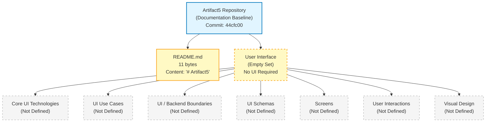

The diagram visually reaffirms the textual finding established throughout Section 7: only the repository root and `README.md` are observable, and every Section 7 prompt dimension — Core UI Technologies, UI Use Cases, UI/Backend Interaction Boundaries, UI Schemas, Screens, User Interactions, and Visual Design Considerations — resolves to an empty set with no derivable interior structure.

## 7.4 RE-DOCUMENTATION TRIGGERS FOR USER INTERFACE DESIGN

### 7.4.1 Trigger Conditions

This Section 7 must be re-authored from its current empty state once any of the following observable conditions are met in the repository. The triggers below mirror the re-documentation discipline established in Section 2.7 and Section 3.8 of this specification.

| Trigger Category | Specific Condition | Required Section 7 Update |
|---|---|---|
| Frontend Source Files | Appearance of `.html`, `.css`, `.js`, `.ts`, `.tsx`, or `.jsx` files in any path | Populate Section 7.2.1 (Core UI Technologies); enumerate referenced screen files in Section 7.2.5 |
| Mobile Source Files | Appearance of `.swift`, `.kt`, or `.m` files in any path | Populate Section 7.2.1 with mobile framework selection; populate Section 7.2.5 with screen files |
| Frontend Dependency Manifest | Appearance of `package.json`, `bower.json`, or equivalent declaring UI framework dependencies | Populate Section 7.2.1; cross-reference Section 3.3.1 |
| UI Component Directories | Creation of `components/`, `views/`, `pages/`, `screens/`, or `templates/` directories | Populate Section 7.2.5 (Screens) with discovered files; cross-reference paths |
| Design Specifications | Appearance of design files (Figma exports, Sketch files, wireframes, mockups) in a `design/` or `docs/` directory | Populate Section 7.2.7 (Visual Design Considerations) |
| API / Schema Contracts | Appearance of OpenAPI, GraphQL schema, or Protocol Buffer files declaring UI-consumable endpoints | Populate Section 7.2.3 (UI/Backend Interaction Boundaries) and Section 7.2.4 (UI Schemas) |
| User Workflow Documentation | Population of "Primary User Workflows" in Section 1.3.1 | Populate Section 7.2.2 (UI Use Cases) and Section 7.2.6 (User Interactions) |
| Backend Framework Declaration | Population of "Web / HTTP Application Framework" in Section 3.3.1 with a UI-serving framework | Populate Section 7.2.3 with backend integration boundary |

Until any of the above triggers is observed in a future repository commit, this Section 7 will remain in its current empty-state form and will continue to declare "No user interface required" as its primary determination.

## 7.5 REFERENCES

### 7.5.1 Files Examined

- `README.md` — The sole non-`.git` file in the repository. Total size: 11 bytes. Full content: `# Artifact5` (a single Markdown H1 heading). Verified to contain no UI-related content, no design references, no screen descriptions, and no technology selections.

### 7.5.2 Folders Examined

- `/` (repository root) — Verified to contain only `README.md` (file) and `.git/` (version-control metadata directory). No subdirectories of any kind exist. The repository's directory depth is 0. Specifically, no UI-organizing directories (`src/`, `frontend/`, `client/`, `web/`, `ui/`, `app/`, `views/`, `components/`, `pages/`, `screens/`, `templates/`, `static/`, `assets/`, `public/`) are present.

### 7.5.3 Repository Searches Executed

- File-pattern search for UI source extensions (`user interface frontend web HTML CSS JavaScript React Vue Angular`) → empty result set.
- Folder-pattern search for UI-organizing directory names (`frontend UI components views screens templates`) → empty result set.

### 7.5.4 Negative Findings (Verified Absences)

- No HTML, CSS, JavaScript, TypeScript, JSX, TSX, Swift, Kotlin, or Objective-C source files exist anywhere in the repository tree.
- No frontend dependency manifest files (`package.json`, `bower.json`, `yarn.lock`, `pnpm-lock.yaml`) exist.
- No UI framework declarations (React, Vue, Angular, Svelte, SwiftUI, Jetpack Compose, Flutter, React Native, etc.) exist.
- No static asset files (images, fonts, icons, videos) exist.
- No design specification artifacts (Figma exports, Sketch files, wireframes, mockups, style guides) exist.
- No API contracts (OpenAPI/Swagger, GraphQL SDL, Protocol Buffer definitions) exist.
- No screen-organizing directory exists in the repository (`components/`, `views/`, `pages/`, `screens/`, `templates/`).

### 7.5.5 Cross-Referenced Specification Sections

- **Section 1.1 (Executive Summary)** — Established initialization-stage baseline; confirmed only `README.md` exists in the repository.
- **Section 1.2 (System Overview)** — Confirmed no system capabilities, no language/framework/runtime selected.
- **Section 1.3 (Scope)** — Confirmed "Primary User Workflows" marked "Not defined in repository"; established complete documentation baseline acknowledgement (commit `44cfc00`, `README.md` content `# Artifact5`).
- **Section 2.1 (Documentation Baseline and Evidentiary Constraints)** — Established the evidence-based discipline followed by Section 7.
- **Section 2.2 (Feature Catalog)** — Confirmed empty feature inventory; no UI features could be derived.
- **Section 3.1 (Documentation Baseline)** — Established empty technology stack landscape and empty-state mermaid diagram convention adopted in Section 7.3.
- **Section 3.2 (Programming Languages)** — Confirmed Frontend/Client-Side (Web), Mobile (iOS), Mobile (Android), and Desktop/Native all marked "Not defined in repository."
- **Section 3.3 (Frameworks & Libraries)** — Confirmed Frontend UI Framework, Mobile Application Framework, and Web/HTTP Application Framework all marked "Not defined in repository" with evidence "No manifest, no source."
- **Section 5.2 (High-Level Architecture)** — Confirmed no architectural style, no components, no data flows, no external integrations; provided template for the empty-state landscape diagram replicated in Section 7.3.

# 8. Infrastructure

## 8.1 Documentation Baseline and Applicability Determination

### 8.1.1 Inherited Baseline from Sections 1.x, 2.x, 3.x, 4.x, 5.x, 6.x, and 7.x

This Infrastructure section is produced against the same initialization-stage repository baseline already documented in Sections 1.1 (Executive Summary), 1.2 (System Overview), 1.3 (Scope), the entirety of Section 2 (Product Requirements), the entirety of Section 3 (Technology Stack), the entirety of Section 4 (Process Flowchart), the entirety of Section 5 (System Architecture), the entirety of Section 6 (System Components Design), and Section 7 (User Interface Design). The observable repository facts that constrain every subsection below are inherited verbatim from Sections 1.1.2, 5.1.1, 5.7, 6.1.1, 6.4.1.1, 6.5.1.1, and 6.6.1.1:

- The repository's working tree contains exactly one tracked artifact — `README.md` (11 bytes) — whose entire content is the project name expressed as a Markdown H1 heading (`# Artifact5`).
- No source code files, configuration files, build scripts, dependency manifests, test artifacts, license files, `.gitignore` files, or supplementary documentation exist in the repository.
- No subdirectories exist beneath the repository root; the only entries are `README.md` and the `.git/` metadata directory.
- The Git history contains exactly one commit (`44cfc00` — "Initial commit") authored by `Blitzy-Multi <mmwforfinance@gmail.com>`.
- Per Section 1.2.2, no programming language, framework, runtime environment, persistence layer, **deployment target**, or architectural style has been selected or declared in the repository. The "Deployment Target" technical decision row is explicitly marked "Not selected in repository."
- Per Section 2.5.1, all four constraint dimensions (Language / Platform Constraints, Runtime / Environment Constraints, Architectural Constraints, **Deployment Constraints**) are marked "Not defined in repository."
- Per Section 2.5.2, all four performance dimensions (Latency Targets, Throughput Targets, Availability Targets, **Resource Utilization Targets**) are marked "Not defined in repository."
- Per Section 2.5.3, all four scalability dimensions (Horizontal Scaling Strategy, Vertical Scaling Strategy, Load Profile Assumptions, Capacity Planning Assumptions) are marked "Not defined in repository."
- Per Section 2.5.5, the maintenance dimensions for "Operational Runbooks," "Monitoring / Observability," "Backup / Recovery Procedures," and "Upgrade / Migration Procedures" are all marked "Not defined in repository."
- Per Section 2.8.4, **"No build or infrastructure files (`Dockerfile`, `docker-compose.yml`, `Makefile`, `.github/workflows/`, `.gitlab-ci.yml`, `Jenkinsfile`, Terraform, Kubernetes manifests, etc.) exist."** This finding is the central evidentiary anchor for the present section.
- Per Section 3.5.4, all seven cloud-service categories (Compute, Object / Blob Storage, Managed Database Services, Managed Messaging / Queue, Managed Identity / Secrets, Content Delivery Network, Edge / Function Services) are marked "Not defined in repository," and no cloud platform of any kind (AWS, Azure, Google Cloud, Oracle Cloud, IBM Cloud, Alibaba Cloud, or other) is referenced.
- Per Section 3.7.1, all eight development-tool dimensions (Source Code Editor / IDE Convention, Linter / Static Analyzer, Code Formatter, Type Checker, Version Control System, Branching Strategy, Code Review Tooling, Local Development Environment) are marked "Not defined in repository," with Git being the only inferred component due to the observable `.git/` metadata.
- Per Section 3.7.2, all five build-system concerns (Build Orchestrator, Task Runner, Bundler / Compiler, Artifact Packaging Format, Versioning / Release Tagging Strategy) are marked "Not defined in repository."
- Per Section 3.7.3, all five containerization concerns (Container Runtime, Container Image Definition, Container Orchestration Platform, Container Registry, Service Mesh) are marked "Not defined in repository."
- Per Section 3.7.4, all seven CI/CD concerns (CI / Build Automation Platform, Test Automation Trigger, Code Quality Gates, Security / SCA Scanning, Deployment Automation, Environment Promotion Strategy, Rollback Strategy) are marked "Not defined in repository," with the explicit confirmation that "no `.github/workflows/`, `.gitlab-ci.yml`, `Jenkinsfile`, CircleCI configuration, Azure Pipelines definition, or other CI/CD platform artifact exists."
- Per Section 3.7.5, all four Infrastructure-as-Code (IaC) concerns (Infrastructure Provisioning Tool, Configuration Management Tool, Secrets Management Integration, State Storage Backend) are marked "Not defined in repository."
- Per Section 5.5.5, all four performance / SLA dimensions resolve to "Not defined in repository."
- Per Section 5.5.6, all four disaster-recovery concerns (Backup Procedure, Recovery / Restore Procedure, Disaster-Recovery Sequence, Recovery Time / Recovery Point Objectives) resolve to "Not defined in repository."
- Per Section 5.7.4, the repository contains **"no Infrastructure-as-Code artifacts (`.tf`, `.tfvars`, CloudFormation, ARM templates, Pulumi, Bicep, CDK projects)"** and **"no service-orchestration manifests (Kubernetes YAML, Docker Compose, Helm charts, Nomad jobs, ECS task definitions, Cloud Run service definitions)"** from which infrastructure topology could be inferred.
- Per Section 6.1.3 (Scalability Design — Not Applicable), all five scalability dimensions resolve to "Not Applicable."
- Per Section 6.1.4 (Resilience Patterns — Not Applicable), all five resilience dimensions resolve to "Not Applicable."
- Per Section 6.4 (Security Architecture), "Detailed Security Architecture is not applicable for this system," with no key-management substrate, no secrets-management substrate, no network segmentation, and no compliance framework declared.
- Per Section 6.5 (Monitoring and Observability), "Detailed Monitoring Architecture is not applicable for this system," with all monitoring infrastructure dimensions and incident-response substrates resolving to empty sets.
- Per Section 6.6 (Testing Strategy), "Detailed Testing Strategy is not applicable for this system," with no CI/CD test-automation triggers, no quality gates, and no security-scanning configurations.
- Per Section 7 (User Interface Design), "No user interface required," foreclosing CDN, edge-cache, and frontend-asset-delivery infrastructure authorship.

### 8.1.2 Section 8 Off-Ramp Invocation

The Section 8 prompt provides an explicit off-ramp clause, reproduced verbatim:

> "If the system is a standalone application or library that does not require deployment infrastructure, clearly state 'Detailed Infrastructure Architecture is not applicable for this system' and explain why, then document only the minimal build and distribution requirements."

**Detailed Infrastructure Architecture is not applicable for this system.**

The applicability determination is grounded in the following nine evidence-based findings from prior sections:

1. **No deployable artifact exists.** Per Section 1.2.2, the repository "realizes no system capabilities at this time. There are no executable artifacts, functional modules, behavioral specifications, or interface definitions." Per Section 2.8.4, "no source code files of any language … exist anywhere in the repository tree." Per Section 5.7.4, the verified-absences inventory confirms zero source files in any of the recognized language ecosystems. Infrastructure architecture presupposes at least one deployable artifact (binary, container image, serverless function package, virtual-machine image, static-site bundle, language-runtime package) that requires placement onto a runtime substrate; zero such artifacts are observable.

2. **No deployment target is declared.** Per Section 1.2.2, the "Deployment Target" technical decision row is explicitly marked "Not selected in repository." Per Section 2.5.1, "Deployment Constraints" is marked "Not defined in repository." Per Section 2.5.5, "Upgrade / Migration Procedures" is marked "Not defined in repository (No deployable artifact exists)." The selection of an environment type (on-premises, cloud, hybrid, multi-cloud) presupposes at least one declared compute target; zero compute targets are observable.

3. **No cloud platform is referenced.** Per Section 3.5.4, no cloud platform (AWS, Azure, Google Cloud, Oracle Cloud, IBM Cloud, Alibaba Cloud, or other) is referenced anywhere in the repository, and all seven cloud-service categories are marked "Not defined in repository." Per Section 6.4.4.2 (Key Management — Not Applicable), no cloud-native key-management substrate exists. Per Section 5.7.4, no Infrastructure-as-Code artifacts exist from which cloud-resource architecture could be derived. Cloud-provider selection, service catalog, and cost modeling cannot be authored against zero declared cloud commitments.

4. **No containerization substrate is declared.** Per Section 3.7.3, all five containerization concerns (Container Runtime, Container Image Definition, Container Orchestration Platform, Container Registry, Service Mesh) are marked "Not defined in repository." Per Section 2.8.4, no `Dockerfile`, no `docker-compose.yml`, and no Kubernetes manifest exists. Per Section 5.7.4, no service-orchestration manifests exist. Container platform selection, base-image strategy, image-versioning approach, build-optimization techniques, and security-scanning requirements cannot be specified against zero declared container substrate.

5. **No orchestration platform is declared.** Per Section 3.7.3, the "Container Orchestration Platform" concern is marked "Not defined in repository." Per Section 5.7.4, "no service-orchestration manifests (Kubernetes YAML, Docker Compose, Helm charts, Nomad jobs, ECS task definitions, Cloud Run service definitions) exist from which deployment topology could be inferred." Per Section 6.1.3 (Scalability Design — Not Applicable), all five scalability dimensions including auto-scaling triggers and resource allocation are marked "Not Applicable." Orchestration platform selection, cluster architecture, service deployment strategy, auto-scaling configuration, and resource allocation policies presuppose at least one declared workload to orchestrate; zero workloads exist.

6. **No CI/CD substrate exists.** Per Section 3.7.4, all seven CI/CD concerns are marked "Not defined in repository," with the explicit confirmation that no `.github/workflows/`, `.gitlab-ci.yml`, `Jenkinsfile`, CircleCI configuration, Azure Pipelines definition, or other CI/CD platform artifact exists. Per Section 6.6.3 (Test Automation — Not Applicable), all six test-automation dimensions are marked "Not Applicable." Source-control triggers, build environment requirements, dependency management, artifact generation and storage, quality gates, deployment strategy, environment promotion workflow, rollback procedures, post-deployment validation, and release management cannot be specified against zero declared pipelines.

7. **No infrastructure-monitoring substrate exists.** Per Section 6.5 (Monitoring and Observability), "Detailed Monitoring Architecture is not applicable for this system," with all six observability tool categories marked "Not defined in repository." Per Section 5.5.1, all four observability concerns resolve to "Not defined in repository." Per Section 5.7.4, no observability configurations exist. Resource monitoring, performance metrics collection, cost monitoring, security monitoring, and compliance auditing presuppose at least one declared telemetry-emitting workload and one declared observability backend; zero are observable.

8. **No regulatory or compliance scope is declared.** Per Section 6.2.4 (Compliance Considerations — Not Applicable), all five compliance dimensions resolve to "Not Applicable." Per Section 6.4.4.5 (Compliance Controls — Not Applicable), no regulatory framework (GDPR, HIPAA, SOX, PCI-DSS, CCPA, FedRAMP, ISO 27001, SOC 2, NIST 800-53) is referenced. Infrastructure compliance and regulatory requirements (data residency, sovereign-cloud commitments, FedRAMP authorization boundaries, PCI cardholder-data-environment segmentation, HIPAA Business Associate Agreements, GDPR data-residency declarations) presuppose declared regulatory scope; zero such declarations exist.

9. **No performance, scalability, or DR commitments exist.** Per Section 5.5.5, no performance requirements or SLAs are declared. Per Section 2.5.3, all four scalability dimensions are marked "Not defined in repository." Per Section 5.5.6, all four disaster-recovery concerns (Backup Procedure, Recovery / Restore Procedure, Disaster-Recovery Sequence, Recovery Time / Recovery Point Objectives) resolve to "Not defined in repository." Infrastructure sizing, geographic distribution, backup procedures, disaster-recovery plans, high-availability designs, cost-optimization strategies, and auto-scaling configurations cannot be authored against zero declared targets.

### 8.1.3 Minimal Build and Distribution Requirements at the Documentation Baseline

The Section 8 prompt explicitly requires that the off-ramp invocation "document only the minimal build and distribution requirements." Under the controlling authoring discipline established in Section 3.3.4 ("The author cannot retroactively justify selections that the repository has not made") and Section 3.1.2 (which prohibits "speculative language selections, hypothetical framework choices, presumed runtime targets, imagined database technologies, or fabricated cloud-platform commitments"), the answer to this clause is constrained by the same evidentiary boundary that governs every preceding section. The Section 6.4.1.3, Section 6.5.1.3, and Section 6.6.1.3 precedents established that the only standard / basic / minimal practices observably operative at the documentation baseline are Git-baseline ones; that precedent extends transitively to the present section.

The only build-and-distribution-relevant practices observably operative at the documentation baseline are **distributed-version-control content distribution** and **Git-protocol clone / fetch / push transport**, each afforded by the single Git commit (`44cfc00` — "Initial commit") and the observable `.git/` metadata directory. These minimal practices are enumerated below:

| Minimal Build / Distribution Practice Observed at Baseline | Evidence in Repository | Scope of Applicability |
|---|---|---|
| Git object-database content distribution | Single commit `44cfc00` distributable via Git clone (per Sections 1.1.2 and 5.7.3) | Repository content (`README.md` only) |
| Git-protocol transport (HTTPS / SSH / Git wire-protocol) | Branches `remotes/origin/HEAD`, `remotes/origin/main` indicate remote-tracking capability (per Section 5.7.3) | Repository-tier distribution only |
| Markdown-readable distribution format | `README.md` (11 bytes) renderable by any Markdown-aware viewer (per Section 2.8.1) | Documentation surface only |

Beyond these three Git-baseline practices, **no further "minimal build and distribution requirements" can be committed to at this documentation baseline without violating the speculative-content prohibition reaffirmed across Sections 2.1.3, 3.1.2, 3.3.4, 4.1.3, 5.1.3, 6.1.1, 6.2.1.3, 6.3.1.3, 6.4.1.4, 6.5.1.4, and 6.6.1.4.** Minimal build practices such as language-native build tools (`make`, `npm run build`, `cargo build`, `go build`, `mvn package`, `gradle build`, `dotnet build`, `bundle install`, `composer install`, `pip wheel`), language-native packaging (Python wheels via `setuptools` / `poetry` / `flit` / `hatch`; JavaScript bundles via `webpack` / `rollup` / `esbuild` / `vite` / `parcel`; Java JAR / WAR / EAR via `maven` / `gradle`; .NET NuGet packages via `dotnet pack`; Ruby gems via `gem build`; PHP Composer packages; Go binaries via `go build`; Rust crates via `cargo publish`), language-native distribution endpoints (npm registry, PyPI, Maven Central, NuGet Gallery, RubyGems.org, Packagist, crates.io, Go module proxy, Docker Hub, GitHub Container Registry, AWS ECR, GCP Artifact Registry, Azure Container Registry), reproducible-build configurations (lockfiles, frozen-dependency declarations, container-image digests, SLSA Level 1+ provenance attestations), code-signing (GPG-signed Git tags, signed artifact attestations via cosign / Sigstore, JAR signing via `jarsigner`, .NET strong naming, Authenticode for Windows binaries, codesign for macOS binaries), and release-publication workflows (GitHub Releases, GitLab Releases, semantic versioning per `SemVer 2.0`, Conventional Commits driving automated releases via `semantic-release` / `release-please` / `changesets`) each presuppose at least one of the following prerequisites that is absent at this baseline:

- A selected programming language and runtime (against which language-native build tools and packaging formats would apply) — absent per Sections 1.2.2 and 3.2.1.
- A dependency manifest (against which lockfile generation, dependency resolution, and reproducible-build attestation would operate) — absent per Sections 2.8.4 and 3.4.1.
- A selected build orchestrator (Make, Bazel, Gradle, Maven, npm, Cargo, etc.) — absent per Section 3.7.2.
- A selected artifact packaging format (binary, JAR, container image, OCI artifact, NuGet package, Python wheel, etc.) — absent per Section 3.7.2.
- A selected versioning / release-tagging strategy (SemVer, CalVer, conventional commits, custom monotonic counter) — absent per Section 3.7.2.
- A CI/CD substrate (in which build, packaging, signing, and publication would be orchestrated) — absent per Section 3.7.4.
- A container or artifact registry (Docker Hub, ECR, GCR, ACR, Artifactory, Nexus, GitHub Packages) — absent per Section 3.7.3.

Consequently, the explanation required by the off-ramp clause resolves to: **"The only minimal build and distribution practices currently operative are the Git-baseline content-distribution and transport practices enumerated in the table above; all other minimal build and distribution requirements — including but not limited to artifact packaging format, distribution endpoint, code-signing, reproducible-build attestation, and release-publication workflow — will be selected and documented at the point in time when the repository accumulates the underlying language, runtime, build-orchestrator, and dependency selections against which those practices apply, as enumerated in the re-documentation triggers in Section 8.9.1."** This determination is consistent with the precedent established in Section 6.1.1, Section 6.2.1.2, Section 6.3.1.2, Section 6.4.1.2, Section 6.5.1.2, and Section 6.6.1.2, each of which similarly defers the elaboration of a domain's content to a future commit that introduces the prerequisite artifacts.

### 8.1.4 Authoring Constraint and Speculative-Content Non-Applicability

Consistent with the documentation discipline established in Sections 2.1.3, 3.1.2, 4.1.3, 5.1.3, 6.1.1, 6.2.1.3, 6.3.1.3, 6.4.1.4, 6.5.1.4, and 6.6.1.4, this Infrastructure section does not introduce speculative cloud platforms, hypothetical container runtimes, presumed orchestration topologies, imagined CI/CD pipelines, fabricated IaC modules, invented monitoring substrates, presumed cost estimates, or any other infrastructure-architecture content unsupported by repository evidence. The Section 3.3.4 precedent — **"The author cannot retroactively justify selections that the repository has not made"** — is the controlling discipline for the present section.

The Section 3.1.2 enumeration of prohibited content categories is incorporated by reference and extended for the present infrastructure domain. This section introduces:

- **No speculative cloud provider** — Amazon Web Services (AWS), Microsoft Azure, Google Cloud Platform (GCP), Oracle Cloud Infrastructure (OCI), IBM Cloud, Alibaba Cloud, Tencent Cloud, DigitalOcean, Linode / Akamai Cloud, Vultr, Hetzner, OVHcloud, Scaleway, Cloudflare, Fly.io, Render, Railway, Vercel, Netlify, Heroku, Fastly Compute@Edge, Akamai EdgeWorkers.
- **No speculative compute service** — AWS EC2 / Lambda / Fargate / ECS / EKS / Lightsail / Batch / Outposts / Wavelength / Local Zones; GCP Compute Engine / Cloud Run / Cloud Functions / GKE / GKE Autopilot / App Engine; Azure Virtual Machines / Container Instances / App Service / Functions / AKS / Container Apps / Batch; Oracle Compute / Container Engine for Kubernetes (OKE) / Functions; IBM Cloud Code Engine / Kubernetes Service.
- **No speculative storage service** — AWS S3 / EBS / EFS / FSx / S3 Glacier / Storage Gateway; GCP Cloud Storage / Persistent Disk / Filestore / Cloud Storage Nearline / Coldline / Archive; Azure Blob Storage / Disk Storage / Files / NetApp Files / Archive Storage; MinIO, Ceph, Wasabi, Backblaze B2, Storj DCS.
- **No speculative database service** — AWS RDS / Aurora / DynamoDB / DocumentDB / Neptune / Timestream / Keyspaces / QLDB / MemoryDB / ElastiCache; GCP Cloud SQL / Spanner / Bigtable / Firestore / Memorystore / AlloyDB; Azure SQL Database / Cosmos DB / Database for PostgreSQL / Database for MySQL / Cache for Redis / Synapse; managed-OSS database providers (PlanetScale, Neon, Supabase, Crunchy Data, ScaleGrid, Aiven, MongoDB Atlas, Redis Cloud, Elastic Cloud, Confluent Cloud).
- **No speculative orchestration platform** — Kubernetes (vanilla, managed via EKS / GKE / AKS / OKE / DOKS / Linode LKE / Civo / OVH Managed Kubernetes), HashiCorp Nomad, Apache Mesos, Docker Swarm, AWS ECS (Fargate / EC2 launch types), GCP Cloud Run, Azure Container Apps / Container Instances, Red Hat OpenShift, Rancher / SUSE Rancher, VMware Tanzu / TKG, Mirantis Kubernetes Engine, OpenStack Magnum.
- **No speculative service mesh** — Istio, Linkerd, Consul Connect, AWS App Mesh, Google Anthos Service Mesh / Cloud Service Mesh, Cilium Service Mesh, Kuma, Open Service Mesh, Traefik Mesh, NGINX Service Mesh.
- **No speculative container runtime or image format** — Docker Engine, containerd, CRI-O, Podman, Buildah, Kaniko, BuildKit, Buildah, img, OCI image spec, Docker image spec; multi-stage Dockerfile patterns, distroless base images (`gcr.io/distroless/*`), Chainguard Images, Wolfi-based images, Alpine, Debian / Ubuntu / Red Hat UBI base layers.
- **No speculative container registry** — Docker Hub, GitHub Container Registry (GHCR), GitLab Container Registry, AWS ECR (Public and Private), GCP Artifact Registry / Container Registry, Azure Container Registry (ACR), Quay.io, JFrog Artifactory, Sonatype Nexus, Harbor, Distribution, Zot.
- **No speculative CI/CD platform** — GitHub Actions, GitLab CI/CD, Jenkins, Jenkins X, CircleCI, Travis CI, Azure DevOps / Azure Pipelines, AWS CodePipeline / CodeBuild / CodeDeploy, GCP Cloud Build / Cloud Deploy, Bitbucket Pipelines, Buildkite, Drone CI, Woodpecker CI, TeamCity, Bamboo, Concourse CI, Argo CD / Argo Workflows / Argo Rollouts, Flux CD, Tekton Pipelines, Spinnaker, Harness, Octopus Deploy, Codefresh, Semaphore CI, GoCD, AppVeyor.
- **No speculative IaC tool** — HashiCorp Terraform / OpenTofu, Pulumi, AWS CloudFormation, AWS CDK / CDK for Terraform (CDKTF), Azure Resource Manager (ARM) templates / Bicep, GCP Deployment Manager, Crossplane, Kustomize, Helm, Helmfile, Jsonnet / Tanka, Ansible, Chef, Puppet, SaltStack, Cloud-Init, Packer, Vagrant.
- **No speculative configuration-management substrate** — Ansible Tower / AWX, Puppet Enterprise, Chef Automate, Salt Stack Enterprise, Rudder, CFEngine, Spacelift, env0, Terraform Cloud / Enterprise, Atlantis, Scalr, Pulumi Cloud.
- **No speculative secrets-management substrate** — HashiCorp Vault, AWS Secrets Manager, AWS Parameter Store, GCP Secret Manager, Azure Key Vault, CyberArk Conjur, Akeyless, Doppler, 1Password Secrets Automation, Bitwarden Secrets Manager, External Secrets Operator, Sealed Secrets (Bitnami).
- **No speculative infrastructure-monitoring platform** — Datadog Infrastructure Monitoring, New Relic Infrastructure, Dynatrace, AppDynamics, Splunk Observability, Honeycomb, Lightstep, Chronosphere, Prometheus + Grafana, VictoriaMetrics, InfluxDB + Telegraf, Zabbix, Nagios, Icinga, LibreNMS, Solarwinds, PRTG.
- **No speculative cost-management tool** — AWS Cost Explorer / AWS Budgets / AWS Compute Optimizer, GCP Cost Management / Recommender, Azure Cost Management + Billing, CloudHealth (VMware Aria Cost), Cloudability (Apptio), Vantage, Spot.io, Densify, ProsperOps, nOps, Kubecost, OpenCost, Flexera One.
- **No speculative deployment strategy** — blue / green deployments, canary deployments (Argo Rollouts, Flagger, AWS CodeDeploy traffic shifting), rolling updates (Kubernetes `RollingUpdate` strategy, AWS ECS rolling deployments), feature-flag-based progressive delivery (LaunchDarkly, Split.io, Unleash, Flagsmith, ConfigCat, GrowthBook, PostHog Feature Flags), shadow / dark deployments, A/B-tested deployments.
- **No speculative network topology** — Virtual Private Cloud (VPC) topologies, transit gateways (AWS Transit Gateway, GCP Network Connectivity Center, Azure Virtual WAN), service-meshes, ingress controllers (NGINX, Traefik, HAProxy, Istio Gateway, Envoy Gateway, Contour, Gloo, Kong, AWS ALB Ingress Controller, AWS Gateway API Controller), CDN edge networks (CloudFront, Cloud CDN, Azure CDN, Fastly, Akamai, Cloudflare CDN, BunnyCDN), DNS providers (Route 53, Cloud DNS, Azure DNS, NS1, Cloudflare DNS).
- **No speculative backup / DR substrate** — AWS Backup, AWS Elastic Disaster Recovery, GCP Backup and DR Service, Azure Backup / Azure Site Recovery, Veeam, Rubrik, Cohesity, Commvault, Druva, Velero (for Kubernetes), Stash, Kasten K10.
- **No speculative cost estimates** — no dollar amounts, no hourly / monthly / annual rates, no reserved-instance / committed-use-discount pricing, no sustained-use discount calculations, no spot / preemptible pricing, no savings plan rates, no per-request / per-GB-month / per-vCPU-hour rates are quoted, presumed, or extrapolated.

The section prompt's overriding instruction is reproduced verbatim:

> "Only include sections and items that are actually relevant to this system, based on your analysis of its requirements. Don't add any items that aren't clearly applicable."

Under this instruction and the inherited evidentiary baseline, **zero Infrastructure items are clearly applicable**. Every dimension below is therefore documented as "Not applicable" with cross-references to the upstream evidence sections that establish its empty state.

---

## 8.2 Deployment Environment — Not Applicable

No deployment environment is declared in the repository. The two deployment-environment categories enumerated in the Section 8 prompt — Target Environment Assessment and Environment Management — each presuppose the existence of a declared deployment target, a declared compute substrate, a declared environment hierarchy (dev / staging / prod), or an Infrastructure-as-Code artifact. Per Sections 1.2.2, 2.5.1, 2.8.4, 3.7.5, and 5.7.4, none of these prerequisites is observable in the repository.

### 8.2.1 Target Environment Assessment

Target-environment assessment substrates (on-premises data-center provisioning with rack-and-stack topology, hyperconverged infrastructure such as Nutanix / VMware vSAN / Cisco HyperFlex; public-cloud regions with availability-zone topology and edge-location proximity to user populations; hybrid topologies via AWS Outposts / Azure Arc / Google Anthos / VMware Cloud on AWS spanning on-premises and cloud; multi-cloud topologies distributing workloads across AWS / Azure / GCP / OCI / IBM Cloud; geographic distribution requirements driven by data-residency commitments such as GDPR Article 44 transfer restrictions, PCI-DSS Requirement 1 network-segmentation, HIPAA technical safeguards, FedRAMP Moderate / High authorization boundaries, China Multi-Level Protection Scheme (MLPS), Australia IRAP, UK Cyber Essentials Plus; resource requirements expressed as compute (vCPU cores, sustained / burst clock rates), memory (RAM capacity, NVDIMM / persistent memory), storage (HDD / SSD / NVMe IOPS, GB-month capacity, throughput MB/s), network (bandwidth Gbps, packet-per-second rates, latency RTT ms); compliance and regulatory requirements driving infrastructure attestation reports such as SOC 2 Type II, ISO 27001 / 27017 / 27018, FedRAMP authorization-to-operate, HITRUST CSF, PCI-DSS Attestation of Compliance) each require (a) at least one declared workload to deploy, (b) declared capacity assumptions, and (c) declared compliance scope.

The table below maps each Target Environment Assessment dimension enumerated by the Section 8 prompt to its empty-state determination and the upstream evidence section that establishes that determination.

| Target Environment Dimension | Declared Implementation | Cross-Reference |
|---|---|---|
| Environment Type (on-premises / cloud / hybrid / multi-cloud) | Not applicable — no deployment target selected | See Sections 1.2.2, 2.5.1 |
| Geographic Distribution Requirements | Not applicable — no data-residency or region commitments | See Sections 2.5.1, 6.4.4.5 |
| Resource Requirements (compute / memory / storage / network) | Not applicable — no capacity assumptions declared | See Sections 2.5.2, 2.5.3 |
| Compliance and Regulatory Requirements | Not applicable — no regulatory framework declared | See Sections 6.2.4, 6.4.4.5 |

Per Section 1.2.2, "Deployment Target: Not selected in repository." Per Section 2.5.1, "Deployment Constraints: Not defined in repository." Per Section 2.5.3, all four scalability dimensions (Horizontal Scaling Strategy, Vertical Scaling Strategy, Load Profile Assumptions, Capacity Planning Assumptions) are marked "Not defined in repository." Per Section 6.4.4.5 (Compliance Controls — Not Applicable), no regulatory framework (GDPR, HIPAA, SOX, PCI-DSS, CCPA, FedRAMP, ISO 27001, SOC 2, NIST 800-53) is referenced. No target environment can be assessed against zero declared workloads, zero capacity assumptions, and zero regulatory commitments.

### 8.2.2 Environment Management

Environment-management substrates (Infrastructure-as-Code via HashiCorp Terraform / OpenTofu with `.tf` / `.tfvars` files declaring providers / resources / modules / variables / outputs / data sources / state backends; Pulumi programs in TypeScript / Python / Go / .NET / Java / YAML declaring infrastructure as application code; AWS CloudFormation YAML / JSON templates with stacks, change sets, and StackSets for multi-account / multi-region propagation; AWS CDK programs synthesizing CloudFormation from TypeScript / Python / Java / .NET / Go constructs; Azure Resource Manager (ARM) templates and Bicep declarative resource modules; GCP Deployment Manager Jinja / Python templates; Crossplane composite resources defining cloud-provider abstractions; configuration management via Ansible playbooks / roles / collections, Chef cookbooks / Berkshelf, Puppet manifests / modules, SaltStack states / pillars / formulas; environment promotion strategies including trunk-based development with promotion artifacts, GitFlow with `develop` / `release/*` / `main` branches mapped to dev / staging / prod, GitOps via Argo CD / Flux CD with `kustomize` / `helm` overlays per environment, Spinnaker pipelines with stage-based promotion, Octopus Deploy environment promotion, manual approval gates between environments; backup and disaster recovery plans including AWS Backup vault policies with cross-region copy, Azure Backup recovery services vaults, GCP Backup and DR Service appliances, third-party backup orchestrators such as Veeam / Rubrik / Cohesity / Commvault / Druva, Velero for Kubernetes resource and persistent-volume backup, declared Recovery Time Objectives (RTO) and Recovery Point Objectives (RPO) by service tier, DR runbooks with regional-failover sequences, chaos-engineering programs validating DR posture) each require (a) declared infrastructure resources to manage, (b) declared configuration baselines to enforce, and (c) declared lifecycle events (provision, update, decommission, recover) to orchestrate.

The table below maps each Environment Management dimension enumerated by the Section 8 prompt to its empty-state determination and the upstream evidence section that establishes that determination.

| Environment Management Dimension | Declared Implementation | Cross-Reference |
|---|---|---|
| Infrastructure-as-Code (IaC) Approach | Not applicable — no Terraform / Pulumi / CFN / ARM / Bicep / CDK | See Sections 3.7.5, 5.7.4 |
| Configuration Management Strategy | Not applicable — no Ansible / Chef / Puppet / Salt declared | See Section 3.7.5 |
| Environment Promotion Strategy (dev / staging / prod) | Not applicable — no environment hierarchy declared | See Sections 3.7.4, 2.5.5 |
| Backup and Disaster Recovery Plans | Not applicable — no DR or backup substrate declared | See Sections 5.5.6, 2.5.5 |

Per Section 3.7.5, all four IaC concerns (Infrastructure Provisioning Tool, Configuration Management Tool, Secrets Management Integration, State Storage Backend) are marked "Not defined in repository." Per Section 5.7.4, "no Infrastructure-as-Code artifacts (`.tf`, `.tfvars`, CloudFormation, ARM templates, Pulumi, Bicep, CDK projects) exist from which cloud-resource architecture could be derived." Per Section 3.7.4, the "Environment Promotion Strategy" and "Rollback Strategy" CI/CD concerns are marked "Not defined in repository." Per Section 5.5.6, all four disaster-recovery concerns (Backup Procedure, Recovery / Restore Procedure, Disaster-Recovery Sequence, Recovery Time / Recovery Point Objectives) are marked "Not defined in repository." Per Section 2.5.5, "Backup / Recovery Procedures: Not defined in repository (No persistence layer selected)" and "Upgrade / Migration Procedures: Not defined in repository (No deployable artifact exists)." No environment-management practice can be specified against zero IaC artifacts, zero environment hierarchies, and zero DR commitments.

---

## 8.3 Cloud Services — Not Applicable

No cloud-service architecture exists in the repository. The Section 8 prompt's conditional clause — *"If the system does not use cloud services, clearly state why and skip this section"* — directly applies. The five cloud-service dimensions enumerated by the prompt (provider selection, core services, high availability, cost optimization, security and compliance) each presuppose the existence of at least one declared cloud platform, one declared cloud-resource, one IaC artifact, or one cloud-provider SDK integration. Per Sections 3.5.4, 3.7.5, and 5.7.4, none of these prerequisites is observable in the repository.

### 8.3.1 Cloud Provider Selection

Per Section 3.5.4, no cloud platform (AWS, Azure, Google Cloud, Oracle Cloud, IBM Cloud, Alibaba Cloud, or other) is referenced anywhere in the repository. The verified-absence finding in Section 3.5.4 explicitly notes: "The absence of any Infrastructure-as-Code artifact (`.tf`, `.tfvars`, CloudFormation, ARM, Pulumi, Bicep), any cloud-provider SDK declaration in a manifest, or any deployment configuration (per Section 2.8.4) confirms this state." Per Section 5.7.4, "no Infrastructure-as-Code artifacts" exist. Cloud-provider selection presupposes (a) a documented requirement for managed-service consumption, (b) a vendor evaluation matrix, and (c) a signed master service agreement or terms-of-service acceptance. Zero such artifacts are observable.

### 8.3.2 Core Cloud Services and Versions

The table below maps each cloud-service category enumerated by the Section 3.5.4 cloud-service inventory (referenced by Section 8) to its empty-state determination and the upstream evidence section that establishes that determination.

| Cloud Service Category | Declared Provider / Service / Version | Cross-Reference |
|---|---|---|
| Compute (VM / Container / Serverless) | Not applicable — no compute substrate declared | See Sections 1.2.2, 3.5.4 |
| Object / Blob Storage | Not applicable — no storage service declared | See Sections 1.2.2, 3.5.4 |
| Managed Database Services | Not applicable — no database service declared | See Sections 1.2.2, 6.2.1.2 |
| Managed Messaging / Queue | Not applicable — no messaging service declared | See Sections 1.2.1, 3.5.4 |
| Managed Identity / Secrets | Not applicable — no secrets-management substrate | See Sections 3.5.4, 6.4.4.2 |
| Content Delivery Network (CDN) | Not applicable — no CDN substrate declared | See Sections 1.2.2, 7 |
| Edge / Function Services | Not applicable — no edge or serverless platform | See Sections 1.2.2, 3.5.4 |

Per Section 3.5.4, all seven cloud-service categories are marked "Not defined in repository." No service-version commitment (e.g., AWS Lambda Node.js 20 runtime, GCP Cloud Run gen2 execution environment, Azure Functions v4 host, Kubernetes 1.29 cluster version) can be specified against zero declared cloud platform and zero declared service catalog.

### 8.3.3 High Availability, Cost Optimization, Security, and Compliance Considerations

The table below maps each cloud-cross-cutting dimension enumerated by the Section 8 prompt to its empty-state determination and the upstream evidence section that establishes that determination.

| Cloud Cross-Cutting Dimension | Declared Implementation | Cross-Reference |
|---|---|---|
| High Availability Design | Not applicable — no multi-AZ / multi-region topology | See Sections 5.5.5, 6.1.4 |
| Cost Optimization Strategy | Not applicable — no resource baseline or budget declared | See Sections 1.2.3, 2.5.2 |
| Security Considerations | Not applicable — see Section 6.4 (entire SecArch Not Applicable) | See Section 6.4 |
| Compliance Considerations | Not applicable — no regulatory framework declared | See Sections 6.2.4, 6.4.4.5 |

Per Section 6.1.4 (Resilience Patterns — Not Applicable), all five resilience dimensions (Fault Tolerance Mechanisms, Disaster Recovery Procedures, Data Redundancy Approach, Failover Configurations, Service Degradation Policies) are marked "Not Applicable." Per Section 5.5.5, no availability target is declared. Per Section 1.2.3, no KPIs are declared across any performance dimension; consequently, no cost-per-request, cost-per-tenant, cost-per-transaction, or unit-economics baseline exists against which optimization could be measured. Per Section 6.4 (Security Architecture), "Detailed Security Architecture is not applicable for this system." Per Section 6.4.4.5, no compliance framework is declared. No high-availability design, no cost-optimization strategy, no cloud-security posture, and no cloud-compliance commitment can be specified against zero declared cloud commitments.

---

## 8.4 Containerization — Not Applicable

No containerization architecture exists in the repository. The Section 8 prompt's conditional clause — *"If the system does not use containers, clearly state why and skip this section"* — directly applies. The five containerization dimensions enumerated by the prompt (container platform selection, base image strategy, image versioning approach, build optimization techniques, security scanning requirements) each presuppose the existence of at least one declared container runtime, one declared image definition (`Dockerfile`, `Containerfile`, `Buildpack`), one declared registry endpoint, or one declared image-scanning configuration. Per Sections 2.8.4, 3.7.3, and 5.7.4, none of these prerequisites is observable in the repository.

### 8.4.1 Container Platform and Image Strategy

Container platform substrates (Docker Engine on Linux / Windows / macOS hosts, containerd as Kubernetes runtime, CRI-O as Kubernetes runtime, Podman as rootless daemon-free runtime, Buildah for image construction, Kaniko for in-cluster builds, BuildKit for advanced build caching, Buildah for OCI-compliant image generation, img for unprivileged builds; OCI image specification (image-spec) and runtime specification (runtime-spec) versions; multi-architecture image builds via `docker buildx` with `linux/amd64` / `linux/arm64` / `linux/arm/v7` / `linux/ppc64le` / `linux/s390x` platforms; base-image strategies including scratch / distroless / Chainguard / Wolfi / Alpine / Debian-slim / Ubuntu-LTS / Red Hat UBI / Windows Server Core / Nanoserver; Buildpacks via Cloud Native Buildpacks (CNB), Paketo Buildpacks, Heroku Buildpacks, Google Cloud Buildpacks; image-versioning approaches including immutable tags (semantic versioning, Git SHA, build number), `latest` floating tags (anti-pattern but observed), content-addressable digests (`sha256:...`), provenance attestations per SLSA Level 1+) each require (a) a declared base image, (b) a declared image-build process, and (c) a declared image-distribution endpoint.

The table below maps each container-platform / image-strategy dimension enumerated by the Section 8 prompt to its empty-state determination and the upstream evidence section that establishes that determination.

| Container / Image Dimension | Declared Implementation | Cross-Reference |
|---|---|---|
| Container Platform Selection | Not applicable — no container runtime declared | See Sections 2.8.4, 3.7.3 |
| Base Image Strategy | Not applicable — no `Dockerfile` or `Containerfile` exists | See Sections 2.8.4, 3.7.3 |
| Image Versioning Approach | Not applicable — no image tag or versioning policy | See Sections 3.7.2, 3.7.3 |

Per Section 3.7.3, all five containerization concerns (Container Runtime, Container Image Definition, Container Orchestration Platform, Container Registry, Service Mesh) are marked "Not defined in repository." Per Section 2.8.4, "no build or infrastructure files (`Dockerfile`, `docker-compose.yml`, …, Kubernetes manifests, etc.) exist." Per Section 3.7.2, the "Artifact Packaging Format" and "Versioning / Release Tagging Strategy" build-system concerns are marked "Not defined in repository." No container platform, base image, or image-versioning approach can be specified against zero declared container substrate.

### 8.4.2 Build Optimization and Security Scanning

Build-optimization techniques (multi-stage Dockerfiles separating build-time dependencies from runtime layers; layer-caching via cache-mount syntax (`--mount=type=cache`); BuildKit secret-mount syntax (`--mount=type=secret`) avoiding secret leakage into layers; reproducible builds via fixed timestamps (`SOURCE_DATE_EPOCH`); minimal base images reducing attack surface (scratch, distroless, Wolfi); SBOM emission during build via Syft / Trivy / Snyk; dependency-graph optimization through ordering of `RUN` / `COPY` instructions; ignoring build context via `.dockerignore`; build-cache externalization to registry via `--cache-to` and `--cache-from`; remote builders via BuildKit / Buildah / Kaniko; concurrent multi-arch builds via QEMU emulation or native cross-build hosts) and security-scanning substrates (Trivy / Grype / Anchore / Clair / Snyk Container / Aqua Trivy Premium / Prisma Cloud / Sysdig Secure / Lacework / Wiz image scanners; vulnerability databases (NVD, CVE, GHSA, OSV, Red Hat OVAL, Debian Security Tracker, Ubuntu USN); SBOM generation in CycloneDX / SPDX / Syft JSON formats; image signing via cosign / Notation / Sigstore; admission controllers enforcing signed-image policies (Kyverno, OPA Gatekeeper, Connaisseur, Portieris, Sigstore policy-controller); SLSA Level 2+ provenance attestations; CIS Docker / Kubernetes Benchmarks; runtime threat detection via Falco, Sysdig, Aqua Security, Prisma Cloud Compute, Lacework, Wiz Runtime Sensor) each require (a) a declared image build process, (b) a declared scanning workflow, and (c) a declared scan-result-handling policy.

The table below maps each build-optimization / security-scanning dimension enumerated by the Section 8 prompt to its empty-state determination and the upstream evidence section that establishes that determination.

| Build / Scanning Dimension | Declared Implementation | Cross-Reference |
|---|---|---|
| Build Optimization Techniques | Not applicable — no `Dockerfile` to optimize | See Sections 2.8.4, 3.7.3 |
| Security Scanning Requirements | Not applicable — no SAST / DAST / SCA / image scanner declared | See Sections 3.7.4, 6.4.6.1 |

Per Section 3.7.4, the "Security / SCA Scanning" CI/CD concern is marked "Not defined in repository." Per Section 6.4.6.1 (Security Architecture Triggers), no SAST configurations (Semgrep, SonarQube SAST, CodeQL, Snyk Code, Checkmarx), no DAST configurations (OWASP ZAP, Burp Suite, Nuclei), no SCA configurations (Snyk, Dependabot, Renovate, Mend, Black Duck), no container-image scanners (Trivy, Grype, Anchore, Clair, Aqua, Prisma Cloud), and no secret scanners (gitleaks, trufflehog, detect-secrets, GitGuardian) exist. No build-optimization technique or security-scanning requirement can be specified.

---

## 8.5 Orchestration — Not Applicable

No orchestration architecture exists in the repository. The Section 8 prompt's conditional clause — *"If the system does not require orchestration, clearly state why and skip this section"* — directly applies. The five orchestration dimensions enumerated by the prompt (orchestration platform selection, cluster architecture, service deployment strategy, auto-scaling configuration, resource allocation policies) each presuppose the existence of at least one declared workload to orchestrate, one declared orchestrator manifest, or one declared cluster topology. Per Sections 2.8.4, 3.7.3, 5.7.4, and 6.1.3, none of these prerequisites is observable in the repository.

### 8.5.1 Orchestration Platform and Cluster Architecture

Orchestration-platform substrates (Kubernetes — vanilla upstream, managed via AWS EKS / GCP GKE / Azure AKS / Oracle OKE / DigitalOcean DOKS / Linode LKE / Civo / OVH / Scaleway; HashiCorp Nomad with job specifications, task groups, allocations; Apache Mesos with Marathon / Chronos / DC/OS; Docker Swarm with services, stacks, secrets, configs; AWS ECS with Fargate and EC2 launch types; GCP Cloud Run for stateless containers; Azure Container Apps / Container Instances; Red Hat OpenShift with Operators / OperatorHub; Rancher with Rancher Kubernetes Engine; Mirantis Kubernetes Engine; Cluster topologies including control-plane-and-node-pool separation; node-pool taints and tolerations for workload segregation; node-pool spot / preemptible instance mixtures; multi-AZ control-plane high availability; multi-region cluster federation via Cluster API, Karmada, Kubefed; cluster-autoscaling via Kubernetes Cluster Autoscaler, Karpenter, GCP GKE Autopilot, AKS Karpenter Provider; ingress topologies via NGINX Ingress Controller, Traefik, HAProxy, Istio Gateway, Envoy Gateway, Contour, Gloo Edge, Kong; CNI plugin selection (Calico, Cilium, Flannel, Weave Net, AWS VPC CNI, Azure CNI, Antrea); CSI driver selection per storage class) each require (a) at least one declared workload, (b) a declared orchestrator manifest, and (c) a declared cluster topology.

The table below maps each orchestration-platform / cluster-architecture dimension enumerated by the Section 8 prompt to its empty-state determination and the upstream evidence section that establishes that determination.

| Orchestration / Cluster Dimension | Declared Implementation | Cross-Reference |
|---|---|---|
| Orchestration Platform Selection | Not applicable — no Kubernetes / Nomad / ECS / Cloud Run | See Sections 3.7.3, 5.7.4 |
| Cluster Architecture | Not applicable — no cluster topology declared | See Sections 5.7.4, 6.1.2 |

Per Section 3.7.3, the "Container Orchestration Platform" concern is marked "Not defined in repository." Per Section 5.7.4, "no service-orchestration manifests (Kubernetes YAML, Docker Compose, Helm charts, Nomad jobs, ECS task definitions, Cloud Run service definitions) exist from which deployment topology could be inferred." Per Section 6.1.2 (Service Components — Not Applicable), all six service-component dimensions are marked "Not Applicable." Per Section 6.1.3, the "Auto-Scaling Triggers and Rules" scalability dimension is marked "Not Applicable." No orchestration platform or cluster architecture can be specified against zero declared workloads and zero declared orchestrator manifests.

### 8.5.2 Service Deployment, Auto-Scaling, and Resource Allocation

Service-deployment strategies (Kubernetes `Deployment` with `RollingUpdate` (default `maxSurge: 25%`, `maxUnavailable: 25%`) or `Recreate` strategies; Argo Rollouts with canary and blue-green progressive delivery and analysis templates referencing Prometheus / Datadog / New Relic / Wavefront / CloudWatch metrics; Flagger with canary releases and metric-driven promotion; AWS CodeDeploy with `AllAtOnce` / `HalfAtATime` / `OneAtATime` / canary 10% / linear 10% deployment configurations; Spinnaker pipelines with bake / deploy / verify stages; feature-flag-based progressive delivery decoupling deployment from release via LaunchDarkly / Split.io / Unleash / Flagsmith / ConfigCat / GrowthBook; auto-scaling configurations including Kubernetes Horizontal Pod Autoscaler (HPA) v2 with CPU / memory / custom-metric / external-metric targets, Kubernetes Vertical Pod Autoscaler (VPA) in Off / Initial / Recreate / Auto modes, KEDA `ScaledObject` and `ScaledJob` with event-driven autoscaling from 60+ scalers, Cluster Autoscaler scaling node pools, Karpenter for just-in-time node provisioning, AWS Auto Scaling Groups with target-tracking / step-scaling / simple-scaling / predictive-scaling policies, GCP Managed Instance Group autoscaler, Azure VM Scale Set autoscaling; resource-allocation policies including Kubernetes resource `requests` / `limits` for CPU / memory / ephemeral-storage / hugepages-{2Mi,1Gi}, Quality-of-Service classes (Guaranteed / Burstable / BestEffort), Pod Priority and Preemption with `PriorityClass`, `LimitRange` and `ResourceQuota` at namespace tier, `PodDisruptionBudget` for voluntary-disruption protection, taints and tolerations for node-pool isolation, node affinity / anti-affinity and pod affinity / anti-affinity rules, topology spread constraints across zones / regions / hosts) each require (a) at least one declared service, (b) a declared deployment strategy, and (c) declared resource envelopes.

The table below maps each service-deployment / auto-scaling / resource-allocation dimension enumerated by the Section 8 prompt to its empty-state determination and the upstream evidence section that establishes that determination.

| Deployment / Scaling Dimension | Declared Implementation | Cross-Reference |
|---|---|---|
| Service Deployment Strategy | Not applicable — no service to deploy | See Sections 6.1.2, 5.7.4 |
| Auto-Scaling Configuration | Not applicable — no HPA / VPA / Karpenter / ASG declared | See Sections 2.5.3, 6.1.3 |
| Resource Allocation Policies | Not applicable — no resource envelopes declared | See Sections 2.5.2, 6.1.3 |

Per Section 6.1.2, "Service Boundaries and Responsibilities" is marked "Not Applicable — no services declared." Per Section 2.5.3, all four scalability dimensions are marked "Not defined in repository." Per Section 6.1.3, "Resource Allocation Strategy" is marked "Not Applicable — no resource constraints declared." Per Section 2.5.2, all four performance dimensions (Latency Targets, Throughput Targets, Availability Targets, Resource Utilization Targets) are marked "Not defined in repository." No service-deployment strategy, no auto-scaling configuration, and no resource-allocation policy can be specified against zero declared services and zero declared resource envelopes.

---

## 8.6 CI/CD Pipeline — Not Applicable

No CI/CD pipeline architecture exists in the repository. The two CI/CD pipeline categories enumerated by the Section 8 prompt — Build Pipeline and Deployment Pipeline — each presuppose the existence of a declared CI/CD platform, declared pipeline definitions, declared build / deploy artifacts, or declared environment promotion workflows. Per Sections 3.7.2, 3.7.4, and 5.7.4, none of these prerequisites is observable in the repository.

### 8.6.1 Build Pipeline

Build-pipeline substrates (GitHub Actions workflows in `.github/workflows/*.yml` with `on: push` / `on: pull_request` / `on: schedule` triggers and `jobs.<id>.steps[*]` shell / action invocations; GitLab CI `.gitlab-ci.yml` with `stages` and per-stage jobs; Jenkins `Jenkinsfile` declarative or scripted pipelines; CircleCI `.circleci/config.yml` with `workflows` and reusable orbs; Travis CI `.travis.yml` with `language` / `script` / `before_install` stages; Azure DevOps `azure-pipelines.yml` with stages / jobs / steps; AWS CodePipeline with CodeBuild projects and `buildspec.yml`; GCP Cloud Build with `cloudbuild.yaml`; Bitbucket Pipelines `bitbucket-pipelines.yml`; Buildkite pipeline definitions; Tekton `Pipeline` / `PipelineRun` / `Task` / `TaskRun` CRDs; Argo Workflows `Workflow` CRDs; build environment requirements including specific OS images (`ubuntu-latest`, `windows-latest`, `macos-latest`, custom self-hosted runner pools), specific runtime versions (Node 18 / 20, Python 3.11 / 3.12, Go 1.22, Java 17 / 21, .NET 8, Ruby 3.3), specific tool versions (Docker, kubectl, helm, terraform); dependency management including lockfile validation, dependency-tree resolution, supply-chain attestation, license scanning; artifact generation and storage including binary outputs to GitHub Releases / GitLab Releases / Artifactory / Nexus, container images to Docker Hub / ECR / GCR / ACR / GHCR, NPM packages to npm registry / GitHub Packages, Python wheels to PyPI / TestPyPI, Maven artifacts to Maven Central / OSS Sonatype Nexus, .NET packages to NuGet.org / GitHub Packages, Ruby gems to RubyGems.org / GitHub Packages; quality gates including unit-test pass-rate floors, code-coverage thresholds via Codecov / Coveralls / SonarQube, static analysis via SonarQube / CodeClimate / Codacy / DeepSource, license-compliance via FOSSA / Snyk / WhiteSource, security gates via SAST / DAST / SCA / container-scan results, signed-commit verification, branch-protection rule enforcement) each require (a) a declared CI/CD platform, (b) a declared pipeline definition file, and (c) declared build / test / package / publish stages.

The table below maps each Build Pipeline dimension enumerated by the Section 8 prompt to its empty-state determination and the upstream evidence section that establishes that determination.

| Build Pipeline Dimension | Declared Implementation | Cross-Reference |
|---|---|---|
| Source Control Triggers | Not applicable — no pipeline file declared | See Sections 3.7.4, 6.6.3.2 |
| Build Environment Requirements | Not applicable — no runner / executor declared | See Sections 3.7.2, 3.7.4 |
| Dependency Management | Not applicable — no manifest or lockfile exists | See Sections 3.4.1, 2.8.4 |
| Artifact Generation and Storage | Not applicable — no package format or registry | See Sections 3.7.2, 3.7.3 |
| Quality Gates | Not applicable — no test / coverage / SAST gates | See Sections 3.7.4, 6.6.4.4 |

Per Section 3.7.4, all seven CI/CD concerns are marked "Not defined in repository," with the explicit confirmation that "no `.github/workflows/`, `.gitlab-ci.yml`, `Jenkinsfile`, CircleCI configuration, Azure Pipelines definition, or other CI/CD platform artifact exists." Per Section 3.7.2, all five build-system concerns (Build Orchestrator, Task Runner, Bundler / Compiler, Artifact Packaging Format, Versioning / Release Tagging Strategy) are marked "Not defined in repository." Per Section 3.4.1 (referenced via Section 6.6.1.1), no dependency manifest exists in any ecosystem. Per Section 6.6.4.4 (Quality Gates — Not Applicable), no quality-gate declaration is observable. No build pipeline can be authored against zero declared CI substrate, zero declared dependency manifests, and zero declared quality gates.

### 8.6.2 Deployment Pipeline

Deployment-pipeline substrates (deployment strategies including blue-green deployments with parallel environments and DNS / load-balancer cutover; canary deployments with progressive traffic shifting (1% / 5% / 25% / 50% / 100%) via Argo Rollouts / Flagger / AWS App Mesh Virtual Router weight shifting / Linkerd traffic splits / Istio `VirtualService` weight rules; rolling updates via Kubernetes `RollingUpdate` strategy, AWS ECS rolling deployments, GCP Managed Instance Group rolling updates, Azure VM Scale Set rolling-upgrade policies; immutable deployments where pre-production artifacts are promoted unchanged; environment promotion workflows including GitOps via Argo CD with `Application` and `ApplicationSet` CRDs syncing manifest repositories, Flux CD with `Kustomization` and `HelmRelease` CRDs, manual approval gates between dev / staging / prod with required reviewers, automated promotion based on canary success metrics; rollback procedures including automatic rollback on canary metric-threshold breaches, `kubectl rollout undo`, `helm rollback`, Argo Rollouts abort and rollback, AWS CodeDeploy automatic rollback, Spinnaker pipeline rollback stages, blue-green DNS / load-balancer reversal; post-deployment validation via synthetic-monitor probes (Pingdom, UptimeRobot, DataDog Synthetics, CloudWatch Synthetics, GCP Monitoring uptime checks), smoke-test execution against deployed environments, contract-test re-validation, distributed-trace sampling of post-deployment requests, error-rate burn-rate evaluation per SRE Workbook; release management process including release-train cadences (weekly / bi-weekly / monthly), release-notes generation via Conventional Commits + `semantic-release` / `release-please` / `changesets`, release approval workflows in Jira / Linear / GitHub Issues, change-management ticket integration with ServiceNow / Jira Service Management, post-release verification windows, hypercare periods following major releases) each require (a) a declared deployable artifact, (b) a declared target environment, and (c) a declared promotion-and-rollback policy.

The table below maps each Deployment Pipeline dimension enumerated by the Section 8 prompt to its empty-state determination and the upstream evidence section that establishes that determination.

| Deployment Pipeline Dimension | Declared Implementation | Cross-Reference |
|---|---|---|
| Deployment Strategy (blue-green / canary / rolling) | Not applicable — no service to deploy | See Sections 3.7.4, 6.1.2 |
| Environment Promotion Workflow | Not applicable — no env hierarchy declared | See Sections 3.7.4, 2.5.5 |
| Rollback Procedures | Not applicable — no rollback substrate declared | See Section 3.7.4 |
| Post-Deployment Validation | Not applicable — no smoke tests or synthetic probes | See Sections 6.5.3.1, 6.6.2.3 |
| Release Management Process | Not applicable — no versioning / release strategy | See Sections 3.7.2, 2.8.3 |

Per Section 3.7.4, the "Deployment Automation," "Environment Promotion Strategy," and "Rollback Strategy" CI/CD concerns are all marked "Not defined in repository." Per Section 2.5.5, "Upgrade / Migration Procedures: Not defined in repository (No deployable artifact exists)." Per Section 6.6.2.3 (End-to-End Testing — Not Applicable), no post-deployment validation substrate is declared. Per Section 6.5.3.1 (Health Checks — Not Applicable), no synthetic-probe or health-check substrate is observable. Per Section 2.8.3, the Git history contains exactly one commit (`44cfc00` — "Initial commit"), establishing that zero releases have been issued from which a release-management cadence could be inferred. No deployment strategy, environment promotion workflow, rollback procedure, post-deployment validation, or release-management process can be specified.

---

## 8.7 Infrastructure Monitoring — Not Applicable

No infrastructure-monitoring architecture exists in the repository. The five infrastructure-monitoring dimensions enumerated in the Section 8 prompt (resource monitoring approach, performance metrics collection, cost monitoring and optimization, security monitoring, compliance auditing) each presuppose the existence of at least one declared running workload, one declared telemetry pipeline, one declared cost-allocation substrate, one declared SIEM, or one declared compliance-control framework. Per Sections 3.5.3, 5.5.1, 5.5.2, 6.4.3.5, 6.4.4.5, and 6.5 (entire section), none of these prerequisites is observable in the repository.

### 8.7.1 Resource Monitoring and Performance Metrics

Resource-monitoring substrates at the infrastructure tier (Linux/Unix host monitoring via Node Exporter, cAdvisor for container resource utilization, kube-state-metrics for Kubernetes object state, etcd metrics, kubelet metrics; cloud-provider-native infrastructure monitoring via AWS CloudWatch metrics for EC2 / EBS / ELB / RDS / Lambda, GCP Cloud Monitoring metrics for Compute Engine / GKE / Cloud SQL / Cloud Run, Azure Monitor metrics for VMs / AKS / SQL Database / Functions; managed observability platforms via Datadog Infrastructure Monitoring, New Relic Infrastructure, Dynatrace, AppDynamics, Splunk Observability, Honeycomb, Lightstep; metric scraping topologies via Prometheus `prometheus.yml` scrape configurations and Prometheus Operator `ServiceMonitor` / `PodMonitor` / `Probe` CRDs; long-term metric storage via VictoriaMetrics, Cortex, Thanos, Mimir, M3DB; performance-metric collection per the four golden signals (latency, traffic, errors, saturation), the RED method (rate, errors, duration), the USE method (utilization, saturation, errors); infrastructure-specific metrics including CPU steal time, IO wait, page faults, kernel context switches, network packet drops, TCP retransmissions, conntrack-table saturation, file-descriptor exhaustion, ephemeral-port exhaustion) each require (a) at least one running host / container / VM / function to monitor, (b) a declared metric-emission substrate, and (c) a declared metric-storage backend.

The table below maps each Infrastructure Resource / Performance Monitoring dimension enumerated by the Section 8 prompt to its empty-state determination and the upstream evidence section that establishes that determination.

| Resource / Performance Monitoring Dimension | Declared Implementation | Cross-Reference |
|---|---|---|
| Resource Monitoring Approach | Not applicable — no host / container / VM to monitor | See Sections 6.5.2.1, 1.2.2 |
| Performance Metrics Collection | Not applicable — no metric backend or instrumentation | See Sections 3.5.3, 6.5.2.1 |

Per Section 3.5.3, all six observability tool categories (APM, Log Aggregation, Distributed Tracing, Metrics / Time-Series Backend, Alerting / On-Call Routing, Error Tracking) are marked "Not defined in repository." Per Section 6.5.2.1 (Metrics Collection — Not Applicable) and Section 6.5.3.2 (Performance Metrics — Not Applicable), no metric-collection topology is observable. Per Section 5.7.4, "no observability configurations (OpenTelemetry initialization, Prometheus scrape configs, Grafana dashboards, Loki / Elastic indices, Jaeger / Zipkin exporters, alerting rules) exist." No resource-monitoring approach or performance-metrics collection topology can be specified.

### 8.7.2 Cost, Security, and Compliance Monitoring

Cost-monitoring-and-optimization substrates (AWS Cost Explorer with reservation utilization, savings-plan coverage, anomaly detection; AWS Budgets with monthly / quarterly / annual cost thresholds and email / SNS / chatbot alerts; AWS Compute Optimizer for right-sizing recommendations; AWS Trusted Advisor cost-optimization checks; GCP Cost Management with budgets and forecasts; GCP Recommender for VM / disk / commitment / IAM right-sizing; Azure Cost Management + Billing with budgets, cost views, scheduled reports; CloudHealth (VMware Aria Cost), Cloudability (Apptio), Vantage, Densify, Spot.io, ProsperOps, nOps, Flexera One for multi-cloud cost optimization; FinOps practices including cost-allocation tagging conventions, showback / chargeback per business unit, unit-economics tracking (cost per request, cost per tenant, cost per transaction), reserved-instance / savings-plan / committed-use-discount planning; Kubernetes cost allocation via Kubecost / OpenCost with namespace / label / pod-level cost attribution; spot / preemptible / low-priority-VM usage tracking) and security-monitoring substrates (AWS GuardDuty for threat detection, AWS Security Hub for security-finding aggregation, AWS Macie for data-classification monitoring, AWS Inspector for vulnerability assessment, AWS Config for resource-configuration drift; GCP Security Command Center with Premium / Enterprise tiers, GCP Cloud Armor for DDoS / WAF, Chronicle for security-event analytics, BeyondCorp Enterprise zero-trust; Azure Defender for Cloud, Azure Sentinel SIEM, Microsoft Defender for Cloud Apps; third-party cloud security posture management (CSPM) via Wiz, Lacework, Orca Security, Prisma Cloud, CrowdStrike Falcon Cloud Security, Aqua Security, Sysdig Secure, Tenable Cloud Security, Check Point CloudGuard; runtime security via Falco, Tetragon, Wiz Runtime Sensor, Aqua Enforcer, Sysdig Secure Runtime, CrowdStrike Falcon Sensor; SIEM substrates including Splunk Enterprise Security, Elastic Security, Microsoft Sentinel, Sumo Logic Cloud SIEM, Chronicle SIEM, IBM QRadar, Exabeam, Securonix, LogRhythm, ArcSight, Datadog Cloud SIEM) and compliance-auditing substrates (AWS Audit Manager mapped to NIST 800-53 / NIST CSF / PCI DSS / HIPAA / GDPR / SOC 2 / ISO 27001 frameworks; AWS Config conformance packs; AWS Artifact for compliance-report retrieval; GCP Assured Workloads for FedRAMP / IL4 / IL5 / CJIS / HIPAA; GCP Security Command Center compliance reports; Azure Policy with regulatory-compliance initiative definitions; Azure Compliance Manager assessments; CIS Benchmarks automated assessment via CIS-CAT Pro, Prisma Cloud, Wiz, Lacework; Open Policy Agent (OPA) / Conftest / Gatekeeper / Kyverno policy-as-code for compliance enforcement; HashiCorp Sentinel for IaC policy enforcement; Bridgecrew / Checkov / tfsec / Terrascan for IaC compliance scanning; Drata / Vanta / Secureframe / Tugboat Logic / Strike Graph for SOC 2 / ISO 27001 audit-evidence automation) each require (a) a declared cloud platform or workload, (b) a declared cost-allocation / security-monitoring / compliance-framework substrate, and (c) a declared budget / threat-detection / compliance-control policy.

The table below maps each Cost / Security / Compliance Monitoring dimension enumerated by the Section 8 prompt to its empty-state determination and the upstream evidence section that establishes that determination.

| Cost / Security / Compliance Dimension | Declared Implementation | Cross-Reference |
|---|---|---|
| Cost Monitoring and Optimization | Not applicable — no cloud spend or budget declared | See Sections 1.2.3, 3.5.4 |
| Security Monitoring | Not applicable — no SIEM / GuardDuty / SCC declared | See Sections 6.4.3.5, 6.5.4.1 |
| Compliance Auditing | Not applicable — no regulatory framework declared | See Sections 6.2.4, 6.4.4.5 |

Per Section 1.2.3, "the repository declares no KPIs across any performance dimension," foreclosing cost-per-request / cost-per-tenant unit-economics tracking. Per Section 3.5.4, no cloud platform is referenced, foreclosing cloud-native cost-management integrations. Per Section 6.4.3.5 (Audit Logging — Not Applicable), no SIEM substrate is declared. Per Section 6.5.4.1 (Alert Routing — Not Applicable), no security-alert-routing substrate exists. Per Section 6.2.4 (Compliance Considerations — Not Applicable), all five compliance dimensions resolve to "Not Applicable." Per Section 6.4.4.5 (Compliance Controls — Not Applicable), no regulatory framework is declared. No cost-monitoring, security-monitoring, or compliance-auditing approach can be specified.

---

## 8.8 Required Diagrams and Inventory Tables — Renderability Determination

### 8.8.1 Diagram Renderability Determination

The Section 8 prompt enumerates four required Mermaid diagram categories — (1) infrastructure architecture diagram, (2) deployment workflow diagram, (3) environment promotion flow, and (4) network architecture (conditional — *"if applicable"*). Each of these categories presupposes the existence of declared infrastructure resources, declared deployment workflows, declared environment hierarchies, or declared network topologies — all of which are absent at the current documentation baseline.

Following the Renderability Determination pattern established in Sections 5.3.2, 5.4.3, 5.5.7, 6.1.5, 6.2.6, 6.3.5, 6.4.5, 6.5.5, and 6.6.5, the table below documents each required diagram with its renderability determination and the upstream evidence source for that determination. No speculative or placeholder infrastructure-architecture, deployment-workflow, environment-promotion, or network-architecture diagrams are produced, consistent with the precedent set in Sections 4.5.2, 6.1.5, 6.2.6, 6.3.5, 6.4.5, 6.5.5, and 6.6.5.

| Required Diagram | Renderability Determination | Source of Evidence |
|---|---|---|
| Infrastructure Architecture Diagram | Not renderable — no infrastructure resources declared | See Sections 3.5.4, 3.7.5, 5.7.4 |
| Deployment Workflow Diagram | Not renderable — no CI/CD pipeline declared | See Sections 3.7.4, 5.7.4 |
| Environment Promotion Flow Diagram | Not renderable — no env hierarchy or promotion strategy | See Sections 3.7.4, 2.5.5 |
| Network Architecture Diagram | Not renderable — no VPC / subnet / firewall topology declared | See Sections 6.4.4.4, 5.7.4 |

### 8.8.2 Empty-State Infrastructure Landscape

A single empty-state landscape diagram is rendered below, consistent with the visualization precedent set in Section 1.2.2 (Major System Components), Section 2.4.1 (Feature Dependency Map), Section 3.1.3 (Empty Technology Stack Landscape), Section 4.5.1 (Empty-State Workflow Landscape), Section 5.2.5 (Empty-State Architecture Landscape), Section 6.1.5 (Empty-State Core Services Architecture Landscape), Section 6.2.6.1 (Empty-State Database Design Landscape), Section 6.3.5.1 (Empty-State Integration Architecture Landscape), Section 6.4.5.1 (Empty-State Security Architecture Landscape), Section 6.5.5.1 (Empty-State Monitoring and Observability Landscape), and Section 6.6.5.1 (Empty-State Testing Strategy Landscape). The diagram uses the identical style conventions established throughout the specification to distinguish concrete repository artifacts (the repository root, `README.md`) from empty sets (every Infrastructure dimension enumerated by the Section 8 prompt).

```mermaid
graph TD
    Root["Artifact5 Repository<br/>(Documentation Baseline)<br/>Commit: 44cfc00"]
    Readme["README.md<br/>11 bytes<br/>Content: '# Artifact5'"]
    NoInfra["Infrastructure<br/>(Empty Set)"]

    NoDeployEnv["Deployment Environment<br/>(Not Applicable)"]
    NoEnvType["Environment Type<br/>(Not Defined)"]
    NoGeoDist["Geographic Distribution<br/>(Not Defined)"]
    NoResReq["Resource Requirements<br/>(Not Defined)"]
    NoIaC["IaC Approach<br/>(Not Defined)"]
    NoConfigMgmt["Configuration Management<br/>(Not Defined)"]
    NoEnvPromo["Environment Promotion<br/>(Not Defined)"]
    NoBackupDR["Backup and DR Plans<br/>(Not Defined)"]

    NoCloud["Cloud Services<br/>(Not Applicable)"]
    NoCloudProv["Cloud Provider Selection<br/>(Not Defined)"]
    NoCloudSvc["Core Cloud Services<br/>(Not Defined)"]
    NoCloudHA["High Availability Design<br/>(Not Defined)"]
    NoCloudCost["Cost Optimization<br/>(Not Defined)"]
    NoCloudSec["Cloud Security and Compliance<br/>(Not Defined)"]

    NoContainer["Containerization<br/>(Not Applicable)"]
    NoContPlatform["Container Platform<br/>(Not Defined)"]
    NoBaseImg["Base Image Strategy<br/>(Not Defined)"]
    NoImgVer["Image Versioning<br/>(Not Defined)"]
    NoBuildOpt["Build Optimization<br/>(Not Defined)"]
    NoImgScan["Security Scanning<br/>(Not Defined)"]

    NoOrch["Orchestration<br/>(Not Applicable)"]
    NoOrchPlat["Orchestration Platform<br/>(Not Defined)"]
    NoCluster["Cluster Architecture<br/>(Not Defined)"]
    NoSvcDeploy["Service Deployment<br/>(Not Defined)"]
    NoAutoScale["Auto-Scaling Configuration<br/>(Not Defined)"]
    NoResAlloc["Resource Allocation<br/>(Not Defined)"]

    NoCICD["CI/CD Pipeline<br/>(Not Applicable)"]
    NoBuildPipe["Build Pipeline<br/>(Not Defined)"]
    NoDeployPipe["Deployment Pipeline<br/>(Not Defined)"]
    NoQualityGate["Quality Gates<br/>(Not Defined)"]
    NoRollback["Rollback Procedures<br/>(Not Defined)"]
    NoRelease["Release Management<br/>(Not Defined)"]

    NoInfraMon["Infrastructure Monitoring<br/>(Not Applicable)"]
    NoResMon["Resource Monitoring<br/>(Not Defined)"]
    NoPerfMet["Performance Metrics<br/>(Not Defined)"]
    NoCostMon["Cost Monitoring<br/>(Not Defined)"]
    NoSecMon["Security Monitoring<br/>(Not Defined)"]
    NoCompAudit["Compliance Auditing<br/>(Not Defined)"]

    Root --> Readme
    Root --> NoInfra
    NoInfra --> NoDeployEnv
    NoInfra --> NoCloud
    NoInfra --> NoContainer
    NoInfra --> NoOrch
    NoInfra --> NoCICD
    NoInfra --> NoInfraMon

    NoDeployEnv --> NoEnvType
    NoDeployEnv --> NoGeoDist
    NoDeployEnv --> NoResReq
    NoDeployEnv --> NoIaC
    NoDeployEnv --> NoConfigMgmt
    NoDeployEnv --> NoEnvPromo
    NoDeployEnv --> NoBackupDR

    NoCloud --> NoCloudProv
    NoCloud --> NoCloudSvc
    NoCloud --> NoCloudHA
    NoCloud --> NoCloudCost
    NoCloud --> NoCloudSec

    NoContainer --> NoContPlatform
    NoContainer --> NoBaseImg
    NoContainer --> NoImgVer
    NoContainer --> NoBuildOpt
    NoContainer --> NoImgScan

    NoOrch --> NoOrchPlat
    NoOrch --> NoCluster
    NoOrch --> NoSvcDeploy
    NoOrch --> NoAutoScale
    NoOrch --> NoResAlloc

    NoCICD --> NoBuildPipe
    NoCICD --> NoDeployPipe
    NoCICD --> NoQualityGate
    NoCICD --> NoRollback
    NoCICD --> NoRelease

    NoInfraMon --> NoResMon
    NoInfraMon --> NoPerfMet
    NoInfraMon --> NoCostMon
    NoInfraMon --> NoSecMon
    NoInfraMon --> NoCompAudit

    style Root fill:#e1f5ff,stroke:#0277bd,stroke-width:2px
    style Readme fill:#fff9c4,stroke:#f9a825,stroke-width:2px
    style NoInfra fill:#fff9c4,stroke:#f9a825,stroke-width:2px,stroke-dasharray: 5 5
    style NoDeployEnv fill:#fff9c4,stroke:#f9a825,stroke-width:2px,stroke-dasharray: 5 5
    style NoCloud fill:#fff9c4,stroke:#f9a825,stroke-width:2px,stroke-dasharray: 5 5
    style NoContainer fill:#fff9c4,stroke:#f9a825,stroke-width:2px,stroke-dasharray: 5 5
    style NoOrch fill:#fff9c4,stroke:#f9a825,stroke-width:2px,stroke-dasharray: 5 5
    style NoCICD fill:#fff9c4,stroke:#f9a825,stroke-width:2px,stroke-dasharray: 5 5
    style NoInfraMon fill:#fff9c4,stroke:#f9a825,stroke-width:2px,stroke-dasharray: 5 5
    style NoEnvType fill:#f5f5f5,stroke:#9e9e9e,stroke-dasharray: 5 5
    style NoGeoDist fill:#f5f5f5,stroke:#9e9e9e,stroke-dasharray: 5 5
    style NoResReq fill:#f5f5f5,stroke:#9e9e9e,stroke-dasharray: 5 5
    style NoIaC fill:#f5f5f5,stroke:#9e9e9e,stroke-dasharray: 5 5
    style NoConfigMgmt fill:#f5f5f5,stroke:#9e9e9e,stroke-dasharray: 5 5
    style NoEnvPromo fill:#f5f5f5,stroke:#9e9e9e,stroke-dasharray: 5 5
    style NoBackupDR fill:#f5f5f5,stroke:#9e9e9e,stroke-dasharray: 5 5
    style NoCloudProv fill:#f5f5f5,stroke:#9e9e9e,stroke-dasharray: 5 5
    style NoCloudSvc fill:#f5f5f5,stroke:#9e9e9e,stroke-dasharray: 5 5
    style NoCloudHA fill:#f5f5f5,stroke:#9e9e9e,stroke-dasharray: 5 5
    style NoCloudCost fill:#f5f5f5,stroke:#9e9e9e,stroke-dasharray: 5 5
    style NoCloudSec fill:#f5f5f5,stroke:#9e9e9e,stroke-dasharray: 5 5
    style NoContPlatform fill:#f5f5f5,stroke:#9e9e9e,stroke-dasharray: 5 5
    style NoBaseImg fill:#f5f5f5,stroke:#9e9e9e,stroke-dasharray: 5 5
    style NoImgVer fill:#f5f5f5,stroke:#9e9e9e,stroke-dasharray: 5 5
    style NoBuildOpt fill:#f5f5f5,stroke:#9e9e9e,stroke-dasharray: 5 5
    style NoImgScan fill:#f5f5f5,stroke:#9e9e9e,stroke-dasharray: 5 5
    style NoOrchPlat fill:#f5f5f5,stroke:#9e9e9e,stroke-dasharray: 5 5
    style NoCluster fill:#f5f5f5,stroke:#9e9e9e,stroke-dasharray: 5 5
    style NoSvcDeploy fill:#f5f5f5,stroke:#9e9e9e,stroke-dasharray: 5 5
    style NoAutoScale fill:#f5f5f5,stroke:#9e9e9e,stroke-dasharray: 5 5
    style NoResAlloc fill:#f5f5f5,stroke:#9e9e9e,stroke-dasharray: 5 5
    style NoBuildPipe fill:#f5f5f5,stroke:#9e9e9e,stroke-dasharray: 5 5
    style NoDeployPipe fill:#f5f5f5,stroke:#9e9e9e,stroke-dasharray: 5 5
    style NoQualityGate fill:#f5f5f5,stroke:#9e9e9e,stroke-dasharray: 5 5
    style NoRollback fill:#f5f5f5,stroke:#9e9e9e,stroke-dasharray: 5 5
    style NoRelease fill:#f5f5f5,stroke:#9e9e9e,stroke-dasharray: 5 5
    style NoResMon fill:#f5f5f5,stroke:#9e9e9e,stroke-dasharray: 5 5
    style NoPerfMet fill:#f5f5f5,stroke:#9e9e9e,stroke-dasharray: 5 5
    style NoCostMon fill:#f5f5f5,stroke:#9e9e9e,stroke-dasharray: 5 5
    style NoSecMon fill:#f5f5f5,stroke:#9e9e9e,stroke-dasharray: 5 5
    style NoCompAudit fill:#f5f5f5,stroke:#9e9e9e,stroke-dasharray: 5 5
```

The diagram visually reaffirms the textual finding established throughout this section: only two repository artifacts are observable (the repository root and `README.md`), and every Section 8 prompt category — Deployment Environment, Cloud Services, Containerization, Orchestration, CI/CD Pipeline, and Infrastructure Monitoring — resolves to an empty set with no derivable interior structure. The diagram is purposefully an empty-set landscape rather than an infrastructure-architecture, deployment-workflow, environment-promotion-flow, or network-architecture diagram, because no infrastructure resource, no CI/CD pipeline, no environment hierarchy, and no network topology exists in the repository from which such diagrams could be constructed.

### 8.8.3 Infrastructure Cost Estimate Inventory

The Section 8 prompt directs the author to "include infrastructure cost estimates." Per Section 1.2.3 (no KPIs declared across any performance dimension), Section 2.5.2 (no resource utilization targets), Section 2.5.3 (no capacity-planning assumptions), Section 3.5.4 (no cloud platform referenced), Section 3.7.5 (no IaC artifacts), and Section 5.7.4 (no Infrastructure-as-Code artifacts), zero cost-relevant inputs exist in the repository. Cost estimation presupposes (a) a declared cloud platform with published price lists, (b) declared resource SKUs and quantities, (c) declared usage patterns or capacity baselines, and (d) declared region / discount-tier selection — all of which are absent. The cost-estimate inventory is, therefore, the empty set, with each row inheriting an established cross-reference to the authoritative upstream evidence section.

| Cost Estimate Category | Declared Estimate at Baseline | Source of Evidence |
|---|---|---|
| Compute (vCPU-hour / GB-RAM-hour / Lambda-GB-second) | 0 declarations | See Sections 1.2.2, 3.5.4 |
| Storage (GB-month / IOPS / throughput) | 0 declarations | See Sections 3.5.4, 6.2.1.2 |
| Network Egress / Data Transfer | 0 declarations | See Sections 1.2.1, 3.5.4 |
| Managed Services (DB / Queue / Cache / CDN) | 0 declarations | See Sections 3.5.4, 6.2.1.2 |
| Observability / Logging Ingestion | 0 declarations | See Sections 3.5.3, 6.5.2.2 |
| Security / Secrets / IAM Add-Ons | 0 declarations | See Sections 3.5.4, 6.4.4.2 |
| Support / Enterprise Plans | 0 declarations | See Section 3.5.4 |
| Reserved / Committed-Use Discounts | 0 declarations | See Sections 1.2.3, 2.5.3 |

Under the controlling discipline established in Section 3.3.4 ("The author cannot retroactively justify selections that the repository has not made") and Section 3.1.2 (prohibition of "speculative … fabricated cloud-platform commitments"), no dollar amounts, no hourly / monthly / annual rates, no per-vCPU-hour / per-GB-month / per-request prices, no reserved-instance discount percentages, no sustained-use-discount calculations, no spot / preemptible / low-priority-VM pricing, no savings-plan rates, and no enterprise-support tier costs are quoted, presumed, or extrapolated. A meaningful cost estimate requires at minimum: (i) a selected cloud provider per Section 3.5.4, (ii) a declared resource catalog with quantities per Section 2.5.3, (iii) a declared usage pattern per Section 5.5.5, and (iv) a declared region selection per Section 6.4.4.5 — none of which is observable at the current documentation baseline.

### 8.8.4 Resource Sizing Guidelines Inventory

The Section 8 prompt directs the author to "provide resource sizing guidelines." Per Section 2.5.2 (all four performance dimensions Not defined), Section 2.5.3 (all four scalability dimensions Not defined), Section 5.5.5 (no performance requirements or SLAs declared), and Section 6.1.3 (Resource Allocation Strategy — Not Applicable), no resource-sizing inputs exist in the repository. Resource sizing presupposes (a) a declared workload, (b) a declared load profile (requests per second, concurrent users, data volume, throughput), and (c) a declared resource-utilization target — all of which are absent. The resource-sizing-guidelines inventory is, therefore, the empty set:

| Sizing Dimension | Declared Guideline at Baseline | Source of Evidence |
|---|---|---|
| CPU Allocation (vCPU per workload) | 0 declarations | See Sections 2.5.2, 6.1.3 |
| Memory Allocation (GB RAM per workload) | 0 declarations | See Sections 2.5.2, 6.1.3 |
| Storage Allocation (GB per persistent volume) | 0 declarations | See Sections 2.5.3, 6.2.1.2 |
| Network Bandwidth (Mbps / Gbps per workload) | 0 declarations | See Sections 2.5.2, 5.4.1 |
| Replica Count (per environment tier) | 0 declarations | See Sections 2.5.3, 6.1.3 |
| Burst Capacity Headroom (peak / steady ratio) | 0 declarations | See Sections 2.5.3, 5.5.5 |
| Database Instance Class / Tier | 0 declarations | See Section 6.2.1.2 |
| Cache Instance Class / Tier | 0 declarations | See Section 3.6.3 |

The empty-set determination is consistent with Section 1.2.3's foundational finding that "the repository declares no KPIs across any performance dimension (latency, throughput, availability, error rate, adoption / usage, quality metrics)," which transitively forecloses resource-sizing-guideline authorship across every dimension in this table.

### 8.8.5 External Dependencies Inventory

The Section 8 prompt directs the author to "document all external dependencies." Per Section 1.2.1 (all four integration touchpoint categories Not defined), Section 2.4.2 (Integration Points — Not defined), Section 3.4 (no Open Source Dependencies — no manifest exists), Section 3.5 (Third-Party Services — Not defined across all sub-categories), and Section 6.3.4 (External Systems Integration — Not Applicable), no external dependencies exist in the repository. The external-dependencies inventory is, therefore, the empty set:

| External Dependency Category | Declared Dependencies at Baseline | Source of Evidence |
|---|---|---|
| Cloud-Provider Service Dependencies | 0 declarations | See Section 3.5.4 |
| Third-Party SaaS / API Dependencies | 0 declarations | See Sections 3.5.1, 6.3.4 |
| Identity / Authentication Providers | 0 declarations | See Sections 1.2.1, 3.5.2 |
| Observability / Monitoring Vendors | 0 declarations | See Sections 3.5.3, 6.5 |
| Payment / Billing Processors | 0 declarations | See Sections 1.2.1, 6.3.4 |
| Communication / Messaging Vendors | 0 declarations | See Sections 1.2.1, 3.5.4 |
| Open-Source Library Dependencies | 0 declarations | See Sections 3.4, 5.7.4 |
| Container / Registry Dependencies | 0 declarations | See Section 3.7.3 |

The empty-set determination across this table is consistent with Section 1.2.1's foundational finding that all four integration touchpoint categories (Upstream Systems, Downstream Systems, Authentication / Identity Providers, Data / Messaging Backbones) are marked "Not defined in repository," which transitively forecloses external-dependency authorship across every dimension in this table.

---

## 8.9 Re-Documentation Triggers for Infrastructure

### 8.9.1 Required Artifact Categories for Meaningful Section 8 Population

Consistent with the re-documentation discipline established in Section 1.3.3, Section 2.7.1, Section 3.8.1, Section 4.6.1, Section 5.6.1, Section 6.1.6, Section 6.2.7.1, Section 6.3.6.1, Section 6.4.6.1, Section 6.5.6.1, and Section 6.6.6.1, a meaningful Infrastructure section requires the repository to first accumulate one or more of the following artifact categories. The list below extends the Section 5.6.1, Section 6.1.6, Section 6.4.6.1, Section 6.5.6.1, and Section 6.6.6.1 trigger inventories with artifact categories specifically required to substantiate Section 8's six prompt areas (Deployment Environment, Cloud Services, Containerization, Orchestration, CI/CD Pipeline, Infrastructure Monitoring).

**Triggers for the Deployment Environment subsection (Section 8.2):**

- **Infrastructure-as-Code artifacts** — HashiCorp Terraform `.tf` / `.tfvars` files with provider blocks (`provider "aws"`, `provider "google"`, `provider "azurerm"`), resource declarations, module composition, and state-backend configuration (`backend "s3"`, `backend "gcs"`, `backend "azurerm"`, Terraform Cloud / Enterprise workspace); OpenTofu equivalents; Pulumi programs in TypeScript / Python / Go / C# / Java / YAML using `@pulumi/aws` / `@pulumi/gcp` / `@pulumi/azure-native`; AWS CloudFormation `*.yaml` / `*.json` templates with `Parameters` / `Mappings` / `Conditions` / `Resources` / `Outputs` sections; AWS CDK projects in TypeScript / Python / Java / .NET / Go using `aws-cdk-lib` constructs; Azure Resource Manager (ARM) templates; Azure Bicep `*.bicep` declarative modules; GCP Deployment Manager Jinja / Python templates; Crossplane `Composition` / `CompositeResourceDefinition` (XRD) custom resources. Triggers re-authoring of Sections 8.2.1 and 8.2.2.
- **Configuration-management artifacts** — Ansible `playbook.yml` / `roles/` / `inventory.ini` / `ansible.cfg` declarations with `hosts` / `tasks` / `handlers` / `vars`; Chef `cookbooks/` with `recipes/` / `attributes/` / `metadata.rb`; Puppet `manifests/site.pp` / `modules/`; SaltStack `top.sls` / `state.sls` files; cloud-init `user-data` scripts; Packer `*.pkr.hcl` / `*.json` templates for golden-image construction. Triggers re-authoring of Section 8.2.2.
- **Environment-promotion artifacts** — GitOps repository structures with per-environment directories (`environments/dev/`, `environments/staging/`, `environments/prod/`) containing Kustomize overlays or Helm value files; Argo CD `Application` / `ApplicationSet` CRDs with sync waves and sync windows; Flux CD `Kustomization` / `HelmRelease` CRDs with dependencies; Spinnaker pipeline JSON configurations with stage-based promotion; Octopus Deploy lifecycle definitions; manual-approval workflow declarations in CI/CD platforms (GitHub Actions `environments` with required reviewers, GitLab CI `protected_environments`); release-train cadence documents. Triggers re-authoring of Section 8.2.2.
- **Backup and DR artifacts** — AWS Backup vault declarations and backup plans (Terraform `aws_backup_vault` / `aws_backup_plan`), AWS Elastic Disaster Recovery launch templates, Azure Backup recovery-services-vault declarations, Azure Site Recovery vault declarations, GCP Backup and DR Service configurations, Velero `Backup` / `Restore` / `Schedule` / `BackupStorageLocation` CRDs for Kubernetes; declared Recovery Time Objective (RTO) and Recovery Point Objective (RPO) documents in `docs/dr/`, `docs/runbooks/dr/`, or `runbooks/`; DR-runbook Markdown files with regional-failover sequences; cross-region replication configurations for S3 / GCS / Azure Blob; database point-in-time-recovery configurations. Triggers re-authoring of Section 8.2.2.

**Triggers for the Cloud Services subsection (Section 8.3):**

- **Cloud provider commitment artifacts** — Any IaC declaration referencing a cloud provider (Terraform `provider "aws"` / `"google"` / `"azurerm"` / `"oci"` / `"alicloud"`, AWS CDK / CloudFormation, Azure Bicep / ARM, GCP Deployment Manager); any cloud-provider SDK declaration in a dependency manifest (`@aws-sdk/*` / `aws-sdk-go-v2` / `boto3` / `google-cloud-*` / `@google-cloud/*` / `azure-sdk-for-*` / `oci-sdk` / `@alicloud/*`); any cloud-CLI configuration (`~/.aws/config`, `~/.config/gcloud/`, `~/.azure/`); any signed master-service-agreement (MSA) or terms-of-service acceptance reference. Triggers re-authoring of Section 8.3.1.
- **Cloud resource manifests** — Concrete resource declarations of compute (`aws_instance`, `aws_lambda_function`, `aws_ecs_service`, `aws_ecs_task_definition`, `aws_eks_cluster`, `google_compute_instance`, `google_cloud_run_service`, `google_cloudfunctions_function`, `google_container_cluster`, `azurerm_linux_virtual_machine`, `azurerm_kubernetes_cluster`, `azurerm_function_app`, `azurerm_container_app`), storage (`aws_s3_bucket`, `aws_ebs_volume`, `aws_efs_file_system`, `google_storage_bucket`, `google_compute_disk`, `azurerm_storage_account`, `azurerm_managed_disk`), networking (`aws_vpc`, `aws_subnet`, `aws_security_group`, `aws_route53_zone`, `google_compute_network`, `google_compute_firewall`, `google_dns_managed_zone`, `azurerm_virtual_network`, `azurerm_network_security_group`, `azurerm_dns_zone`), managed databases (`aws_rds_cluster`, `aws_dynamodb_table`, `google_sql_database_instance`, `google_firestore_database`, `azurerm_sql_server`, `azurerm_cosmosdb_account`), messaging (`aws_sqs_queue`, `aws_sns_topic`, `aws_msk_cluster`, `google_pubsub_topic`, `google_pubsub_subscription`, `azurerm_servicebus_namespace`, `azurerm_eventhub`). Triggers re-authoring of Section 8.3.2.
- **High-availability and multi-region declarations** — Multi-AZ database deployments (`aws_rds_cluster` with `availability_zones` list, RDS Multi-AZ via `multi_az = true`, DynamoDB Global Tables, GCP Spanner regional / multi-regional configurations, Cosmos DB multi-region writes), multi-region application deployments (Route 53 latency / failover / geolocation routing policies, AWS Global Accelerator, GCP Global Load Balancing with backend buckets / services, Azure Front Door, Azure Traffic Manager); auto-scaling group cross-AZ distribution declarations; multi-region S3 cross-region replication (`aws_s3_bucket_replication_configuration`); GCS dual-region / multi-region bucket configurations; Azure Storage geo-redundant-storage (GRS / RA-GRS / GZRS / RA-GZRS) configurations. Triggers re-authoring of Section 8.3.3.
- **Cost-optimization artifacts** — Reserved-instance / savings-plan / committed-use-discount declarations (Terraform `aws_ec2_reserved_instance` / `aws_savingsplans_plan` / `google_compute_commitment` / `azurerm_reservation_*`); cost-allocation-tag conventions (FinOps Foundation framework tagging); AWS Budgets `aws_budgets_budget` resources; AWS Compute Optimizer enrollment; GCP Cost Management budget alerts; Azure Cost Management budget resources; Kubecost / OpenCost deployment manifests; spot-instance / preemptible-VM / low-priority-VM declarations (`aws_spot_instance_request`, `google_compute_instance` with `scheduling.preemptible = true`, Azure Spot VMs); right-sizing recommendations exported from cloud-provider services. Triggers re-authoring of Section 8.3.3.

**Triggers for the Containerization subsection (Section 8.4):**

- **Container image definitions** — `Dockerfile` / `Containerfile` files with `FROM` / `RUN` / `COPY` / `CMD` / `ENTRYPOINT` directives; multi-stage build declarations (`FROM ... AS builder` and subsequent stages); Buildpacks `project.toml` declarations; BuildKit-specific syntax (`# syntax=docker/dockerfile:1.6`); ko `ko.yaml` configurations; nixery / Bazel container rules. Triggers re-authoring of Sections 8.4.1 (Base Image Strategy).
- **Container runtime configurations** — `docker-compose.yml` / `compose.yaml` files declaring services / networks / volumes; Podman `pod.yaml` declarations; container-runtime daemon configurations (`/etc/docker/daemon.json`, `/etc/containerd/config.toml`, `/etc/crio/crio.conf`); BuildKit `buildkitd.toml` configurations. Triggers re-authoring of Section 8.4.1.
- **Image registry configurations** — Container registry references in image-pull / image-push workflows (`docker.io/...`, `ghcr.io/...`, `ecr.aws/...`, `gcr.io/...`, `<region>-docker.pkg.dev/...`, `<registry>.azurecr.io/...`, `quay.io/...`); registry authentication configurations (`~/.docker/config.json`, Kubernetes `ImagePullSecret` resources); image-versioning conventions (SemVer tags, Git-SHA tags, content-addressable digests `sha256:...`). Triggers re-authoring of Section 8.4.1 (Image Versioning Approach).
- **Build-optimization artifacts** — Multi-stage build patterns in `Dockerfile`; `.dockerignore` files; BuildKit cache-mount and secret-mount declarations; build-argument declarations (`ARG ...`); reproducible-build configurations (`SOURCE_DATE_EPOCH`, fixed timestamps via `--build-arg`); SBOM emission configurations (Trivy `--format cyclonedx`, Syft `syft packages dir:.`). Triggers re-authoring of Section 8.4.2 (Build Optimization).
- **Image-scanning configurations** — Trivy `.trivyignore` and `trivy.yaml` configurations; Grype `.grype.yaml` configurations; Snyk Container `.snyk` policy files; Anchore policy bundles; admission-controller policy declarations (Kyverno `ClusterPolicy`, OPA Gatekeeper `ConstraintTemplate` / `Constraint`, Connaisseur policies, Sigstore policy-controller `ClusterImagePolicy`); image-signing configurations (cosign keys / Sigstore TUF roots / Notation trust policies). Triggers re-authoring of Section 8.4.2 (Security Scanning Requirements).

**Triggers for the Orchestration subsection (Section 8.5):**

- **Kubernetes workload manifests** — `Deployment` / `StatefulSet` / `DaemonSet` / `Job` / `CronJob` declarations with `spec.replicas`, `spec.strategy`, `spec.template.spec.containers[*]` resource requests / limits, liveness / readiness / startup probes; `Service` / `Ingress` / `Gateway` / `HTTPRoute` declarations for traffic routing; `ConfigMap` / `Secret` declarations for configuration; `PersistentVolumeClaim` declarations for storage; `HorizontalPodAutoscaler` (HPA v2) and `VerticalPodAutoscaler` (VPA) declarations for auto-scaling; `PodDisruptionBudget` for voluntary-disruption protection; `NetworkPolicy` for ingress / egress traffic control. Triggers re-authoring of Sections 8.5.1 and 8.5.2.
- **Helm charts and Kustomize overlays** — `Chart.yaml` / `values.yaml` / `templates/` Helm chart structures; `kustomization.yaml` with `bases` / `resources` / `patches` / `commonLabels`; Helmfile `helmfile.yaml` declarations; Argo CD `Application` references to Helm or Kustomize sources. Triggers re-authoring of Section 8.5.1.
- **Cluster-tier configurations** — Cluster API `Cluster` / `MachineDeployment` / `MachinePool` declarations; AWS EKS `aws_eks_cluster` + `aws_eks_node_group` / Karpenter `Provisioner` / `NodePool` resources; GCP GKE `google_container_cluster` + `google_container_node_pool` declarations; Azure AKS `azurerm_kubernetes_cluster` + `azurerm_kubernetes_cluster_node_pool` declarations; cluster-autoscaler configurations; CNI plugin selections (Calico / Cilium / Flannel / AWS VPC CNI / Azure CNI Helm charts or DaemonSets); CSI driver declarations per StorageClass; ingress-controller deployments (NGINX Ingress, Traefik, Istio Gateway, Envoy Gateway). Triggers re-authoring of Section 8.5.1.
- **Service-deployment progressive-delivery manifests** — Argo Rollouts `Rollout` / `AnalysisTemplate` / `Experiment` CRDs; Flagger `Canary` CRDs with Prometheus / Datadog / CloudWatch metric-template references; service-mesh traffic-shifting configurations (Istio `VirtualService` weight rules, Linkerd traffic splits, AWS App Mesh Virtual Router weighted targets); AWS CodeDeploy `Deployment` / `DeploymentGroup` declarations with `BlueGreen` / `Canary` / `Linear` traffic-shifting configurations; feature-flag-platform integrations (LaunchDarkly / Split.io / Unleash / Flagsmith / ConfigCat / GrowthBook). Triggers re-authoring of Section 8.5.2.
- **Non-Kubernetes orchestration manifests** — Docker Compose `docker-compose.yml` for local / dev orchestration; Nomad `*.nomad.hcl` job specifications; ECS task definitions and service declarations (`aws_ecs_task_definition`, `aws_ecs_service`); Cloud Run service / job declarations (`google_cloud_run_v2_service`, `google_cloud_run_v2_job`); Azure Container Apps declarations (`azurerm_container_app`). Triggers re-authoring of Section 8.5.1.

**Triggers for the CI/CD Pipeline subsection (Section 8.6):**

- **CI/CD pipeline definitions** — `.github/workflows/*.yml` (GitHub Actions); `.gitlab-ci.yml` (GitLab CI); `Jenkinsfile` (Jenkins); `.circleci/config.yml` (CircleCI); `azure-pipelines.yml` (Azure DevOps); `cloudbuild.yaml` (GCP Cloud Build); `buildspec.yml` (AWS CodeBuild); `bitbucket-pipelines.yml` (Bitbucket Pipelines); `.buildkite/pipeline.yml` (Buildkite); `.drone.yml` (Drone); Tekton `Pipeline` / `Task` / `PipelineRun` / `TaskRun` CRDs; Argo Workflows `Workflow` / `WorkflowTemplate` / `CronWorkflow` CRDs. Triggers re-authoring of Sections 8.6.1 and 8.6.2.
- **Build environment configurations** — Self-hosted runner deployments (`actions-runner-controller` for GitHub Actions, GitLab Runner deployments, Jenkins agent pools, CircleCI self-hosted runners); container-based build images and runner-image declarations; matrix-build configurations across language / OS / architecture combinations. Triggers re-authoring of Section 8.6.1 (Build Environment Requirements).
- **Artifact-distribution configurations** — Package-registry publish-token declarations (npm tokens for npm registry, PyPI tokens, RubyGems API keys, NuGet API keys, Maven Central credentials); container-registry push credentials (Docker Hub, ECR, GCR, ACR, GHCR); GitHub Releases / GitLab Releases automated publication via `actions/upload-release-asset` / `release-cli`; signed-artifact attestations via cosign / Sigstore; SLSA Level 1 / 2 / 3 provenance attestations. Triggers re-authoring of Section 8.6.1 (Artifact Generation and Storage).
- **Deployment-pipeline configurations** — GitOps tools (Argo CD `Application`, Flux CD `Kustomization` / `HelmRelease`), traditional CD platforms (Spinnaker pipelines, Octopus Deploy lifecycles, AWS CodeDeploy `Deployment` / `DeploymentGroup`); pre-deploy / post-deploy validation hooks (smoke tests, contract tests, synthetic-monitor probes); rollback automation (Argo Rollouts abort, Spinnaker rollback stages, AWS CodeDeploy auto-rollback, `kubectl rollout undo` invocations); release-automation configurations (`semantic-release.config.js`, `release-please-config.json`, `changesets/config.json`, Conventional Commits enforcement via commitlint). Triggers re-authoring of Section 8.6.2.

**Triggers for the Infrastructure Monitoring subsection (Section 8.7):**

- **Infrastructure-metrics-collection configurations** — Cloud-native infrastructure-metric integrations (AWS CloudWatch Agent declarations, GCP Cloud Monitoring agent / Ops Agent declarations, Azure Monitor Agent declarations); host-tier exporters (Node Exporter, Process Exporter, Postgres Exporter, MySQL Exporter, Redis Exporter, MongoDB Exporter, blackbox_exporter); container-tier exporters (cAdvisor, kube-state-metrics, etcd metrics, kubelet metrics); managed observability platform agents (Datadog Agent, New Relic Infrastructure Agent, Dynatrace OneAgent, AppDynamics Machine Agent, Splunk Universal Forwarder); Prometheus Operator `ServiceMonitor` / `PodMonitor` / `Probe` CRDs targeting infrastructure endpoints. Triggers re-authoring of Section 8.7.1.
- **Cost-monitoring configurations** — AWS Cost Explorer API integrations, AWS Budgets `aws_budgets_budget` declarations, GCP Billing budget alerts and notification-channel bindings, Azure Cost Management budget alerts, third-party cost-management deployments (CloudHealth, Cloudability, Vantage, Densify, Spot.io, ProsperOps, nOps, Flexera One agent configurations), Kubecost / OpenCost deployments with namespace / label cost-allocation policies. Triggers re-authoring of Section 8.7.2 (Cost Monitoring and Optimization).
- **Security-monitoring configurations** — AWS GuardDuty / Security Hub / Macie / Inspector / Config enrollment declarations; GCP Security Command Center Premium / Enterprise enablement; Azure Defender for Cloud / Microsoft Sentinel data-connector configurations; third-party CSPM agents (Wiz / Lacework / Orca Security / Prisma Cloud / CrowdStrike Falcon Cloud Security / Aqua Security / Sysdig Secure / Check Point CloudGuard); runtime-security DaemonSets (Falco, Tetragon, Wiz Runtime Sensor, Aqua Enforcer, Sysdig Secure Agent, CrowdStrike Falcon Sensor); SIEM data-ingestion configurations (Splunk HTTP Event Collector tokens, Elastic data streams, Microsoft Sentinel data connectors, Sumo Logic collectors, Chronicle ingestion APIs). Triggers re-authoring of Section 8.7.2 (Security Monitoring).
- **Compliance-auditing configurations** — AWS Audit Manager framework selections; AWS Config conformance packs (`PCI-DSS-v3-2-1`, `HIPAA-Security`, `NIST-800-53`); GCP Assured Workloads folder declarations (FedRAMP Moderate / High, IL4 / IL5, HIPAA, CJIS); Azure Policy `Microsoft.Authorization/policyAssignments` for regulatory-compliance initiatives; CIS-Benchmark automated assessment via CIS-CAT Pro / Prisma Cloud / Wiz / Lacework; policy-as-code declarations (OPA / Conftest / Gatekeeper / Kyverno / HashiCorp Sentinel / Checkov / tfsec / Terrascan); audit-evidence-automation platform deployments (Drata, Vanta, Secureframe, Tugboat Logic, Strike Graph, Anecdotes, Hyperproof). Triggers re-authoring of Section 8.7.2 (Compliance Auditing).

**Cross-cutting triggers (apply to all six subsections):**

- **Any source code** — Source files in any language declaring deployable behavior, against which deployment, build, packaging, and runtime monitoring would apply. Required to declare any deployable artifact; triggers re-authoring across Sections 8.2 through 8.7.
- **Any dependency manifest** — `package.json`, `requirements.txt`, `pyproject.toml`, `go.mod`, `Cargo.toml`, `pom.xml`, `build.gradle`, `composer.json`, `Gemfile`, `*.csproj`, `mix.exs`, `pubspec.yaml` declaring runtime or build-time dependencies, against which build pipelines, SBOM generation, vulnerability scanning, and supply-chain attestation would operate. Required to declare any dependency-aware build; triggers re-authoring across Sections 8.4 and 8.6.
- **Documentation directory establishment** — Creation of any `docs/` subdirectory, particularly `docs/infra/`, `docs/infrastructure/`, `docs/deploy/`, `docs/deployment/`, `docs/ops/`, `docs/operations/`, `docs/sre/`, `docs/architecture/`, `docs/runbooks/`, `docs/dr/`, `docs/release/`, or `docs/cost/`. Required to host infrastructure documentation; triggers re-authoring across all Section 8.x subsections.
- **Network and connectivity manifests** — VPC / subnet / route-table / NAT-gateway / Internet-gateway declarations; security-group / NSG / firewall-rule declarations; VPN / Direct Connect / ExpressRoute / Cloud Interconnect configurations; private-connectivity declarations (AWS PrivateLink, GCP Private Service Connect, Azure Private Link); DNS configurations (Route 53, Cloud DNS, Azure DNS) — required to substantiate the conditional network-architecture diagram per Section 8.8.1.
- **Compliance and regulatory commitment artifacts** — Statement of Applicability (SoA) documents, control-mapping matrices, Data Processing Agreements (DPAs), Business Associate Agreements (BAAs), Privacy Impact Assessments (PIAs), DPIA documents, ROPA records, signed cloud-provider compliance attestations — required to declare regulatory scope; triggers re-authoring of Sections 8.2.1 (Compliance Requirements), 8.3.3 (Cloud Security and Compliance), and 8.7.2 (Compliance Auditing).

### 8.9.2 Versioning and Revision Tracking

This Section 8 baseline corresponds to repository commit `44cfc00` ("Initial commit"). Any commit that introduces one or more of the artifact categories listed in Section 8.9.1 should trigger a re-issuance of this Infrastructure section, with evidence-based deployment-environment, cloud-services, containerization, orchestration, CI/CD-pipeline, and infrastructure-monitoring content replacing the current empty-state visualization in Section 8.8.2 and the empty-state tables throughout Sections 8.2 through 8.7.

| Version Attribute | Current Value |
|---|---|
| Section Baseline Commit | `44cfc00` |
| Section Baseline Commit Message | "Initial commit" |
| Infrastructure-as-Code Files at Baseline | 0 |
| Cloud Provider Commitments at Baseline | 0 |
| Cloud Resource Declarations at Baseline | 0 |
| Configuration-Management Artifacts at Baseline | 0 |
| Environment Hierarchies Declared at Baseline | 0 |
| Backup / DR Procedures at Baseline | 0 |
| Container Image Definitions at Baseline | 0 |
| Container Registry References at Baseline | 0 |
| Image Scanning Configurations at Baseline | 0 |
| Kubernetes / Nomad / ECS Manifests at Baseline | 0 |
| Auto-Scaling Configurations at Baseline | 0 |
| Resource Allocation Policies at Baseline | 0 |
| CI/CD Pipeline Files at Baseline | 0 |
| Build Pipeline Quality Gates at Baseline | 0 |
| Deployment Strategies Declared at Baseline | 0 |
| Rollback Procedures at Baseline | 0 |
| Infrastructure-Metrics Collectors at Baseline | 0 |
| Cost-Monitoring Integrations at Baseline | 0 |
| Security-Monitoring (SIEM / CSPM) Integrations at Baseline | 0 |
| Compliance-Auditing Frameworks at Baseline | 0 |
| Required-Diagram Categories Rendered at Baseline | 0 of 4 (infrastructure architecture, deployment workflow, environment promotion flow, network architecture) |
| Empty-State Landscape Diagrams Rendered at Baseline | 1 (Section 8.8.2) |
| Infrastructure Cost Estimate Entries at Baseline | 0 |
| Resource Sizing Guideline Entries at Baseline | 0 |
| External Dependency Entries at Baseline | 0 |

Re-triggering this section is contingent on at least one of the artifact categories listed in Section 8.9.1 being introduced to the repository. Until that trigger fires, the empty-state baseline documented in this section remains authoritative.

---

## 8.10 References

### 8.10.1 Files Examined

- `README.md` — Confirmed sole tracked content artifact in the repository (11 bytes); complete content is the single Markdown H1 heading `# Artifact5`. Examined to confirm absence of infrastructure narrative, deployment-target declarations, cloud-provider commitments, containerization references, orchestration manifests, CI/CD pipeline definitions, monitoring substrate descriptions, cost-estimate annotations, resource-sizing guidelines, or any other infrastructure content.

### 8.10.2 Folders Explored

- `/` (repository root, depth 0) — Confirmed to contain only `README.md` and the `.git/` metadata directory. No subdirectories exist; specifically verified absent: `infra/`, `infrastructure/`, `deploy/`, `deployment/`, `deployments/`, `terraform/`, `tf/`, `opentofu/`, `pulumi/`, `cloudformation/`, `cfn/`, `arm/`, `bicep/`, `cdk/`, `crossplane/`, `helm/`, `charts/`, `kustomize/`, `k8s/`, `kubernetes/`, `manifests/`, `nomad/`, `ecs/`, `cloudrun/`, `containerapps/`, `serverless/`, `lambda/`, `cloudfunctions/`, `functions/`, `docker/`, `containers/`, `images/`, `ansible/`, `chef/`, `puppet/`, `salt/`, `packer/`, `vagrant/`, `.github/`, `.github/workflows/`, `.gitlab-ci/`, `.circleci/`, `.travis/`, `.buildkite/`, `.drone/`, `.woodpecker/`, `jenkins/`, `azure-pipelines/`, `aws-codebuild/`, `cloudbuild/`, `tekton/`, `argo/`, `argocd/`, `flux/`, `spinnaker/`, `octopus/`, `harness/`, `runbooks/`, `playbooks/`, `dr/`, `disaster-recovery/`, `backup/`, `monitoring/`, `observability/`, `metrics/`, `logging/`, `tracing/`, `dashboards/`, `alerts/`, `cost/`, `finops/`, `security/`, `audit/`, `compliance/`, `iam/`, `secrets/`, `vault/`, `kms/`, `pki/`, `certs/`, `tls/`, `network/`, `networking/`, `vpc/`, `firewalls/`, `cdn/`, `dns/`, `ingress/`, `mesh/`, `service-mesh/`, `docs/infra/`, `docs/infrastructure/`, `docs/deploy/`, `docs/deployment/`, `docs/ops/`, `docs/operations/`, `docs/sre/`, `docs/dr/`, `docs/runbooks/`, `docs/architecture/`, `docs/release/`, and `docs/cost/`. No Infrastructure-as-Code artifacts, no container image definitions, no orchestration manifests, no CI/CD pipeline files, no infrastructure-monitoring configurations, no cost-management integrations, no security-monitoring deployments, no compliance-auditing configurations, no backup / DR documentation, and no operational runbooks exist.
- `.git/` — Version-control metadata only; not a runtime infrastructure component. Contains the single initialization commit `44cfc00`. Provides the Git-baseline content-distribution and transport practices enumerated in Section 8.1.3 as the only minimal build / distribution practices observably operative at the documentation baseline.

### 8.10.3 Verified Absences Catalog (Extends Sections 2.8.4, 5.7.4, 6.1.7, 6.2.8.3, 6.3.7.3, 6.4.7.3, 6.5.7.3, and 6.6.7.3)

The following artifact categories were verified absent from the repository tree via filesystem inspection. This catalog extends the comprehensive verified-absence lists established in Sections 2.8.4, 3.9, 4.7.4, 5.7.4, 6.1.7, 6.2.8.3, 6.3.7.3, 6.4.7.3, 6.5.7.3, and 6.6.7.3:

**Deployment-environment absences:**

- No Infrastructure-as-Code artifacts — no Terraform `.tf` / `.tfvars` files, no OpenTofu equivalents, no Pulumi programs in any language, no AWS CloudFormation templates, no AWS CDK projects, no Azure ARM templates, no Azure Bicep files, no GCP Deployment Manager templates, no Crossplane `Composition` / `CompositeResourceDefinition` resources, no Terraform state declarations (`backend "s3"`, `backend "gcs"`, `backend "azurerm"`, Terraform Cloud workspaces).
- No configuration-management artifacts — no Ansible playbooks / roles / inventory files, no Chef cookbooks, no Puppet manifests / modules, no SaltStack states / pillars, no cloud-init user-data scripts, no Packer templates.
- No environment-promotion artifacts — no environment-specific Kustomize overlays or Helm value files, no Argo CD `Application` / `ApplicationSet` CRDs, no Flux CD `Kustomization` / `HelmRelease` CRDs, no Spinnaker pipeline configurations, no Octopus Deploy lifecycle definitions, no GitHub Actions `environments` declarations, no GitLab CI `protected_environments` declarations.
- No backup / DR artifacts — no AWS Backup vault / plan declarations, no Azure Backup or Site Recovery configurations, no GCP Backup and DR Service configurations, no Velero CRDs for Kubernetes, no documented RTO / RPO commitments, no cross-region replication configurations, no DR-runbook Markdown files.

**Cloud-services absences:**

- No cloud provider commitments — no IaC `provider` declarations referencing AWS / Azure / GCP / OCI / IBM Cloud / Alibaba Cloud, no cloud-provider SDK declarations in dependency manifests, no cloud-CLI configurations, no signed MSA / TOS acceptance references.
- No cloud resource manifests — no compute resources (EC2, Lambda, ECS, EKS, Compute Engine, Cloud Run, Cloud Functions, GKE, Linux VMs, AKS, Function Apps, Container Apps, OCI Compute, OKE), no storage resources (S3, EBS, EFS, FSx, Cloud Storage, Persistent Disk, Filestore, Blob Storage, Disk Storage, Files), no networking resources (VPC, Subnet, Security Group, Route 53, Network, Firewall, DNS, VNet, NSG, DNS Zone), no managed-database resources (RDS, Aurora, DynamoDB, DocumentDB, Cloud SQL, Spanner, Firestore, Cosmos DB, SQL Server, MySQL Database, PostgreSQL Database), no messaging resources (SQS, SNS, MSK, EventBridge, Pub/Sub, Service Bus, Event Hubs, Event Grid).
- No high-availability declarations — no Multi-AZ, multi-region, or geo-redundant configurations.
- No cost-optimization artifacts — no Reserved Instance / Savings Plan / Committed Use Discount declarations, no cost-allocation tagging, no Budgets configurations, no Compute Optimizer / Recommender enrollments, no spot-instance / preemptible-VM declarations.

**Containerization absences:**

- No container image definitions — no `Dockerfile`, no `Containerfile`, no Buildpacks `project.toml`, no BuildKit-specific syntax declarations, no ko configurations, no Bazel / nixery container rules.
- No container runtime configurations — no `docker-compose.yml` / `compose.yaml`, no Podman `pod.yaml`, no container-runtime daemon configurations, no BuildKit `buildkitd.toml`.
- No container registry references — no image-pull or image-push workflows referencing Docker Hub, GHCR, ECR, GCR, Artifact Registry, ACR, Quay.io, Artifactory, Nexus, Harbor, or Distribution.
- No build-optimization artifacts — no multi-stage builds, no `.dockerignore` files, no BuildKit cache / secret mounts, no SBOM emission configurations.
- No image-scanning configurations — no Trivy / Grype / Anchore / Clair / Snyk Container / Aqua / Prisma Cloud / Sysdig Secure / Lacework / Wiz scanner configurations, no admission-controller policies (Kyverno, Gatekeeper, Connaisseur, Portieris, Sigstore policy-controller), no image-signing configurations (cosign / Notation / Sigstore).

**Orchestration absences:**

- No Kubernetes workload manifests — no `Deployment` / `StatefulSet` / `DaemonSet` / `Job` / `CronJob` / `Service` / `Ingress` / `Gateway` / `HTTPRoute` / `ConfigMap` / `Secret` / `PersistentVolumeClaim` / `HorizontalPodAutoscaler` / `VerticalPodAutoscaler` / `PodDisruptionBudget` / `NetworkPolicy` declarations.
- No Helm charts or Kustomize overlays — no `Chart.yaml`, no `values.yaml`, no `templates/`, no `kustomization.yaml`, no Helmfile declarations.
- No cluster-tier configurations — no Cluster API resources, no EKS / GKE / AKS / OKE cluster declarations, no Karpenter `Provisioner` / `NodePool` resources, no cluster-autoscaler configurations, no CNI / CSI driver declarations, no ingress-controller deployments.
- No progressive-delivery manifests — no Argo Rollouts CRDs, no Flagger Canary CRDs, no service-mesh traffic-shifting configurations, no AWS CodeDeploy declarations, no feature-flag-platform integrations.
- No non-Kubernetes orchestration manifests — no Nomad `*.nomad.hcl` job specifications, no ECS task definitions / services, no Cloud Run service / job declarations, no Azure Container Apps declarations.

**CI/CD pipeline absences:**

- No CI/CD pipeline definitions — no `.github/workflows/*.yml`, no `.gitlab-ci.yml`, no `Jenkinsfile`, no `.circleci/config.yml`, no `.travis.yml`, no `azure-pipelines.yml`, no `cloudbuild.yaml`, no `buildspec.yml`, no `bitbucket-pipelines.yml`, no `.buildkite/pipeline.yml`, no `.drone.yml`, no Tekton or Argo Workflows CRDs.
- No self-hosted runner configurations — no `actions-runner-controller` deployments, no GitLab Runner deployments, no Jenkins agent pools, no CircleCI self-hosted runners.
- No artifact-distribution configurations — no package-registry publish-token declarations, no container-registry push credentials, no GitHub Releases / GitLab Releases automation, no cosign / Sigstore signed-artifact attestations, no SLSA provenance attestations.
- No deployment-pipeline configurations — no GitOps Application / Kustomization / HelmRelease declarations, no Spinnaker / Octopus / CodeDeploy lifecycles, no pre-deploy / post-deploy validation hooks, no rollback automation, no release-automation tools (semantic-release, release-please, changesets) configurations.

**Infrastructure-monitoring absences:**

- No infrastructure-metrics-collection configurations — no CloudWatch Agent / Ops Agent / Azure Monitor Agent declarations, no host-tier exporters (Node Exporter, Process Exporter, blackbox_exporter, postgres_exporter, mysql_exporter, redis_exporter, mongodb_exporter), no container-tier exporters (cAdvisor, kube-state-metrics, etcd metrics, kubelet metrics), no managed observability platform agents (Datadog, New Relic, Dynatrace, AppDynamics, Splunk), no Prometheus Operator `ServiceMonitor` / `PodMonitor` / `Probe` CRDs targeting infrastructure.
- No cost-monitoring configurations — no AWS Budgets `aws_budgets_budget` resources, no AWS Cost Explorer API integrations, no GCP Billing budget alerts, no Azure Cost Management budget alerts, no CloudHealth / Cloudability / Vantage / Densify / Spot.io / ProsperOps / nOps / Flexera One agents, no Kubecost / OpenCost deployments.
- No security-monitoring configurations — no AWS GuardDuty / Security Hub / Macie / Inspector / Config enrollments, no GCP Security Command Center configurations, no Azure Defender for Cloud / Sentinel data-connectors, no third-party CSPM agents (Wiz, Lacework, Orca Security, Prisma Cloud, CrowdStrike Falcon Cloud Security, Aqua, Sysdig Secure, Check Point CloudGuard), no runtime-security DaemonSets (Falco, Tetragon, Wiz Runtime Sensor, Aqua Enforcer, Sysdig Secure Agent, CrowdStrike Falcon Sensor), no SIEM ingestion configurations (Splunk HEC tokens, Elastic data streams, Sumo Logic collectors, Chronicle ingestion).
- No compliance-auditing configurations — no AWS Audit Manager framework selections, no AWS Config conformance packs, no GCP Assured Workloads declarations, no Azure Policy regulatory-compliance initiative assignments, no CIS-Benchmark assessment configurations, no policy-as-code declarations (OPA, Conftest, Gatekeeper, Kyverno, HashiCorp Sentinel, Checkov, tfsec, Terrascan), no audit-evidence-automation platform deployments (Drata, Vanta, Secureframe, Tugboat Logic, Strike Graph, Anecdotes, Hyperproof).

**Cross-cutting infrastructure absences:**

- No `.blitzyignore` files exist (verified via filesystem-wide search, consistent with the verified absence reaffirmed in Sections 5.7.4, 6.3.7.3, 6.4.7.3, 6.5.7.3, and 6.6.7.3).
- No source code in any language exists from which a deployable artifact could be derived (per Sections 2.8.4 and 5.7.4).
- No dependency manifests of any kind exist (per Sections 2.8.4, 3.4.1, and 5.7.4).
- No `LICENSE` or third-party-license-distribution artifacts exist that would constrain artifact-distribution requirements (per Section 2.8.4).
- No documentation directory of any kind exists (`docs/`, `documentation/`, `doc/`, `wiki/`, `manual/`, `guides/` all absent per Section 5.7.2).
- No network-topology manifests exist (no VPC / subnet / firewall / DNS / VPN / PrivateLink / Private Service Connect / Private Link declarations) from which the conditional network-architecture diagram per Section 8.8.1 could be rendered.
- No compliance commitment documents exist — no Statement of Applicability, no Data Processing Agreements, no Business Associate Agreements, no PIA / DPIA / ROPA documents, no signed cloud-provider compliance attestations.

### 8.10.4 Technical Specification Sections Referenced

**Primary infrastructure-evidence sources:**

- **Section 1.2.2 (High-Level Description)** — **Central evidence source:** the "Deployment Target," "Programming Language," "Framework / Platform," "Runtime Environment," "Persistence Layer," and "Architectural Style" technical decisions are all marked "Not selected in repository," with the explicit finding that the repository "realizes no system capabilities at this time. There are no executable artifacts, functional modules, behavioral specifications, or interface definitions." Cited throughout Sections 8.1.1, 8.1.2, 8.2, and 8.3.
- **Section 2.5.1 (Technical Constraints)** — Established that "Deployment Constraints" is marked "Not defined in repository"; cited in Sections 8.1.2 and 8.2.1.
- **Section 2.5.2 (Performance Requirements)** — Established that all four performance dimensions (Latency Targets, Throughput Targets, Availability Targets, Resource Utilization Targets) are marked "Not defined in repository"; cited throughout Sections 8.2.1, 8.5.2, 8.7.1, and 8.8.4.
- **Section 2.5.3 (Scalability Considerations)** — Established that all four scalability dimensions (Horizontal Scaling Strategy, Vertical Scaling Strategy, Load Profile Assumptions, Capacity Planning Assumptions) are marked "Not defined in repository"; cited throughout Sections 8.2.1, 8.5.2, 8.8.3, and 8.8.4.
- **Section 2.5.5 (Maintenance Requirements)** — Established that all four maintenance dimensions ("Operational Runbooks," "Monitoring / Observability," "Backup / Recovery Procedures," "Upgrade / Migration Procedures") are marked "Not defined in repository"; cited throughout Sections 8.1.1, 8.2.2, 8.6.2, and 8.7.
- **Section 2.8.4 (Negative Findings — Verified Absences)** — **Primary evidence source:** explicit declaration that **"No build or infrastructure files (`Dockerfile`, `docker-compose.yml`, `Makefile`, `.github/workflows/`, `.gitlab-ci.yml`, `Jenkinsfile`, Terraform, Kubernetes manifests, etc.) exist."** Cited throughout Sections 8.1.1, 8.4, 8.5, and 8.6.
- **Section 3.5.4 (Cloud Services)** — **Primary evidence source:** all seven cloud-service categories marked "Not defined in repository," with the explicit finding that "no cloud platform (AWS, Azure, Google Cloud, Oracle Cloud, IBM Cloud, Alibaba Cloud, or other) is referenced in the repository." Cited throughout Sections 8.1.1, 8.3, and 8.7.2.
- **Section 3.7.1 (Development Tools)** — Established that all eight development-tool dimensions (excluding Git inferred from `.git/`) are marked "Not defined in repository"; cited in Sections 8.1.1 and 8.6.1.
- **Section 3.7.2 (Build System)** — Established that all five build-system concerns (Build Orchestrator, Task Runner, Bundler / Compiler, Artifact Packaging Format, Versioning / Release Tagging Strategy) are marked "Not defined in repository"; cited throughout Sections 8.1.3, 8.4, and 8.6.1.
- **Section 3.7.3 (Containerization)** — **Primary evidence source:** all five containerization concerns marked "Not defined in repository"; cited throughout Sections 8.4 and 8.5.
- **Section 3.7.4 (CI/CD Requirements)** — **Primary evidence source:** all seven CI/CD concerns marked "Not defined in repository," with the explicit confirmation that "no `.github/workflows/`, `.gitlab-ci.yml`, `Jenkinsfile`, CircleCI configuration, Azure Pipelines definition, or other CI/CD platform artifact exists." Cited throughout Section 8.6.
- **Section 3.7.5 (Infrastructure as Code)** — **Primary evidence source:** all four IaC concerns marked "Not defined in repository," with the explicit finding that "No Infrastructure-as-Code (IaC) tooling — Terraform, Pulumi, CloudFormation, ARM, Bicep, CDK, Ansible, Chef, Puppet, SaltStack — is referenced in the repository." Cited throughout Sections 8.2.2 and 8.3.1.
- **Section 5.5.6 (Disaster Recovery Procedures)** — Established that all four DR concerns (Backup Procedure, Recovery / Restore Procedure, Disaster-Recovery Sequence, Recovery Time / Recovery Point Objectives) resolve to "Not defined in repository"; cited throughout Section 8.2.2.
- **Section 5.7.4 (Negative Findings / Verified Absences for Architecture)** — **Central evidence source:** explicit declarations that "no Infrastructure-as-Code artifacts (`.tf`, `.tfvars`, CloudFormation, ARM templates, Pulumi, Bicep, CDK projects) exist" and "no service-orchestration manifests (Kubernetes YAML, Docker Compose, Helm charts, Nomad jobs, ECS task definitions, Cloud Run service definitions) exist from which deployment topology could be inferred." Cited throughout Sections 8.1.1, 8.2, 8.3, 8.4, 8.5, and 8.10.3.

**Supporting evidence sources:**

- **Section 1.1 (Executive Summary)** — Established project identity (`Artifact5`), commit baseline (`44cfc00`), and the evidence-based "Not defined in repository" pattern adopted throughout Section 8.
- **Section 1.2.1 (Integration with Existing Enterprise Landscape)** — Established that all four integration touchpoint categories (Upstream Systems, Downstream Systems, Authentication / Identity Providers, Data / Messaging Backbones) are marked "Not defined in repository"; cited in Section 8.8.5.
- **Section 1.2.3 (KPI Framework)** — Established that "the repository declares no KPIs across any performance dimension"; cited throughout Sections 8.3.3, 8.7.2, and 8.8.3.
- **Section 2.4.2 (Integration Points)** — Established that all four integration categories (Inbound, Outbound, Synchronous, Asynchronous) are marked "Not defined in repository"; cited in Section 8.8.5.
- **Section 2.8.3 (Repository Metadata Examined)** — Established that the Git history contains exactly one commit (`44cfc00` — "Initial commit") and that branches `main`, `remotes/origin/HEAD`, and `remotes/origin/main` all point to the same single initialization commit; cited in Sections 8.1.3 and 8.6.2.
- **Section 3.2.1 (Programming Languages — Selection Inventory)** — Established that no programming language is selected across any platform category; cited in Section 8.1.3.
- **Section 3.3.2 (Supporting Libraries)** — Established that "Logging / Structured Logs" and "Telemetry / Instrumentation" categories are marked "Not defined in repository (No manifest present)"; cited in Section 8.7.
- **Section 3.4.1 (Dependency Manifest Inventory)** — Established the absence of every recognized dependency manifest; cited throughout Sections 8.1.3, 8.4, and 8.6.1.
- **Section 3.5.1 (External APIs and Integrations)** — Established that all five integration categories are marked "Not defined in repository"; cited in Section 8.8.5.
- **Section 3.5.2 (Authentication Services)** — Established that all five authentication concerns are marked "Not defined in repository"; cited in Sections 8.7.2 and 8.8.5.
- **Section 3.5.3 (Monitoring and Observability Tools)** — Established that all six observability tool categories are marked "Not defined in repository"; cited throughout Section 8.7.
- **Section 5.5.1 (Monitoring and Observability Approach)** — Established that all four observability concerns resolve to "Not defined in repository"; cited in Section 8.7.
- **Section 5.5.2 (Logging and Tracing Strategy)** — Established that all four logging-and-tracing concerns resolve to "Not defined in repository"; cited in Section 8.7.
- **Section 5.5.5 (Performance Requirements and SLAs)** — Established that all four performance / SLA dimensions resolve to "Not defined in repository"; cited throughout Sections 8.3.3, 8.5.2, and 8.8.4.
- **Section 5.7.2 (Folders Examined)** — Established the directory-depth-0 baseline and the absence of every recognized infrastructure / deployment / monitoring / security / DR / runbook directory; cited throughout Section 8.10.2.
- **Section 5.7.3 (Repository Metadata Examined)** — Established the single-commit Git history with all branches converging on `44cfc00`; cited in Section 8.6.2.

**Sister-section (Section 6) precedent sources:**

- **Section 6.1 (Core Services Architecture)** — Primary precedent for the off-ramp invocation pattern, inherited-baseline opening, and authoring-constraint framework. Section 6.1.2 (Service Components — Not Applicable), 6.1.3 (Scalability Design — Not Applicable), and 6.1.4 (Resilience Patterns — Not Applicable) are directly inherited by Sections 8.3.3, 8.5, and 8.6.2.
- **Section 6.2 (Database Design)** — Established that no persistence layer is selected; cited in Sections 8.3.2, 8.7.1, and 8.8.4.
- **Section 6.2.4 (Compliance Considerations — Not Applicable)** — Established that all five compliance dimensions resolve to "Not Applicable"; cited throughout Sections 8.1.2, 8.3.3, 8.7.2, and 8.8.1.
- **Section 6.3 (Integration Architecture)** — Established the absence of API contracts, messaging substrates, external systems, and API gateways; cited in Section 8.8.5.
- **Section 6.4 (Security Architecture)** — Established that "Detailed Security Architecture is not applicable for this system"; directly inherited and cited throughout Sections 8.3.3, 8.4.2, 8.7.2, and 8.10.3. Section 6.4.4.5 (Compliance Controls — Not Applicable) is directly cited in Section 8.2.1.
- **Section 6.5 (Monitoring and Observability)** — Established that "Detailed Monitoring Architecture is not applicable for this system"; directly inherited throughout Section 8.7. Section 6.5.3.5 (Capacity Tracking — Not Applicable), Section 6.5.2.1 (Metrics Collection — Not Applicable), and Section 6.5.4.1 (Alert Routing — Not Applicable) are central evidence for Section 8.7.
- **Section 6.6 (Testing Strategy)** — Established that "Detailed Testing Strategy is not applicable for this system"; cited in Sections 8.6.1 (Quality Gates) and 8.6.2 (Post-Deployment Validation). Section 6.6.3 (Test Automation — Not Applicable) and Section 6.6.4.4 (Quality Gates — Not Applicable) are directly cited.

**User-Interface precedent source:**

- **Section 7 (User Interface Design)** — Established "No user interface required," foreclosing CDN, edge-cache, and frontend-asset-delivery infrastructure authorship; cited in Section 8.3.2 (CDN — Not Applicable).

**Authoring discipline sources:**

- **Section 2.1.3 (Authoring Constraint Acknowledgement)** — Sourced the speculative-content prohibition.
- **Section 3.1.2 (Authoring Constraint and Default Stack Non-Applicability)** — Sourced the controlling rule against "speculative language selections, hypothetical framework choices, presumed runtime targets, imagined database technologies, or fabricated cloud-platform commitments."
- **Section 3.3.4 (Authoring Constraint Precedent)** — Sourced the controlling discipline: **"The author cannot retroactively justify selections that the repository has not made."**
- **Section 4.5.2 (Renderability Determination Precedent)** — Sourced the discipline of not producing speculative or placeholder diagrams.
- **Section 6.1.1 (Documentation Baseline and Applicability Determination)** — Primary precedent for the Section 8 off-ramp invocation pattern, inherited-baseline opening, and authoring-constraint framework.
- **Section 6.2.1 (Documentation Baseline and Applicability Determination)** — Secondary precedent with refined hierarchical numbering directly adopted in Section 8.1.
- **Section 6.3.1 (Documentation Baseline and Applicability Determination)** — Tertiary precedent extending the off-ramp pattern with numbered evidence-based justifications and prompt-area-grouped re-documentation triggers.
- **Section 6.4.1 (Documentation Baseline and Applicability Determination)** — Quaternary precedent providing the refined four-subsection structure (6.X.1.1 through 6.X.1.4) and the "Standard Practices in the Absence of an Implementation" pattern directly adopted in Section 8.1.3.
- **Section 6.5.1 (Documentation Baseline and Applicability Determination)** — Quinary precedent providing the "Basic Practices in the Absence of an Implementation" pattern and the cross-cutting / prompt-area-grouped trigger taxonomy directly adopted in Section 8.9.1.
- **Section 6.6.1 (Documentation Baseline and Applicability Determination)** — Most recent sister-section precedent, directly templated for Section 8.1, including the most refined nine-finding evidence-based justification pattern adopted in Section 8.1.2.

**Visualization style sources:**

- **Section 1.2.2 (Major System Components)** — Original Mermaid empty-state template with the standardized color scheme.
- **Section 5.2.5 (Empty-State Architecture Landscape)** — Established visual style transferred to Section 8.8.2.
- **Section 6.1.5 (Empty-State Core Services Architecture Landscape)** — Established the multi-dimension empty-state landscape pattern.
- **Section 6.2.6.1 (Empty-State Database Design Landscape)** — Refined the multi-dimension empty-state landscape pattern with four prompt areas.
- **Section 6.3.5.1 (Empty-State Integration Architecture Landscape)** — Three-prompt-area expansion of the multi-dimension empty-state pattern.
- **Section 6.4.5.1 (Empty-State Security Architecture Landscape)** — Three-prompt-area empty-state landscape pattern with refined node hierarchy.
- **Section 6.5.5.1 (Empty-State Monitoring and Observability Landscape)** — Three-prompt-area empty-state landscape with extended subdimension breakdown.
- **Section 6.6.5.1 (Empty-State Testing Strategy Landscape)** — Most recent three-prompt-area empty-state landscape pattern, directly templated for Section 8.8.2 (which extends the pattern to six prompt areas, the largest empty-state landscape rendered in the Technical Specification to date).

**Precedent sources for re-documentation triggers:**

- **Section 5.6.1 (Required Inputs for Meaningful Section 5 Population)** — Sourced the artifact-category trigger pattern.
- **Section 6.1.6 (Re-Documentation Triggers for Core Services Architecture)** — Sourced the trigger-list and versioning-attribution-table format.
- **Section 6.2.7 (Re-Documentation Triggers for Database Design)** — Sourced the refined trigger-list with prompt-area-grouped subsections.
- **Section 6.3.6 (Re-Documentation Triggers for Integration Architecture)** — Sourced the trigger-list pattern with prompt-area-grouped and cross-cutting trigger categories.
- **Section 6.4.6 (Re-Documentation Triggers for Security Architecture)** — Sourced the refined trigger-list pattern with prompt-area-grouped and cross-cutting trigger categories.
- **Section 6.5.6 (Re-Documentation Triggers for Monitoring and Observability)** — Sourced the most refined cross-cutting trigger taxonomy.
- **Section 6.6.6 (Re-Documentation Triggers for Testing Strategy)** — Most recent precedent providing the six-area trigger-list pattern directly adopted in Section 8.9.1 (which extends the pattern to six Section 8 prompt areas plus a cross-cutting category).

# 9. Appendices

## 9.1 Documentation Baseline and Evidentiary Constraints

### 9.1.1 Inherited Baseline from Sections 1.x through 8.x

This Appendices section is produced against the same initialization-stage repository baseline already documented in Sections 1.1 (Executive Summary), 1.2 (System Overview), 1.3 (Scope), the entirety of Section 2 (Product Requirements), the entirety of Section 3 (Technology Stack), the entirety of Section 4 (Process Flowchart), the entirety of Section 5 (System Architecture), the entirety of Section 6 (System Components Design), Section 7 (User Interface Design), and the entirety of Section 8 (Infrastructure). The observable repository facts that constrain every subsection below are inherited verbatim from Sections 1.1.2, 5.7, 6.1.1, 6.4.1.1, 6.5.1.1, 6.6.1.1, and 8.1.1:

- The repository's working tree contains exactly one tracked artifact — `README.md` (11 bytes) — whose entire content is the project name expressed as a Markdown H1 heading (`# Artifact5`).
- No source code files, configuration files, build scripts, dependency manifests, test artifacts, license files, `.gitignore` files, or supplementary documentation exist in the repository.
- No subdirectories exist beneath the repository root; the only entries are `README.md` and the `.git/` metadata directory.
- The Git history contains exactly one commit (`44cfc00` — "Initial commit") authored by `Blitzy-Multi <mmwforfinance@gmail.com>`.
- Per Section 7, "No user interface required."
- Per Section 8.1.2, "Detailed Infrastructure Architecture is not applicable for this system."
- Per Sections 6.1.1, 6.2.1.2, 6.3.1.2, 6.4.1.2, 6.5.1.2, and 6.6.1.2, every elaborated System-Components-Design domain (Core Services, Database, Integration, Security, Monitoring, Testing) has been off-ramped on evidence-based grounds, with each domain's content deferred to a future commit that introduces the prerequisite artifacts.

### 9.1.2 Authoring Constraint Acknowledgement

Consistent with the documentation discipline established in Sections 2.1.3, 3.1.2, 4.1.3, 5.1.3, 6.1.1, 6.2.1.3, 6.3.1.3, 6.4.1.4, 6.5.1.4, 6.6.1.4, and 8.1.4, this Appendices section does not introduce speculative technical information, hypothetical terminology, presumed acronym expansions, imagined glossary entries, or any other appendix content unsupported by repository evidence or by the inherited text of Sections 1 through 8. The Section 3.3.4 precedent — **"The author cannot retroactively justify selections that the repository has not made"** — is the controlling discipline for the present section.

The section prompt's overriding instruction, identical in form to those reproduced verbatim in Sections 3.1.2, 6.1.1, 6.2.1.3, 6.3.1.3, 6.4.1.4, 6.5.1.4, 6.6.1.4, and 8.1.4, governs the scope of the present section: **"Only include sections and items that are actually relevant to this system, based on your analysis of its requirements. Don't add any items that aren't clearly applicable."** Under this instruction, every glossary term and every acronym expansion documented in Sections 9.3 and 9.4 must trace its applicability to text that appears within the inherited Technical Specification itself; no terminology is imported speculatively from broader industry lexicons.

### 9.1.3 Scope of the Appendices

The Section 9 prompt requires the following three categories of content, each of which is documented as a top-level subsection below:

| Required Subsection Category | Subsection Location | Population Approach |
|---|---|---|
| Additional Technical Information not captured elsewhere | Section 9.2 | Document inherited-baseline facts and authoring conventions |
| Glossary of terms used within the document | Section 9.3 | Define terms that appear in Sections 1–8 inherited text |
| Acronyms used throughout the document | Section 9.4 | Expand acronyms that appear in Sections 1–8 inherited text |

The complementary subsections that follow these three required categories — Section 9.5 (Required Diagram and Empty-State Visualization), Section 9.6 (Re-Documentation Triggers), and Section 9.7 (References) — replicate the structural conventions established in every prior section of this Technical Specification, ensuring that the Appendices integrate seamlessly with the surrounding documentation.

---

## 9.2 Additional Technical Information

### 9.2.1 Consolidated Repository Baseline (Inherited from Section 1.1.2)

The single most material technical fact about the `Artifact5` project — that the repository contains exactly one tracked content artifact at the documentation baseline — has been independently re-established in every prior section of this Technical Specification. The consolidated baseline table below presents every observable repository fact captured cumulatively across Sections 1.1.2, 1.3.3, 2.8, 3.9, 4.7, 5.7, 6.1.7, 6.2.8, 6.3.7, 6.4.7, 6.5.7, 6.6.7, 7.1, and 8.10, providing a single authoritative reference for downstream consumers of this Technical Specification.

| Attribute | Observed Value | Verification Source |
|---|---|---|
| Project Name | `Artifact5` | Section 1.1.2 |
| Repository State | Initialization-stage | Section 1.1.2 |
| Tracked Files (excluding `.git/`) | 1 (`README.md` only) | Section 1.1.2 |
| Repository Content Size | 11 bytes | Section 1.1.2 |
| `README.md` Content | `# Artifact5` (Markdown H1 heading) | Section 1.1.2 |
| Subdirectories | None (directory depth = 0) | Section 1.3.3 |
| Initial Commit Hash | `44cfc00` | Section 1.1.2 |
| Initial Commit Message | "Initial commit" | Section 1.1.2 |
| Commit Author | `Blitzy-Multi <mmwforfinance@gmail.com>` | Section 1.1.2 |
| Branches | `main`, `remotes/origin/HEAD`, `remotes/origin/main` (all converge on `44cfc00`) | Section 5.7.3 |
| Tags | None | Section 1.3.3 |
| Programming Language | Not selected in repository | Section 1.2.2 |
| Framework / Platform | Not selected in repository | Section 1.2.2 |
| Runtime Environment | Not selected in repository | Section 1.2.2 |
| Persistence Layer | Not selected in repository | Section 1.2.2 |
| Deployment Target | Not selected in repository | Section 1.2.2 |
| Architectural Style | Not selected in repository | Section 1.2.2 |
| `.blitzyignore` Files | None (verified via filesystem-wide search) | Sections 5.7.4, 6.3.7.3, 6.4.7.3, 6.5.7.3, 6.6.7.3, 8.10.3 |

### 9.2.2 Structural Conventions Used Throughout the Specification

Several structural conventions are introduced incrementally across Sections 1 through 8 and are applied uniformly throughout the Technical Specification. The subsections below consolidate these conventions as a single reference, making them retrievable from a single location for reviewers and downstream re-authoring agents.

#### 9.2.2.1 Identifier Schemas

Two identifier schemas are introduced in Section 2 as structural conventions for future population. Both schemas are presented as placeholders only; neither is populated with concrete identifiers at the current documentation baseline because no features or requirements have been declared in the repository.

| Schema Name | Schema Format | Introduced In | Current Population |
|---|---|---|---|
| Feature Identifier | `F-XXX` (where `XXX` is a zero-padded sequential integer) | Section 2.2.2 | Zero features identified (Section 2.2.1) |
| Functional Requirement Identifier | `F-XXX-RQ-YYY` (where `F-XXX` is the parent feature ID and `YYY` is a zero-padded sequential integer scoped to that feature) | Section 2.3.2 | Zero requirements identified (Section 2.3.1) |

Per Section 2.3.1, the `F-XXX-RQ-YYY` schema is derived from feature identifiers; because no feature identifiers can be issued absent declared features, no requirement identifiers can be issued either.

#### 9.2.2.2 Empty-State Visualization Style

Every empty-state landscape diagram rendered in this Technical Specification uses an identical color scheme to distinguish three node categories. This convention is introduced in Section 1.2.2 (Major System Components), refined in Section 2.4.1 (Feature Dependency Map), and applied in Sections 3.1.3, 4.5.1, 5.2.5, 6.1.5, 6.2.6.1, 6.3.5.1, 6.4.5.1, 6.5.5.1, 6.6.5.1, and 8.8.2.

| Node Category | Color Scheme (Fill / Stroke) | Representative Node |
|---|---|---|
| Repository root and other observable, concrete artifacts | Blue fill `#e1f5ff`, blue stroke `#0277bd`, solid 2px stroke | `Artifact5 Repository (Documentation Baseline)` |
| `README.md` content artifact and section-heading empty-set parent nodes | Yellow fill `#fff9c4`, yellow stroke `#f9a825`, solid (for `README.md`) or dashed (for parents) 2px stroke | `README.md (11 bytes)` |
| Empty-set dimension nodes (Not Defined / Not Selected / Not Applicable / Not Declared) | Gray fill `#f5f5f5`, gray stroke `#9e9e9e`, dashed stroke (`5 5`) | `Programming Languages (Not Selected)` |

The dashed-stroke convention is reserved for nodes that represent the empty set; concrete, observable repository artifacts use solid strokes to emphasize their materiality. This visual distinction allows readers to instantly identify what is observably present (solid lines) versus what is conventionally enumerated but verifiably absent (dashed lines).

#### 9.2.2.3 Renderability Determination Convention

Every required-diagram category enumerated by a section prompt is evaluated for renderability using the convention introduced in Section 4.5.2 ("Diagram Categories Not Renderable") and refined in Sections 5.3.2, 5.4.3, 5.5.7, 6.1.5, 6.2.6, 6.3.5, 6.4.5, 6.5.5, and 6.6.5. The Renderability Determination table follows the standard four-column format:

| Required Diagram | Renderability Determination | Source of Evidence |
|---|---|---|
| _(name of required diagram category)_ | _(short renderability statement)_ | _(cross-reference to upstream section)_ |

In place of any non-renderable required diagram, a single empty-state landscape diagram is produced for each section, following the visualization style in Section 9.2.2.2.

#### 9.2.2.4 References Subsection Structure

Every section's References subsection follows a consistent four-element structure introduced in Section 1.3.3 ("References") and refined progressively in Sections 2.8, 3.9, 4.7, 5.7, 6.1.7, 6.2.8, 6.3.7, 6.4.7, 6.5.7, 6.6.7, and 8.10.

| References Sub-Element | Content |
|---|---|
| Files Examined | List of files actually inspected; at the current baseline, this is `README.md` only |
| Folders Examined / Explored | List of directories actually inspected; at the current baseline, this is the repository root only (depth = 0) |
| Verified Absences Catalog (formerly Negative Findings) | Comprehensive enumeration of artifact categories confirmed absent via filesystem inspection |
| Technical Specification Sections Referenced | List of cross-referenced sections grouped by evidence purpose |

The Verified Absences Catalog convention extends and inherits prior absence catalogs from earlier sections, creating a cumulative inventory that grows in coverage as sections are authored. By Section 8.10.3, the catalog has been extended to cover every artifact category relevant to deployment-environment, cloud-services, containerization, orchestration, CI/CD-pipeline, and infrastructure-monitoring concerns.

#### 9.2.2.5 Off-Ramp Invocation Pattern

Starting with Section 6.1.1.2, every Section 6 subsection invokes its section prompt's explicit off-ramp clause when the inherited evidentiary baseline cannot substantiate domain content. The pattern is repeated in Sections 6.2.1.2, 6.3.1.2, 6.4.1.2, 6.5.1.2, 6.6.1.2, and 8.1.2. The structure of an off-ramp invocation is:

| Off-Ramp Element | Purpose |
|---|---|
| Verbatim quotation of the prompt's off-ramp clause | Establishes the explicit textual authorization to defer |
| Affirmative determination statement | "X is not applicable for this system" |
| Numbered evidence-based findings | Enumerates concrete grounds (typically 4–9 findings per section) |
| Standard / basic / minimal practices in the absence of an implementation | Identifies what observably-operative practices remain (typically Git-baseline practices only) |
| Authoring constraint and speculative-content non-applicability | Re-affirms the speculative-content prohibition; enumerates prohibited content categories |

The pattern is anchored by Section 3.3.4's controlling discipline ("The author cannot retroactively justify selections that the repository has not made") and Section 3.1.2's prohibition on "speculative language selections, hypothetical framework choices, presumed runtime targets, imagined database technologies, or fabricated cloud-platform commitments."

### 9.2.3 Baseline Versioning Attribution

Every section of this Technical Specification anchors its baseline to repository commit `44cfc00` ("Initial commit") and documents this attribution in a standardized versioning table (introduced in Section 2.7.2 and repeated in Sections 3.8.2, 4.6.2, 5.6.2, 6.1.6, 6.2.7.2, 6.3.6.2, 6.4.6.2, 6.5.6.2, 6.6.6.2, and 8.9.2). The Appendices baseline shares the same anchor:

| Version Attribute | Current Value |
|---|---|
| Section Baseline Commit | `44cfc00` |
| Section Baseline Commit Message | "Initial commit" |
| Glossary Entries Sourced from Inherited Specification Text | All entries in Section 9.3 |
| Acronym Expansions Sourced from Inherited Specification Text | All entries in Section 9.4 |

---

## 9.3 Glossary of Terms

The glossary below defines terms that appear in the inherited text of Sections 1 through 8. Each entry is scoped strictly to its usage within this Technical Specification; broader industry meanings are noted only when they are necessary to disambiguate a term that has multiple meanings. Terms are organized into four functional groupings for navigability.

### 9.3.1 Repository and Version Control Terminology

| Term | Definition (As Used in This Specification) |
|---|---|
| Branch | A named pointer to a Git commit; per Section 5.7.3, the `Artifact5` repository has three branches (`main`, `remotes/origin/HEAD`, `remotes/origin/main`) that all converge on commit `44cfc00`. |
| Commit | An atomic unit of change in the Git version-control history; per Section 1.1.2, the repository contains exactly one commit (`44cfc00`). |
| Commit Hash | A short hexadecimal identifier for a Git commit; the initial-commit hash for `Artifact5` is `44cfc00`. |
| Documentation Baseline | The state of the repository against which this Technical Specification has been authored — namely, the state at commit `44cfc00`. Every section anchors its findings to this baseline (per Sections 1.3.3, 2.7.2, 3.8.2, and following). |
| Git History | The chronological sequence of commits in a Git repository; for `Artifact5`, the Git history is a single linear sequence of one commit (per Section 1.1.2). |
| Initial Commit | The first commit recorded in a Git repository's history; for `Artifact5`, this is commit `44cfc00` titled "Initial commit" (per Section 1.1.2). |
| Repository Root | The top-level directory of the repository, which for `Artifact5` contains only `README.md` and the `.git/` metadata directory (per Section 1.3.3). |
| Working Tree | The set of tracked files in the current revision of a Git repository; per Section 1.1.2, the working tree of `Artifact5` consists of exactly one tracked artifact (`README.md`). |

### 9.3.2 Authoring Discipline Terminology

| Term | Definition (As Used in This Specification) |
|---|---|
| Authoring Constraint | The collective set of documentation rules that prohibit speculative content; introduced in Section 2.1.3 and reaffirmed in Sections 3.1.2, 3.3.4, 4.1.3, 5.1.3, 6.1.1, 6.2.1.3, 6.3.1.3, 6.4.1.4, 6.5.1.4, 6.6.1.4, and 8.1.4. |
| Cross-Reference | A pointer from one section to another, used to substantiate findings without duplicating evidence; the standard form is "See Section X.Y.Z." |
| Empty-State Landscape Diagram | A Mermaid diagram that visually depicts the empty-set determination for a section's required diagrams; introduced in Section 1.2.2 and applied uniformly across the specification. |
| Empty-State Pattern | The documentation convention of marking dimensions as "Not defined in repository" (or "Not selected in repository" / "Not applicable") with cross-references to upstream evidence, rather than introducing speculative content. |
| Evidence-Based Documentation | The discipline of grounding every technical statement in the provided repository evidence (per Section 1.1.2). |
| Inherited Baseline | The set of observable repository facts that constrain every subsection; introduced in Section 2.1.1 and replicated as the opening of every subsequent section (3.1.1, 4.1.1, 5.1.1, 6.1.1, 6.2.1.1, 6.3.1.1, 6.4.1.1, 6.5.1.1, 6.6.1.1, 8.1.1). |
| Initialization-Stage Repository | A repository that has been initialized in version control but has not yet accumulated implementation artifacts, formal requirements documents, or design specifications; per Section 1.1.1, `Artifact5` is in this state. |
| Markdown H1 Heading | A first-order Markdown heading expressed with a single `#` character; per Section 1.1.1, the entire content of `README.md` is a single Markdown H1 heading (`# Artifact5`). |
| Negative Finding | An explicit confirmation of the absence of an artifact category, established via filesystem inspection or cross-reference; the structural sibling of the Verified Absences Catalog. |
| Not Applicable | The off-ramp determination used when an entire section domain is foreclosed by the inherited baseline; introduced in Section 6.1.1 and applied in Sections 6.2 through 6.6 and Section 8. |
| Not Defined in Repository | The standard placeholder used throughout the specification to indicate that a dimension has no evidentiary basis in the repository; introduced in Section 1.1.3 and applied uniformly. |
| Not Selected in Repository | A variant of "Not Defined in Repository" used specifically for technology / framework / platform selections; introduced in Section 1.2.2. |
| Off-Ramp Invocation | The structured invocation of a section prompt's explicit deferral clause; introduced in Section 6.1.1.2 and applied in Sections 6.2 through 6.6 and Section 8. |
| Re-Documentation Trigger | A repository artifact whose introduction in a future commit would mandate re-authoring of a section; the trigger inventory is enumerated per section (Sections 2.7.1, 3.8.1, 4.6.1, 5.6.1, 6.1.6, 6.2.7.1, 6.3.6.1, 6.4.6.1, 6.5.6.1, 6.6.6.1, 8.9.1, 9.6.1). |
| Renderability Determination | The convention of evaluating each required diagram category against the inherited baseline and declaring it "Not renderable" when prerequisites are absent; introduced in Section 4.5.2. |
| Speculative Content | Content (such as hypothetical framework choices or presumed runtime targets) that is not grounded in repository evidence; prohibited throughout the specification per Sections 2.1.3, 3.1.2, and following. |
| Verified Absences Catalog | A comprehensive enumeration of artifact categories that have been confirmed absent via filesystem inspection; refined progressively across Sections 2.8.4, 3.9.3, 5.7.4, 6.1.7, 6.2.8.3, 6.3.7.3, 6.4.7.3, 6.5.7.3, 6.6.7.3, and 8.10.3. |

### 9.3.3 Architecture and Integration Terminology

| Term | Definition (As Used in This Specification) |
|---|---|
| API Contract | A formally declared interface specification (e.g., OpenAPI, GraphQL schema, Protocol Buffer file); per Section 6.3.2, no API contracts exist in `Artifact5`. |
| Architectural Style | The overarching organizational pattern of a software system (monolith, layered, hexagonal, event-driven, microservices, serverless, modular-monolith, etc.); per Section 1.2.2, no architectural style has been selected for `Artifact5`. |
| Asynchronous Communication Pattern | An inter-component communication style in which the sender does not wait for the receiver's response (e.g., message-broker-based exchanges); per Section 5.4.1, not declared for `Artifact5`. |
| Behavioral Component | An executable subsystem or service with addressable functionality; per Section 5.2.2, no behavioral components exist in `Artifact5` (only the repository root, `README.md`, and `.git/` are observable). |
| Circuit Breaker Pattern | A resilience mechanism that prevents cascading failures by interrupting calls to a failing dependency; per Section 6.1.2, not declared for `Artifact5`. |
| Common Service | A service shared across multiple consumers; per Section 2.4.3, not defined for `Artifact5`. |
| Component | A discrete, addressable unit of a system; per Section 5.2.2, the only observable components in `Artifact5` are the repository root, `README.md`, and `.git/`. |
| Cross-Cutting Concern | A capability or quality (logging, observability, security, etc.) that spans multiple components; per Section 2.4.3, not defined for `Artifact5`. |
| Dependency Manifest | A configuration file that declares external libraries and their versions (e.g., `package.json`, `requirements.txt`, `go.mod`); per Section 3.4.1, no dependency manifest exists for `Artifact5`. |
| Inter-Service Communication | The exchange of messages or requests between distinct services; per Section 6.1.2, not declared for `Artifact5`. |
| Integration Point | A boundary at which a system exchanges data or control with another system; per Sections 1.2.1 and 2.4.2, no integration points exist for `Artifact5`. |
| Load Balancing Strategy | A mechanism for distributing inbound traffic across multiple service instances; per Section 6.1.2, not declared for `Artifact5`. |
| Microservices | An architectural style in which a system is decomposed into multiple small, independently deployable services; per Section 5.2.1, not selected for `Artifact5`. |
| Persistence Layer | The component of a system that stores and retrieves durable data; per Section 1.2.2, not selected for `Artifact5`. |
| Service Component | An executable subsystem with a declared boundary, responsibility, and interface; per Section 6.1.2, no service components exist in `Artifact5`. |
| Service Discovery Mechanism | A substrate that resolves service identities to network endpoints; per Section 6.1.2, not declared for `Artifact5`. |
| Service Mesh | A platform-tier substrate (e.g., Istio, Linkerd) that mediates inter-service traffic; per Sections 3.7.3 and 6.1.7, not declared for `Artifact5`. |
| Synchronous Communication Pattern | An inter-component communication style in which the sender waits for the receiver's response (e.g., HTTP request/response); per Section 5.4.1, not declared for `Artifact5`. |

### 9.3.4 Persistence, Security, Observability, and Testing Terminology

| Term | Definition (As Used in This Specification) |
|---|---|
| Alert Routing | The mechanism by which alert notifications are dispatched to recipients; per Section 6.5.4.1, not declared for `Artifact5`. |
| Audit Logging | The recording of authentication, authorization, and privileged-operation events for compliance and forensic purposes; per Section 6.4.3.5, not declared for `Artifact5`. |
| Authentication Framework | The set of mechanisms by which a system verifies the identity of a principal; per Section 6.4.2, not declared for `Artifact5`. |
| Authorization System | The set of mechanisms by which a system grants or denies access to a resource based on the principal's identity and attributes; per Section 6.4.3, not declared for `Artifact5`. |
| Backup Procedure | A documented process for capturing point-in-time snapshots of durable data; per Sections 2.5.5 and 5.5.6, not declared for `Artifact5`. |
| Capacity Tracking | The monitoring of resource utilization against declared capacity ceilings; per Section 6.5.3.5, not declared for `Artifact5`. |
| Caching Tier | A layer of in-memory, distributed, HTTP, or database storage that accelerates data retrieval; per Section 3.6.3, no caching tier is declared for `Artifact5`. |
| Code Coverage | The proportion of source code executed by a test suite, typically measured as line, branch, function, or statement coverage; per Section 6.6.4.1, no coverage target is declared for `Artifact5`. |
| Compliance Control | A measure (technical or procedural) implemented to satisfy a regulatory or contractual requirement; per Section 6.4.4.5, no compliance control matrix exists for `Artifact5`. |
| Configuration Manifest | A file (such as `package.json` or `requirements.txt`) that declares dependencies, version constraints, build targets, or runtime configuration; per Section 3.8.1, no configuration manifest exists for `Artifact5`. |
| Container Image | A packaged, executable artifact in OCI or Docker image format; per Sections 3.7.3 and 8.4, no container image is declared for `Artifact5`. |
| Container Orchestration Platform | A platform (such as Kubernetes or Nomad) that schedules and supervises container workloads; per Sections 3.7.3 and 8.5, not declared for `Artifact5`. |
| Container Registry | A repository that stores container images (such as Docker Hub or GHCR); per Sections 3.7.3 and 8.4, not declared for `Artifact5`. |
| Data Masking | A technique for replacing sensitive data values with redacted, tokenized, or pseudonymized substitutes; per Section 6.4.4.3, not declared for `Artifact5`. |
| Data Protection | The set of mechanisms by which data is preserved against unauthorized access, modification, or loss; per Section 6.4.4, not declared for `Artifact5`. |
| Dashboard | A visualization surface that aggregates observability signals; per Section 6.5.2.5, no dashboard tool is declared for `Artifact5`. |
| Database | A persistent data store (relational, document, key-value, columnar, graph, time-series, or search); per Section 3.6.1, no database is selected for `Artifact5`. |
| Disaster Recovery Procedure | A documented process for restoring a system after a catastrophic failure; per Sections 5.5.6 and 6.1.4, not declared for `Artifact5`. |
| Distributed Tracing | An observability technique that propagates trace context across service boundaries to reconstruct end-to-end request flows; per Section 6.5.2.3, not declared for `Artifact5`. |
| Encryption Standard | A declared cryptographic algorithm and configuration used to protect data at rest or in transit; per Section 6.4.4.1, not declared for `Artifact5`. |
| End-to-End Test | A test that exercises a complete user journey across all system layers; per Section 6.6.2.3, no E2E test exists for `Artifact5`. |
| Error Handling | The set of mechanisms by which a system detects, reports, and recovers from runtime failures; per Section 4.4.2, not declared for `Artifact5`. |
| Escalation Procedure | A documented process for routing an unresolved incident from one responder tier to the next; per Section 6.5.4.2, not declared for `Artifact5`. |
| Failed Test Handling | The CI/SCM workflows that determine the consequences of a failing test (block merge, retry, quarantine, etc.); per Section 6.6.3.5, not declared for `Artifact5`. |
| Flaky Test | A test whose pass/fail outcome varies non-deterministically across executions; per Section 6.6.3.6, no flaky-test management approach is declared for `Artifact5`. |
| Health Check | A probe (typically HTTP or TCP) that confirms a workload's responsiveness; per Section 6.5.3.1, no health-check substrate exists for `Artifact5`. |
| Identity Management | The substrate by which user, service, and system identities are issued, attested, and lifecycle-managed; per Section 6.4.2.1, not declared for `Artifact5`. |
| Improvement Tracking | The aggregation and follow-up of action items derived from post-mortems and reliability reviews; per Section 6.5.4.5, not declared for `Artifact5`. |
| Incident Response | The set of practices for detecting, mitigating, and recovering from operational incidents; per Section 6.5.4, not declared for `Artifact5`. |
| Infrastructure as Code (IaC) | The declaration of infrastructure resources as version-controlled code (Terraform, Pulumi, CloudFormation, etc.); per Section 3.7.5, no IaC tooling is referenced for `Artifact5`. |
| Integration Test | A test that exercises the interactions between two or more components; per Section 6.6.2.2, no integration test exists for `Artifact5`. |
| Key Management | The substrate by which cryptographic keys are generated, stored, rotated, and revoked; per Section 6.4.4.2, not declared for `Artifact5`. |
| Log Aggregation | The collection, transport, and centralized storage of log records from distributed workloads; per Section 6.5.2.2, not declared for `Artifact5`. |
| Mocking Strategy | The approach for substituting dependencies with controlled test doubles during unit or integration testing; per Section 6.6.2.1, not declared for `Artifact5`. |
| Multi-Factor Authentication | An authentication mechanism that requires more than one factor (knowledge, possession, inherence) for verification; per Section 6.4.2.2, not declared for `Artifact5`. |
| Observability Pattern | A practice for instrumenting and observing system behavior (health checks, performance metrics, business metrics, SLA monitoring, capacity tracking); per Section 6.5.3, not declared for `Artifact5`. |
| Performance Metric | A quantitative measure of system performance (latency, throughput, error rate, resource utilization); per Sections 1.2.3, 2.5.2, and 6.5.3.2, no performance metric is declared for `Artifact5`. |
| Performance Test Threshold | A pass/fail criterion applied to a performance test result; per Section 6.6.4.3, not declared for `Artifact5`. |
| Policy Enforcement Point (PEP) | A component that intercepts a request and invokes a policy decision point (PDP) to determine whether the request is authorized; per Section 6.4.3.4, not declared for `Artifact5`. |
| Post-Mortem Process | A blameless retrospective of an operational incident, producing root-cause analysis and remediation action items; per Section 6.5.4.4, not declared for `Artifact5`. |
| Quality Gate | A multi-criterion check that must pass before code can be merged or released; per Section 6.6.4.4, not declared for `Artifact5`. |
| Resource Authorization | The decision logic that grants or denies access to a specific resource based on the principal's identity and the resource's policy; per Section 6.4.3.3, not declared for `Artifact5`. |
| Role-Based Access Control (RBAC) | An authorization model in which permissions are assigned to roles, and principals are granted access by role assignment; per Section 6.4.3.1, not declared for `Artifact5`. |
| Runbook | A documented procedure for responding to an alert or executing an operational task; per Sections 2.5.5 and 6.5.4.3, no runbook exists for `Artifact5`. |
| Secure Communication | The use of TLS, mTLS, or equivalent cryptographic protocols to protect data in transit; per Section 6.4.4.4, not declared for `Artifact5`. |
| Service Level Agreement (SLA) | A formal commitment to availability, latency, throughput, or other performance dimensions; per Section 5.5.5, no SLA is declared for `Artifact5`. |
| Session Management | The lifecycle handling of authenticated sessions (creation, validation, expiry, rotation); per Section 6.4.2.3, not declared for `Artifact5`. |
| Source Code | The set of human-readable program-language files (`.py`, `.js`, `.go`, etc.) from which executable artifacts are derived; per Section 2.8.4, no source code exists for `Artifact5`. |
| Test Automation | The execution of tests by a CI/CD substrate without manual intervention; per Section 6.6.3, not declared for `Artifact5`. |
| Test Framework | A library or platform that provides test discovery, execution, and reporting capabilities; per Section 6.6.2.1, not declared for `Artifact5`. |
| Test Strategy | The overall approach to verifying system correctness, including unit, integration, end-to-end, and performance testing; per Section 6.6, not declared for `Artifact5`. |
| Threat Model | A structured analysis of attack surfaces, threat actors, attack vectors, and mitigations; per Section 2.5.4, not declared for `Artifact5`. |
| Token Handling | The substrate by which authentication tokens (JWTs, OAuth access/refresh tokens, API keys) are issued, transmitted, and verified; per Section 6.4.2.4, not declared for `Artifact5`. |
| Unit Test | A test that exercises a single function, method, class, or module in isolation; per Section 6.6.2.1, no unit test exists for `Artifact5`. |

### 9.3.5 Glossary Inventory Summary

The Glossary above contains a total of 72 defined terms organized into four functional groupings. The summary table below records the cardinality of each grouping, demonstrating that every term traces its applicability to the inherited specification text and that no terms have been imported speculatively.

| Glossary Grouping | Number of Entries | Source Sections |
|---|---|---|
| Repository and Version Control Terminology (Section 9.3.1) | 8 | Sections 1.1.2, 1.3.3, 5.7.3 |
| Authoring Discipline Terminology (Section 9.3.2) | 14 | Sections 1.3.3, 2.1.3, 3.1.2, 3.3.4, 4.5.2, 6.1.1, and following |
| Architecture and Integration Terminology (Section 9.3.3) | 17 | Sections 1.2.1, 1.2.2, 2.4.2, 2.4.3, 5.2, 5.4, 6.1, 6.3 |
| Persistence, Security, Observability, and Testing Terminology (Section 9.3.4) | 33 | Sections 3.5, 3.6, 3.7, 4.4, 5.5, 6.2, 6.4, 6.5, 6.6, 8 |

---

## 9.4 Acronyms

The acronyms below expand abbreviations that appear in the inherited text of Sections 1 through 8. Each entry is scoped strictly to its usage within this Technical Specification. Acronyms are organized into four functional groupings for navigability, mirroring the glossary structure in Section 9.3.

### 9.4.1 General Process and Documentation Acronyms

| Acronym | Expansion (As Used in This Specification) |
|---|---|
| ADR | Architectural Decision Record (cited in Section 5.7.4 as a verified-absent artifact category) |
| BDD | Behavior-Driven Development (cited in Section 6.6.6.1 as a re-documentation trigger for behavior specifications) |
| CAST | Causal Analysis based on Systems Theory (cited in Section 6.5.4.4 as a root-cause-analysis methodology) |
| CRD | Custom Resource Definition (cited in Sections 6.4.6.1 and 6.5.6.1 as a Kubernetes API extension category) |
| DDL | Data Definition Language (cited in Section 6.6.2.2 as a database-tier artifact category) |
| DORA | DevOps Research and Assessment (cited in Section 6.5.3.2 as the source of deployment-frequency and lead-time-for-changes metrics) |
| H1 | First-order Markdown heading (cited in Section 1.1.1 — `README.md` content `# Artifact5` is a single Markdown H1 heading) |
| KPI | Key Performance Indicator (cited in Section 1.2.3 — the repository declares no KPIs across any performance dimension) |
| MTBF | Mean Time Between Failures (cited in Section 6.5.4.5 as an incident-metric category) |
| MTTA | Mean Time To Acknowledge (cited in Section 6.5.4.4 as an incident-metric category) |
| MTTD | Mean Time To Detect (cited in Section 6.5.4.4 as an incident-metric category) |
| MTTR | Mean Time To Recovery (cited in Section 6.5.3.2 as a DORA metric and in Section 6.5.4.4 as an incident metric) |
| OKR | Objectives and Key Results (cited in Section 6.5.4.5 as a reliability-tracking framework) |
| RACI | Responsible, Accountable, Consulted, Informed (referenced implicitly in escalation-procedure substrates per Section 6.5.4.2) |
| ROPA | Records of Processing Activities (cited in Section 6.4.4.5 as a GDPR Article 30 artifact) |
| RTO | Recovery Time Objective (cited in Sections 5.5.6, 6.1.4, and 6.5.3.4 as a DR commitment dimension) |
| RPO | Recovery Point Objective (cited in Sections 5.5.6, 6.1.4, and 6.5.3.4 as a DR commitment dimension) |
| SBOM | Software Bill of Materials (cited in Section 6.4.6.1 as a supply-chain-security artifact category) |
| SDK | Software Development Kit (cited throughout Sections 6.4 and 6.5 as a vendor integration substrate) |
| SLSA | Supply-chain Levels for Software Artifacts (cited in Sections 6.4.6.1 and 8.1.3 as a supply-chain attestation framework) |

### 9.4.2 Architecture and Protocol Acronyms

| Acronym | Expansion (As Used in This Specification) |
|---|---|
| ACID | Atomicity, Consistency, Isolation, Durability (cited in Section 4.4.1 as a transactional-model category) |
| ACS | Assertion Consumer Service (cited in Section 6.4.6.1 as a SAML 2.0 endpoint type) |
| ALB | Application Load Balancer (cited in Sections 6.1.6 and 6.4.4.4 as an AWS load-balancer category) |
| API | Application Programming Interface (cited throughout Sections 1.3.3, 2.4.2, 2.8.4, 3.5.1, 5.7.4, 6.3.2, and 6.4) |
| BASE | Basically Available, Soft state, Eventual consistency (cited in Section 4.4.1 as a transactional-model alternative to ACID) |
| CDN | Content Delivery Network (cited in Sections 3.5.4 and 4.4.1 as a cloud-service / caching-tier category) |
| CRUD | Create, Read, Update, Delete (referenced implicitly in resource-authorization patterns per Section 6.4.3.3) |
| CSRF | Cross-Site Request Forgery (cited in Section 6.4.2.3 as a session-management threat) |
| DNS | Domain Name System (cited in Section 6.1.2 as a service-discovery substrate) |
| ELB | Elastic Load Balancer (cited in Section 6.1.6 as an AWS load-balancer category) |
| FCP | First Contentful Paint (cited in Section 6.6.4.3 as a Lighthouse / Web Vitals metric) |
| FID | First Input Delay (cited in Section 6.6.4.3 as a Web Vitals metric) |
| gRPC | (Originally "gRPC Remote Procedure Calls"; widely treated as a recursive acronym) — A protocol referenced throughout Sections 3.5.1, 5.4.1, 6.1.6, and 6.3 |
| HTTP | Hypertext Transfer Protocol (cited throughout Sections 2.4.2, 3.5.1, 5.4.1, 6.1.2, 6.3.2.1, 6.5.3.1) |
| HTTPS | Hypertext Transfer Protocol Secure (cited in Section 8.1.3 as a Git-transport option) |
| INP | Interaction to Next Paint (cited in Section 6.6.4.3 as a Web Vitals metric) |
| LCP | Largest Contentful Paint (cited in Section 6.6.4.3 as a Web Vitals metric) |
| NLB | Network Load Balancer (cited in Sections 6.1.6 and 6.4.4.4 as an AWS load-balancer category) |
| ORM | Object-Relational Mapping (cited throughout Sections 2.8.4, 3.3.1, 3.9.3, 5.7.4, 6.6.6.1 as a data-access library category) |
| OTLP | OpenTelemetry Protocol (cited in Sections 6.5.2.1 and 6.5.2.3 as an observability-export protocol) |
| RED | Rate, Errors, Duration (cited in Section 6.5.2.5 as a panel taxonomy for request-driven services) |
| REST | Representational State Transfer (cited throughout Sections 3.5.1, 5.4.1, 5.2.3, 6.1.2, and 6.4.3.3) |
| RPC | Remote Procedure Call (referenced implicitly in gRPC; cited in Sections 3.5.1 and 6.3) |
| RPS | Requests Per Second (cited in Sections 6.5.3.5 and 6.6.4.3 as a throughput unit) |
| SDK | Software Development Kit — (also enumerated in Section 9.4.1; appears in architecture context in Sections 6.4.2.1 and 6.5.2.1) |
| SDLC | Software Development Life Cycle (referenced implicitly throughout the re-documentation triggers in Sections 2.7.1, 3.8.1, and following) |
| TTFB | Time to First Byte (cited in Section 6.6.4.3 as a Web Vitals metric) |
| URL | Uniform Resource Locator (cited in Sections 6.4.3.3 and 6.5.4.3 as a resource-addressing scheme) |
| USE | Utilization, Saturation, Errors (cited in Section 6.5.2.5 as a panel taxonomy for resource-driven systems) |

### 9.4.3 Security, Identity, and Compliance Acronyms

| Acronym | Expansion (As Used in This Specification) |
|---|---|
| ABAC | Attribute-Based Access Control (cited in Sections 6.4.1.4 and 6.4.3.2 as an authorization model) |
| ACL | Access Control List (cited throughout Sections 6.4.3.3 and 6.4.7.3) |
| ACME | Automatic Certificate Management Environment (cited in Sections 6.4.4.4 and 6.4.6.1 as a certificate-issuance protocol) |
| BAA | Business Associate Agreement (cited in Section 6.4.4.5 as a HIPAA-required contract) |
| CCPA | California Consumer Privacy Act (cited in Sections 6.4.1.4 and 6.4.4.5 as a privacy-regulation framework) |
| CIS | Center for Internet Security (cited in Section 6.4.1.3 as a benchmark-hardening framework) |
| CMK | Customer-Managed Key (cited in Section 6.4.4.2 as an AWS KMS key category) |
| CMMC | Cybersecurity Maturity Model Certification (cited in Sections 6.4.1.4 and 6.4.4.5 as a defense-supply-chain framework) |
| CPRA | California Privacy Rights Act (cited in Section 6.4.4.5 as a successor to CCPA) |
| CSFLE | Client-Side Field-Level Encryption (cited in Section 6.4.4.1 as a MongoDB encryption feature) |
| CSPM | Cloud Security Posture Management (cited in Section 8.10.3 as a security-monitoring category) |
| CUI | Controlled Unclassified Information (cited in Section 6.4.4.5 in the context of NIST 800-171) |
| CVE | Common Vulnerabilities and Exposures (cited in Section 6.6.4.4 as a vulnerability-scan finding category) |
| DAST | Dynamic Application Security Testing (cited in Sections 6.4.6.1 and 6.6.1.4 as a security-testing category) |
| DEK | Data-Encryption Key (cited in Section 6.4.4.1 in envelope-encryption hierarchies) |
| DLP | Data Loss Prevention (cited in Section 6.4.4.3 as a data-protection control category) |
| DPA | Data Processing Agreement (cited in Section 6.4.4.5 as a GDPR-required contract) |
| DPIA | Data Protection Impact Assessment (cited in Section 6.4.4.5 as a GDPR risk-assessment artifact) |
| DREAD | Damage, Reproducibility, Exploitability, Affected users, Discoverability (cited in Section 6.4.6.1 as a threat-modeling methodology) |
| DSAR | Data Subject Access Request (cited in Section 6.4.4.3 as a GDPR-derived data-subject right) |
| FedRAMP | Federal Risk and Authorization Management Program (cited in Sections 6.4.1.4 and 6.4.4.5 as a US-government cloud-authorization framework) |
| FIDO | Fast Identity Online (cited in Section 6.4.2.2 in the context of FIDO2 hardware authenticators) |
| FIPS | Federal Information Processing Standards (cited in Section 6.4.4.2 as the validation framework for cryptographic modules) |
| FPE | Format-Preserving Encryption (cited in Section 6.4.4.3 as a data-masking technique) |
| GDPR | General Data Protection Regulation (cited in Sections 6.4.1.4 and 6.4.4.5 as a privacy-regulation framework) |
| HIPAA | Health Insurance Portability and Accountability Act (cited in Sections 6.4.1.4 and 6.4.4.5 as a healthcare-regulation framework) |
| HITECH | Health Information Technology for Economic and Clinical Health Act (cited in Section 6.4.5.3 as a healthcare regulation) |
| HITRUST | Health Information Trust Alliance (cited in Section 6.4.4.5 in the context of HITRUST CSF) |
| HSM | Hardware Security Module (cited in Sections 6.4.1.2 and 6.4.4.2 as a key-management substrate) |
| HSTS | HTTP Strict Transport Security (cited in Section 6.4.4.4 as a TLS-enforcement header) |
| HYOK | Hold Your Own Key (cited in Section 6.4.4.2 as a key-management topology) |
| IAM | Identity and Access Management (cited throughout Sections 6.4.1.1, 6.4.3.1, 6.4.6.1, and 6.4.7.3) |
| IDP | Identity Provider (cited throughout Sections 1.2.1, 3.5.2, 6.4.1.1, and 6.4.2.1) |
| IRAP | Information Security Registered Assessors Program (cited in Section 6.4.5.3 as an Australian government compliance framework) |
| ITGC | IT General Controls (cited in Section 6.4.4.5 in the context of SOX) |
| JWKS | JSON Web Key Set (cited in Section 6.4.2.4 as a JWT signing-key publication format) |
| JWT | JSON Web Token (cited in Section 6.4.2.4 as a token format with multiple signing algorithms) |
| KEK | Key-Encryption Key (cited in Section 6.4.4.1 in envelope-encryption hierarchies) |
| LDAP | Lightweight Directory Access Protocol (cited in Sections 6.4.1.4 and 6.4.2.1 as an identity-management protocol) |
| MFA | Multi-Factor Authentication (cited throughout Sections 3.5.2, 5.7.4, 6.4.2.2, and 6.4.6.1) |
| mTLS | Mutual Transport Layer Security (cited throughout Sections 6.4.1.4, 6.4.2.4, 6.4.4.4, and 6.4.6.1) |
| NIST | National Institute of Standards and Technology (cited throughout Sections 6.4.1.4, 6.4.2.5, 6.4.4.5, and 6.4.5.3) |
| OAuth | Open Authorization (cited throughout Sections 5.7.4, 6.4.1.4, 6.4.2.4, and 6.4.6.1) |
| OIDC | OpenID Connect (cited throughout Sections 5.7.4, 6.4.1.4, and 6.4.6.1) |
| OPA | Open Policy Agent (cited throughout Sections 6.4.1.4, 6.4.3.4, and 6.4.6.1) |
| OWASP | Open Worldwide Application Security Project (cited in Section 6.4.1.3 in the context of OWASP Top 10) |
| PASTA | Process for Attack Simulation and Threat Analysis (cited in Section 6.4.6.1 as a threat-modeling methodology) |
| PCI-DSS | Payment Card Industry Data Security Standard (cited in Sections 6.4.1.4 and 6.4.4.5 as a payment-card-regulation framework) |
| PDP | Policy Decision Point (cited in Sections 6.4.3 and 6.4.3.4 as an authorization-architecture component) |
| PEP | Policy Enforcement Point (cited in Sections 6.4.3 and 6.4.3.4 as an authorization-architecture component) |
| PHI | Protected Health Information (cited in Section 6.4.4.3 as a HIPAA-regulated data category) |
| PIA | Privacy Impact Assessment (cited in Section 6.4.4.5 as a privacy-risk-assessment artifact) |
| PII | Personally Identifiable Information (cited in Sections 6.4.4.1 and 6.4.4.3 as a sensitive-data category) |
| PKI | Public Key Infrastructure (referenced throughout Section 6.4.4 in certificate-management contexts) |
| RBAC | Role-Based Access Control — (also enumerated in Section 9.3.4) — (cited throughout Sections 6.4.3.1, 6.4.6.1, and 6.4.7.3) |
| ReBAC | Relationship-Based Access Control (cited in Sections 6.4.1.4 and 6.4.3.2 as an authorization model) |
| RLS | Row-Level Security (cited in Sections 6.4.3.3 and 6.4.6.1 as a database-tier authorization mechanism) |
| SAML | Security Assertion Markup Language (cited throughout Sections 6.4.1.4, 6.4.2.1, and 6.4.6.1) |
| SAST | Static Application Security Testing (cited in Sections 6.4.6.1 and 6.6.1.4 as a security-testing category) |
| SCIM | System for Cross-domain Identity Management (cited in Sections 6.4.2.1 and 6.4.6.1 as an identity-provisioning protocol) |
| SIEM | Security Information and Event Management (cited throughout Sections 6.4.1.4, 6.4.3.5, and 6.4.6.1) |
| SOC | Service Organization Control (cited in Sections 6.4.1.4 and 6.4.4.5 in the context of SOC 2 Type I / Type II) |
| SOX | Sarbanes-Oxley Act (cited in Sections 6.4.1.4 and 6.4.4.5 as a financial-reporting compliance framework) |
| SPIFFE | Secure Production Identity Framework For Everyone (cited in Section 6.4.4.4 as a workload-identity standard) |
| SPIRE | SPIFFE Runtime Environment (cited in Sections 6.4.4.4 and 6.4.6.1 as a workload-identity substrate) |
| STRIDE | Spoofing, Tampering, Repudiation, Information Disclosure, Denial of Service, Elevation of Privilege (cited in Section 6.4.6.1 as a threat-modeling methodology) |
| TDE | Transparent Data Encryption (cited in Sections 6.4.4.1 and 6.4.6.1 as a database-tier encryption feature) |
| TLS | Transport Layer Security (cited throughout Sections 6.4.1.2, 6.4.4.4, and 6.4.6.1) |
| TOTP | Time-based One-Time Password (cited in Sections 6.4.2.2 and 6.4.6.1 as an MFA second-factor category) |

### 9.4.4 Observability, Testing, and Infrastructure Acronyms

| Acronym | Expansion (As Used in This Specification) |
|---|---|
| ACR | Azure Container Registry (cited in Sections 8.1.4 and 8.10.3 as a container-image registry) |
| AKS | Azure Kubernetes Service (cited in Section 8.1.4 as a managed Kubernetes platform) |
| APM | Application Performance Monitoring (cited throughout Sections 3.5.3, 5.5.1, and 6.5.1.1) |
| ARM | Azure Resource Manager (cited in Sections 3.9.3, 5.7.4, and 8.1.4 as an Azure IaC format) |
| AWS | Amazon Web Services (cited throughout Sections 3.5.4, 6.4.1.1, and 8.1.4) |
| Azure | Microsoft Azure (cited throughout Sections 3.5.4, 6.4.1.1, and 8.1.4) |
| AZ | Availability Zone (cited in Section 8.10.3 in the context of Multi-AZ deployments) |
| CD | Continuous Delivery / Continuous Deployment (cited throughout Sections 3.7, 3.8.1, 6.6.3, and 8.6) |
| CDK | Cloud Development Kit (cited in Sections 3.9.3, 5.7.4, and 8.1.4 as an IaC tool) |
| CDKTF | CDK for Terraform (cited in Section 8.1.4 as an IaC tool variant) |
| CI | Continuous Integration (cited throughout Sections 3.7, 3.8.1, 6.6.3, and 8.6) |
| CKV | (Acronym not used; Checkov referenced by full name in Sections 6.4.6.1, 6.6.1.4, and 8.10.3) |
| CLI | Command-Line Interface (cited in Sections 8.10.3 and elsewhere as a tool-invocation surface) |
| CNI | Container Network Interface (cited in Section 8.10.3 as a Kubernetes networking standard) |
| CSI | Container Storage Interface (cited in Section 8.10.3 as a Kubernetes storage standard) |
| DOKS | DigitalOcean Kubernetes Service (cited in Section 8.1.4 as a managed Kubernetes platform) |
| E2E | End-to-End (cited throughout Section 6.6 as a testing-strategy pillar) |
| EBS | Elastic Block Store (cited throughout Sections 6.4.4.1, 6.4.6.1, 8.1.4, and 8.10.3 as an AWS storage service) |
| ECR | Elastic Container Registry (cited in Sections 6.4.7.3 and 8.10.3 as an AWS container-image registry) |
| ECS | Elastic Container Service (cited throughout Sections 3.9.3, 5.7.4, 8.1.4, and 8.10.3 as an AWS container-orchestration service) |
| EFS | Elastic File System (cited in Sections 8.1.4 and 8.10.3 as an AWS file-storage service) |
| EKS | Elastic Kubernetes Service (cited throughout Sections 8.1.4 and 8.10.3 as an AWS managed Kubernetes platform) |
| FaaS | Function as a Service (referenced implicitly in serverless / Lambda contexts per Section 8.1.4) |
| FIS | Fault Injection Simulator (cited in Sections 6.5.4.5 and 6.5.6.1 as the AWS chaos-engineering platform) |
| GCP | Google Cloud Platform (cited throughout Sections 3.5.4, 6.4.1.1, and 8.1.4) |
| GCR | Google Container Registry (cited in Section 8.10.3 as a GCP container-image registry) |
| GHCR | GitHub Container Registry (cited in Section 8.1.4 as a container-image registry) |
| GKE | Google Kubernetes Engine (cited throughout Sections 8.1.4 and 8.10.3 as a managed Kubernetes platform) |
| HCL | HashiCorp Configuration Language (referenced implicitly via Terraform `.tf` files throughout Section 3.7.5) |
| HEC | HTTP Event Collector (cited in Section 6.4.6.1 as a Splunk ingestion endpoint) |
| HPA | Horizontal Pod Autoscaler (cited throughout Sections 6.1.3, 6.5.3.5, 6.5.6.1, and 8.10.3 as a Kubernetes autoscaling resource) |
| IaaS | Infrastructure as a Service (referenced implicitly in cloud-platform context per Section 8.1.4) |
| IaC | Infrastructure as Code — (also enumerated in Section 9.3.4) — (cited throughout Sections 3.7.5, 3.9.3, 5.7.4, and 8.1.4) |
| ID | Identifier (cited throughout the document; e.g., Feature ID, Requirement ID, Client ID per Sections 2.2.2, 2.3.2, and 6.4.6.1) |
| IDE | Integrated Development Environment (cited in Section 3.7.1 as a development-tool dimension) |
| JMX | Java Management Extensions (referenced implicitly in JMX Exporter per Section 6.5.6.1) |
| JSON | JavaScript Object Notation (cited throughout Sections 6.4, 6.4.7.3, and 6.5 as a data-interchange format) |
| KEDA | Kubernetes Event-Driven Autoscaling (cited throughout Sections 6.1.6, 6.5.6.1, and 8.10.3 as a Kubernetes autoscaling extension) |
| KMS | Key Management Service (cited throughout Sections 3.5.4, 6.4.1.2, 6.4.4.2, and 6.4.6.1) |
| KQL | Kibana Query Language / Kusto Query Language (cited in Section 6.5.2.2 as a log-query language) |
| LKE | Linode Kubernetes Engine (cited in Section 8.1.4 as a managed Kubernetes platform) |
| NACL | Network Access Control List (referenced as "Network ACL" throughout Sections 6.4.4.4 and 6.4.6.1) |
| NSG | Network Security Group (cited throughout Sections 6.4.4.4, 6.4.6.1, and 8.10.3 as an Azure network-security resource) |
| OCI | (1) Open Container Initiative (cited throughout Sections 8.1.4 and 8.10.3 as a container-image standard); (2) Oracle Cloud Infrastructure (cited throughout Sections 3.5.4, 6.4.1.1, and 8.1.4 as a cloud platform) — disambiguated by surrounding context |
| OKE | Oracle Container Engine for Kubernetes (cited in Sections 8.1.4 and 8.10.3 as a managed Kubernetes platform) |
| p50 | 50th-percentile latency (cited in Section 6.5.3.2 as a performance-metric dimension) |
| p95 | 95th-percentile latency (cited in Sections 6.5.3.2 and 6.6.4.3 as a performance-metric dimension) |
| p99 | 99th-percentile latency (cited in Sections 6.5.3.2 and 6.6.4.3 as a performance-metric dimension) |
| p99.9 | 99.9th-percentile latency (cited in Section 6.5.3.2 as a performance-metric dimension) |
| PaaS | Platform as a Service (referenced implicitly in cloud-platform context per Section 8.1.4) |
| PR | Pull Request (cited throughout Sections 6.6.3.1, 6.6.3.4, and 6.6.3.5 in CI/CD-pipeline contexts) |
| PSC | Private Service Connect (cited in Section 6.4.4.4 as a GCP private-connectivity service) |
| QA | Quality Assurance (cited in Section 6.6.4.5 in test-documentation contexts) |
| Rego | (Not strictly an acronym; the policy language of Open Policy Agent) — Cited throughout Sections 6.4.1.4, 6.4.3.4, 6.4.6.1, and 6.4.7.3 |
| RUM | Real User Monitoring (referenced implicitly throughout Section 6.5.3 in business-metrics contexts) |
| SaaS | Software as a Service (referenced implicitly in cloud-platform context per Section 8.1.4) |
| SCA | Software Composition Analysis (cited in Sections 6.4.6.1, 6.6.1.4, 6.6.4.4, and 3.7.4 as a security-testing category) |
| SCM | Source Code Management (cited in Section 6.6.3.1 in CI/CD-pipeline contexts) |
| SLA | Service Level Agreement — (also enumerated in Section 9.3.4) — (cited throughout Sections 5.2.4, 5.5.5, 6.3.4.4, 6.5.3.4, and 6.6.4.3) |
| SLI | Service Level Indicator (cited throughout Sections 6.5.3.4 and 6.5.6.1) |
| SLO | Service Level Objective (cited throughout Sections 6.5.3.4, 6.5.4.5, 6.5.6.1, and 6.6.4.3) |
| SoA | Statement of Applicability (cited in Sections 6.4.4.5 and 6.4.6.1 in the context of ISO 27001) |
| SPL | Splunk Processing Language (cited in Section 6.5.2.2 as a log-query language) |
| SRE | Site Reliability Engineering (cited throughout Sections 6.5.2.4, 6.5.2.5, 6.5.4.4, and 6.5.6.1) |
| SSH | Secure Shell (cited in Sections 6.4.4.4, 6.4.6.1, and 8.1.3 as a transport / key-authentication protocol) |
| SSL | Secure Sockets Layer (cited in Section 6.4.4.4 in the context of Mozilla SSL Configuration Generator) |
| TPS | Transactions Per Second (cited in Section 6.5.3.5 as a throughput unit) |
| TRX | Test Results in XML (referenced implicitly in Section 6.6.3.4 as a .NET test-result format) |
| TS | TypeScript (referenced throughout Sections 2.8.4 and 5.7.4 as a programming-language file-extension category) |
| UI | User Interface (cited throughout Section 7) |
| VPA | Vertical Pod Autoscaler (cited throughout Sections 6.1.3, 6.5.3.5, 6.5.6.1, and 8.10.3 as a Kubernetes autoscaling resource) |
| VPC | Virtual Private Cloud (cited throughout Sections 6.4.4.4, 6.4.6.1, and 8.10.3 as a cloud-networking primitive) |
| VPN | Virtual Private Network (cited throughout Sections 6.4.4.4 and 6.4.6.1 as a secure-connectivity substrate) |
| WAF | Web Application Firewall (referenced implicitly in cloud-security contexts per Section 8.10.3) |
| YAML | YAML Ain't Markup Language (cited throughout Sections 5.7.4, 6.1.6, and 6.4.6.1 as a configuration-file format) |

### 9.4.5 Acronym Inventory Summary

The Acronyms above contain a total of 148 acronym expansions organized into four functional groupings. The summary table below records the cardinality of each grouping and notes the disambiguation conventions applied where acronyms have multiple meanings.

| Acronym Grouping | Number of Entries | Notes |
|---|---|---|
| General Process and Documentation Acronyms (Section 9.4.1) | 20 | All entries trace to Sections 1.x through 8.x inherited text |
| Architecture and Protocol Acronyms (Section 9.4.2) | 29 | Includes recursive acronyms (e.g., gRPC) and protocol-specific terms |
| Security, Identity, and Compliance Acronyms (Section 9.4.3) | 45 | Largest grouping due to Section 6.4's comprehensive prohibited-content enumeration |
| Observability, Testing, and Infrastructure Acronyms (Section 9.4.4) | 54 | Largest grouping; includes cloud-platform acronyms (AWS / GCP / Azure / OCI), Kubernetes-extension acronyms, and percentile metrics (p50 / p95 / p99 / p99.9) |

Disambiguation notes are appended inline to six multi-meaning acronyms (most notably OCI, which is used in this specification both as Open Container Initiative and as Oracle Cloud Infrastructure depending on surrounding context).

---

## 9.5 Required Diagram and Empty-State Visualization

### 9.5.1 Renderability Determination for the Appendices

The Section 9 prompt requires no Mermaid-diagram categories explicitly. Following the Renderability Determination pattern established in Sections 4.5.2, 5.3.2, 5.4.3, 5.5.7, 6.1.5, 6.2.6, 6.3.5, 6.4.5, 6.5.5, 6.6.5, and 8.8, the table below documents the diagram-renderability state of the Appendices.

| Diagram Category | Renderability Determination | Source of Evidence |
|---|---|---|
| Appendix Content Diagrams (per Section 9 prompt) | None required; section prompt enumerates no diagrams | Section 9 prompt requirements |
| Optional Empty-State Landscape | Renderable as a continuity diagram showing the Appendices' relationship to the inherited baseline | Section 9.2.1, Section 9.5.2 |

### 9.5.2 Empty-State Appendices Landscape

The diagram below visualizes the Appendices' content boundary against the inherited baseline. It uses the identical style conventions established in Sections 1.2.2, 2.4.1, 3.1.3, 4.5.1, 5.2.5, 6.1.5, 6.2.6.1, 6.3.5.1, 6.4.5.1, 6.5.5.1, 6.6.5.1, and 8.8.2 to distinguish observable repository artifacts (the repository root, `README.md`) from empty sets (every appendix-content dimension that traces to the inherited baseline rather than to fresh repository observations).

```mermaid
graph TD
    Root["Artifact5 Repository<br/>(Documentation Baseline)<br/>Commit: 44cfc00"]
    Readme["README.md<br/>11 bytes<br/>Content: '# Artifact5'"]
    Appendices["Section 9 Appendices<br/>(Inherited-Baseline Anchored)"]

    AdditionalInfo["Additional Technical Info<br/>(Section 9.2)"]
    BaselineConsol["Repository Baseline<br/>Consolidation"]
    Conventions["Structural Conventions<br/>(Inherited)"]
    Versioning["Baseline Versioning<br/>Attribution"]

    Glossary["Glossary of Terms<br/>(Section 9.3)"]
    GlossaryRepo["Repository / VC Terms<br/>(8 entries)"]
    GlossaryDisc["Authoring Discipline Terms<br/>(14 entries)"]
    GlossaryArch["Architecture / Integration Terms<br/>(17 entries)"]
    GlossaryOps["Persistence / Security /<br/>Observability / Testing Terms<br/>(33 entries)"]

    Acronyms["Acronyms<br/>(Section 9.4)"]
    AcronymsGen["General / Process<br/>(20 entries)"]
    AcronymsArch["Architecture / Protocol<br/>(29 entries)"]
    AcronymsSec["Security / Identity /<br/>Compliance<br/>(45 entries)"]
    AcronymsObs["Observability / Testing /<br/>Infrastructure<br/>(54 entries)"]

    Root --> Readme
    Root --> Appendices
    Appendices --> AdditionalInfo
    Appendices --> Glossary
    Appendices --> Acronyms

    AdditionalInfo --> BaselineConsol
    AdditionalInfo --> Conventions
    AdditionalInfo --> Versioning

    Glossary --> GlossaryRepo
    Glossary --> GlossaryDisc
    Glossary --> GlossaryArch
    Glossary --> GlossaryOps

    Acronyms --> AcronymsGen
    Acronyms --> AcronymsArch
    Acronyms --> AcronymsSec
    Acronyms --> AcronymsObs

    style Root fill:#e1f5ff,stroke:#0277bd,stroke-width:2px
    style Readme fill:#fff9c4,stroke:#f9a825,stroke-width:2px
    style Appendices fill:#fff9c4,stroke:#f9a825,stroke-width:2px
    style AdditionalInfo fill:#fff9c4,stroke:#f9a825,stroke-width:2px,stroke-dasharray: 5 5
    style Glossary fill:#fff9c4,stroke:#f9a825,stroke-width:2px,stroke-dasharray: 5 5
    style Acronyms fill:#fff9c4,stroke:#f9a825,stroke-width:2px,stroke-dasharray: 5 5
    style BaselineConsol fill:#f5f5f5,stroke:#9e9e9e,stroke-dasharray: 5 5
    style Conventions fill:#f5f5f5,stroke:#9e9e9e,stroke-dasharray: 5 5
    style Versioning fill:#f5f5f5,stroke:#9e9e9e,stroke-dasharray: 5 5
    style GlossaryRepo fill:#f5f5f5,stroke:#9e9e9e,stroke-dasharray: 5 5
    style GlossaryDisc fill:#f5f5f5,stroke:#9e9e9e,stroke-dasharray: 5 5
    style GlossaryArch fill:#f5f5f5,stroke:#9e9e9e,stroke-dasharray: 5 5
    style GlossaryOps fill:#f5f5f5,stroke:#9e9e9e,stroke-dasharray: 5 5
    style AcronymsGen fill:#f5f5f5,stroke:#9e9e9e,stroke-dasharray: 5 5
    style AcronymsArch fill:#f5f5f5,stroke:#9e9e9e,stroke-dasharray: 5 5
    style AcronymsSec fill:#f5f5f5,stroke:#9e9e9e,stroke-dasharray: 5 5
    style AcronymsObs fill:#f5f5f5,stroke:#9e9e9e,stroke-dasharray: 5 5
```

The diagram visually reaffirms the textual finding established throughout this section: the Appendices are anchored entirely to the inherited baseline, and every appendix-content node traces its applicability to text that appears in Sections 1 through 8. No appendix node introduces speculative content unsupported by repository evidence.

### 9.5.3 Cross-Reference Coverage Matrix

The matrix below records the principal cross-reference relationships between Section 9 subsections and the upstream Technical Specification sections from which they inherit content. This matrix supplements (without duplicating) the per-subsection cross-references woven throughout Sections 9.3 and 9.4.

| Appendix Subsection | Principal Upstream Source | Inheritance Mechanism |
|---|---|---|
| Section 9.2.1 (Consolidated Repository Baseline) | Sections 1.1.2, 1.3.3, 5.7.3, 8.10 | Table-row consolidation of every observable repository fact |
| Section 9.2.2.1 (Identifier Schemas) | Sections 2.2.2, 2.3.2 | Direct quotation of the `F-XXX` and `F-XXX-RQ-YYY` schemas |
| Section 9.2.2.2 (Empty-State Visualization Style) | Sections 1.2.2, 2.4.1, 3.1.3, 4.5.1, 5.2.5 | Color-scheme codification from twelve uniform empty-state landscapes |
| Section 9.2.2.3 (Renderability Determination Convention) | Sections 4.5.2, 5.3.2, 5.4.3 | Convention abstraction from the recurring four-column table pattern |
| Section 9.2.2.4 (References Subsection Structure) | Sections 1.3.3, 2.8, 3.9, 5.7, 8.10 | Convention abstraction from the recurring four-element structure |
| Section 9.2.2.5 (Off-Ramp Invocation Pattern) | Sections 6.1.1.2, 6.2.1.2, 6.3.1.2, 6.4.1.2, 6.5.1.2, 6.6.1.2, 8.1.2 | Pattern abstraction from seven uniform off-ramp invocations |
| Section 9.2.3 (Baseline Versioning Attribution) | Sections 2.7.2, 3.8.2, 4.6.2, 5.6.2 | Direct adoption of the versioning-table template |
| Section 9.3 (Glossary of Terms) | All Sections 1–8 (each entry traceable to specific section text) | Per-entry traceability noted in the term's definition |
| Section 9.4 (Acronyms) | All Sections 1–8 (each expansion traceable to specific section text) | Per-acronym usage citation in the expansion |

---

## 9.6 Re-Documentation Triggers for the Appendices

### 9.6.1 Required Inputs for Meaningful Section 9 Re-Authoring

Consistent with the re-documentation discipline established in Sections 1.3.3, 2.7.1, 3.8.1, 4.6.1, 5.6.1, 6.1.6, 6.2.7.1, 6.3.6.1, 6.4.6.1, 6.5.6.1, 6.6.6.1, and 8.9.1, the Section 9 Appendices content is contingent on the inherited baseline of Sections 1 through 8. The Appendices must be re-authored when (a) any of the inherited Sections 1 through 8 are re-authored due to their own re-documentation triggers, or (b) new terminology / acronyms are introduced in re-authored sections that require addition to the Glossary or Acronyms inventories.

**Triggers grouped by appendix subsection:**

- **Triggers for Section 9.2 (Additional Technical Information):**
  - Any commit that introduces new repository facts (new tracked files, subdirectories, additional branches, additional commits, additional tags, additional authors) that would update the consolidated baseline in Section 9.2.1. Triggers re-authoring of Section 9.2.1.
  - Any commit that introduces new identifier schemas in the re-authored Sections 2.2 or 2.3 (beyond the existing `F-XXX` and `F-XXX-RQ-YYY` schemas). Triggers re-authoring of Section 9.2.2.1.
  - Any commit that introduces new visualization styles in any re-authored section. Triggers re-authoring of Section 9.2.2.2.
  - Any commit that introduces new convention categories (beyond Identifier Schemas, Empty-State Visualization Style, Renderability Determination Convention, References Subsection Structure, and Off-Ramp Invocation Pattern). Triggers re-authoring of Section 9.2.2.
  - Any commit that introduces new versioning attribution beyond the `44cfc00` anchor. Triggers re-authoring of Section 9.2.3.
  - Any commit that changes the inherited baseline state itself (e.g., the commit count grows to two; new files appear in the repository tree). Triggers re-authoring of Section 9.2.1 in its entirety.

- **Triggers for Section 9.3 (Glossary of Terms):**
  - Any commit that re-authors Sections 1 through 8 and introduces new terminology not currently catalogued in Section 9.3. Triggers re-authoring of the affected glossary grouping.
  - Any commit that introduces new technology-stack selections that bring new terminology into the inherited specification text (e.g., a programming-language selection that introduces language-specific terminology). Triggers re-authoring of Section 9.3.4.
  - Any commit that introduces new architecture / integration declarations bringing new architectural terminology (e.g., a microservices commitment introducing service-mesh terminology). Triggers re-authoring of Section 9.3.3.
  - Any commit that introduces new security / compliance commitments bringing new security terminology. Triggers re-authoring of Section 9.3.4.
  - Any commit that introduces new observability / monitoring declarations bringing new observability terminology. Triggers re-authoring of Section 9.3.4.
  - Any commit that introduces test artifacts bringing new testing terminology. Triggers re-authoring of Section 9.3.4.

- **Triggers for Section 9.4 (Acronyms):**
  - Any commit that re-authors Sections 1 through 8 and introduces new acronyms not currently catalogued in Section 9.4. Triggers re-authoring of the affected acronym grouping.
  - Any commit that introduces new cloud-platform commitments bringing new platform-specific acronyms (AWS / GCP / Azure / OCI service acronyms). Triggers re-authoring of Section 9.4.4.
  - Any commit that introduces new security-framework commitments bringing new compliance acronyms (GDPR / HIPAA / PCI-DSS / SOC 2 / ISO 27001 / FedRAMP / NIST 800-53 etc.). Triggers re-authoring of Section 9.4.3.
  - Any commit that introduces new observability-tool commitments bringing new observability acronyms. Triggers re-authoring of Section 9.4.4.

- **Cross-cutting triggers (apply to all appendix subsections):**
  - **Re-issuance of any prior section** — Any re-authoring of Sections 1 through 8 automatically triggers a review of the corresponding portions of Sections 9.2, 9.3, and 9.4 to ensure consistency between the inherited text and the appendices content.
  - **Introduction of any source code, dependency manifest, or build artifact** — These are the foundational re-documentation triggers from Sections 2.7.1, 3.8.1, 5.6.1, 6.x.6, and 8.9.1. When they fire, every appendix subsection must be reviewed.
  - **Modification of the `README.md` artifact** — Any change to the repository's sole content artifact (beyond the current 11-byte `# Artifact5` heading) requires re-authoring of Section 9.2.1.

### 9.6.2 Versioning and Revision Tracking

This Section 9 baseline corresponds to repository commit `44cfc00` ("Initial commit"). Any commit that triggers re-authoring of Sections 1 through 8 (per the cross-cutting triggers above) should also trigger a re-review of this Section 9, with appendix content updated as necessary to maintain consistency with the inherited baseline.

| Version Attribute | Current Value |
|---|---|
| Section Baseline Commit | `44cfc00` |
| Section Baseline Commit Message | "Initial commit" |
| Consolidated Repository Baseline Rows at Baseline | 18 |
| Identifier Schemas Documented at Baseline | 2 (`F-XXX`, `F-XXX-RQ-YYY`) |
| Structural Conventions Codified at Baseline | 5 (Identifier Schemas, Empty-State Visualization Style, Renderability Determination Convention, References Subsection Structure, Off-Ramp Invocation Pattern) |
| Glossary Terms Defined at Baseline | 72 |
| Acronyms Expanded at Baseline | 148 |
| Empty-State Landscape Diagrams Rendered at Baseline | 1 (Section 9.5.2) |
| Cross-Reference Coverage Matrix Rows at Baseline | 9 |

Re-triggering this section is contingent on (a) re-authoring of any inherited Section 1 through 8, or (b) introduction of new terminology / acronyms that warrant addition to the existing inventories. Until those triggers fire, the appendix baseline documented in this section remains authoritative.

---

## 9.7 References

### 9.7.1 Files Examined

- `README.md` — Confirmed sole tracked content artifact in the repository (11 bytes); complete content is the single Markdown H1 heading `# Artifact5`. Examined to confirm absence of additional terminology, additional acronyms, or supplementary appendix content beyond what is inherited from the prior sections of this Technical Specification.

### 9.7.2 Folders Explored

- `/` (repository root, depth 0) — Confirmed to contain only `README.md` and the `.git/` metadata directory. No subdirectories exist; specifically verified absent: `docs/`, `docs/glossary/`, `docs/acronyms/`, `docs/appendices/`, `appendices/`, `glossary/`, `terminology/`, `definitions/`, `reference/`, `dictionary/`. No supplementary appendix sources, no separately maintained glossary or acronym files, and no auxiliary documentation directories exist.
- `.git/` — Version-control metadata only; not a content source. Contains the single initialization commit `44cfc00`. Provides the commit baseline anchored to in Section 9.6.2.

### 9.7.3 Verified Absences Catalog (Extends Sections 2.8.4, 5.7.4, 6.1.7, 6.2.8.3, 6.3.7.3, 6.4.7.3, 6.5.7.3, 6.6.7.3, and 8.10.3)

The following artifact categories were verified absent from the repository tree via filesystem inspection. This catalog extends the comprehensive verified-absence lists established in Sections 2.8.4, 3.9, 4.7.4, 5.7.4, 6.1.7, 6.2.8.3, 6.3.7.3, 6.4.7.3, 6.5.7.3, 6.6.7.3, and 8.10.3:

**Documentation and reference-artifact absences:**

- No supplementary documentation directories — no `docs/`, `documentation/`, `doc/`, `wiki/`, `manual/`, `guides/`, `appendices/`, `reference/`, `glossary/`, `terminology/`, `definitions/`, `dictionary/`.
- No project glossary files — no `GLOSSARY.md`, no `TERMS.md`, no `glossary.json`, no `terms.yaml`, no `definitions.csv`, no `dictionary.txt`.
- No project acronym files — no `ACRONYMS.md`, no `acronyms.json`, no `abbreviations.yaml`, no `acronyms.csv`.
- No supplementary specification documents — no `SPECIFICATION.md`, no `SPEC.md`, no `REQUIREMENTS.md`, no `ARCHITECTURE.md`, no `DESIGN.md`.
- No project changelog or release-notes files — no `CHANGELOG.md`, no `RELEASE_NOTES.md`, no `HISTORY.md`, no `NEWS.md`.
- No project license files — no `LICENSE`, no `LICENSE.md`, no `COPYING`, no `COPYING.txt`, no `NOTICE`, no `NOTICE.md`.

**Domain-terminology absences (consistent with the inherited verified-absences across Sections 2.8.4, 5.7.4, 6.1.7, 6.2.8.3, 6.3.7.3, 6.4.7.3, 6.5.7.3, 6.6.7.3, and 8.10.3):**

- No source code from which language-specific terminology could be inferred — no source files of any language exist anywhere in the repository tree.
- No dependency manifests from which framework-specific or library-specific terminology could be inferred.
- No configuration files from which platform-specific terminology could be inferred (no `Dockerfile`, no Kubernetes manifests, no IaC artifacts, no CI/CD pipeline files).
- No API specifications from which integration-tier terminology could be inferred (no OpenAPI, no GraphQL schema, no Protocol Buffer files).
- No database schemas or migration files from which persistence-tier terminology could be inferred.
- No security-policy artifacts from which security-tier terminology could be inferred.
- No observability configurations from which telemetry-tier terminology could be inferred.
- No test artifacts from which testing-tier terminology could be inferred.

**Cross-cutting appendix absences:**

- No `.blitzyignore` files exist (verified via filesystem-wide search, consistent with the verified absence reaffirmed in Sections 5.7.4, 6.3.7.3, 6.4.7.3, 6.5.7.3, 6.6.7.3, and 8.10.3).

### 9.7.4 Technical Specification Sections Referenced

The following Technical Specification sections were retrieved and used as the foundational source material for the Appendices content. Every glossary term and acronym expansion appearing in Sections 9.3 and 9.4 is traceable to one or more of these cross-referenced sections.

**Primary appendix-content evidence sources (repository baseline and authoring conventions):**

- **Section 1.1 (Executive Summary)** — Established project identity (`Artifact5`), commit baseline (`44cfc00`), single-file repository state (11-byte `README.md`), single-author attribution (`Blitzy-Multi <mmwforfinance@gmail.com>`), and the discipline of marking undefined dimensions explicitly. Central source for Section 9.2.1.
- **Section 1.2 (System Overview)** — Source of the canonical "Not selected in repository" table for architectural style, persistence layer, deployment target, runtime, framework, and programming language; foundational source of empty-state Mermaid diagram template followed in Section 9.5.2.
- **Section 1.3 (Scope)** — Established the Documentation Baseline Acknowledgement pattern; source of the foundational verified-absence framework extended in Section 9.7.3.
- **Section 2.1 (Documentation Baseline and Evidentiary Constraints)** — Source of the inherited-baseline opening pattern (replicated in Section 9.1.1) and the Section 2.1.3 authoring constraint (referenced in Section 9.1.2).
- **Section 2.2 (Feature Catalog)** — Source of the `F-XXX` schema cited in Section 9.2.2.1.
- **Section 2.3 (Functional Requirements Table)** — Source of the `F-XXX-RQ-YYY` schema cited in Section 9.2.2.1.
- **Section 2.7 (Re-Documentation Triggers)** — Source of the Required Inputs enumeration pattern (replicated in Section 9.6.1) and the versioning-attribution table format (replicated in Section 9.6.2).
- **Section 2.8 (References)** — Source of the comprehensive References subsection template followed in Section 9.7.

**Authoring-discipline evidence sources:**

- **Section 3.1 (Documentation Baseline and Evidentiary Constraints)** — Source of the speculative-content prohibition cited in Section 9.1.2; foundational reference for the authoring-discipline glossary entries in Section 9.3.2.
- **Section 3.2 (Programming Languages)** — Source of the language-selection empty-state cited throughout Sections 9.3 and 9.4.
- **Section 3.3 (Frameworks & Libraries)** — Source of the Section 3.3.4 controlling discipline ("The author cannot retroactively justify selections that the repository has not made") cited throughout this specification and referenced in Section 9.3.2.
- **Section 3.8 (Re-Documentation Triggers for the Technology Stack)** — Source of the artifact-category trigger pattern; foundational reference for Section 9.6.1.
- **Section 3.9 (References)** — Source of the verified-absence catalog pattern; foundational reference for Section 9.7.3.

**Architecture, integration, and infrastructure evidence sources:**

- **Section 4.4 (Technical Implementation)** — Source of error-handling dimension enumeration; referenced in Section 9.3.4 for error-handling terminology.
- **Section 5.2 (High-Level Architecture)** — Source of the architectural-style empty-state and the foundational core-components empty-state landscape; referenced in Section 9.3.3 for architecture terminology.
- **Section 5.5 (Cross-Cutting Concerns)** — Source of the monitoring, logging, SLA, and disaster-recovery empty-state dimensions; referenced in Section 9.3.4 for observability terminology.
- **Section 5.7 (References)** — Source of the verified-absences catalog template; referenced in Section 9.7.3.
- **Section 6.1 (Core Services Architecture)** — Source of the off-ramp invocation pattern (Section 9.2.2.5) and the service-architecture terminology referenced in Section 9.3.3.
- **Section 6.2 (Database Design)** — Source of the database-tier empty-state determinations referenced in Section 9.3.4.
- **Section 6.3 (Integration Architecture)** — Source of the integration-architecture terminology referenced in Section 9.3.3.
- **Section 6.4 (Security Architecture)** — Largest source of security-tier terminology and acronyms; referenced extensively in Sections 9.3.4 and 9.4.3.
- **Section 6.5 (Monitoring and Observability)** — Largest source of observability terminology and acronyms; referenced extensively in Sections 9.3.4 and 9.4.4.
- **Section 6.6 (Testing Strategy)** — Source of testing-strategy terminology and acronyms; referenced in Sections 9.3.4 and 9.4.4.
- **Section 7 (User Interface Design)** — Source of the "No user interface required" determination referenced in Section 9.1.1.
- **Section 8.1 (Documentation Baseline and Applicability Determination)** — Source of the most refined nine-finding evidence-based off-ramp invocation, the minimal-build-and-distribution-practices pattern, and the comprehensive speculative-content prohibition list; referenced throughout Section 9.1.
- **Section 8.10 (References)** — Source of the most comprehensive verified-absences inventory; foundational reference for Section 9.7.3.

**Visualization-style evidence sources:**

- **Section 1.2.2 (Major System Components)** — Original Mermaid empty-state template with the standardized color scheme; foundational reference for Section 9.5.2.
- **Section 5.2.5 (Empty-State Architecture Landscape)** — Established visual style template adopted in Section 9.5.2.
- **Section 6.1.5 (Empty-State Core Services Architecture Landscape)** — Established the multi-dimension empty-state landscape pattern adopted in Section 9.5.2.
- **Section 6.4.5.1, 6.5.5.1, 6.6.5.1, and 8.8.2** — Subsequent empty-state landscape diagrams that further refined the styling conventions adopted in Section 9.5.2.

**Re-documentation-trigger evidence sources:**

- **Sections 2.7.1, 3.8.1, 4.6.1, 5.6.1, 6.1.6, 6.2.7.1, 6.3.6.1, 6.4.6.1, 6.5.6.1, 6.6.6.1, and 8.9.1** — Cumulative source of the artifact-category trigger pattern (foundational), the prompt-area-grouped trigger pattern (refined in Sections 6.2 through 6.6), and the cross-cutting trigger taxonomy (most refined in Sections 6.5.6.1 and 6.6.6.1). All eleven trigger inventories are referenced in Section 9.6.1, which extends the pattern to the appendix-specific re-documentation needs.